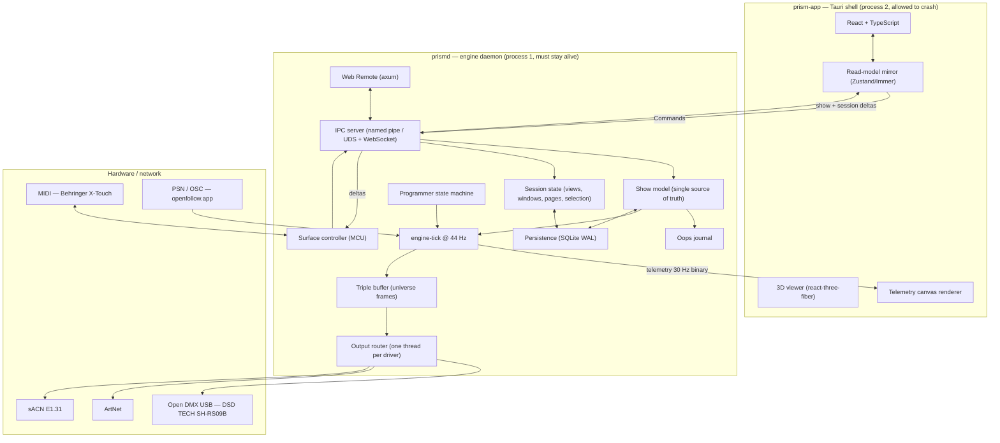
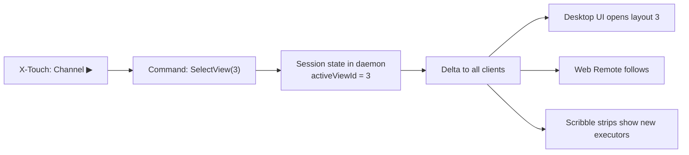

# ARCHITECTURE_SPEC.md — PrismDMX System Architecture

**Status:** Planning Phase complete, approved. Implementation (Phase 2) not started.
**Audience:** developers and AI assistants working on PrismDMX.
**Companion documents:** [`docs/MCU_MAPPING.md`](docs/MCU_MAPPING.md), [`docs/IPC_PROTOCOL.md`](docs/IPC_PROTOCOL.md), [`docs/DMX_MERGE.md`](docs/DMX_MERGE.md).

---

## 0. Scope and non-goals

PrismDMX is real-time DMX lighting control software for schools, community centres, small venues and theatre productions. It targets both professional network protocols (ArtNet, sACN, PSN) and budget USB hardware, and uses the Behringer X-Touch over Mackie Control Universal (MCU) as its physical console.

Three requirements are structural — they cannot be retrofitted, and every decision below is justified against them:

1. **Zero-crash.** DMX output must never stall during a show, including when the UI crashes.
2. **Deterministic timing.** A 44 Hz internal tick (22.727 ms) with low jitter.
3. **School-grade operability.** Installation without an IT department, on ageing hardware.

**Non-goals for V1:** multi-user sessions, RDM, timecode chase, media server integration, GDTF import.

---

## 1. Decision records

| # | Decision | Choice | Rationale |
|---|---|---|---|
| **D1** | Application stack | **Tauri v2 + Rust core + React/TypeScript UI** | No GC ⇒ no frame jitter in the tick loop; ~10 MB installer and ~100 MB RAM instead of 250/400 MB with Electron; mature crates for MIDI, FTDI, ArtNet and sACN; the UI stays web technology including three.js |
| **D2** | Process isolation | **Two processes from day one: `prismd` (engine daemon) + `prism-app` (Tauri shell)** | The strongest achievable zero-crash guarantee: the UI may die, restart and reconnect while DMX keeps running |
| **D3** | State management | **Single source of truth in the daemon**; every client is a view onto it. Two separate channels: Control (deltas) and Telemetry (30 Hz, binary, droppable) | One place of truth for desktop UI, X-Touch and Web Remote. The telemetry channel exists because 64 × 512 channels cannot pass through React state — it is a rendering optimisation, not a responsibility boundary |
| **D4** | Show file | **SQLite `.prism`** (WAL, autosave) + JSON for fixture library, surface mappings and settings + JSON export | A power cut mid-save must not destroy a show. Schools have no backups |
| **D5** | DMX outputs in V1 | **Open DMX USB (FTDI FT232R), ArtNet, sACN** — all three in V1. Enttec Pro protocol comes later | The target hardware is a **DSD TECH SH-RS09B**, an Open DMX cable without a microcontroller ⇒ host-side break timing is mandatory |
| **D6** | MCU mapping | **Declarative JSON bindings** across three layers (codec → surface model → binding table) | `XTouch.txt` specifies "assignable function out of a list" in six places — this is user configuration, not a constant |
| **D7** | Executor paging | **One page = 8 executors.** The Executor Bar shows only the **current** page. `Faderbank ◀▶` = page down/up | Supersedes "4 Rows of 8 Executors" in `Architecture.txt` — see §11 |
| **D8** | X-Touch `Channel ◀▶` | **Switches UI views** (saved window layouts from the View Selector Bar) | "View down/up" in `XTouch.txt` refers to canvas views, not executor rows |
| **D9** | Daemon lifecycle | **Both modes, switchable in settings.** Default: the shell starts `prismd` and leaves it running on close. Opt-in: autostart at boot | A classroom laptop and a permanent venue installation have opposite expectations. *Settled in S37: the flag is `prism_core::MachineConfig`'s and the settings window writes it; the shell (S29) is what acts on it — §10.3* |
| **D10** | Platforms | **Windows is primary.** Raspberry Pi (Linux ARM64) and macOS are *kept portable* but not shipped | The target audience is on Windows, but portability must not rot — see §10 |
| **D11** | Surface ↔ UI | **The X-Touch operates the UI fully — through shared session state in the daemon, never by routing through the UI** | Views, windows, pages and encoder banks are operating state and belong in the daemon. The console drives the UI *and* the low-latency fader path stays untouched — see §4 |

---

## 2. System overview



**What the process boundary buys us:** the MIDI surface, the show file, the operating state and every output live in the daemon. If the UI dies, the console and the lights keep working — the operator continues the show on the X-Touch while the interface restarts, and afterwards sees exactly the state established from the console.

---

## 3. Threading model

| Thread (inside `prismd`) | Priority | Responsibility | Must never block on |
|---|---|---|---|
| `engine-tick` | Realtime / high | 44 Hz: drain command queue, evaluate playbacks, merge, write frame to triple buffer | locks, allocation, I/O, logging |
| `out-opendmx-*` | High | Break/MAB plus 513-byte frame per adapter; reconnect backoff | the engine |
| `out-artnet`, `out-sacn` | High | Read latest frame, send at own cadence | the engine |
| `midi-in` / `midi-out` | Normal | MCU codec; feedback coalescing at 30 Hz | the engine |
| `psn-osc-in` | Normal | Tracker positions into a ring buffer (latest value only) | the engine |
| `core-main` (async, tokio) | Normal | IPC server, show model, session state, persistence, Web Remote | — |

### 3.1 Hard rules for `engine-tick`

Enforced by lint (`#![deny(clippy::unwrap_used, clippy::expect_used, clippy::panic)]` in `prism-engine`):

- **No heap allocation inside the tick.** All buffers are sized up front from the patch.
- **No mutex locks the tick can wait on.** Input arrives over an SPSC ring buffer and output leaves through a triple buffer, neither of which locks at all. Two hand-overs *from* the core thread — a rebuilt `MergeBody` (S17) and a joining or leaving output subscriber (S33) — are behind a `std::sync::Mutex` the tick only ever `try_lock`s: a lock it cannot have this instant is one it does not take, and the hand-over arrives 23 ms later instead. The rule is that the tick never **waits**, and that is what the jitter gates and the allocation gates measure.
- **No synchronous logging.** Log records go into a lock-free ring; a separate writer thread drains it.
- **Absolute deadlines** via `Instant` so error does not accumulate; `sleep(deadline − 1 ms)` followed by a spin for the remainder.
- **`panic = "unwind"`** in the release profile. The panic hook marks the module *degraded* rather than terminating the process.
- **Nothing derived is computed here — it is read.** The rule the allocation gate enforces has a second half the gate cannot see: anything the tick needs that is a *function of the show* is built on the core thread and handed over as a table. The tracking state (S48, §6.0) is the case that made this worth writing down — a cue entry resolves every attribute the list touches through a table `SequencePlan::build` prepared, which is a binary search per slot and no allocation; building it inside a `Goto` would have allocated once per key press on the one thread that may not.

### 3.1.1 What comes back out (S34)

The rules above are about what may go *into* the tick. What comes out of it is the frame, through the triple buffer — and, since S34, one thing more: **what each playback is doing**. `prism_engine::PlaybackReport` is a fixed table of atomic words, one per playback — which is one per cue list since S45 — published at the end of every tick with a relaxed store and sampled by `prismd`'s own loop at 25 ms. It obeys §3.1 by construction: sized when it is built, never resized, never locked, never waited on.

Two consequences worth stating, because both are deliberate:

- **A reader may be one tick out of date, and may never be wrong about a tick that happened.** One entry is written atomically, so a playback's number, its cue index and whether it is running arrive together; two entries are not guaranteed to be from the same tick, and neither is the length. Making them so would need a seqlock, which would make the reader spin and buy nothing for feedback that drives a screen.
- **The tick is the only author of `Executor.isActive` and `Executor.currentCueIndex`.** The daemon used to write `isActive` on its way past a Go, because nothing else could; with a readback that would be a second author racing the first, and the symptom was a strip that lit, went dark on the next poll and lit again. The cost is that a `Toggle` pressed within a poll of somebody else's Go reads the state from just before it — which is the same latency any desk with two operators has, and much shorter than a person's reaction.

### 3.2 Frame rate, stated precisely

The engine tick always runs at 44 Hz — it is the time base for fades, phasers and cue timing. Output drivers consume the most recent frame from the triple buffer **at whatever rate they can achieve**. ArtNet and sACN reach 44 Hz; Open DMX USB is limited to roughly 30–40 Hz by its hardware (§7.1). The `CLAUDE.md` invariant therefore holds at the engine level without misrepresenting what budget hardware can do.

---

## 4. Session state — how the X-Touch operates the UI

This resolves two requirements that appear to conflict: **minimum fader latency** (a direct path into the backend) and **full UI operation from the console** (switching views, opening windows, paging).

They do not conflict, because the X-Touch does not remote-control the UI. Operating state — the active view, which windows are open, the executor page, the encoder bank, the selected programmer parameter — lives in the daemon, not in the client. The console changes that state, the daemon broadcasts a delta, and **every** attached surface follows.



This beats the obvious alternative ("surface sends a keypress to the UI, UI opens a window") in three ways:

- It works **while the UI is closed or restarting** — the state is already there when a client connects.
- It works with **multiple screens or clients** at once without them drifting apart.
- The scribble strips show the right thing automatically, because console and UI read the same source.

### 4.1 What belongs to session state (console-controllable)

```typescript
interface Session {
  id: SessionId;
  name: string;                        // V1: exactly one, "Main"
  activeViewId: number;                // canvas layout from the View Selector Bar
  openWindows: WindowInstance[];       // type, position, size on the canvas
  focusedWindow: number | null;
  executorPage: number;                // Faderbank ◀▶
  selectedExecutor: ExecutorId | null; // drives main fader, Flip, transport
  selectedSequence: SequenceId | null; // the cue list a store goes into (S39)
  editingCue: CueEdit | null;          // which cue the programmer is editing (S39)
  encoderBank: FeatureGroup;           // Dimmer / Position / Color / Beam / Focus
  programmerPage: number;              // Zoom ▲▼ — pages the encoder bar (S35)
  programmerParamIndex: number;        // Zoom ◀▶ — what the jog wheel turns
  commandLine: string;                 // contents of the console line
  windowPicker: boolean;               // whether the window chooser is up (S43)
}
```

```typescript
interface CueEdit {
  sequenceId: SequenceId;
  cueNumber: string;   // the number, not an index — a number is what an operator wrote down
  modified: boolean;   // whether the programmer has moved since the cue was loaded
}
```

Sessions are persisted with the show file: reopening a show restores the console exactly as it was saved. The two S39 fields are `#[serde(default)]`, because a `.prism` file keeps the session as an opaque document (S15) and a file written before them does not carry them; `editingCue` is also **not** an edit that resumes, since the programmer is deliberately not in the file either.

> **The selected sequence is a field of its own, and that was S39's decision** *(S39)*. Until it existed the cue sheet followed the sequence on `selectedExecutor`, and S28 marked that as an assumption rather than making it permanent — §4.4 named S39 as the session that would settle it. It is settled by adding the field, for two reasons the executor reading cannot meet: `Store Cue 5` typed with **no executor selected** has to mean something, and a cue list nobody has put on a fader has to be editable without occupying a playback slot to reach it.
>
> It is deliberately **not** coupled to `selectedExecutor`. An operator programming cue list 7 while executor 3 plays the show is the ordinary case on a console, not the edge case, and a desk that moved this every time a fader was selected would store into whatever was last touched. The two are separate selections and the interface draws both: the cue sheet follows this one and the transport line follows the executor.

> **`commandLineRun` is gone, and S49 is what took it** *(S43, removed in S49)*. It was a counter the daemon bumped when an X-Touch key meant *run the line*: running one needs a **parser**, the parser was in the interface, so the daemon wrote the line down and asked whichever client held the keyboard focus to read it. It was written down as a stop-gap at the time — *a field that exists to work around where a component lives is exactly the kind of thing that quietly becomes permanent* — and the session named against it did move the parser. The line is `commandLine`, running it is `CommandLineInput { run: true }`, and the daemon reads it: no client is involved, so there is no edge to watch and nothing for two focused screens to run twice. A `.prism` file written before S49 still carries the field, and nothing reads it.

> **`windowPicker` is session state because the console opens it** *(S43)*. Whether a chooser is up looks like client-local state by §4.2's rule, and it is not: an X-Touch key opens it, and a key that opened a chooser on one screen and not the others would be a desk in two states. It is cleared by anything that empties the canvas, because it names windows to open on *this* view.

> **The programmer carries the provenance of a selection** *(S43)*. `ProgrammerState` gained `selectedGroups` and `manualSelection`, both `#[serde(default)]`. Selecting a group used to **toggle** its fixtures, so a lamp already on went off; it now only ever adds, and deselecting releases only what no other selected group and no manual pick still holds. That question cannot be answered from the selection alone — *why* a fixture is in it is the missing fact — so the daemon keeps it, and it keeps it rather than the client because two clients working it out separately would disagree the first time one of them missed a delta.

> **`editingCue` is the update state, and it is here rather than in the programmer** *(S39)*. It is what makes an Update key blink — `editingCue !== null && editingCue.modified` — and every attached client has to blink the same key, which is precisely what §4's opening paragraph is about. A client that worked it out from its own mirror of the programmer would have to know which cue that programmer came from, and that is the fact this field carries. It is cleared when the programmer is cleared, when the cue is deleted, and when a different cue is loaded; a renumber of the cue being edited **carries it**, because otherwise an Update would recreate the cue at the number it used to have.

### 4.2 What does not (client-local)

Monitor assignment of a window, scroll position, hover and drag state, 3D viewer camera, UI zoom level. These are legitimately different per screen and would be actively annoying as shared state. The console cannot drive them — deliberately, and with no loss of function.

### 4.3 Latency budget, fader to light

The direct path is fully preserved. The UI appears in **none** of these steps:

| Step | Latency |
|---|---|
| Fader movement → MIDI packet at the host | **measured 2026-08-13 (S20): a round trip through the surface is 0.71 ms median (0.61–1.02 over 60 exchanges), so one direction is well under 1 ms. The step that actually bounds this is the surface's own report interval: a moving fader is reported every 19.8 ms, so a movement is seen 0–20 ms after it happens** |
| MIDI thread → codec → command → engine SPSC queue | < 0.1 ms |
| Wait for the next tick (44 Hz grid) | 0–22.7 ms (avg 11) |
| Merge and frame generation | < 1 ms |
| Output: ArtNet/sACN immediate · Open DMX until next frame | 0–30 ms |
| **Total fader → light** | **~15–50 ms**, dominated by the DMX protocol itself and, at the top of the chain, by the surface's 19.8 ms report interval — not by anything PrismDMX does |

Routing through the UI (MIDI → daemon → UI → daemon) would add two IPC round trips and a React render cycle, and would make lighting depend on UI responsiveness. That is why **no** operating path goes through the UI — including the UI commands themselves.

### 4.4 Commands the console issues for the interface

`SelectView`, `StoreView`, `OpenWindow`, `CloseWindow`, `FocusWindow`, `SetExecutorPage`, `SelectExecutor`, `SelectSequence`, `SetEncoderBank`, `SetProgrammerPage`, `SelectProgrammerParam`, `CommandLineInput`.

> **`CommandLineInput` is the one of the twelve that reaches past the session** *(S49)*. It writes `Session::commandLine`, which is all it ever did; with `run` set it is also *and read it*, and reading a line is `prism_core::console` — so the command falls into the commands the line means and those go through the ordinary appliers. It stays in this list because what it applies **to the session** is the line, and the fan-out is an effect carried out by `prism_core::ShowFile`, which is the one type holding the session and the show at once. §4.5 has the argument for why no second command was added.

These twelve are what the **console** issues — eleven since S12, plus `SelectSequence` (**S39**), which a console issues by typing `Sequence 5` on the command line. `PlaceWindow` (**S25**) is a session command that is deliberately not in this list, for one reason: a console never drags a window, but §4.1 puts a window's position in the session, so a client that kept it locally would be holding session state. It travels with the twelve, is journalled with them (that is, not at all — §6.1), and is specified in [`docs/IPC_PROTOCOL.md`](docs/IPC_PROTOCOL.md) §5.

> **`Color` is `Label`'s mirror and is always a show command.** `Color Sequence 4 Red` and `Color Executor 1 Red` write the same colour onto the same cue list — an executor is a place and the colour belongs to the list standing in it, so a list moved to another fader takes it along. It reaches two of the six things `ObjectRef` names, because only a cue list is drawn on a scribble strip; the other four are refused with the noun that was typed. `docs/MCU_MAPPING.md` §2.3 has what the surface does with the twenty-four bits, and `null` is *no colour chosen* rather than black.

> **Four commands are session commands only sometimes** *(S40)*. `Delete`, `Copy`, `Move` and `Label` name one of the six numbered things a desk has, and one of the six — a **view** — is session state by §4.1. So which applier owns one of them is a property of its *target*: `Command::is_session_command` reads it, `ShowFile::apply` routes on it, and §6.1 follows. They replaced S35's `RenameView`, `DeleteView` and `MoveView`, which said the same thing in narrower words; managing a view library is still something an operator does with a pointer, and now the pointer writes the same line the console types. `docs/IPC_PROTOCOL.md` §5 has why there are four verbs rather than twenty-four commands.

> **The view library's order is its numbers** *(S35, kept in S40)*. `views` is keyed by number, the View Selector Bar draws in number order, `SelectView` names a number and `Channel ◀▶` steps from one number to the next — so a move **exchanges two views' contents** and leaves their numbers where they are, rather than recording an order beside them. One order means the console cannot step to a view other than the one drawn next. It costs what it has to: after a move, `SelectView 3` names a different layout, and an F-key bound to a view number reaches whatever now sits in that place.
>
> S40 made the command **absolute** — `Move View 1 View 3` rather than `Prev`/`Next` — and the decision is untouched by that. What changed is where *left* becomes a number: the bar knows its neighbour and writes the line, which is §4.5, and one command covers both directions rather than the protocol carrying a word for each.

The **F1–F8 XKeys** are therefore freely assignable to "open Fixture Sheet", "open Patch", "jump to view 2" or macros — drawing on the same command list the UI buttons use. There is no second command world for the console.

> **There is a *selected sequence*, and S39 decided it should be one** *(S28, decided in S39)*. S28 met this and marked it: the Sequence Sheet and the Cue Viewer followed the sequence on `selectedExecutor`, which needed nothing added to §4.1, and choosing one was a `Command::AssignExecutor`. Both readings were defensible and only one could be right for `Store Cue 5` typed with no executor selected — so S39 added `Session::selectedSequence` and `Command::SelectSequence`, for the reasons in §4.1. What it costs is a second selection on the screen; what it buys is a cue list that can be written before anybody decides which fader it goes on. The one reader that had to change was `ui/src/show/looks.ts::executorInForce`, exactly as S28 predicted.

> **Playback is addressed to a sequence as well as to an executor** *(S40)*. Every playback command named an executor until then, so `On Sequence 1` — a cue list nobody has put on a fader — had no representation at all. `PlaybackTarget` is the three ways a line can say which playback it means: an executor, a sequence, or *the selected one*; the daemon resolves all three, because which cue list an executor holds is show state and which sequence is selected is session state, and a client that worked either out would be sending a command whose meaning had already moved.
>
> This is the other half of S39's argument for `selectedSequence`: a cue list can be written before anybody decides which fader it goes on, and a list you can write but not hear is a list you cannot check.
>
> **And a playback is the cue list's, full stop** *(S45)*. S40 wrote down the rule — *two players of one cue list would fight over the same slots in the merge* — and kept it only between its own two kinds; put one list on two executors and each `Go` started a player of its own. That is punch-list entry **B18**. `PlaybackId` is now the list's own number, `Show::playback_of` resolves an executor to the list standing on it, and an executor is a **handle**: which list, and what its fader, encoder and four keys do. What those five controls do is itself editable, from a window, from the line and from a bound key — `Command::ConfigureExecutor`, punch-list entry **B15**, and `docs/IPC_PROTOCOL.md` §5 carries the decision that it is a *show* command.

> **`SelectProgrammerParam` is relative and stays relative** *(S26)*. It steps, because `Zoom ◀▶` steps; there is no *set the parameter to n* command and the interface does not need one — clicking an encoder in the encoder bar composes the steps between where the highlight is and where it was clicked, which for a bank of at most six parameters is at most five commands. A thirteenth session command would have been a second way of saying the same thing, and the console could not issue it. The **upper** bound is the client's: `prism-core` deliberately does not know how many parameters a bank has (S13), so the bar stops offering *next* at the end of the bank rather than letting the index run past it, where the jog wheel would turn nothing at all.

> **Multi-session (later):** the model permits several sessions so two operators can work with independent views. V1 has exactly one session and the programmer belongs to it. Multiple programmers would be a merge question (LTP between them) and are deliberately out of scope.

### 4.5 The command line is the primary interface *(S40)*

**A key on the desk writes a word into the command line. It does not act.**

> **And since S49 the *daemon* reads it.** The grammar was `ui/src/desk/console.ts` from S40 until then, because that is where the operator types, and the consequence was quiet and then loud: a key on the X-Touch cannot run a line if the only parser is in a browser. It is `prism_core::console` now, the line travels as `Command::CommandLineInput { run: true }`, and what a line *would* do travels back as `Query::CommandLineReading` — so an interface draws the reading and answers nothing. Two things follow that could not be had before: a bound key fires **with no client attached at all**, and two focused screens cannot each run one line. `docs/COMMAND_LINE.md` §5 is the wire form.

That is the decision, and it is a decision about the whole interface rather than
about one window. `Session::commandLine` is §4.1 state, so what an operator is
part-way through typing is already shared by every attached client; making the
keys write into it means the line is not a second way of doing things beside the
buttons — it is the **one** way, with the buttons as a faster keyboard for it.

Three shapes, and every control on the screen is one of them:

| Shape | Example | What pressing it does |
|---|---|---|
| **A whole command with no argument** | `Clear`, `Oops`, `Update`, `Full` | writes the word and **executes it at once** |
| **A command that needs arguments** | `Store`, `Edit`, `Goto`, `Move`, `Copy`, `Delete`, `Label`, `Color`, `Assign` | writes the word and **waits** — the operator types the rest and presses Enter, which is also a key on the surface |
| **An argument keyword** | `Fixture`, `Group`, `Sequence`, `Cue`, `Preset`, `View`, `Executor` | **appends** the word to the line as it stands |

So `Fixture` `1` `Enter` is three presses that build `Fixture 1`, and it is the
same line an operator could have typed. An item picked out of a **list** — a
group in the group pool, a fixture in the patch, a cue in the sheet — writes the
command that names it *and submits it*, because the pointer has supplied the
argument the line was waiting for.

**Why this rather than buttons that send commands directly.** Four things follow
from it that do not follow from the obvious alternative:

- **One vocabulary to learn, and the screen teaches it.** An operator who has
  only ever used the pointer has been reading the lines they were building, and
  the day they start typing they already know the words.
- **One path to test.** What a gesture means is what the line means, so a
  recording of lines is a recording of the whole interface — and a button that
  built a line nobody could have typed would be a second grammar with no parser.
  Since **S49** this is sharper than it was: a window's test asserts *which line*
  a tile writes and the parser's own suite asserts what that line means, so the
  two claims are made once each rather than restated in TypeScript.
- **The prompt has somewhere to live.** A store into a cue that exists asks
  *merge, override or cancel*; the question belongs in the line the store came
  from, and Escape cancels it (§4.4's rule that a prompt is not a modal).
- **`commandLine` is session state, so a second screen follows the first.** An
  operator part-way through a command is visible on every client, which is the
  same argument §4 makes for the active view.

**S45 is the test being applied rather than assumed, in the other direction.**
The `Executors` window grew a control editor (punch-list B15) and it is *not* an
exception: the grammar was given the words — `Assign Executor 1 Fader Master`,
`Assign Executor 1 Button 2 Go+` — so every chooser in it writes that line and
sends it, exactly as a tile in a pool does. What that buys is the exit criterion
for free: the window, a typed line and a bound X-Touch key converge on one line
rather than three code paths that have to be kept in step.

The exceptions are the ones a line cannot express and are deliberately small:
the **executor keys and faders** (a Go is a gesture with timing in it, §4.3),
the **encoders**, direct manipulation of the canvas — dragging a window, resizing
it (§4.2) — and, since **S37**, the **settings window**, whose control editor
(**S38**) is the clearest case of the test being applied rather than assumed: a
line cannot say *this key does that*, because S40's grammar has no noun for a
key any more than it has one for a file. A path is not a word an
operator types into a console line and a log level is not one either; S40's
grammar has no noun for a file or for a setting, exactly as it has none for a
window type, so those commands are sent the way `OpenWindow` is. The test is the
same one in every case: *could a line say this?* — and where it could, the line
is what the screen writes. Everything else is the line.

### 4.6 The screen an operator sees *(S43)*

The owner's drawing is `design/skeleton/` — a Penpot export in two boards,
`main-layout.pdf` and `programmer.pdf`. It states **arrangement and flow** and
deliberately no detail: no pixels, no type sizes, no colour values, no wording.
What it states holds; what it leaves open this session decided, and the decisions
are written down here so that a later session can tell a choice from an accident.

**The shape.** A header, a **canvas**, the command line, and the programmer band.
Nothing else is fixed furniture. The executor strip, the console's keys and the
status readings had been bands around the canvas since S25–S26; the drawing has
no band for any of them, so they are **windows an operator opens** and the canvas
got the room back. `WindowType` is the list of what can be opened and it is
generated from `prism_domain`, so a window added in Rust appears in the chooser
without a second list being edited.

**The canvas lays itself out, in the daemon.** `OpenWindow` carries no geometry
and never has (§4.4). A new window takes the first free place searched from the
top left, at the default size, shrinking to
`MIN_WINDOW_WIDTH × MIN_WINDOW_HEIGHT` before it is refused out loud; a **move**
is accepted when it overlaps no more windows than the one it replaces, so a
layout stacked at the origin by an older build can still be taken apart while a
clean one cannot be spoiled. The arithmetic is `prism_core::layout`, and it is
the daemon's for §4.1's reason: two clients offsetting their own windows would
race.

**The pools are keys.** §4.5 said *every key writes a line*; S43 finished the
thought — a tile in a pool is a key too. With a verb standing in the line, a
click on a sequence, group, preset, fixture, cue or executor **appends its
words** rather than performing a selection, and sends the line when it has become
a whole command. `ui/src/desk/consoleshell.ts::pickOnto` is the rule and it is a
pure function. Two carve-outs, both deliberate: a line whose first word is not a
verb is a fixture selection, so `1 thru` plus a click is a range being built and
not a group being named; and `Label` and `Color` are **never** sent by a click,
because both are valid without a last word and both *remove* something.

#### Departures from the drawing, and why

| The drawing | What was built | Why |
|---|---|---|
| A `<` `>` pair beside the encoders **and** a page stepper | One stepper, for the **page** | The band has room for four encoders with their readings and one two-button control. The parameter highlight is reachable directly — **clicking an encoder selects it** — and `Zoom ◀▶` still sends `SelectProgrammerParam`, so nothing was lost but a redundant pair of arrows |
| A programmer band of roughly a third of the height | About a fifth | Everything the drawing puts in the band fits, and `CLAUDE.md`'s rule that nothing scrolls outside the canvas is the binding constraint at 1280 × 720. A third would have been taken from the canvas, which is the part that holds the show |
| Seven encoder banks, one of them `Control` | Seven, and `Control` has **no X-Touch Assign key** | The surface has six Encoder Assign buttons and §4.3 will not spend a reserved one. `Control` is reached from the band and from the command line. It is the row of lamp-on, reset and fan that is touched once a show and never during one, so it is the right bank to leave off the surface |
| Status readings not drawn at all | A `Status` window | They were a strip along the bottom. The drawing has no strip, and a reading nobody looks at during a show does not deserve permanent height |

The seven banks are themselves a change the drawing forced: `FeatureGroup` had
five, with gobo, prism, iris, zoom, shutter and control on one `Beam` bank — six
knobs, which is two pages of four and a lamp-control channel filed behind a
shutter. The drawing names seven, and the split is the one a person makes
standing at a desk.

---

## 5. DMX engine pipeline

One tick, in order:

```mermaid
flowchart LR
    A["1 Drain command queue"] --> B["2 Advance fades / phasers / timecode"]
    B --> C["3 Evaluate executors → attribute values"]
    C --> D["4 Merge: playbacks"]
    D --> E["5 Merge: programmer (absolute priority)"]
    E --> F["6 Apply masters (grand / group / speed)"]
    F --> G["7 Attributes → DMX channels (16-bit split, curves, invert)"]
    G --> H["8 Universe frames → triple buffer"]
    H --> I["9 Telemetry snapshot (throttled)"]
```



Merge semantics, the priority stack and the invariants that must hold under test are specified in [`docs/DMX_MERGE.md`](docs/DMX_MERGE.md). In brief: intensity merges **HTP**, everything else merges **LTP** by activation order, the programmer overrides all playbacks, and the stack from bottom to top is `Home → Playbacks → Programmer → Grand Master`.

---

## 6. Domain model

Types are defined once in Rust (`prism-domain`) and generated into TypeScript with `ts-rs`/`specta`. There is no hand-maintained duplicate. Shown here in TypeScript notation:

```typescript
type FixtureId = number;  type GroupId = number;
type SequenceId = number; type ExecutorId = number;
type PresetId = number;   type UniverseId = number;   // 1..=64

type AttributeType =
  | "Dimmer" | "Pan" | "Tilt" | "Red" | "Green" | "Blue" | "White" | "Amber"
  | "Iris" | "Zoom" | "Focus" | "Gobo" | "Prism" | "Shutter" | "Control";

type FeatureGroup = "Dimmer" | "Position" | "Color" | "Beam" | "Focus";

interface AttributeDef {
  attribute: AttributeType;
  featureGroup: FeatureGroup;
  coarseOffset: number;        // 0-based offset within the fixture footprint
  fineOffset: number | null;   // 16-bit fine channel, null when 8-bit
  defaultValue: number;        // home value, 0..65535
  mergeMode: "HTP" | "LTP";
  invert: boolean;
  physicalFrom: number;        // e.g. -270 for Pan
  physicalTo: number;
}

interface FixtureType {
  id: string;                  // stable key, e.g. "generic.rgbw.par"
  manufacturer: string; name: string; mode: string;
  footprint: number;           // channel count
  attributes: AttributeDef[];
}

interface Fixture {
  id: FixtureId;               // user-facing fixture number
  name: string; typeId: string;
  universe: UniverseId; address: number;   // 1..=512 start address
  position: Vec3; rotation: Vec3;          // 3D viewer + PSN follow
  invertPan: boolean; invertTilt: boolean;
}

interface Group { id: GroupId; name: string; fixtures: FixtureId[]; }

interface Preset {
  id: PresetId;
  pool: FeatureGroup;          // Color / Position / Dimmer pools
  name: string;
  color: RgbColor | null;      // shown on the X-Touch scribble strip
  values: Array<{ fixture: FixtureId; attribute: AttributeType; value: number }>;
}

// What a cue says about one attribute it names — S48. *Inherits* is the third
// state and is written as no part at all.
type CueTracking = "Track" | "CueOnly";

interface CuePart {
  fixture: FixtureId; attribute: AttributeType;
  value: number;               // 0..65535
  presetRef: PresetId | null;  // preset link keeps the cue live-updatable:
                               // storing the preset rewrites this part's value
                               // (prism_core::Show::relink, S28)
  tracking: CueTracking;       // carries forward, or is taken back when the list
                               // leaves the cue (S48; docs/DMX_MERGE.md §2.4).
                               // `#[serde(default)]` — an older file tracks
}

interface Cue {
  number: string;              // "1", "1.5" — string preserves decimal ordering
  name: string;
  fadeIn: number; fadeOut: number; delay: number;   // seconds
  trigger: "Go" | "Follow" | "Time" | "Sound";
  triggerTime: number | null;
  parts: CuePart[];
}

interface Sequence {
  id: SequenceId; name: string; cues: Cue[];
  color: RgbColor | null;      // what the scribble strip lights; null is no colour, not black
  loop: boolean;               // whether an automatic follow chain comes round —
                               // a **Go** always does, on every list
  // ---- the playback, and there is exactly one of it per list (S45) ----
  masterLevel: number;         // 0..65535
  speed: number;               // the speed master, in SPEED_UNITY (1024) units
                               // (S34; docs/DMX_MERGE.md §4.1)
  isActive: boolean;           // written only by the tick's readback (S34)
  currentCueIndex: number | null;   // the same
}

type ExecutorButtonFunction =
  | "Empty" | "Go+" | "Go-" | "LearnSpeed" | "Off" | "On" | "Flash" | "Toggle"
  // The **custom row** (S45): a key that sends a line the operator wrote.
  | { CommandLine: { line: string } };
type ExecutorFaderFunction   = "Empty" | "Master" | "Speed" | "XFade";
type ExecutorEncoderFunction = "Empty" | "Master" | "Speed";

// An executor is a **handle** on a cue list's playback (S45), not a player.
interface Executor {
  id: ExecutorId;              // page * 8 + slot  (D7: one page = 8 executors)
  sequenceId: SequenceId | null;
  faderFunction: ExecutorFaderFunction;
  buttonFunctions: ExecutorButtonFunction[];  // Rec / Solo / Mute / Select
  encoderFunction: ExecutorEncoderFunction;
}

// One control of an executor and what it is to do — `Command::ConfigureExecutor`
// (S45, punch-list B15). One at a time, so two operators with the editor open
// cannot undo each other. docs/IPC_PROTOCOL.md §5 has why it is a command
// rather than a `MachineChange`.
type ExecutorChange =
  | { t: "Fader"; function: ExecutorFaderFunction }
  | { t: "Encoder"; function: ExecutorEncoderFunction }
  | { t: "Button"; index: number; function: ExecutorButtonFunction };

// Which of an executor's buttons a press names (S34). A `Slot` is a hardware
// position and what it does is `buttonFunctions`, resolved by prism-core and by
// nothing else; a `Function` is a row of the surface profile naming one
// outright, which is the desk's own configuration rather than a client's
// inference. Either way the daemon decides what it comes out as — `Toggle` is
// resolved against `isActive` where `isActive` is owned.
// See docs/MCU_MAPPING.md §4.2.1.
type ExecutorButtonRef =
  | { t: "Slot"; index: number }
  | { t: "Function"; function: ExecutorButtonFunction };

interface ProgrammerState {
  selection: FixtureId[];
  activeFeatureGroup: FeatureGroup;
  values: Map<FixtureId, Map<AttributeType, ProgrammerValue>>;
  clearStage: 0 | 1 | 2;       // three-stage clear per CLAUDE.md
}

interface ProgrammerValue {
  value: number;
  source: "Manual" | "Preset" | "Recalled";
  presetRef: PresetId | null;
}

type WindowType =
  | "FixtureSheet" | "DmxSheet" | "SequenceSheet" | "Groups" | "Viewer3D"
  | "PhaserEditor" | "ClockViewer" | "CueViewer" | "PresetPool" | "Patch"
  | "Settings";   // DmxSheet added in S25: the output itself, channel by channel
// S27 settled what the three sheets are for, which had never been written down:
//   Patch        — the *rig*: which fixtures exist and where their channels are.
//                  The one window that changes the show's shape.
//   FixtureSheet — the *state*: what the programmer holds and what is on the
//                  cable, per fixture, live. Watched, not edited.
//   DmxSheet     — the *cable*: channel by channel, with no fixtures in it.
// S28 settled the three that are about *looks*:
//   SequenceSheet— the *cue list*: which sequences there are, which one is in
//                  force, and its cues with their numbers, names, times and
//                  triggers, edited in place. The one window that stores a look.
//   CueViewer    — the *cue*: what those cues set, fixture by fixture, with the
//                  preset links visible. Watched, not edited — what a cue sets
//                  comes from the programmer through StoreCue.
//   PresetPool   — the *pools*: named looks per feature group, applied and
//                  stored, with the colour the scribble strips use.

interface WindowInstance {
  instanceId: number; type: WindowType;
  x: number; y: number; w: number; h: number;
  params: Record<string, unknown>;   // e.g. which preset pool
}

interface View { id: number; name: string; windows: WindowInstance[]; }
```

The `Command` and `Delta` wire types are specified in [`docs/IPC_PROTOCOL.md`](docs/IPC_PROTOCOL.md).

> **A Go always comes round, and `loop` is a different question.** `Go+` on the last cue of a list enters the first, and `Go-` on the first enters the last, whether or not the list loops — a Go is a key somebody pressed, and a desk that did nothing would look broken in the dark. Nothing goes to black on the way: the wrap enters that cue with its own fade, exactly as any other Go into it would. `Sequence.loop` governs the **automatic** chain instead — whether `Follow` and `Time` cues run off the end and round again, which is a list that never stops on its own. `prism_engine::SequencePlan` answers the two with `step` and `follow_step`, and the split is the type: a Go always has somewhere to go, and a follow chain can end.

### 6.0 Tracking is derived, and lives nowhere in this model *(S48)*

The one piece of show state that is **not** in the model above, deliberately.

A cue list walked from the top produces, at every cue, a full set of attribute
values: the ones that cue asserts, plus everything an earlier cue asserted and
nothing has overwritten. That is the **tracking state**, it is what a `Goto`
resolves through, and it is computed from the cues rather than stored beside
them — `docs/DMX_MERGE.md` §2.4 is the specification.

**A `.prism` file keeps the edits.** A file that stored the resolved state would
be a file that could not be corrected by editing cue 2, which is the same rule
`Query::DarkUniverses` (S37) and `Query::ArtNetNodes` (S46) are built on one
panel along. So:

- **The engine's copy** is `prism_engine::SequencePlan`, built by the core thread
  in `SequencePlan::build` — at load, and again whenever a cue is stored, edited,
  deleted, renumbered or moved, because that is when a sequence is recompiled.
  The tick **reads** it and never builds it (§3.1), with one binary search per
  slot and no allocator call.
- **The rule itself** is `prism_domain::CueTrack`, written once and used by the
  engine to compile the table, by `prism_core` to answer the query, and by
  `Command::SetCueTracking`'s `Block` to write a cue's inherited values into it.
- **Clients ask.** `Query::CueTracking` answers, per cue, what it inherits and
  whether it blocks. A client folding the cues itself would be a second opinion
  about the rule the engine resolves a `Goto` through, which is exactly the trap
  `PatchPreview` was built to avoid.

Held **by attribute** rather than by cue, and that is what makes it fit: a
cue-by-attribute grid is `cues × attributes` cells, most of them repeats of the
cell above, while one entry per *change* is bounded by the number of cue parts —
the same size as the edits it is derived from.

### 6.1 Oops (undo/redo)

Applying a command produces a compact `UndoRecord` holding the inverse and the affected scope, kept in a 200-entry ring buffer.

**Deliberately not undoable:** playback actions (`ExecutorGo`, `ExecutorOff`, `ExecutorOn`, `Goto`, `ExecutorButton`, master moves) and every session command from §4.4 — `SelectSequence` (S39) among them, because an Oops must not pull a cue list out from under an operator any more than it pulls a window. `ExecutorOn` and `Goto` are S40's and are excluded for the same reason as the two beside them: they change light somebody is currently driving.

**Every machine command is excluded too** *(S33, six of them since S37, and S38 added no seventh)*, and that follows from where the output patch lives rather than from a separate decision. `AddOutput`, `ConfigureOutput`, `RemoveOutput`, `SetOutputEnabled`, `SetSurfacePort` and `ConfigureMachine` edit `prism_core::MachineConfig` (§7.0, §10.3), which is not show content: this journal belongs to the show, it is cleared when a show is loaded, and a record of a rig change would be a record of something the show it is filed against knows nothing about. It is also the playback rule met by another road — an Oops that re-addressed a node would move light on a stage while somebody was driving it. `Command::is_machine_command` is the predicate, `ShowFile::apply` refuses these four outright, and `crates/prism-core/tests/outputs.rs` asserts that a refusal leaves the journal exactly where it was.

**S37's six file commands are excluded, and three of them are why the other
three are** *(S37)*. `SaveShow`, `SaveShowAs` and `ExportShow` change no show
state at all, so there is nothing to take back. `OpenShow`, `NewShow` and
`ImportShow` **replace** the show, which empties this journal — a record is an
assertion about the show that was open a moment ago, and its inverse describes a
show that no longer exists. `ConfigureMachine` is excluded as the sixth machine
command, for the reason the five before it are.

**S38 changed what a desk's keys do and added no command at all** *(S38)*. The
binding table of `docs/MCU_MAPPING.md` §4 is edited through
`MachineChange::SurfaceBinding`, which travels inside `ConfigureMachine` and is
therefore already excluded — and it would have been excluded on its own terms,
because a table belongs to the building exactly as the rig and the port do. An
Oops that took back a key rebinding would be taking back a change the show it is
filed against knows nothing about, and it would do it in the middle of a show,
on a desk somebody is playing. `MachineChange::SurfaceLearn` is excluded twice
over: it is a machine change, and it writes nothing down at all.

**Four commands are undoable only sometimes** *(S40)*. `Delete`, `Copy`, `Move` and `Label` are show edits when they name a sequence, a cue, a group, a preset or an executor, and **session** commands when they name a view (§4.4) — so an Oops takes back a deleted cue and never a deleted view. That is the same rule applied through a payload rather than a variant, and `crates/prism-core/tests/objects.rs` holds it on the show's bytes. Their scope is wider than the two things they name: a move of a sequence images every executor that played it and a move of a preset images every cue that linked to it, because both are repointed by the move and an undo that put half of it back would leave a fader pointing at a cue list that is gone. The show edits S28 added — `StorePreset`, `SetCueProperty`, `AssignExecutor`, and the two S40 folded into `StoreSequence` and `Delete` — **are** undoable, as is S48's `SetCueTracking`, whose scope is `SetCueProperty`'s: that sequence and the update state, because a `Block` rewrites the cue and the same two things can move, and a `StorePreset` images the sequences its preset reaches as well as the preset itself: storing a preset rewrites the cue parts linked to it, so restoring the pool alone would take the edit back in one place and leave it standing in every cue. Undo during a running show must neither change light the operator is currently driving nor pull windows out from under them.

S39's three are undoable for the same reason: `StoreSequence` and `Update` are stores, and `EditCue` fills the programmer. **`StoreSequence` carries the selection too** *(S40)*: a store onto a free number *makes* the cue list and puts it in force, because `Store Cue 1` names no list and means the selected one (§4.1) — so an Oops that took the cue list back and left the desk pointing at a sequence that no longer exists would restore half a state, in exactly the way the update state below does. A store into a list that already exists moves no selection and images none. **Their scope carries the update state** (`Session::editingCue`), which does not contradict the exclusion of the session *commands* above — that exclusion is about an undo pulling windows out from under an operator, and this is the cursor into the cue the programmer came from. An Oops over an `EditCue` that put the programmer back and left the desk claiming to be editing cue 3 would restore half a state, and the half it left standing is the one the Update key acts on. `DeleteCue` and a renumber carry it too, because both can move it.

---

## 7. DMX outputs

```rust
trait DmxOutput: Send {
    fn id(&self) -> OutputId;
    fn send_frame(&mut self, universe: UniverseId, data: &[u8; 512]) -> Result<(), OutputError>;
    fn health(&self) -> OutputHealth;   // Ok | Degraded | Disconnected
}
```

Every driver runs on its own thread wrapped in `catch_unwind`, with exponential reconnect backoff (100 ms → 5 s), and reports `health` through the telemetry channel so the UI can show a status light per interface.

### 7.0 The output patch — the rig as data *(S33)*

Until S33 the outputs were `prismd` command-line flags built once at start-up, and every network output was handed the show's whole set of universes. A venue's real rig — several outputs, of several kinds, each carrying the universes it is actually wired for — was not expressible at all.

It is now `prism_domain::OutputInstance`: a number, a name, a kind with its parameters, **the set of universes it carries**, and whether it is enabled. `docs/IPC_PROTOCOL.md` §5 has the wire form and the four commands that edit it.

**Where it lives is the decision.** `prism_core::MachineConfig`, beside the desk identity, and never inside a `.prism` file — because a show carried to another hall on a stick must not bring the first hall's cabling with it. That is the argument §7.2 and `prism_core::desk` already make for the sACN CID, with one more beside it: a rig is a property of the **building**, and the school's template for next term names an Art-Net node the hall it is opened in has never heard of. The session is not a home for it either, since §4.1 persists the session *with the show*.

| Aspect | Decision |
|---|---|
| Routing | Both ways: one universe may go to several outputs, and one output may carry many. A universe sent to two outputs arrives byte-identical at both, because the publisher fans the frame out rather than sharing it (§3.2) |
| A universe with no output | A **legitimate state that is reported** — `prism_core::ShowIssue::UniverseNotOutput`, said on the way up and again as a `Delta::Notice` whenever the rig changes. Refusing to patch into an unwired universe would be a desk that cannot be prepared before the get-in; dropping it in silence is how a universe ends up dark with every light green |
| Art-Net port mapping | Universe → Net · Sub-Net · Universe **on that node**, so a four-port node is four rows an installer reads off the back of it. A universe with no row keeps §7.2's default, N − 1 |
| sACN port mapping | Universe → E1.31 universe and priority, per universe (§7.2). A universe with no row is sent as itself at priority 100 |
| Open DMX | Exactly one universe per adapter (§7.1) — refused rather than truncated — and a **serial** that pins one cable when there are two, which is what `DeviceDescriptor::with_serial` was built for in S8 |
| Hot reconfiguration | Adding, removing or re-addressing an output while the show runs costs **no tick and no frame** to the outputs that did not change. `prism_engine::FrameEnrolment` is the channel: the arriving subscriber's buffer is allocated on the core thread and taken up by the tick with one atomic load and a `try_lock` that never blocks, and the departing one's is freed back on the core thread. It is `prismd`'s `BodySwap` pattern applied to the publisher's fan-out |
| What costs a restart | The kind, the universes, the number, the enabled flag — and nothing else. **A rename costs nothing**, because an operator who typed a better name should not watch their rig blink, and for sACN a restart is a stream terminated and a stream begun |
| Disabled | Keeps its whole configuration and has no thread and no socket, which is what an operator wants of a node that is being worked on. It carries no universes for the dark-universe report, because nothing is reaching those fixtures |
| Where the drivers are opened | `prismd::outputs::OutputFactory` — `SystemOutputs` opens the real thing, `MockDevices` (`--mock-devices`) opens a recording double carrying the same universes. The same seam `FtdiBackend` is one level down, and it is what lets S33's worked example be asserted frame by frame with nothing plugged in |
| The command line | Outputs named on it are the **whole rig for that run**: the stored configuration is neither read nor written, and the four commands are refused. A daemon started with `--mock-output` — every test in this repository — must neither inherit a venue's cabling nor overwrite it |

### 7.1 Open DMX USB — DSD TECH SH-RS09B (V1, mandatory)

The cable is an **FTDI FT232R with no microcontroller**. There is no widget firmware to generate break and mark-after-break, so the **host** owns DMX timing.

| Aspect | Approach |
|---|---|
| Access path | Behind an `FtdiBackend` trait. Windows: **D2XX** (`libftd2xx`, statically linked), fallback **VCP** (`serialport` with `set_break`/`clear_break`). Linux/RPi: **libftdi** (`rusb`) |
| Device discovery | USB VID/PID — **verified 2026-08-11 (S8): `0403:6001`**, product string `FT232R USB UART`, serial `B0037HIY`. The strings are FTDI's own, so the profile matches on VID/PID and leaves the serial as the way to tell two cables apart |
| Port setup | 250 000 baud, 8 data bits, **2 stop bits**, no parity, no flow control; `SetLatencyTimer(1)` — the 16 ms default would be fatal; explicit USB transfer sizes |
| Frame | `SetBreakOn` → ~110 µs → `SetBreakOff` → ~16 µs MAB → write 513 bytes (start code `0x00` + 512 channels) → **wait out the frame's transmission time before the next break** (see below) |
| Achievable rate | **35.5 Hz measured** over 60 s through D2XX, 38.4 Hz through the VCP (S8). Pure data time is 22.6 ms; the two break transfers measured ~3 ms together, not the 0.1–1 ms assumed. A longer break remains DMX512-compliant (up to 1 s is permitted) |
| **Frame ordering** | **`FT_Write` returns before the bytes have left** — measured at 20.0 ms for a frame that takes 22.6 ms — and `FT_GetStatus`'s transmit queue reads zero immediately, so it is no help. A break is a USB *control* transfer and does not queue behind bulk data, so one asserted at that point lands **inside** the frame still going out and every frame is malformed. The driver therefore waits out the computed transmission time (513 × 11 bits ÷ 250 000 baud = 22.572 ms) plus a 2 ms margin before the next break. This is why the real rate is 35.5 Hz and not the 43 Hz an unsynchronised driver appears to reach |
| Limitations | Transmit only, no RDM, no read-back. Exactly **one** universe per adapter |
| Failure mode in the field | USB unplugged or machine suspended ⇒ the driver thread detects the error, purges and reconnects; the UI light turns red, the engine keeps running |
| Linux/RPi note | `ftdi_sio` claims the device; the libftdi path resolves this by detaching the kernel driver plus a udev rule. Do not use D2XX on Linux |

**Statically linked, and since S29 so is everything else on Windows.** `ftd2xx.dll` ships with FTDI's driver package, and a dynamically linked daemon on a machine without it would fail to start *at all* rather than falling back to the virtual COM port — the import is resolved when the process loads, long before any of our code can decide anything. FTDI's static library is built against the **static** C runtime, which from S8 to S29 was reconciled by excluding the dynamic one's competitor (`/NODEFAULTLIB:LIBCMT`). The shell ended that: `webview2-com-sys` links a second static library built the same way, and one link cannot both have the static runtime and not have it. The whole Windows build is `-Ctarget-feature=+crt-static` now, which makes all three agree and takes the Visual C++ redistributable — a **per-machine** install, on a desk whose installer needs no administrator rights (§10.3) — off the list of things a school has to have. `.cargo/config.toml` carries the reasoning and both workflows repeat the flag, because `RUSTFLAGS` from the environment *replaces* the configuration's rather than adding to it.

35 Hz is normal for this class of hardware — QLC+ and FreeStyler achieve no more with the same cable — and is unproblematic for conventional dimmers and LED pars. Guaranteed 44 Hz requires ArtNet, sACN or a future Enttec Pro widget. The UI states this plainly when the output is created rather than hiding it.

**D2XX or the VCP on this machine (S8):** both were driven against a real fixture and both produced a steady, correct picture. **D2XX remains the preferred path**, and not because of the rate — the VCP measured *faster* (38.4 Hz against 35.5 Hz), and the whole of that difference is the 2 ms safety margin D2XX is given before the next break. It is preferred because it configures the port completely: the latency timer and the USB transfer sizes are reachable through D2XX and **not reachable at all** through a serial API, where they are whatever the registry says — 16 ms on the bring-up machine. A path that cannot set the settings this table calls fatal is a fallback, not a default.

### 7.2 Network outputs (V1)

| Protocol | Crate | Notes |
|---|---|---|
| ArtNet | **none — written in `artnet.rs` (S9), `artpoll.rs` + `discovery.rs` (S46)** | **Unicast by default** — broadcast floods school networks; optional ArtSync; full-frame refresh at least every 800 ms even without changes; node discovery by `ArtPoll`/`ArtPollReply`, which is the only **receive** path in the crate |
| sACN (E1.31) | **none — written in `sacn.rs` (S10)** | Multicast `239.255.x.x`, per-universe priority, source name from the show file, termination packet on clean shutdown |

**ArtNet as built (S9).** ArtDmx is 530 bytes and its header is 18 of them, which
is less code than the seam an external crate would need — so the packet is built
here, field by field, against the specification, and asserted the same way. The
socket is `std::net::UdpSocket` behind a `UdpSender` trait, so the packet bytes
are checked with no network present *and* checked again on a datagram received
over loopback.

| Aspect | Approach |
|---|---|
| Addressing | Fifteen-bit `PortAddress` (Net · Sub-Net · Universe). Default mapping is **universe N → port address N − 1**, since PrismDMX numbers universes from 1 and Art-Net from 0; overridable per universe, because nodes disagree |
| Sequence | Per port address, 1 → 255 → **1**. Never 0, which is the value that tells a node this sender does not number its packets |
| When a datagram goes out | On change, and otherwise as the forced refresh. An unchanged universe sent every cadence is the broadcast flood in a quieter form: at 44 Hz, 64 universes is 1.5 MB/s of nothing |
| Refresh timing | The 800 ms is a **maximum gap**, so the refresh goes out one cadence *early* (`refresh_margin`, default one engine tick). Refreshing at 800 ms exactly would put the datagram at 800 ms + one cadence |
| ArtSync | Off by default: a node that understands it stops displaying data until one arrives. When on, it follows the last universe of each frame and goes to **the same addresses the data went to** — enabling it must not turn a unicast configuration into a broadcasting one |
| Broadcast | Opt-in by name (`Destination::Broadcast`), and the only thing that asks the socket for broadcast permission |
| Rate | 44 Hz, i.e. the engine's own — this is the output §3.2 means when it says the network protocols keep up |

**Art-Net node discovery as built (S46).** Everything above sends. `Health::Ok`
therefore meant *the socket accepted the datagram*, and UDP accepts every
datagram there is — so a configured node with nothing plugged in read as well,
which is punch-list **B6**. Knowing takes an answer from the far end, and §6 of
the specification has one: `ArtPoll` out, `ArtPollReply` back, carrying the
node's short and long name, its IP and MAC, its port-address table, its status
bytes and its firmware revision.

| Aspect | Approach |
|---|---|
| Where a poll goes | **To the addresses the rig's Art-Net outputs already send to**, unicast, and nowhere else. Nothing broadcasts: an ArtPoll to an address this desk is already sending 530 bytes to 44 times a second needs no new permission and reaches nothing new, and the socket is never asked for broadcast permission — asserted, not stated |
| What that costs | A node at an address nobody has typed is found only when it **announces itself**, which nodes do at power-up and on a configuration change. The listening socket is bound to Art-Net's own port, so those announcements are heard. A node that neither answers where this desk sends nor announces itself is not discovered |
| Cadence | One poll per configured node every 3 s (`DiscoveryConfig::poll_interval`), which is the specification's own guidance. Fourteen bytes per node per three seconds |
| Health | **Three-valued and its own word** — `NodeHealth`: *answering*, *never answered*, *stopped*. Not three more `OutputHealth` variants, because an Open DMX cable and an sACN stream have no answer-back and would enter *never answered* and never leave. What an output *reports* is still `OutputHealth`, folded down by `prismd::outputs::reported_health`: an Art-Net output whose nodes are silent is **`Degraded`** — sending, and not sending cleanly |
| The time on a *stopped* row | An **age** in milliseconds beside the value, never a timestamp inside it, because the daemon and a browser share no clock (S33's rule for `last_error_ago_ms`). Every age in one answer is measured against one `Instant::now()` on the daemon |
| Timeout | One poll interval and a margin (`reply_timeout`, 3.5 s), so a node that stops is reported stopped inside one interval. The price is stated rather than smoothed: one lost reply reads as *stopped* for one interval, and a node answering one poll in two is not a node an installer should be told is well |
| Where it runs | Its own thread (`prismd::discovery`), never the tick's and never an output's, and **only while the rig has an Art-Net row**. A socket that will not bind degrades **alone**: the outputs go on sending, the table says `listening: false` with the reason in words, and no output's health is folded — because a desk that is not listening knows nothing about the far end and must not report `Degraded` out of ignorance |
| Reading a reply | Into an **MTU**, never into the size of the packet. §6's `Filler` is *transmit as zero, receivers do not test*, so a node may pad its reply past 239 bytes and many do — and a `recvfrom` into a buffer smaller than the datagram truncates on Unix and **fails** on Windows (`WSAEMSGSIZE`, data discarded). S46 shipped a 239-byte buffer and a real node found it: it answered every poll, the desk read *Degraded*, and CI was green because CI is Linux. `UdpError::Oversized` is its own value so one unreadable datagram is dropped rather than ending the pass that had a real reply behind it |
| A reply is an input from outside | Parsed, never believed. `parse_art_poll_reply` allocates **nothing** — the three name fields stay as the byte arrays they arrived in — the table is bounded at 64 nodes, one read pass is bounded at 64 datagrams, and a malformed reply is dropped and counted. Measured in `tests/artpoll_fuzz.rs` under `prism-surface`'s harness |
| What the panel is told | The node list, whether the socket is bound, why it is not, a **remedy** in the daemon's own words when polls go out and nothing at all comes back — and the **counters**: polls sent, replies, unreadable, dropped. Added after two faults found in a hall: a padded reply the desk discarded, and an inbound firewall rule that covered the wrong network profile, which the desk could see the fingerprint of the whole time and never said |
| Where a discovered node lives | Nowhere durable. It is an **observation about the network**, so it is a `Query` (`ArtNetNodes`) and not `MachineConfig`: it changes while nobody does anything, no command causes it, and it is gone at the next start. `docs/IPC_PROTOCOL.md` §5.2 |

**sACN as built (S10).** The E1.31 data packet is 638 bytes across three nested
PDUs, and the same reasoning as Art-Net applies: the seam an external crate would
need is larger than the packet, and the requirement is a **byte-for-byte**
assertion against the standard — which is easiest to trust when the bytes are
written once, beside the field names. The socket is the same `UdpSender` seam,
one method wider: a sender needs a multicast **hop limit**, and nothing else that
multicast usually implies (joining a group is how a *receiver* asks to be given
datagrams).

| Aspect | Approach |
|---|---|
| Identity | `Cid`, a UUID, **configuration rather than a random number at start-up**. Nothing in the crate generates one: a desk with a fresh CID every start is a *new source* every start, and the old one holds the universe until the receiver times it out. An output without one refuses to connect rather than transmitting under the nil CID that every unconfigured desk would share. Until the show file exists (S11/S15) it lives in `SacnConfig::cid` |
| Addressing | Multicast `239.255.{universe high}.{universe low}` on port 5568, computed for the **whole** E1.31 range 1…63999 rather than the desk's 1…64. Unicast to named receivers is available for venues that forbid multicast. Never broadcast, and the socket is never asked for the permission |
| Universe numbering | Universe N → E1.31 universe N. Unlike Art-Net, both count from 1 — but the mapping is still data (`SacnPort::at_universe`), because a venue's universe 1 is not always a desk's |
| Priority | **Per universe** (`SacnPort::at_priority`), 0…200, default 100. Two sources on one universe are resolved by the higher priority winning outright, which is how a backup desk takes over; refused above 200 rather than clamped |
| Source name | 64 bytes, UTF-8, null-terminated, from the show file. Truncated **on a character boundary**, so an over-long name loses a character rather than half of one |
| Sequence | Per universe, 0 → 255 → **0**. Art-Net skips 0 because there it means "not numbered"; here skipping it would be the bug |
| Sync | Sync Address transmitted as 0 and no synchronisation packets sent. A non-zero address tells a receiver to hold data until a sync arrives, so offering the setting without the packets would be a way to configure a rig into darkness |
| When a datagram goes out | On change, and otherwise as the keep-alive. `last` and `sent_at` record the last datagram that **actually went out**, so a refused one is not written down — and a look that failed and was then changed back is not re-sent, because the receiver already has it |
| Refresh timing | E1.31 requires at least one packet per universe per second. Maximum gap, so it goes out one cadence *early* (`refresh_margin`), the same trap as Art-Net's 800 ms |
| Shutdown | Three `Stream_Terminated` packets per universe that has an active stream, each with the **next** sequence number — three identical ones would be discarded as duplicates and only the first would end anything. They carry the last look: whether the stage goes dark is S17's configurable decision, one level up |
| Multicast hop limit | Asked for explicitly at connect (`multicast_ttl`, default 1). A hop limit that could not be set is a **disconnected** output: the operator asked for a routed lighting network and would otherwise get datagrams that stop at the first router, under a green light |
| Rate | 44 Hz, the engine's own |

### 7.3 Later
Enttec USB Pro protocol over VCP. It uses the same `DmxOutput` boundary and is purely additive.

---

## 8. Incoming position data (PSN / OSC — openfollow.app)

Trackers send at their own rate (typically 30–60 Hz), asynchronously to the tick. A receiver thread writes into a ring buffer; the tick reads **only the latest** value — stale positions are worthless, so nothing is queued. Fixtures with a follow assignment compute pan and tilt from tracker position combined with fixture position and rotation in 3D space.

On packet timeout (500 ms) the last position is **held**, a warning appears in the UI, and nothing jumps.

---

## 9. Repository layout

```
prismdmx/
├─ crates/
│  ├─ prism-domain/      # types, Command/Delta/Telemetry, ts-rs export → ui/src/bindings
│  ├─ prism-engine/      # 44 Hz tick, merge, playback. No I/O, no UI dependencies.
│  ├─ prism-core/        # show model, session state, programmer, Oops, SQLite
│  ├─ prism-protocols/   # DmxOutput: OpenDmxUsb, ArtNet, sACN + PSN/OSC input
│  ├─ prism-surface/     # MCU codec, surface model, binding table
│  ├─ prism-midi/        # the MIDI port itself: enumeration, naming, hot-plug.
│  │                     # The ONE crate that opens a device (§10.1, S36); the
│  │                     # `midir` dependency is target-gated so the ARM64
│  │                     # cross-check never sees it.
│  ├─ prism-ipc/         # framing + transport, server and client halves
│  ├─ prismd/            # daemon binary (engine, session, surface, outputs, Web Remote)
│  └─ prism-app/         # Tauri shell (thin client; spawns or attaches to
│                        # prismd). Built in S29: `attach`, `autostart`,
│                        # `dialogs` and `spawn` are the decisions and have
│                        # tests that need no window; `shell` is the assembly.
│                        # `tauri.conf.json` + `icons/` + `capabilities/` are
│                        # the bundle, and it carries `prismd.exe` and
│                        # `profiles/` as resources so an installed desk finds
│                        # both beside its own executable.
├─ ui/
│  ├─ src/components/    # Canvas, Executor Bar, Encoder Bar, Console, View Selector
│  ├─ src/windows/       # Fixture Sheet, Sequence Sheet, 3D Viewer, Patch, Settings …
│  ├─ src/state/         # read-model mirror, telemetry channel (canvas/refs, not useState)
│  └─ src/bindings/      # generated from prism-domain
├─ profiles/
│  ├─ surface/xtouch.json    # layer 3 bindings + the S20 verification record
│  └─ fixtures/              # the Open Fixture Library, DOWNLOADED at install
│                            # time and not committed (S44). Only SOURCE.md is
│                            # in git; tools/fetch-fixtures installs the rest.
│                            # A copy here would be the second copy of somebody
│                            # else's data, and the one that is out of date.
├─ tools/
│  └─ xtouch-probe/      # S20's bring-up tool. NOT a workspace member, and
│                        # still not one after S36: what it does needs a device
│                        # — it walks a panel button by button and floods a
│                        # surface until it stops answering — and no test may.
│                        # `prism-midi` is where the shipping backend lives.
├─ docs/                 # MCU_MAPPING.md, IPC_PROTOCOL.md, DMX_MERGE.md,
│                        # PRERELEASE_PUNCHLIST.md, RELEASE_NOTES.md
├─ .github/workflows/    # ci.yml on every commit — including, since S29, the
│                        # shell and its installer — and release.yml, which
│                        # runs the gates again on a `v*` tag and attaches the
│                        # installer to the release it makes
└─ tests/                # integration and stress/latency suites
```

---

## 10. Platform and lifecycle strategy (D9 / D10)

### 10.1 Staying portable without shipping it

Windows is the only release target. To stop Raspberry Pi and macOS support from rotting:

- **Platform code is confined.** `#[cfg(target_os = …)]` may appear only in `prism-protocols` (FTDI backend selection), `prism-app` (shell and autostart), **`prism-ipc`, in `transport/local.rs` alone** (named pipe on Windows, Unix domain socket elsewhere — added in S16; the reasoning is in `PROGRESS.md`'s decision log) and **`prism-midi`, in `system.rs` alone** (WinMM, CoreMIDI or ALSA behind `midir` — added in **S36**). In each case the exception selects a platform primitive and nothing above the selection knows which one was chosen: in `prism-ipc` the framing, the handshake, the backpressure policy, the server and the client are one code path on every target, and in `prism-midi` so are the port naming, the reconnection and the `SurfacePort` above them. `prism-domain`, `prism-engine`, `prism-core` and `prism-surface` are platform-neutral and therefore testable anywhere.
- **The fourth exception was a decision, not a detail** *(S36)*. Until then the only code in the repository that had ever opened a MIDI port lived **outside** the workspace (`tools/xtouch-probe/`, S20), and the daemon's `SurfacePort` seam had two implementations, neither of which touched a device. A backend needs a home before it can have an implementation, and there were two candidate homes: another tool outside the workspace, or a crate inside it whose whole purpose is to hold the split. The second was chosen, because the precedent is `thread-priority` (S17) — a dependency taken on for exactly that reason — and because S37's settings window has to *enumerate* ports over the protocol, which a tool cannot do. `prism-surface` gained **no dependency at all** and `prismd` gained one path dependency.
- **What keeps `midir` off the cross-check is the manifest, not a habit.** `prism-midi` declares it for Windows and macOS, whose MIDI service is part of the operating system, and behind an `alsa` feature on Linux, whose is a `pkg-config` probe for `libasound2-dev`. So on `aarch64-unknown-linux-gnu` — the target the ARM64 job checks — `prism-midi` has **no dependencies whatever**, and a Raspberry Pi build (§10.2) is `--features prism-midi/alsa` with that package installed. A build with no backend enumerates an empty list and refuses to open, which is the same answer a machine with nothing plugged in gives, and it is what the Linux CI jobs exercise.
- **CI keeps the door open.** Windows: full build and all tests on every commit, plus — since **S29** — the shell and its installer as a job of their own. Linux ARM64: cross-compile check plus the platform-neutral tests, no hardware tests. macOS: not in CI until it becomes a priority.
- **The ARM64 cross-check does not compile `prism-app`, and that exclusion is this rule rather than an exception to it** *(S29)*. `cargo check --workspace --exclude prism-app --target aarch64-unknown-linux-gnu` is the command. The job exists to catch platform code leaking into a crate that is supposed to be neutral; the shell is the crate it is supposed to leak *into*, it is the only one of the four exceptions whose platform code is the whole purpose of it, and building it needs a webview toolkit this job has no business installing. Everything below it is still checked on that target, which is the claim the job actually makes. What the shell *is* built by is the Windows job, on every commit, all the way to the installer — because an installer that only ever builds on one person's machine is a file rather than a release.
- **Only Windows writes an autostart entry, and that is a decision** *(S29)*. §10.3's table names a systemd user unit and a `LaunchAgent` beside the `HKCU\…\Run` value; `prism_app::autostart` implements the third and reports the other two as *not supported by this build*. D10 makes Windows the only release target, and this section's own argument applies to the shell as much as to anything else: no job compiles `prism-app` on Linux or macOS, so a Linux autostart written today would be code nothing ever builds, which is the rot this section exists to prevent. Everything above the `Entry` seam — the three-way comparison, the report a settings panel reads, the command line an entry carries — is one code path on every target and is tested on every target, so the day a Pi grows a screen the work is one implementation of one trait.
- **No Windows-only crates** in the core crates.
- **A tool that needs a device lives outside the workspace.** S20 had to open a MIDI port to verify the X-Touch, which `prism-surface` is not allowed to do. Rather than bend the rule, `tools/xtouch-probe/` is its own crate with its own `[workspace]`: it depends on `prism-surface` by path — so the bytes it puts on the wire are the shipping codec's and not a transcription — while `cargo test --workspace`, `cargo clippy --workspace --all-targets` and the ARM64 cross-check never compile `midir` at all. The verification it produced comes back into the workspace as **recorded captures** (`crates/prism-surface/tests/captures/`), which the ordinary suite replays with nothing plugged in. That shape is the pattern for any future device: platform code and hardware in a tool, evidence in a fixture.

  **S36 did not change that and is not an exception to it.** The probe stays where it is, because what it does needs a device: it walks a panel button by button and floods a surface until it stops answering. `prism-midi` is the opposite — every one of its tests runs against a fake backend or asks the real one to enumerate, and **nothing in the suite opens a port**, on a machine that has a real X-Touch attached. The rule the two share is the one that matters: *a test may not need hardware*.

### 10.2 Why the Raspberry Pi is nearly free

D2 pays off here: `prismd` has no UI dependency and runs on a Pi with no display. A Pi as a permanent lighting server with the X-Touch on USB, operated through the Web Remote, is not a special build — it is the same daemon without a shell. It needs the libftdi backend (§7.1) and an ARM64 build, not an architectural change.

### 10.3 Autostart without administrator rights

A true Windows service requires admin rights, which schools often cannot grant. Hence three tiers:

| Tier | Windows | Linux | macOS | Rights |
|---|---|---|---|---|
| **Default** | Shell spawns `prismd` as a child, detaches it, leaves it running on close | same | same | none |
| **Opt-in autostart** | `HKCU\…\Run` (user scope) | systemd **user** unit | LaunchAgent | none |
| **Advanced** (permanent install) | Windows service | systemd system unit | LaunchDaemon | admin |

**Single-instance guarantee.** On startup `prismd` writes a lock file containing its PID and IPC endpoints into the user data directory. If the shell finds a live daemon it attaches instead of spawning a second one. Two daemons driving the same output would be the worst possible failure mode, so it is prevented structurally rather than by convention. Stale lock files left by a crash are detected and taken over.

**As built (S17), and it is two files rather than one.** The mutual exclusion is an advisory lock (`std::fs::File::try_lock`) on an empty `prismd.guard`, held for the daemon's lifetime; the discovery document is `prismd.lock` beside it, holding the process id, the endpoints and the §2.1 token. Two files because an exclusive lock on Windows stops *other processes reading the locked bytes*, and the whole point of the discovery file is that clients read it.

The liveness check is therefore the lock rather than a probe of the process id, and that is stronger in two ways as well as portable. The operating system releases the lock when the process ends — **including when it is killed**, which is the case a stale file is about — so the question a second daemon asks is *is anybody holding this*, not *is process 4711 alive*. A process id is reusable, so a probe would report a stale lock as live for ever once the number came round again; and a probe is platform code, which §10.1 does not allow `prismd`. The id is still written down, because a person looking at the file needs it. A named mutex is not used: it would answer the same question with a second mechanism to keep in step.

**As built (S29), and the two edges it had to decide.** `prism_app::attach` is
the caller S17's mechanism was built for. It asks `prismd::lock::look` — a
**shared** lock on the guard, taken and let go, which can never displace the
exclusive one a daemon holds and never creates a file — and then decides:

| What it found | What it does |
|---|---|
| Nobody holding the guard | Starts `prismd` beside itself, detached, and waits for it to publish an endpoint |
| A daemon with a WebSocket listener | **Attaches**: the window is opened against that address, with the §2.1 token if the document carries one |
| A daemon with no listener the window can reach | **Neither.** It says which process holds the desk, where that process said it could be reached, and which data directory the two are arguing about |

The third row is the edge worth writing down. A shell that spawned anyway would
not in fact produce two daemons — `DaemonLock::acquire` refuses the second — but
it would produce something worse to diagnose: a program that appears to start,
briefly, and then reports a lock error from a process the operator never asked
for. *I could not reach the first one* is not evidence that there is not one; it
is usually evidence that somebody switched the listener off.

The other edge is **a daemon belonging to a different installation**, and it
resolves into a question that already has an owner. The *data directory* is the
identity here, not the executable: two installations sharing one user's
`%APPDATA%\PrismDMX` are one desk by definition, and one pointed at a directory
of its own never sees this one's lock. So *a different installation* can only
mean a different **build**, and `docs/IPC_PROTOCOL.md` §4.2's `PROTOCOL_VERSION`
is what refuses an incompatible one — with a message about versions rather than
about files. The shell therefore does **not** compare its own version against the
running daemon's, and it never replaces a running daemon with the one it shipped
with: an update that stopped a desk mid-show to start its own copy would be the
fault the shutdown paragraph below exists to prevent.

**Every one of the three tiers is a setting since S37, and so is the rest of the
command line.** `prism_core::MachineConfig` holds the autostart flag beside the
rig (§7.0) and the surface port, along with the network exposure and its token
(`docs/IPC_PROTOCOL.md` §2.1), the log level, the universe count, the exit action,
the fixture library's path and the surface binding profile — and
`Command::ConfigureMachine` is how a settings window writes one. The **shell**
still owns the autostart *mechanism*, because it is the one process that can write
an `HKCU\…\Run` entry or a user unit; what changed is that the desk writes down
whether it wants one, and every client can read that back. A flag on the command
line is still the value for that run and the stored setting is neither read nor
written, which is S33's rule for the rig generalised; `MachineSettings::overrides`
carries the list, so a settings window greys the held rows out and names the flag
rather than offering a box that does nothing.

**The data directory is the one setting that is read and never written**, and the
reason is where the settings are: they are *in* it. A daemon told to move it would
have to be told somewhere else — a second configuration outside the data
directory, or an argument, which is what `--data-dir` and `PRISMD_DATA_DIR`
already are. The settings window therefore names the directory and the files under
it, so an operator looking for `machine.json` knows where to look, and does not
offer to move it. Adding a redirect would be a new mechanism this section does not
describe, and one whose failure mode is a desk that starts with somebody else's
rig.

**The WebSocket listener is on by default since S37**, on loopback. Before it, a
browser could not reach a desk nobody had passed a flag to — and the settings
window, the Web Remote (S31) and the whole end-to-end suite all speak WebSocket.
Loopback is what makes having it on safe: §2.1's rule is about reaching *off* the
machine, and that still needs both an address and a token. **A listener that
cannot bind is a warning and a daemon that starts**, which is S36's rule for a
MIDI port that is not there and matters more here: two daemons on one machine both
want 7373, and refusing to start over it would let one stray process make a desk
unstartable half an hour before a show. What the operator gets instead is a panel
that says *configured here, listening nowhere*.

**Autostart, as built (S29).** `prism_app::autostart` is the shell acting on the
switch S37 wrote down. Three things about it are decisions rather than details:

- **When.** The entry is reconciled **at every start** — which catches one
  deleted by hand in Task Manager, an installation that moved, and a switch
  changed while the shell was shut — and **again when the daemon confirms a
  change**, so a box that is ticked takes effect at once. It is deliberately not
  written at exit: an exit-time write would fight the box when two clients
  disagree, and a shell that is killed does not run one at all, which is the case
  where a stale entry matters most. It is written on the **delta** rather than on
  the click, because the switch is the daemon's state and any client can change
  it — a shell acting on its own click would be acting on a value it does not own,
  and would write an entry for a command that was refused.
- **What an entry naming somewhere else means.** It is **reinstalled**, not left
  alone. That is what an update looks like from here, and a switch that is on
  beside an entry pointing at last month's directory is the switch this whole
  arrangement exists not to be.
- **What the panel shows.** Both: the *setting*, which is `MachineConfig`'s and
  which every client reads back, and the *entry*, which is a fact about this
  Windows account. Where they disagree the row says which way round and what to
  do about it, because **a switch that displays a lie is worse than no switch**.
  In a browser there is no shell to ask and the row says *that* rather than
  guessing.

**The installer is per-user, and this table is why** *(S29)*. An installer that
demanded administrator rights in order to offer a switch that needs none would
have chosen the wrong tier of it. So the NSIS bundle installs into
`%LOCALAPPDATA%` with `installMode: currentUser`, an existing installation is
replaced in place, and a **running daemon is left running** — it is the previous
build until somebody restarts it, and stopping a desk to install an update is not
something an installer may decide. Uninstalling removes the program and nothing
else: the show files, `machine.json`, the operator's own fixture profiles and the
control map are in `%APPDATA%\PrismDMX` and survive it, because there is no
version of *reinstall this* that also means *throw away my show*. `prismd.lock`
and `prismd.guard` are in that directory too and are not touched; a lock left by a
daemon an update stopped is stale in exactly the sense this section already
handles.

**Shutdown.** The daemon exits only on explicit instruction — tray menu, CLI, service stop — sending sACN termination packets and applying a configurable blackout-or-hold. Accidentally closing a window must never end a show.

**As built (S17):** clients are told first (`Reject { ShuttingDown }`, so they show *the daemon stopped* rather than *the connection broke*), then — with `--blackout-on-exit` — a blackout is **published as a frame** and the outputs are given time to send it, then the driver threads are stopped, which is where `DmxOutput::shutdown` ends the sACN streams carrying that last look. The order is what makes blackout-or-hold a decision at this level rather than in a driver: `--hold-on-exit` is the default and leaves the stage as it was.

**And the tray menu can now say it (S29).** The sentence above has named a tray
menu since S17 and there was nothing that could send one: a daemon spawned by a
shell has no console, so Ctrl-C was unreachable. `Command::Shutdown` is the
instruction — **the fourth kind of command**, acting on neither the show, the
session nor the machine but on the process, so it has no applier and produces no
delta; the daemon's own handler reads it before anything is routed and ends the
run loop, which then takes exactly the path above. The shell sends it over the
**local transport**, which is the one `docs/IPC_PROTOCOL.md` §2 gives the desktop
shell and which is reachable only from this machine and this user. The shell
could have killed the process instead, and that is precisely the difference: a
kill skips every step in the preceding paragraph, so a venue's sACN receivers
would hold the last look until their own timeouts ran out.

**Closing the window is not any of this.** The shell's close button hides the
window and tells the daemon nothing, because nothing about the daemon has
changed; quitting the shell from the tray leaves it running too, which is the
default tier of the table above. Stopping the desk is a third item and says so.
That is **D9**, and `crates/prismd/tests/daemon.rs` asserts the half a test can
reach.

---

## 11. Deviation from `Architecture.txt`

`Architecture.txt` shows the Executor Bar as **"4 Rows of 8 Executors"**. That is superseded by **D7**: one page holds 8 executors and the UI displays only the current page. `Faderbank ◀▶` on the X-Touch pages through them, mapping one-to-one onto the eight physical strips.

Relatedly, **D8**: "View down/up" in `XTouch.txt` refers to saved canvas layouts in the View Selector Bar, not to executor rows. `Channel ◀▶` therefore issues `SelectView`.

The diagrams in `Architecture.txt` and `XTouch.txt` remain the reference for everything else. This section exists so the discrepancy does not mislead anyone later.

---

## 12. Testing policy

| Category | Tooling | Target |
|---|---|---|
| Unit (engine) | `cargo test` + `proptest` for merge invariants (HTP commutative and associative; LTP order-dependent) | > 95 % on `prism-engine` |
| Unit (MCU codec) | Table-driven byte tests: MIDI bytes → control event → MIDI bytes (round trip) | > 95 % on `prism-surface` — **met 2026-08-13: 99.24 % lines (S19), 99.20 % with layer 2 added (S21).** The tables are transcribed from `docs/MCU_MAPPING.md` §2 by hand rather than derived from the profile, because a round trip computed from the same table it is testing passes with every note number shifted by one — a mutation check confirmed it: swapping the two halves of the 14-bit fader split *in both directions* leaves the property tests green and turns the byte tables red |
| **Recorded hardware (MCU codec)** | Four captures of the real X-Touch replayed through the codec — `crates/prism-surface/tests/hardware_capture.rs` | **Added 2026-08-13 (S20).** Every strip button, the whole panel, all nine faders and all nine relative controls, as the device actually sent them: each message must decode to the control the table names, the profile must find nothing it cannot describe, and every message must re-encode to exactly the bytes that arrived. **No hardware required** — the evidence is a fixture, so a device-specific claim is checked on a build server for ever. The same mutation is instructive here: it leaves the byte comparison *green* on genuine recordings, because a decoder composed with its own inverse still reproduces its input. What catches it is a claim about the values — the measured 4-step granularity — and a small table of captured messages read by hand. **Real input does not make a round trip self-validating** |
| **Feedback rules (surface model)** | The four rules of `docs/MCU_MAPPING.md` §5 against a shadow model with no device: no pitch bend to a touched fader and exactly one resync 150 ms after release; 1000 changes in 100 ms costing at most three messages; every control different at once draining in §5.2's order; the desk disappearing and coming back | **Added 2026-08-13 (S21)**, `crates/prism-surface/tests/feedback_rules.rs`. Messages are asserted as **bytes** and classified by their status byte, transcribed from §2.2 by hand — classifying them with the crate's own classifier would pass with the whole order reversed. Eight deliberate regressions were run against it; each turns tests red, and one of them turns exactly *one* test red, which is why that test exists |
| Unit (Open DMX) | Mock `FtdiBackend` asserting the call sequence break → MAB → 513 bytes and start code `0x00` | > 95 % on `prism-protocols` |
| Integration | Mock MIDI → command → programmer → merged frame, asserted at byte level | full core path |
| **Surface → UI (D11)** | Mock MIDI sends `Channel ▶` and F1 **with no UI client connected**; a client then connects and must find both the view and the opened window in its `Snapshot` | mandatory gate for D11 — **passed 2026-08-13 (S22)**, `crates/prismd/tests/surface_gate.rs`. *With no client connected* is asserted rather than assumed: the daemon's client count is 0 when the buttons are pressed and still 0 when the session has changed, and only then does a client connect. The two note numbers are transcribed from `docs/MCU_MAPPING.md` §2.1 by hand — a test that asked the profile which note to send would be asking the code under test what to press |
| **IPC resilience (D2)** | Start the daemon, kill the client, reconnect — assert output ran without a gap | mandatory gate for D2 — **passed 2026-08-12 (S18)**, `crates/prismd/tests/resilience.rs`. *Without a gap* is asserted as two claims on the recorded frames, because either alone is passed by a daemon broken in the other way: no silence longer than 250 ms between consecutive frames for a universe (measured: 24–51 ms, one output cadence), and the look never changing by itself once it is up |
| **The MIDI port itself (S36)** | A fake `MidiBackend` that can be unplugged on cue, plus the real one asked to *enumerate* and never to open — `crates/prism-midi/src/{naming,port,system}.rs` | > 95 % on `prism-midi`. Three claims a device cannot be asked for on demand: a configured port that is not there is a **reason and not a failure**; a cable pulled mid-show closes the port and one put back opens it again, counted; and the retry backoff doubles from 250 ms to a 5 s ceiling, read off the *attempts* rather than described. The fourth is the one that encodes S20's finding — **a desk that has gone quiet is not reopened** — because reopening is the one thing that cannot recover it (`docs/MCU_MAPPING.md` §2.7), and ten seconds of silence with writes still landing must leave the port open and the count of opens at one. Enumeration is asserted on the **real** backend, on a machine with a real X-Touch attached, because asking what is plugged in opens nothing |
| **Hot-plug through the daemon (S36)** | `MockSurfacePort::unplug` and `replug` inside `crates/prismd/tests/surface_gate.rs`, and the configured port in `crates/prismd/tests/surface_port.rs` | Both edges with nothing plugged in: a `SurfaceLink` learns of a cable only through `SurfacePort::connected`, so a mock that answers both ways walks exactly the path a real one does. A reconnect is asserted to redraw the **whole** surface (§5.3's burst as the ordinary diff, 156 messages, not the one fader that changed while it was away), and the engine is asserted to hear about neither — the tick count moves and no tick is missed across both. Every port name in `surface_port.rs` is one **nothing can be called**, so a suite running beside a real X-Touch cannot reach it |
| **The settings, and the show file (S37)** | Every setting written from a command against a running daemon, read back out of `machine.json`, and read back **again** by a second daemon started over the same data directory — `crates/prismd/tests/settings.rs`, plus `crates/prism-core/tests/settings.rs` for the half that needs no disk | The claim is that a setting survives the run that made it, so a test that only asked the daemon what it had been told would pass for an implementation that never wrote anything down. Three things are asserted that a happier test would leave out: a listener off loopback is **refused** without a token and nothing is written; a `NewShow` over a file that is there is refused and that file still holds its three fixtures afterwards; and a daemon whose outputs came off its command line refuses a *setting* too, with the flag named. The daemon these run against is the one a venue runs — no output flags, `--mock-devices`, the rig built with `AddOutput` — because a `--mock-output` daemon refuses every machine command |
| **The control editor (S38)** | `crates/prismd/tests/controls.rs` against a running daemon and a mock surface, `crates/prism-surface/tests/bindings.rs` for the table itself, `ui/src/settings/controls.test.tsx` in jsdom and `ui/e2e/controls.spec.ts` in Chromium | S38's five exit criteria, and the first is the one a getter would fake: *the key does something else now* rather than *the table changed*, so F1 is pressed before and after and the **same three bytes** open a Fixture Sheet and then a Patch window. Every note number is transcribed from `docs/MCU_MAPPING.md` §2.1 by hand — here more than anywhere, because the thing under test **is** the table a profile would have been asked. Learn is checked for a control of every shape §2.1 has (panel button, strip button, encoder, jog wheel) and, the half that is worth the code, checked **not to fire**: F1 opens a window when it is obeyed and the canvas is asserted empty when it is learned. §4.3's permanent set is transcribed by hand too, because a test that asked `McuProfile::permanent` would pass for a constant claiming the whole panel is always in reach |
| **The reserved control (S38)** | Three refusals and one wording — `prism-surface`'s loader (S22), `prism_core::MachineConfig::configure`, and `Bindings::from_rows` for a stored table | §4.3's SMPTE/Beats can now be named from three directions — a file, a command, and a `machine.json` an older build or a person wrote — so it is refused from all three, and the sentence is `prism_domain::RESERVED_REASON` **once**: an operator who met one wording in a log and another in a window would reasonably conclude they were two different rules. The array is stated once as well, and `McuProfile::reserved_buttons` points at it rather than copying it. Asserted on the **words** rather than on the variant, as S22 did, because the refusal exists for the person who believes they have bound it |
| **The value-tree budget (S38)** | `crates/prism-domain/src/wire.rs::a_generated_wire_value_fits_in_a_test_thread` | S37 made it a test for `Command` and `Delta`; S38 found both of its blind spots the hard way. It watches all **four** wire enums now, because `Answer` went over the cliff while it was green; and the budget is the **measured** 30 992 rather than a round 32 KiB, because 32 144 sits in the gap S37 never tried and overflows `prism-core`'s suite. The remedy it points at changed too: with every fat field already boxed the tree grows at 560 bytes per variant *whatever it carries*, so a wide **unit** enum is the expensive thing — `GlobalButton` alone was 36 064 bytes — and `crate::arb::arbitrary_from_list` is what removes it |
| **A listener that cannot bind (S37)** | A real socket is bound to an address and a daemon is configured for it — `crates/prismd/tests/settings.rs` | *The address is taken* is the case the rule exists for, so it is produced rather than contrived. The daemon **starts**, `websocketOpen` is `null` while `websocket` still names the address, and the rig is driven throughout |
| **The settings window (S37)** | `ui/src/settings/settingswindow.test.tsx` in jsdom against a fake socket, and `ui/e2e/settings.spec.ts` in Chromium against a real `prismd` | The unit half asserts on what happens **before** the delta, gesture by gesture: a command out, and the panel unchanged. The browser half is the one that removes the doubt — S33's five-output rig built from nothing but the window with every frame counter climbing, one output re-addressed while the other four keep sending, a show saved under a new name and reopened, a **second tab** following the first without being told, and twelve rows scrolling inside the window with the document *and* the canvas both reading zero. That last is `CLAUDE.md`'s rule checked in a browser rather than reviewed in a stylesheet, and the *inside* half is what a check of zeros everywhere would miss |
| **The desktop shell (S29)** | `crates/prism-app`'s own suite with no Tauri in it, `ui/src/shell/bridge.test.ts` in jsdom, and a row in §14 for what is left | **No test may need a window**, which is `CLAUDE.md`'s hardware rule stated for a shell — so everything the shell *decides* is a function called with neither: `attach::approach` over all four shapes of discovery document (nobody, a listener, no listener, nothing published at all), `autostart::reconcile` over the four states of the comparison **and** the update case an installation that moved produces, `dialogs::chooser` over all seven places a path is asked for, and `spawn::arguments` over what a daemon this shell starts is told. The one piece of platform code has tests too, and they are the reason `RunKey` carries its key as a field: pointed at a scratch key under the user's own hive it exercises the same three registry calls **without leaving a start-up entry on the machine that ran them** — a test may not need a device, and it may not leave one changed either. The bridge is tested in both of the places the interface runs, with and without the object Tauri puts on `window`, because *there is no shell* is an answer rather than a failure. What genuinely needs a window is §14's 🪟 row, as six numbered steps |
| Stress / latency | `criterion`: 64 universes under 100 % CPU load; **p99.9 tick jitter < 2 ms**, no dropped frames over 10 minutes | CI gate |
| UI | `vitest` + Testing Library; Playwright end-to-end against a daemon in mock-output mode | ≥ 85 % global — **met 2026-08-14: 98.91 % lines on `ui/src` (S24), 235 tests.** S24 added the second channel and with it two claims that are *counted* rather than argued: a `<Profiler>` round the whole interface records **zero React commits** over 300 frames of 64 universes, and the frame budget is measured in Chromium against a real `prismd` publishing 64 real universes — 0.30 ms median, 1.10 ms p99 for decode and paint together, against a budget of 8 ms. The renderer is testable at all because the 2D context is a seam like every hardware interface (`LevelSurface`): `jsdom` has no rasteriser, and a recording surface is what lets all 32 768 pixels be asserted against the frame they were drawn from. The telemetry decoder is held to `prism_ipc::TelemetryFrame::decode`'s own answers on frames a running daemon sent — there is no encoder in the interface, deliberately. S23's measurement: **98.60 % lines on `ui/src`, 158 tests.** Both suites exist from that session: the unit suite has no socket at all (the transport is an argument, so a five-second reconnect backoff is *asserted* rather than waited for), and `ui/e2e` starts a real `prismd --mock-output --websocket`, **kills** it and restarts it, which is the reconnect criterion where an operator would meet it. The mirror is not tested against its own expectations: `ui/src/mirror/recording.test.ts` replays a delta stream recorded off a running daemon and compares the result with the snapshot that daemon served a *second* client |

Every hardware interface sits behind a trait (`DmxOutput`, `prismd::surface::SurfacePort`, `prism_midi::MidiBackend`, `FtdiBackend`, `PsnSource`), so tests run deterministically with no hardware attached, as `CLAUDE.md` requires. **S36 added the second of those two MIDI seams and it is deliberate that there are two**: `SurfacePort` is where a *surface* is mocked, which is what the D11 gate needs, and `MidiBackend` is where an *operating system* is, which is what a reconnection schedule needs. One seam would have made the second untestable without the first.

---

## 13. Implementation order (Phase 2, TDD)

1. `prism-domain` — types and TypeScript generation (blocks everything else)
2. `prism-engine` — merge maths, tick loop, triple buffer *(pure logic, the ideal TDD starting point)*
3. `prism-protocols` — Open DMX USB against the mock backend, then the real SH-RS09B; ArtNet; sACN
4. `prism-core` — show model, **session state**, programmer state machine, Oops, SQLite
5. `prism-ipc` + `prismd` — daemon running and testable headless from the CLI; lock file and single-instance
6. `prism-surface` — MCU codec (after device verification), bindings, feedback
7. `ui` + `prism-app` — canvas, view selector, executor bar, encoder bar, patch; attach and autostart logic
8. 3D viewer, Web Remote, PSN/OSC

---

## 14. Open items requiring hardware verification

All of them are isolated as plain table data so verification is a data update, not a refactor.

**Since S29 the list has one row that needs no hardware and cannot be a test
either**, and it is marked 🪟 rather than 🔌: what a *window* does. The rule it
answers to is the same one — `CLAUDE.md` says a test may not need a device, and a
shell adds *a test may not need a window* — so everything the shell **decides**
is a function `crates/prism-app`'s suite calls with no Tauri anywhere: spawn or
attach, the autostart comparison, the dialogue table, the daemon's arguments.
What is left is the platform's own behaviour, and it is a recipe below rather
than a claim nobody checked.

| Item | Where | What to do |
|---|---|---|
| ArtNet against a real node | §7.2 and [`crates/prism-protocols/src/artnet.rs`](crates/prism-protocols/src/artnet.rs) | The packet is asserted field by field against the specification and on a received datagram, which is everything a socket can answer. What only a node can answer is whether *it* agrees: the port-address mapping (0-based or 1-based on that manufacturer's front panel) and whether it needs ArtSync. Both are configuration, not code — `PortAddress` and `ArtNetConfig::sync`. **S46 made the first half answerable without reading a front panel**: a node that answers `ArtPoll` tells the desk its own port-address table, and the settings panel says which of those universes this desk sends nothing on and which it sends that the node does not list |
| ~~Art-Net discovery against a real node~~ | §7.2 and [`crates/prism-protocols/src/discovery.rs`](crates/prism-protocols/src/discovery.rs) | ✅ **Done 2026-08-30 (S46).** An **SGM** node at `2.16.10.66`, directly on Ethernet, no switch: polled, answered, named and shown — `node discovered: "SGM  1" at 2.16.10.66:6454`, one reply per poll. It answers a **unicast** `ArtPoll`, which is what this desk sends and what §6 requires, so *poll where you already send* holds against real hardware. Its reply is 239 bytes and its `ShortName` runs `SGM  1` then a NUL then rubbish — the parser stops at the terminator and reads `SGM  1`, which is the field-by-field check against a real device this row existed for. Two faults were found on the way and both are fixed: a reply padded past 239 bytes was discarded on Windows (`WSAEMSGSIZE`), and the desk's own inbound firewall rule covered the *Private* profile while the lighting network was *Public*, so every reply was dropped before the process saw it. The second one is now a **remedy the desk says out loud**. Original text: S46 built the receive path and everything a *socket* can answer is asserted with nothing on the network: a mock node on loopback is polled, answers, is named and shown; one that stops is *stopped* with the age; one that never answers never reads well; and a quarter of a million random bytes are dropped without a panic or an allocation. What only a real node can answer is two things, and both are about **other people's firmware**: whether it replies to a **unicast** ArtPoll rather than only to a broadcast one — the specification says it must, and this desk deliberately sends no broadcast — and whether it announces itself at power-up, which is what makes an unconfigured node appear. If a venue's nodes turn out to answer only broadcasts, the change is one address and one permission flag in `DiscoveryConfig`, not a code change. Verifying it is an afternoon in a hall with the Outputs panel open |
| sACN against a real receiver | §7.2 and [`crates/prism-protocols/src/sacn.rs`](crates/prism-protocols/src/sacn.rs) | The packet is asserted field by field against E1.31 and on a received datagram, and the group address is computed for the whole 1…63999 range. What only a gateway and a real switch can answer is whether the **multicast** path works end to end: IGMP snooping on the switch, and a hop limit of 1 being enough for the network the venue actually has. Both are configuration — `SacnDestination` and `SacnConfig::multicast_ttl` — and no test sends multicast, because a test suite must not put sACN on the network it runs on |
| ~~MCU note and CC numbers~~ | §12 and [`docs/MCU_MAPPING.md`](docs/MCU_MAPPING.md) §2.7, `profile::X_TOUCH` in [`crates/prism-surface/src/profile.rs`](crates/prism-surface/src/profile.rs) | ✅ **Done 2026-08-13 (S20).** A Behringer X-Touch in **MC mode over USB, firmware V1.25, serial `0156406`** was worked control by control: all 40 strip notes, all 64 panel notes (60 of them verified in both directions at once, by lighting one LED and pressing the button that lit), all nine faders, all nine relative controls, and every outbound message type. **Not one note number, CC number, channel or offset was wrong** — which is what holding the table as one constant was for. Six things no source had stated were corrected instead: the faders report in steps of 4 and stop at 16380, two panel buttons have no LED, the encoders have no lamp, a 7-segment `0` blanks the digit, the meters decay in under a second, and the V-Pots accelerate where the jog wheel does not. `X_TOUCH.verified` is `true`, the recordings are in `crates/prism-surface/tests/captures/` and `tests/hardware_capture.rs` replays them in the ordinary suite with no hardware attached. **One unwelcome finding is in §2.7 and is S21's to design around:** saturating both directions at once can stop the surface transmitting while it goes on receiving, and only a power cycle recovers it |
| 🔌 **The D11 gate over a real MIDI port** | §10.1 and [`crates/prism-midi/`](crates/prism-midi/), `prismd`'s `--surface` | **S36 built it and nothing about it can be a test.** Everything a *port* can answer is asserted with nothing plugged in: enumeration on the real backend, the naming rule that survives a replug, the reconnect schedule, the two edges of a cable, and the refusal to reopen a desk that has merely gone quiet. What only the desk can answer is whether `midir` produces exactly one disappearance and one reappearance for one real unplug and replug — the question `docs/MCU_MAPPING.md` §7's last ◻ row has been holding since S21 — and whether the surface gate of §12 passes over a **real** port rather than a mock. The recipe: `prismd --midi-ports` to read the name, then `prismd --surface "<name>" --mock-output`, press `Channel ▶` and F1, and look for the view and the window in a client's snapshot. Both halves are one command and one flag, which is what putting the port behind a name was for |
| 🔌 **ALSA on the Raspberry Pi** | §10.2 and `prism-midi`'s `alsa` feature | The backend is target-gated so the ARM64 cross-check needs no `libasound2-dev`, which means the Linux MIDI path is **compiled by nobody today**. What a Pi can answer, and only a Pi: that `cargo build --features prism-midi/alsa` succeeds with that package installed, that ALSA's port names go through `prism_midi::normalise` as §2 of `naming.rs` predicts — the ` 24:0` client address coming off — and that the client number really does change across a boot, which is the whole reason that rule exists. It is a data question about one function and a build question about one feature, so verifying it is a build and one test |
| 🔌 **The control editor against a real X-Touch** | §4.4 of [`docs/MCU_MAPPING.md`](docs/MCU_MAPPING.md) and [`ui/src/settings/controls.tsx`](ui/src/settings/controls.tsx) | S38 made the binding table editable and everything a *daemon* can answer for is asserted with nothing plugged in: a key rebound over the protocol changes what the same three bytes do, learn names a control of every shape §2.1 has and does not fire it, and two editors produce one table. What only the desk can answer is whether **learn is comfortable to use on the real panel** — whether pressing a key while an editor is open names the key the operator meant, on a surface whose modifiers are held rather than latched (§2.1) and whose V-Pots accelerate (§2.7). Verifying it is an afternoon with the panel open, not a code change. The second half needs the sound console as well: §4.3's *permanently ours* set is drawn in the editor as data (`McuProfile::permanent`), and confirming it is the same one-line edit §7's ◻ row has always described |
| 🔌 **The settings window against real hardware** | §10.3 and [`ui/src/settings/`](ui/src/settings/) | S37 made every one of `prismd`'s operational flags a setting a browser can write, and everything a *daemon* can answer for is asserted with nothing plugged in: the rig is built from the window against five recording doubles, the MIDI enumeration answers and opens nothing, and a listener that cannot bind is produced by binding the address first. What only a venue can answer is whether the rig an installer types into this window is the rig their nodes receive — which is the two rows below and the two above it, met from the other end. Verifying it is an afternoon in a hall with the panel open, not a code change |
| 🪟 **The shell's window, tray and dialogues (S29)** | §10.3 and [`crates/prism-app/src/shell.rs`](crates/prism-app/src/shell.rs) | Everything the shell **decides** is asserted with no window: `attach::approach` over all four shapes of discovery document, `autostart::reconcile` over the four states of the comparison and the update case, `dialogs::chooser` over every place a path is asked for, and `spawn::arguments` over what a daemon this shell starts is told. What only a desktop can answer is that the platform does what it is asked. The recipe, in order, on a machine with the installer run: **(1)** start it — a window appears and the desk connects; **(2)** close the window with its own button — the tray icon stays, `prismd.exe` is still in Task Manager, and a DMX Sheet on a second client still shows the rig moving; **(3)** start it again from the Start menu — the window comes back and there is still exactly **one** `prismd.exe`; **(4)** *Settings → Show files → Save as → Browse…* — the operating system's dialogue opens, filtered to `.prism`, in the folder the current show is in, and what is picked lands in the box; **(5)** *Settings → This machine*, tick autostart — the row underneath says an entry is in place, and `HKCU\Software\Microsoft\Windows\CurrentVersion\Run` has a `PrismDMX` value; delete that value by hand and reopen the panel — the row says it was removed outside the program; **(6)** tray → *Stop the desk* — `prismd.exe` goes, and with `--blackout-on-exit` the rig goes dark rather than freezing. Each step is a claim a test would have had to fake, and none is a code change to verify |
| Two Open DMX adapters told apart by serial | §7.0 and `DeviceDescriptor::with_serial` in [`crates/prism-protocols/src/device.rs`](crates/prism-protocols/src/device.rs) | S33 made the rig data, and `OutputKind::OpenDmx { serial }` is what pins one output to one physical cable. The serial reaches the bus — `opendmx.rs`'s `a_serial_from_the_configuration_is_what_the_bus_is_asked_for` asserts the descriptor the driver asks D2XX for — and the matching rule is S8's, asserted on enumerated devices. What only **two cables** can answer is whether the two open the adapters an installer expects rather than both taking the first: the machine that verified S8 has one. Both halves are configuration, not code, so verifying it is a data update and one test |
| ~~SH-RS09B USB VID/PID and achievable frame rate~~ | §7.1 and `DeviceProfile::SH_RS09B` in [`crates/prism-protocols/src/device.rs`](crates/prism-protocols/src/device.rs) | ✅ **Done 2026-08-11 (S8).** `0403:6001`, serial `B0037HIY`, `FT232R USB UART`; 35.5 Hz sustained over 60 s through D2XX. The constant now carries `verified: true` and the tests assert the measurements. Verifying it was an edit to three fields and one test, which is what holding it as data was for |
