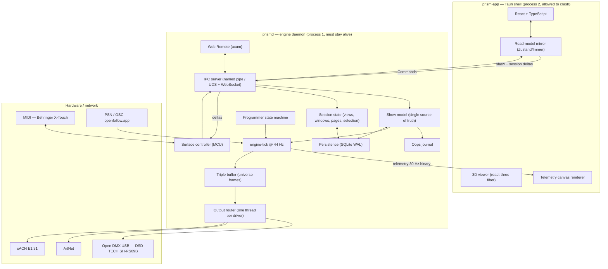
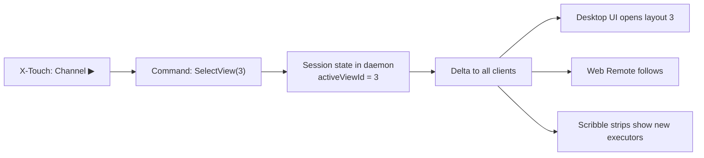

# ARCHITECTURE_SPEC.md — PrismDMX System Architecture

**Status:** Planning Phase complete, approved. Implementation (Phase 2) not started.
**Audience:** developers and AI assistants working on PrismDMX.
**Companion documents:** [`docs/MCU_MAPPING.md`](docs/MCU_MAPPING.md), [`docs/IPC_PROTOCOL.md`](docs/IPC_PROTOCOL.md), [`docs/DMX_MERGE.md`](docs/DMX_MERGE.md).

---

## 0. Scope and non-goals

PrismDMX is real-time DMX lighting control software for schools, community centres, small venues and theatre productions. It targets both professional network protocols (ArtNet, sACN, PSN) and budget USB hardware, and uses the Behringer X-Touch over Mackie Control Universal (MCU) as its physical console.

Three requirements are structural — they cannot be retrofitted, and every decision below is justified against them:

1. **Zero-crash.** DMX output must never stall during a show, including when the UI crashes.
2. **Deterministic timing.** A 44 Hz internal tick (22.727 ms) with low jitter.
3. **School-grade operability.** Installation without an IT department, on ageing hardware.

**Non-goals for V1:** multi-user sessions, RDM, timecode chase, media server integration, GDTF import.

---

## 1. Decision records

| # | Decision | Choice | Rationale |
|---|---|---|---|
| **D1** | Application stack | **Tauri v2 + Rust core + React/TypeScript UI** | No GC ⇒ no frame jitter in the tick loop; ~10 MB installer and ~100 MB RAM instead of 250/400 MB with Electron; mature crates for MIDI, FTDI, ArtNet and sACN; the UI stays web technology including three.js |
| **D2** | Process isolation | **Two processes from day one: `prismd` (engine daemon) + `prism-app` (Tauri shell)** | The strongest achievable zero-crash guarantee: the UI may die, restart and reconnect while DMX keeps running |
| **D3** | State management | **Single source of truth in the daemon**; every client is a view onto it. Two separate channels: Control (deltas) and Telemetry (30 Hz, binary, droppable) | One place of truth for desktop UI, X-Touch and Web Remote. The telemetry channel exists because 64 × 512 channels cannot pass through React state — it is a rendering optimisation, not a responsibility boundary |
| **D4** | Show file | **SQLite `.prism`** (WAL, autosave) + JSON for fixture library, surface mappings and settings + JSON export | A power cut mid-save must not destroy a show. Schools have no backups |
| **D5** | DMX outputs in V1 | **Open DMX USB (FTDI FT232R), ArtNet, sACN** — all three in V1. Enttec Pro protocol comes later | The target hardware is a **DSD TECH SH-RS09B**, an Open DMX cable without a microcontroller ⇒ host-side break timing is mandatory |
| **D6** | MCU mapping | **Declarative JSON bindings** across three layers (codec → surface model → binding table) | `XTouch.txt` specifies "assignable function out of a list" in six places — this is user configuration, not a constant |
| **D7** | Executor paging | **One page = 8 executors.** The Executor Bar shows only the **current** page. `Faderbank ◀▶` = page down/up | Supersedes "4 Rows of 8 Executors" in `Architecture.txt` — see §11 |
| **D8** | X-Touch `Channel ◀▶` | **Switches UI views** (saved window layouts from the View Selector Bar) | "View down/up" in `XTouch.txt` refers to canvas views, not executor rows |
| **D9** | Daemon lifecycle | **Both modes, switchable in settings.** Default: the shell starts `prismd` and leaves it running on close. Opt-in: autostart at boot | A classroom laptop and a permanent venue installation have opposite expectations |
| **D10** | Platforms | **Windows is primary.** Raspberry Pi (Linux ARM64) and macOS are *kept portable* but not shipped | The target audience is on Windows, but portability must not rot — see §10 |
| **D11** | Surface ↔ UI | **The X-Touch operates the UI fully — through shared session state in the daemon, never by routing through the UI** | Views, windows, pages and encoder banks are operating state and belong in the daemon. The console drives the UI *and* the low-latency fader path stays untouched — see §4 |

---

## 2. System overview



**What the process boundary buys us:** the MIDI surface, the show file, the operating state and every output live in the daemon. If the UI dies, the console and the lights keep working — the operator continues the show on the X-Touch while the interface restarts, and afterwards sees exactly the state established from the console.

---

## 3. Threading model

| Thread (inside `prismd`) | Priority | Responsibility | Must never block on |
|---|---|---|---|
| `engine-tick` | Realtime / high | 44 Hz: drain command queue, evaluate playbacks, merge, write frame to triple buffer | locks, allocation, I/O, logging |
| `out-opendmx-*` | High | Break/MAB plus 513-byte frame per adapter; reconnect backoff | the engine |
| `out-artnet`, `out-sacn` | High | Read latest frame, send at own cadence | the engine |
| `midi-in` / `midi-out` | Normal | MCU codec; feedback coalescing at 30 Hz | the engine |
| `psn-osc-in` | Normal | Tracker positions into a ring buffer (latest value only) | the engine |
| `core-main` (async, tokio) | Normal | IPC server, show model, session state, persistence, Web Remote | — |

### 3.1 Hard rules for `engine-tick`

Enforced by lint (`#![deny(clippy::unwrap_used, clippy::expect_used, clippy::panic)]` in `prism-engine`):

- **No heap allocation inside the tick.** All buffers are sized up front from the patch.
- **No mutex locks the tick can wait on.** Input arrives over an SPSC ring buffer and output leaves through a triple buffer, neither of which locks at all. Two hand-overs *from* the core thread — a rebuilt `MergeBody` (S17) and a joining or leaving output subscriber (S33) — are behind a `std::sync::Mutex` the tick only ever `try_lock`s: a lock it cannot have this instant is one it does not take, and the hand-over arrives 23 ms later instead. The rule is that the tick never **waits**, and that is what the jitter gates and the allocation gates measure.
- **No synchronous logging.** Log records go into a lock-free ring; a separate writer thread drains it.
- **Absolute deadlines** via `Instant` so error does not accumulate; `sleep(deadline − 1 ms)` followed by a spin for the remainder.
- **`panic = "unwind"`** in the release profile. The panic hook marks the module *degraded* rather than terminating the process.

### 3.1.1 What comes back out (S34)

The rules above are about what may go *into* the tick. What comes out of it is the frame, through the triple buffer — and, since S34, one thing more: **what each playback is doing**. `prism_engine::PlaybackReport` is a fixed table of atomic words, one per executor, published at the end of every tick with a relaxed store and sampled by `prismd`'s own loop at 25 ms. It obeys §3.1 by construction: sized when it is built, never resized, never locked, never waited on.

Two consequences worth stating, because both are deliberate:

- **A reader may be one tick out of date, and may never be wrong about a tick that happened.** One entry is written atomically, so an executor number, its cue index and whether it is running arrive together; two entries are not guaranteed to be from the same tick, and neither is the length. Making them so would need a seqlock, which would make the reader spin and buy nothing for feedback that drives a screen.
- **The tick is the only author of `Executor.isActive` and `Executor.currentCueIndex`.** The daemon used to write `isActive` on its way past a Go, because nothing else could; with a readback that would be a second author racing the first, and the symptom was a strip that lit, went dark on the next poll and lit again. The cost is that a `Toggle` pressed within a poll of somebody else's Go reads the state from just before it — which is the same latency any desk with two operators has, and much shorter than a person's reaction.

### 3.2 Frame rate, stated precisely

The engine tick always runs at 44 Hz — it is the time base for fades, phasers and cue timing. Output drivers consume the most recent frame from the triple buffer **at whatever rate they can achieve**. ArtNet and sACN reach 44 Hz; Open DMX USB is limited to roughly 30–40 Hz by its hardware (§7.1). The `CLAUDE.md` invariant therefore holds at the engine level without misrepresenting what budget hardware can do.

---

## 4. Session state — how the X-Touch operates the UI

This resolves two requirements that appear to conflict: **minimum fader latency** (a direct path into the backend) and **full UI operation from the console** (switching views, opening windows, paging).

They do not conflict, because the X-Touch does not remote-control the UI. Operating state — the active view, which windows are open, the executor page, the encoder bank, the selected programmer parameter — lives in the daemon, not in the client. The console changes that state, the daemon broadcasts a delta, and **every** attached surface follows.



This beats the obvious alternative ("surface sends a keypress to the UI, UI opens a window") in three ways:

- It works **while the UI is closed or restarting** — the state is already there when a client connects.
- It works with **multiple screens or clients** at once without them drifting apart.
- The scribble strips show the right thing automatically, because console and UI read the same source.

### 4.1 What belongs to session state (console-controllable)

```typescript
interface Session {
  id: SessionId;
  name: string;                        // V1: exactly one, "Main"
  activeViewId: number;                // canvas layout from the View Selector Bar
  openWindows: WindowInstance[];       // type, position, size on the canvas
  focusedWindow: number | null;
  executorPage: number;                // Faderbank ◀▶
  selectedExecutor: ExecutorId | null; // drives main fader, Flip, transport
  selectedSequence: SequenceId | null; // the cue list a store goes into (S39)
  editingCue: CueEdit | null;          // which cue the programmer is editing (S39)
  encoderBank: FeatureGroup;           // Dimmer / Position / Color / Beam / Focus
  programmerPage: number;              // Zoom ▲▼ — pages the encoder bar (S35)
  programmerParamIndex: number;        // Zoom ◀▶ — what the jog wheel turns
  commandLine: string;                 // contents of the console line
}
```

```typescript
interface CueEdit {
  sequenceId: SequenceId;
  cueNumber: string;   // the number, not an index — a number is what an operator wrote down
  modified: boolean;   // whether the programmer has moved since the cue was loaded
}
```

Sessions are persisted with the show file: reopening a show restores the console exactly as it was saved. The two S39 fields are `#[serde(default)]`, because a `.prism` file keeps the session as an opaque document (S15) and a file written before them does not carry them; `editingCue` is also **not** an edit that resumes, since the programmer is deliberately not in the file either.

> **The selected sequence is a field of its own, and that was S39's decision** *(S39)*. Until it existed the cue sheet followed the sequence on `selectedExecutor`, and S28 marked that as an assumption rather than making it permanent — §4.4 named S39 as the session that would settle it. It is settled by adding the field, for two reasons the executor reading cannot meet: `Store Cue 5` typed with **no executor selected** has to mean something, and a cue list nobody has put on a fader has to be editable without occupying a playback slot to reach it.
>
> It is deliberately **not** coupled to `selectedExecutor`. An operator programming cue list 7 while executor 3 plays the show is the ordinary case on a console, not the edge case, and a desk that moved this every time a fader was selected would store into whatever was last touched. The two are separate selections and the interface draws both: the cue sheet follows this one and the transport line follows the executor.

> **`editingCue` is the update state, and it is here rather than in the programmer** *(S39)*. It is what makes an Update key blink — `editingCue !== null && editingCue.modified` — and every attached client has to blink the same key, which is precisely what §4's opening paragraph is about. A client that worked it out from its own mirror of the programmer would have to know which cue that programmer came from, and that is the fact this field carries. It is cleared when the programmer is cleared, when the cue is deleted, and when a different cue is loaded; a renumber of the cue being edited **carries it**, because otherwise an Update would recreate the cue at the number it used to have.

### 4.2 What does not (client-local)

Monitor assignment of a window, scroll position, hover and drag state, 3D viewer camera, UI zoom level. These are legitimately different per screen and would be actively annoying as shared state. The console cannot drive them — deliberately, and with no loss of function.

### 4.3 Latency budget, fader to light

The direct path is fully preserved. The UI appears in **none** of these steps:

| Step | Latency |
|---|---|
| Fader movement → MIDI packet at the host | **measured 2026-08-13 (S20): a round trip through the surface is 0.71 ms median (0.61–1.02 over 60 exchanges), so one direction is well under 1 ms. The step that actually bounds this is the surface's own report interval: a moving fader is reported every 19.8 ms, so a movement is seen 0–20 ms after it happens** |
| MIDI thread → codec → command → engine SPSC queue | < 0.1 ms |
| Wait for the next tick (44 Hz grid) | 0–22.7 ms (avg 11) |
| Merge and frame generation | < 1 ms |
| Output: ArtNet/sACN immediate · Open DMX until next frame | 0–30 ms |
| **Total fader → light** | **~15–50 ms**, dominated by the DMX protocol itself and, at the top of the chain, by the surface's 19.8 ms report interval — not by anything PrismDMX does |

Routing through the UI (MIDI → daemon → UI → daemon) would add two IPC round trips and a React render cycle, and would make lighting depend on UI responsiveness. That is why **no** operating path goes through the UI — including the UI commands themselves.

### 4.4 Commands the console issues for the interface

`SelectView`, `StoreView`, `OpenWindow`, `CloseWindow`, `FocusWindow`, `SetExecutorPage`, `SelectExecutor`, `SelectSequence`, `SetEncoderBank`, `SetProgrammerPage`, `SelectProgrammerParam`, `CommandLineInput`.

These twelve are what the **console** issues — eleven since S12, plus `SelectSequence` (**S39**), which a console issues by typing `Sequence 5` on the command line. `PlaceWindow` (**S25**) is a session command that is deliberately not in this list, for one reason: a console never drags a window, but §4.1 puts a window's position in the session, so a client that kept it locally would be holding session state. It travels with the twelve, is journalled with them (that is, not at all — §6.1), and is specified in [`docs/IPC_PROTOCOL.md`](docs/IPC_PROTOCOL.md) §5.

> **Four commands are session commands only sometimes** *(S40)*. `Delete`, `Copy`, `Move` and `Label` name one of the six numbered things a desk has, and one of the six — a **view** — is session state by §4.1. So which applier owns one of them is a property of its *target*: `Command::is_session_command` reads it, `ShowFile::apply` routes on it, and §6.1 follows. They replaced S35's `RenameView`, `DeleteView` and `MoveView`, which said the same thing in narrower words; managing a view library is still something an operator does with a pointer, and now the pointer writes the same line the console types. `docs/IPC_PROTOCOL.md` §5 has why there are four verbs rather than twenty-four commands.

> **The view library's order is its numbers** *(S35, kept in S40)*. `views` is keyed by number, the View Selector Bar draws in number order, `SelectView` names a number and `Channel ◀▶` steps from one number to the next — so a move **exchanges two views' contents** and leaves their numbers where they are, rather than recording an order beside them. One order means the console cannot step to a view other than the one drawn next. It costs what it has to: after a move, `SelectView 3` names a different layout, and an F-key bound to a view number reaches whatever now sits in that place.
>
> S40 made the command **absolute** — `Move View 1 View 3` rather than `Prev`/`Next` — and the decision is untouched by that. What changed is where *left* becomes a number: the bar knows its neighbour and writes the line, which is §4.5, and one command covers both directions rather than the protocol carrying a word for each.

The **F1–F8 XKeys** are therefore freely assignable to "open Fixture Sheet", "open Patch", "jump to view 2" or macros — drawing on the same command list the UI buttons use. There is no second command world for the console.

> **There is a *selected sequence*, and S39 decided it should be one** *(S28, decided in S39)*. S28 met this and marked it: the Sequence Sheet and the Cue Viewer followed the sequence on `selectedExecutor`, which needed nothing added to §4.1, and choosing one was a `Command::AssignExecutor`. Both readings were defensible and only one could be right for `Store Cue 5` typed with no executor selected — so S39 added `Session::selectedSequence` and `Command::SelectSequence`, for the reasons in §4.1. What it costs is a second selection on the screen; what it buys is a cue list that can be written before anybody decides which fader it goes on. The one reader that had to change was `ui/src/show/looks.ts::executorInForce`, exactly as S28 predicted.

> **Playback is addressed to a sequence as well as to an executor** *(S40)*. Every playback command named an executor until then, so `On Sequence 1` — a cue list nobody has put on a fader — had no representation at all. `PlaybackTarget` is the three ways a line can say which playback it means: an executor, a sequence, or *the selected one*; the daemon resolves the last two, because which executor holds a sequence is show state and which sequence is selected is session state, and a client that worked either out would be sending a command whose meaning had already moved. A cue list that **no** executor holds gets a playback of its own in the engine, with its master at full and no keys — and the two are never both live for one list, because two players of one cue list would fight over the same slots in the merge.
>
> This is the other half of S39's argument for `selectedSequence`: a cue list can be written before anybody decides which fader it goes on, and a list you can write but not hear is a list you cannot check.

> **`SelectProgrammerParam` is relative and stays relative** *(S26)*. It steps, because `Zoom ◀▶` steps; there is no *set the parameter to n* command and the interface does not need one — clicking an encoder in the encoder bar composes the steps between where the highlight is and where it was clicked, which for a bank of at most six parameters is at most five commands. A thirteenth session command would have been a second way of saying the same thing, and the console could not issue it. The **upper** bound is the client's: `prism-core` deliberately does not know how many parameters a bank has (S13), so the bar stops offering *next* at the end of the bank rather than letting the index run past it, where the jog wheel would turn nothing at all.

> **Multi-session (later):** the model permits several sessions so two operators can work with independent views. V1 has exactly one session and the programmer belongs to it. Multiple programmers would be a merge question (LTP between them) and are deliberately out of scope.

### 4.5 The command line is the primary interface *(S40)*

**A key on the desk writes a word into the command line. It does not act.**

That is the decision, and it is a decision about the whole interface rather than
about one window. `Session::commandLine` is §4.1 state, so what an operator is
part-way through typing is already shared by every attached client; making the
keys write into it means the line is not a second way of doing things beside the
buttons — it is the **one** way, with the buttons as a faster keyboard for it.

Three shapes, and every control on the screen is one of them:

| Shape | Example | What pressing it does |
|---|---|---|
| **A whole command with no argument** | `Clear`, `Oops`, `Update`, `Full` | writes the word and **executes it at once** |
| **A command that needs arguments** | `Store`, `Edit`, `Goto`, `Move`, `Copy`, `Delete`, `Label`, `Assign` | writes the word and **waits** — the operator types the rest and presses Enter, which is also a key on the surface |
| **An argument keyword** | `Fixture`, `Group`, `Sequence`, `Cue`, `Preset`, `View`, `Executor` | **appends** the word to the line as it stands |

So `Fixture` `1` `Enter` is three presses that build `Fixture 1`, and it is the
same line an operator could have typed. An item picked out of a **list** — a
group in the group pool, a fixture in the patch, a cue in the sheet — writes the
command that names it *and submits it*, because the pointer has supplied the
argument the line was waiting for.

**Why this rather than buttons that send commands directly.** Four things follow
from it that do not follow from the obvious alternative:

- **One vocabulary to learn, and the screen teaches it.** An operator who has
  only ever used the pointer has been reading the lines they were building, and
  the day they start typing they already know the words.
- **One path to test.** What a gesture means is what the line means, so a
  recording of lines is a recording of the whole interface — and a button that
  built a line nobody could have typed would be a second grammar with no parser.
- **The prompt has somewhere to live.** A store into a cue that exists asks
  *merge, override or cancel*; the question belongs in the line the store came
  from, and Escape cancels it (§4.4's rule that a prompt is not a modal).
- **`commandLine` is session state, so a second screen follows the first.** An
  operator part-way through a command is visible on every client, which is the
  same argument §4 makes for the active view.

The exceptions are the ones a line cannot express and are deliberately small:
the **executor keys and faders** (a Go is a gesture with timing in it, §4.3),
the **encoders**, and direct manipulation of the canvas — dragging a window,
resizing it (§4.2). Everything else is the line.

---

## 5. DMX engine pipeline

One tick, in order:

```mermaid
flowchart LR
    A["1 Drain command queue"] --> B["2 Advance fades / phasers / timecode"]
    B --> C["3 Evaluate executors → attribute values"]
    C --> D["4 Merge: playbacks"]
    D --> E["5 Merge: programmer (absolute priority)"]
    E --> F["6 Apply masters (grand / group / speed)"]
    F --> G["7 Attributes → DMX channels (16-bit split, curves, invert)"]
    G --> H["8 Universe frames → triple buffer"]
    H --> I["9 Telemetry snapshot (throttled)"]
```



Merge semantics, the priority stack and the invariants that must hold under test are specified in [`docs/DMX_MERGE.md`](docs/DMX_MERGE.md). In brief: intensity merges **HTP**, everything else merges **LTP** by activation order, the programmer overrides all playbacks, and the stack from bottom to top is `Home → Playbacks → Programmer → Grand Master`.

---

## 6. Domain model

Types are defined once in Rust (`prism-domain`) and generated into TypeScript with `ts-rs`/`specta`. There is no hand-maintained duplicate. Shown here in TypeScript notation:

```typescript
type FixtureId = number;  type GroupId = number;
type SequenceId = number; type ExecutorId = number;
type PresetId = number;   type UniverseId = number;   // 1..=64

type AttributeType =
  | "Dimmer" | "Pan" | "Tilt" | "Red" | "Green" | "Blue" | "White" | "Amber"
  | "Iris" | "Zoom" | "Focus" | "Gobo" | "Prism" | "Shutter" | "Control";

type FeatureGroup = "Dimmer" | "Position" | "Color" | "Beam" | "Focus";

interface AttributeDef {
  attribute: AttributeType;
  featureGroup: FeatureGroup;
  coarseOffset: number;        // 0-based offset within the fixture footprint
  fineOffset: number | null;   // 16-bit fine channel, null when 8-bit
  defaultValue: number;        // home value, 0..65535
  mergeMode: "HTP" | "LTP";
  invert: boolean;
  physicalFrom: number;        // e.g. -270 for Pan
  physicalTo: number;
}

interface FixtureType {
  id: string;                  // stable key, e.g. "generic.rgbw.par"
  manufacturer: string; name: string; mode: string;
  footprint: number;           // channel count
  attributes: AttributeDef[];
}

interface Fixture {
  id: FixtureId;               // user-facing fixture number
  name: string; typeId: string;
  universe: UniverseId; address: number;   // 1..=512 start address
  position: Vec3; rotation: Vec3;          // 3D viewer + PSN follow
  invertPan: boolean; invertTilt: boolean;
}

interface Group { id: GroupId; name: string; fixtures: FixtureId[]; }

interface Preset {
  id: PresetId;
  pool: FeatureGroup;          // Color / Position / Dimmer pools
  name: string;
  color: RgbColor | null;      // shown on the X-Touch scribble strip
  values: Array<{ fixture: FixtureId; attribute: AttributeType; value: number }>;
}

interface CuePart {
  fixture: FixtureId; attribute: AttributeType;
  value: number;               // 0..65535
  presetRef: PresetId | null;  // preset link keeps the cue live-updatable:
                               // storing the preset rewrites this part's value
                               // (prism_core::Show::relink, S28)
}

interface Cue {
  number: string;              // "1", "1.5" — string preserves decimal ordering
  name: string;
  fadeIn: number; fadeOut: number; delay: number;   // seconds
  trigger: "Go" | "Follow" | "Time" | "Sound";
  triggerTime: number | null;
  parts: CuePart[];
}

interface Sequence { id: SequenceId; name: string; cues: Cue[]; loop: boolean; }

type ExecutorButtonFunction =
  | "Empty" | "Go+" | "Go-" | "LearnSpeed" | "Off" | "On" | "Flash" | "Toggle";
type ExecutorFaderFunction   = "Empty" | "Master" | "Speed" | "XFade";
type ExecutorEncoderFunction = "Empty" | "Master" | "Speed";

interface Executor {
  id: ExecutorId;              // page * 8 + slot  (D7: one page = 8 executors)
  sequenceId: SequenceId | null;
  faderFunction: ExecutorFaderFunction;
  buttonFunctions: ExecutorButtonFunction[];  // Rec / Solo / Mute / Select
  encoderFunction: ExecutorEncoderFunction;
  masterLevel: number;         // 0..65535
  speed: number;               // the speed master, in SPEED_UNITY (1024) units
                               // (S34; docs/DMX_MERGE.md §4.1)
  isActive: boolean;           // written only by the tick's readback (S34)
  currentCueIndex: number | null;   // the same
}

// Which of an executor's buttons a press names (S34). A `Slot` is a hardware
// position and what it does is `buttonFunctions`, resolved by prism-core and by
// nothing else; a `Function` is a row of the surface profile naming one
// outright, which is the desk's own configuration rather than a client's
// inference. Either way the daemon decides what it comes out as — `Toggle` is
// resolved against `isActive` where `isActive` is owned.
// See docs/MCU_MAPPING.md §4.2.1.
type ExecutorButtonRef =
  | { t: "Slot"; index: number }
  | { t: "Function"; function: ExecutorButtonFunction };

interface ProgrammerState {
  selection: FixtureId[];
  activeFeatureGroup: FeatureGroup;
  values: Map<FixtureId, Map<AttributeType, ProgrammerValue>>;
  clearStage: 0 | 1 | 2;       // three-stage clear per CLAUDE.md
}

interface ProgrammerValue {
  value: number;
  source: "Manual" | "Preset" | "Recalled";
  presetRef: PresetId | null;
}

type WindowType =
  | "FixtureSheet" | "DmxSheet" | "SequenceSheet" | "Groups" | "Viewer3D"
  | "PhaserEditor" | "ClockViewer" | "CueViewer" | "PresetPool" | "Patch"
  | "Settings";   // DmxSheet added in S25: the output itself, channel by channel
// S27 settled what the three sheets are for, which had never been written down:
//   Patch        — the *rig*: which fixtures exist and where their channels are.
//                  The one window that changes the show's shape.
//   FixtureSheet — the *state*: what the programmer holds and what is on the
//                  cable, per fixture, live. Watched, not edited.
//   DmxSheet     — the *cable*: channel by channel, with no fixtures in it.
// S28 settled the three that are about *looks*:
//   SequenceSheet— the *cue list*: which sequences there are, which one is in
//                  force, and its cues with their numbers, names, times and
//                  triggers, edited in place. The one window that stores a look.
//   CueViewer    — the *cue*: what those cues set, fixture by fixture, with the
//                  preset links visible. Watched, not edited — what a cue sets
//                  comes from the programmer through StoreCue.
//   PresetPool   — the *pools*: named looks per feature group, applied and
//                  stored, with the colour the scribble strips use.

interface WindowInstance {
  instanceId: number; type: WindowType;
  x: number; y: number; w: number; h: number;
  params: Record<string, unknown>;   // e.g. which preset pool
}

interface View { id: number; name: string; windows: WindowInstance[]; }
```

The `Command` and `Delta` wire types are specified in [`docs/IPC_PROTOCOL.md`](docs/IPC_PROTOCOL.md).

### 6.1 Oops (undo/redo)

Applying a command produces a compact `UndoRecord` holding the inverse and the affected scope, kept in a 200-entry ring buffer.

**Deliberately not undoable:** playback actions (`ExecutorGo`, `ExecutorOff`, `ExecutorOn`, `Goto`, `ExecutorButton`, master moves) and every session command from §4.4 — `SelectSequence` (S39) among them, because an Oops must not pull a cue list out from under an operator any more than it pulls a window. `ExecutorOn` and `Goto` are S40's and are excluded for the same reason as the two beside them: they change light somebody is currently driving.

**Every machine command is excluded too** *(S33)*, and that follows from where the output patch lives rather than from a separate decision. `AddOutput`, `ConfigureOutput`, `RemoveOutput` and `SetOutputEnabled` edit `prism_core::MachineConfig` (§7.0), which is not show content: this journal belongs to the show, it is cleared when a show is loaded, and a record of a rig change would be a record of something the show it is filed against knows nothing about. It is also the playback rule met by another road — an Oops that re-addressed a node would move light on a stage while somebody was driving it. `Command::is_machine_command` is the predicate, `ShowFile::apply` refuses these four outright, and `crates/prism-core/tests/outputs.rs` asserts that a refusal leaves the journal exactly where it was.

**Four commands are undoable only sometimes** *(S40)*. `Delete`, `Copy`, `Move` and `Label` are show edits when they name a sequence, a cue, a group, a preset or an executor, and **session** commands when they name a view (§4.4) — so an Oops takes back a deleted cue and never a deleted view. That is the same rule applied through a payload rather than a variant, and `crates/prism-core/tests/objects.rs` holds it on the show's bytes. Their scope is wider than the two things they name: a move of a sequence images every executor that played it and a move of a preset images every cue that linked to it, because both are repointed by the move and an undo that put half of it back would leave a fader pointing at a cue list that is gone. The show edits S28 added — `StorePreset`, `SetCueProperty`, `AssignExecutor`, and the two S40 folded into `StoreSequence` and `Delete` — **are** undoable, and a `StorePreset` images the sequences its preset reaches as well as the preset itself: storing a preset rewrites the cue parts linked to it, so restoring the pool alone would take the edit back in one place and leave it standing in every cue. Undo during a running show must neither change light the operator is currently driving nor pull windows out from under them.

S39's three are undoable for the same reason: `StoreSequence` and `Update` are stores, and `EditCue` fills the programmer. **`StoreSequence` carries the selection too** *(S40)*: a store onto a free number *makes* the cue list and puts it in force, because `Store Cue 1` names no list and means the selected one (§4.1) — so an Oops that took the cue list back and left the desk pointing at a sequence that no longer exists would restore half a state, in exactly the way the update state below does. A store into a list that already exists moves no selection and images none. **Their scope carries the update state** (`Session::editingCue`), which does not contradict the exclusion of the session *commands* above — that exclusion is about an undo pulling windows out from under an operator, and this is the cursor into the cue the programmer came from. An Oops over an `EditCue` that put the programmer back and left the desk claiming to be editing cue 3 would restore half a state, and the half it left standing is the one the Update key acts on. `DeleteCue` and a renumber carry it too, because both can move it.

---

## 7. DMX outputs

```rust
trait DmxOutput: Send {
    fn id(&self) -> OutputId;
    fn send_frame(&mut self, universe: UniverseId, data: &[u8; 512]) -> Result<(), OutputError>;
    fn health(&self) -> OutputHealth;   // Ok | Degraded | Disconnected
}
```

Every driver runs on its own thread wrapped in `catch_unwind`, with exponential reconnect backoff (100 ms → 5 s), and reports `health` through the telemetry channel so the UI can show a status light per interface.

### 7.0 The output patch — the rig as data *(S33)*

Until S33 the outputs were `prismd` command-line flags built once at start-up, and every network output was handed the show's whole set of universes. A venue's real rig — several outputs, of several kinds, each carrying the universes it is actually wired for — was not expressible at all.

It is now `prism_domain::OutputInstance`: a number, a name, a kind with its parameters, **the set of universes it carries**, and whether it is enabled. `docs/IPC_PROTOCOL.md` §5 has the wire form and the four commands that edit it.

**Where it lives is the decision.** `prism_core::MachineConfig`, beside the desk identity, and never inside a `.prism` file — because a show carried to another hall on a stick must not bring the first hall's cabling with it. That is the argument §7.2 and `prism_core::desk` already make for the sACN CID, with one more beside it: a rig is a property of the **building**, and the school's template for next term names an Art-Net node the hall it is opened in has never heard of. The session is not a home for it either, since §4.1 persists the session *with the show*.

| Aspect | Decision |
|---|---|
| Routing | Both ways: one universe may go to several outputs, and one output may carry many. A universe sent to two outputs arrives byte-identical at both, because the publisher fans the frame out rather than sharing it (§3.2) |
| A universe with no output | A **legitimate state that is reported** — `prism_core::ShowIssue::UniverseNotOutput`, said on the way up and again as a `Delta::Notice` whenever the rig changes. Refusing to patch into an unwired universe would be a desk that cannot be prepared before the get-in; dropping it in silence is how a universe ends up dark with every light green |
| Art-Net port mapping | Universe → Net · Sub-Net · Universe **on that node**, so a four-port node is four rows an installer reads off the back of it. A universe with no row keeps §7.2's default, N − 1 |
| sACN port mapping | Universe → E1.31 universe and priority, per universe (§7.2). A universe with no row is sent as itself at priority 100 |
| Open DMX | Exactly one universe per adapter (§7.1) — refused rather than truncated — and a **serial** that pins one cable when there are two, which is what `DeviceDescriptor::with_serial` was built for in S8 |
| Hot reconfiguration | Adding, removing or re-addressing an output while the show runs costs **no tick and no frame** to the outputs that did not change. `prism_engine::FrameEnrolment` is the channel: the arriving subscriber's buffer is allocated on the core thread and taken up by the tick with one atomic load and a `try_lock` that never blocks, and the departing one's is freed back on the core thread. It is `prismd`'s `BodySwap` pattern applied to the publisher's fan-out |
| What costs a restart | The kind, the universes, the number, the enabled flag — and nothing else. **A rename costs nothing**, because an operator who typed a better name should not watch their rig blink, and for sACN a restart is a stream terminated and a stream begun |
| Disabled | Keeps its whole configuration and has no thread and no socket, which is what an operator wants of a node that is being worked on. It carries no universes for the dark-universe report, because nothing is reaching those fixtures |
| Where the drivers are opened | `prismd::outputs::OutputFactory` — `SystemOutputs` opens the real thing, `MockDevices` (`--mock-devices`) opens a recording double carrying the same universes. The same seam `FtdiBackend` is one level down, and it is what lets S33's worked example be asserted frame by frame with nothing plugged in |
| The command line | Outputs named on it are the **whole rig for that run**: the stored configuration is neither read nor written, and the four commands are refused. A daemon started with `--mock-output` — every test in this repository — must neither inherit a venue's cabling nor overwrite it |

### 7.1 Open DMX USB — DSD TECH SH-RS09B (V1, mandatory)

The cable is an **FTDI FT232R with no microcontroller**. There is no widget firmware to generate break and mark-after-break, so the **host** owns DMX timing.

| Aspect | Approach |
|---|---|
| Access path | Behind an `FtdiBackend` trait. Windows: **D2XX** (`libftd2xx`, statically linked), fallback **VCP** (`serialport` with `set_break`/`clear_break`). Linux/RPi: **libftdi** (`rusb`) |
| Device discovery | USB VID/PID — **verified 2026-08-11 (S8): `0403:6001`**, product string `FT232R USB UART`, serial `B0037HIY`. The strings are FTDI's own, so the profile matches on VID/PID and leaves the serial as the way to tell two cables apart |
| Port setup | 250 000 baud, 8 data bits, **2 stop bits**, no parity, no flow control; `SetLatencyTimer(1)` — the 16 ms default would be fatal; explicit USB transfer sizes |
| Frame | `SetBreakOn` → ~110 µs → `SetBreakOff` → ~16 µs MAB → write 513 bytes (start code `0x00` + 512 channels) → **wait out the frame's transmission time before the next break** (see below) |
| Achievable rate | **35.5 Hz measured** over 60 s through D2XX, 38.4 Hz through the VCP (S8). Pure data time is 22.6 ms; the two break transfers measured ~3 ms together, not the 0.1–1 ms assumed. A longer break remains DMX512-compliant (up to 1 s is permitted) |
| **Frame ordering** | **`FT_Write` returns before the bytes have left** — measured at 20.0 ms for a frame that takes 22.6 ms — and `FT_GetStatus`'s transmit queue reads zero immediately, so it is no help. A break is a USB *control* transfer and does not queue behind bulk data, so one asserted at that point lands **inside** the frame still going out and every frame is malformed. The driver therefore waits out the computed transmission time (513 × 11 bits ÷ 250 000 baud = 22.572 ms) plus a 2 ms margin before the next break. This is why the real rate is 35.5 Hz and not the 43 Hz an unsynchronised driver appears to reach |
| Limitations | Transmit only, no RDM, no read-back. Exactly **one** universe per adapter |
| Failure mode in the field | USB unplugged or machine suspended ⇒ the driver thread detects the error, purges and reconnects; the UI light turns red, the engine keeps running |
| Linux/RPi note | `ftdi_sio` claims the device; the libftdi path resolves this by detaching the kernel driver plus a udev rule. Do not use D2XX on Linux |

35 Hz is normal for this class of hardware — QLC+ and FreeStyler achieve no more with the same cable — and is unproblematic for conventional dimmers and LED pars. Guaranteed 44 Hz requires ArtNet, sACN or a future Enttec Pro widget. The UI states this plainly when the output is created rather than hiding it.

**D2XX or the VCP on this machine (S8):** both were driven against a real fixture and both produced a steady, correct picture. **D2XX remains the preferred path**, and not because of the rate — the VCP measured *faster* (38.4 Hz against 35.5 Hz), and the whole of that difference is the 2 ms safety margin D2XX is given before the next break. It is preferred because it configures the port completely: the latency timer and the USB transfer sizes are reachable through D2XX and **not reachable at all** through a serial API, where they are whatever the registry says — 16 ms on the bring-up machine. A path that cannot set the settings this table calls fatal is a fallback, not a default.

### 7.2 Network outputs (V1)

| Protocol | Crate | Notes |
|---|---|---|
| ArtNet | **none — written in `artnet.rs` (S9)** | **Unicast by default** — broadcast floods school networks; optional ArtSync; full-frame refresh at least every 800 ms even without changes |
| sACN (E1.31) | **none — written in `sacn.rs` (S10)** | Multicast `239.255.x.x`, per-universe priority, source name from the show file, termination packet on clean shutdown |

**ArtNet as built (S9).** ArtDmx is 530 bytes and its header is 18 of them, which
is less code than the seam an external crate would need — so the packet is built
here, field by field, against the specification, and asserted the same way. The
socket is `std::net::UdpSocket` behind a `UdpSender` trait, so the packet bytes
are checked with no network present *and* checked again on a datagram received
over loopback.

| Aspect | Approach |
|---|---|
| Addressing | Fifteen-bit `PortAddress` (Net · Sub-Net · Universe). Default mapping is **universe N → port address N − 1**, since PrismDMX numbers universes from 1 and Art-Net from 0; overridable per universe, because nodes disagree |
| Sequence | Per port address, 1 → 255 → **1**. Never 0, which is the value that tells a node this sender does not number its packets |
| When a datagram goes out | On change, and otherwise as the forced refresh. An unchanged universe sent every cadence is the broadcast flood in a quieter form: at 44 Hz, 64 universes is 1.5 MB/s of nothing |
| Refresh timing | The 800 ms is a **maximum gap**, so the refresh goes out one cadence *early* (`refresh_margin`, default one engine tick). Refreshing at 800 ms exactly would put the datagram at 800 ms + one cadence |
| ArtSync | Off by default: a node that understands it stops displaying data until one arrives. When on, it follows the last universe of each frame and goes to **the same addresses the data went to** — enabling it must not turn a unicast configuration into a broadcasting one |
| Broadcast | Opt-in by name (`Destination::Broadcast`), and the only thing that asks the socket for broadcast permission |
| Rate | 44 Hz, i.e. the engine's own — this is the output §3.2 means when it says the network protocols keep up |

**sACN as built (S10).** The E1.31 data packet is 638 bytes across three nested
PDUs, and the same reasoning as Art-Net applies: the seam an external crate would
need is larger than the packet, and the requirement is a **byte-for-byte**
assertion against the standard — which is easiest to trust when the bytes are
written once, beside the field names. The socket is the same `UdpSender` seam,
one method wider: a sender needs a multicast **hop limit**, and nothing else that
multicast usually implies (joining a group is how a *receiver* asks to be given
datagrams).

| Aspect | Approach |
|---|---|
| Identity | `Cid`, a UUID, **configuration rather than a random number at start-up**. Nothing in the crate generates one: a desk with a fresh CID every start is a *new source* every start, and the old one holds the universe until the receiver times it out. An output without one refuses to connect rather than transmitting under the nil CID that every unconfigured desk would share. Until the show file exists (S11/S15) it lives in `SacnConfig::cid` |
| Addressing | Multicast `239.255.{universe high}.{universe low}` on port 5568, computed for the **whole** E1.31 range 1…63999 rather than the desk's 1…64. Unicast to named receivers is available for venues that forbid multicast. Never broadcast, and the socket is never asked for the permission |
| Universe numbering | Universe N → E1.31 universe N. Unlike Art-Net, both count from 1 — but the mapping is still data (`SacnPort::at_universe`), because a venue's universe 1 is not always a desk's |
| Priority | **Per universe** (`SacnPort::at_priority`), 0…200, default 100. Two sources on one universe are resolved by the higher priority winning outright, which is how a backup desk takes over; refused above 200 rather than clamped |
| Source name | 64 bytes, UTF-8, null-terminated, from the show file. Truncated **on a character boundary**, so an over-long name loses a character rather than half of one |
| Sequence | Per universe, 0 → 255 → **0**. Art-Net skips 0 because there it means "not numbered"; here skipping it would be the bug |
| Sync | Sync Address transmitted as 0 and no synchronisation packets sent. A non-zero address tells a receiver to hold data until a sync arrives, so offering the setting without the packets would be a way to configure a rig into darkness |
| When a datagram goes out | On change, and otherwise as the keep-alive. `last` and `sent_at` record the last datagram that **actually went out**, so a refused one is not written down — and a look that failed and was then changed back is not re-sent, because the receiver already has it |
| Refresh timing | E1.31 requires at least one packet per universe per second. Maximum gap, so it goes out one cadence *early* (`refresh_margin`), the same trap as Art-Net's 800 ms |
| Shutdown | Three `Stream_Terminated` packets per universe that has an active stream, each with the **next** sequence number — three identical ones would be discarded as duplicates and only the first would end anything. They carry the last look: whether the stage goes dark is S17's configurable decision, one level up |
| Multicast hop limit | Asked for explicitly at connect (`multicast_ttl`, default 1). A hop limit that could not be set is a **disconnected** output: the operator asked for a routed lighting network and would otherwise get datagrams that stop at the first router, under a green light |
| Rate | 44 Hz, the engine's own |

### 7.3 Later
Enttec USB Pro protocol over VCP. It uses the same `DmxOutput` boundary and is purely additive.

---

## 8. Incoming position data (PSN / OSC — openfollow.app)

Trackers send at their own rate (typically 30–60 Hz), asynchronously to the tick. A receiver thread writes into a ring buffer; the tick reads **only the latest** value — stale positions are worthless, so nothing is queued. Fixtures with a follow assignment compute pan and tilt from tracker position combined with fixture position and rotation in 3D space.

On packet timeout (500 ms) the last position is **held**, a warning appears in the UI, and nothing jumps.

---

## 9. Repository layout

```
prismdmx/
├─ crates/
│  ├─ prism-domain/      # types, Command/Delta/Telemetry, ts-rs export → ui/src/bindings
│  ├─ prism-engine/      # 44 Hz tick, merge, playback. No I/O, no UI dependencies.
│  ├─ prism-core/        # show model, session state, programmer, Oops, SQLite
│  ├─ prism-protocols/   # DmxOutput: OpenDmxUsb, ArtNet, sACN + PSN/OSC input
│  ├─ prism-surface/     # MCU codec, surface model, binding table
│  ├─ prism-ipc/         # framing + transport, server and client halves
│  ├─ prismd/            # daemon binary (engine, session, surface, outputs, Web Remote)
│  └─ prism-app/         # Tauri shell (thin client; spawns or attaches to prismd)
├─ ui/
│  ├─ src/components/    # Canvas, Executor Bar, Encoder Bar, Console, View Selector
│  ├─ src/windows/       # Fixture Sheet, Sequence Sheet, 3D Viewer, Patch, Settings …
│  ├─ src/state/         # read-model mirror, telemetry channel (canvas/refs, not useState)
│  └─ src/bindings/      # generated from prism-domain
├─ profiles/
│  ├─ surface/xtouch.json    # layer 3 bindings + the S20 verification record
│  └─ fixtures/              # the Open Fixture Library, DOWNLOADED at install
│                            # time and not committed (S44). Only SOURCE.md is
│                            # in git; tools/fetch-fixtures installs the rest.
│                            # A copy here would be the second copy of somebody
│                            # else's data, and the one that is out of date.
├─ tools/
│  └─ xtouch-probe/      # S20's bring-up tool. NOT a workspace member: it opens
│                        # a MIDI port, which is platform code (§10.1), and
│                        # keeping it outside means `cargo test --workspace`,
│                        # clippy and the ARM64 cross-check never see `midir`.
├─ docs/                 # MCU_MAPPING.md, IPC_PROTOCOL.md, DMX_MERGE.md
└─ tests/                # integration and stress/latency suites
```

---

## 10. Platform and lifecycle strategy (D9 / D10)

### 10.1 Staying portable without shipping it

Windows is the only release target. To stop Raspberry Pi and macOS support from rotting:

- **Platform code is confined.** `#[cfg(target_os = …)]` may appear only in `prism-protocols` (FTDI backend selection), `prism-app` (shell and autostart) and **`prism-ipc`, in `transport/local.rs` alone** (named pipe on Windows, Unix domain socket elsewhere — added in S16; the reasoning is in `PROGRESS.md`'s decision log). In each case the exception selects a platform primitive and nothing above the selection knows which one was chosen: in `prism-ipc` the framing, the handshake, the backpressure policy, the server and the client are one code path on every target. `prism-domain`, `prism-engine`, `prism-core` and `prism-surface` are platform-neutral and therefore testable anywhere.
- **CI keeps the door open.** Windows: full build and all tests on every commit. Linux ARM64: cross-compile check plus the platform-neutral tests, no hardware tests. macOS: not in CI until it becomes a priority.
- **No Windows-only crates** in the core crates.
- **A tool that needs a device lives outside the workspace.** S20 had to open a MIDI port to verify the X-Touch, which `prism-surface` is not allowed to do. Rather than bend the rule, `tools/xtouch-probe/` is its own crate with its own `[workspace]`: it depends on `prism-surface` by path — so the bytes it puts on the wire are the shipping codec's and not a transcription — while `cargo test --workspace`, `cargo clippy --workspace --all-targets` and the ARM64 cross-check never compile `midir` at all. The verification it produced comes back into the workspace as **recorded captures** (`crates/prism-surface/tests/captures/`), which the ordinary suite replays with nothing plugged in. That shape is the pattern for any future device: platform code and hardware in a tool, evidence in a fixture.

### 10.2 Why the Raspberry Pi is nearly free

D2 pays off here: `prismd` has no UI dependency and runs on a Pi with no display. A Pi as a permanent lighting server with the X-Touch on USB, operated through the Web Remote, is not a special build — it is the same daemon without a shell. It needs the libftdi backend (§7.1) and an ARM64 build, not an architectural change.

### 10.3 Autostart without administrator rights

A true Windows service requires admin rights, which schools often cannot grant. Hence three tiers:

| Tier | Windows | Linux | macOS | Rights |
|---|---|---|---|---|
| **Default** | Shell spawns `prismd` as a child, detaches it, leaves it running on close | same | same | none |
| **Opt-in autostart** | `HKCU\…\Run` (user scope) | systemd **user** unit | LaunchAgent | none |
| **Advanced** (permanent install) | Windows service | systemd system unit | LaunchDaemon | admin |

**Single-instance guarantee.** On startup `prismd` writes a lock file containing its PID and IPC endpoints into the user data directory. If the shell finds a live daemon it attaches instead of spawning a second one. Two daemons driving the same output would be the worst possible failure mode, so it is prevented structurally rather than by convention. Stale lock files left by a crash are detected and taken over.

**As built (S17), and it is two files rather than one.** The mutual exclusion is an advisory lock (`std::fs::File::try_lock`) on an empty `prismd.guard`, held for the daemon's lifetime; the discovery document is `prismd.lock` beside it, holding the process id, the endpoints and the §2.1 token. Two files because an exclusive lock on Windows stops *other processes reading the locked bytes*, and the whole point of the discovery file is that clients read it.

The liveness check is therefore the lock rather than a probe of the process id, and that is stronger in two ways as well as portable. The operating system releases the lock when the process ends — **including when it is killed**, which is the case a stale file is about — so the question a second daemon asks is *is anybody holding this*, not *is process 4711 alive*. A process id is reusable, so a probe would report a stale lock as live for ever once the number came round again; and a probe is platform code, which §10.1 does not allow `prismd`. The id is still written down, because a person looking at the file needs it. A named mutex is not used: it would answer the same question with a second mechanism to keep in step.

**Shutdown.** The daemon exits only on explicit instruction — tray menu, CLI, service stop — sending sACN termination packets and applying a configurable blackout-or-hold. Accidentally closing a window must never end a show.

**As built (S17):** clients are told first (`Reject { ShuttingDown }`, so they show *the daemon stopped* rather than *the connection broke*), then — with `--blackout-on-exit` — a blackout is **published as a frame** and the outputs are given time to send it, then the driver threads are stopped, which is where `DmxOutput::shutdown` ends the sACN streams carrying that last look. The order is what makes blackout-or-hold a decision at this level rather than in a driver: `--hold-on-exit` is the default and leaves the stage as it was.

---

## 11. Deviation from `Architecture.txt`

`Architecture.txt` shows the Executor Bar as **"4 Rows of 8 Executors"**. That is superseded by **D7**: one page holds 8 executors and the UI displays only the current page. `Faderbank ◀▶` on the X-Touch pages through them, mapping one-to-one onto the eight physical strips.

Relatedly, **D8**: "View down/up" in `XTouch.txt` refers to saved canvas layouts in the View Selector Bar, not to executor rows. `Channel ◀▶` therefore issues `SelectView`.

The diagrams in `Architecture.txt` and `XTouch.txt` remain the reference for everything else. This section exists so the discrepancy does not mislead anyone later.

---

## 12. Testing policy

| Category | Tooling | Target |
|---|---|---|
| Unit (engine) | `cargo test` + `proptest` for merge invariants (HTP commutative and associative; LTP order-dependent) | > 95 % on `prism-engine` |
| Unit (MCU codec) | Table-driven byte tests: MIDI bytes → control event → MIDI bytes (round trip) | > 95 % on `prism-surface` — **met 2026-08-13: 99.24 % lines (S19), 99.20 % with layer 2 added (S21).** The tables are transcribed from `docs/MCU_MAPPING.md` §2 by hand rather than derived from the profile, because a round trip computed from the same table it is testing passes with every note number shifted by one — a mutation check confirmed it: swapping the two halves of the 14-bit fader split *in both directions* leaves the property tests green and turns the byte tables red |
| **Recorded hardware (MCU codec)** | Four captures of the real X-Touch replayed through the codec — `crates/prism-surface/tests/hardware_capture.rs` | **Added 2026-08-13 (S20).** Every strip button, the whole panel, all nine faders and all nine relative controls, as the device actually sent them: each message must decode to the control the table names, the profile must find nothing it cannot describe, and every message must re-encode to exactly the bytes that arrived. **No hardware required** — the evidence is a fixture, so a device-specific claim is checked on a build server for ever. The same mutation is instructive here: it leaves the byte comparison *green* on genuine recordings, because a decoder composed with its own inverse still reproduces its input. What catches it is a claim about the values — the measured 4-step granularity — and a small table of captured messages read by hand. **Real input does not make a round trip self-validating** |
| **Feedback rules (surface model)** | The four rules of `docs/MCU_MAPPING.md` §5 against a shadow model with no device: no pitch bend to a touched fader and exactly one resync 150 ms after release; 1000 changes in 100 ms costing at most three messages; every control different at once draining in §5.2's order; the desk disappearing and coming back | **Added 2026-08-13 (S21)**, `crates/prism-surface/tests/feedback_rules.rs`. Messages are asserted as **bytes** and classified by their status byte, transcribed from §2.2 by hand — classifying them with the crate's own classifier would pass with the whole order reversed. Eight deliberate regressions were run against it; each turns tests red, and one of them turns exactly *one* test red, which is why that test exists |
| Unit (Open DMX) | Mock `FtdiBackend` asserting the call sequence break → MAB → 513 bytes and start code `0x00` | > 95 % on `prism-protocols` |
| Integration | Mock MIDI → command → programmer → merged frame, asserted at byte level | full core path |
| **Surface → UI (D11)** | Mock MIDI sends `Channel ▶` and F1 **with no UI client connected**; a client then connects and must find both the view and the opened window in its `Snapshot` | mandatory gate for D11 — **passed 2026-08-13 (S22)**, `crates/prismd/tests/surface_gate.rs`. *With no client connected* is asserted rather than assumed: the daemon's client count is 0 when the buttons are pressed and still 0 when the session has changed, and only then does a client connect. The two note numbers are transcribed from `docs/MCU_MAPPING.md` §2.1 by hand — a test that asked the profile which note to send would be asking the code under test what to press |
| **IPC resilience (D2)** | Start the daemon, kill the client, reconnect — assert output ran without a gap | mandatory gate for D2 — **passed 2026-08-12 (S18)**, `crates/prismd/tests/resilience.rs`. *Without a gap* is asserted as two claims on the recorded frames, because either alone is passed by a daemon broken in the other way: no silence longer than 250 ms between consecutive frames for a universe (measured: 24–51 ms, one output cadence), and the look never changing by itself once it is up |
| Stress / latency | `criterion`: 64 universes under 100 % CPU load; **p99.9 tick jitter < 2 ms**, no dropped frames over 10 minutes | CI gate |
| UI | `vitest` + Testing Library; Playwright end-to-end against a daemon in mock-output mode | ≥ 85 % global — **met 2026-08-14: 98.91 % lines on `ui/src` (S24), 235 tests.** S24 added the second channel and with it two claims that are *counted* rather than argued: a `<Profiler>` round the whole interface records **zero React commits** over 300 frames of 64 universes, and the frame budget is measured in Chromium against a real `prismd` publishing 64 real universes — 0.30 ms median, 1.10 ms p99 for decode and paint together, against a budget of 8 ms. The renderer is testable at all because the 2D context is a seam like every hardware interface (`LevelSurface`): `jsdom` has no rasteriser, and a recording surface is what lets all 32 768 pixels be asserted against the frame they were drawn from. The telemetry decoder is held to `prism_ipc::TelemetryFrame::decode`'s own answers on frames a running daemon sent — there is no encoder in the interface, deliberately. S23's measurement: **98.60 % lines on `ui/src`, 158 tests.** Both suites exist from that session: the unit suite has no socket at all (the transport is an argument, so a five-second reconnect backoff is *asserted* rather than waited for), and `ui/e2e` starts a real `prismd --mock-output --websocket`, **kills** it and restarts it, which is the reconnect criterion where an operator would meet it. The mirror is not tested against its own expectations: `ui/src/mirror/recording.test.ts` replays a delta stream recorded off a running daemon and compares the result with the snapshot that daemon served a *second* client |

Every hardware interface sits behind a trait (`DmxOutput`, `MidiPort`, `FtdiBackend`, `PsnSource`), so tests run deterministically with no hardware attached, as `CLAUDE.md` requires.

---

## 13. Implementation order (Phase 2, TDD)

1. `prism-domain` — types and TypeScript generation (blocks everything else)
2. `prism-engine` — merge maths, tick loop, triple buffer *(pure logic, the ideal TDD starting point)*
3. `prism-protocols` — Open DMX USB against the mock backend, then the real SH-RS09B; ArtNet; sACN
4. `prism-core` — show model, **session state**, programmer state machine, Oops, SQLite
5. `prism-ipc` + `prismd` — daemon running and testable headless from the CLI; lock file and single-instance
6. `prism-surface` — MCU codec (after device verification), bindings, feedback
7. `ui` + `prism-app` — canvas, view selector, executor bar, encoder bar, patch; attach and autostart logic
8. 3D viewer, Web Remote, PSN/OSC

---

## 14. Open items requiring hardware verification

All of them are isolated as plain table data so verification is a data update, not a refactor.

| Item | Where | What to do |
|---|---|---|
| ArtNet against a real node | §7.2 and [`crates/prism-protocols/src/artnet.rs`](crates/prism-protocols/src/artnet.rs) | The packet is asserted field by field against the specification and on a received datagram, which is everything a socket can answer. What only a node can answer is whether *it* agrees: the port-address mapping (0-based or 1-based on that manufacturer's front panel) and whether it needs ArtSync. Both are configuration, not code — `PortAddress` and `ArtNetConfig::sync` |
| sACN against a real receiver | §7.2 and [`crates/prism-protocols/src/sacn.rs`](crates/prism-protocols/src/sacn.rs) | The packet is asserted field by field against E1.31 and on a received datagram, and the group address is computed for the whole 1…63999 range. What only a gateway and a real switch can answer is whether the **multicast** path works end to end: IGMP snooping on the switch, and a hop limit of 1 being enough for the network the venue actually has. Both are configuration — `SacnDestination` and `SacnConfig::multicast_ttl` — and no test sends multicast, because a test suite must not put sACN on the network it runs on |
| ~~MCU note and CC numbers~~ | §12 and [`docs/MCU_MAPPING.md`](docs/MCU_MAPPING.md) §2.7, `profile::X_TOUCH` in [`crates/prism-surface/src/profile.rs`](crates/prism-surface/src/profile.rs) | ✅ **Done 2026-08-13 (S20).** A Behringer X-Touch in **MC mode over USB, firmware V1.25, serial `0156406`** was worked control by control: all 40 strip notes, all 64 panel notes (60 of them verified in both directions at once, by lighting one LED and pressing the button that lit), all nine faders, all nine relative controls, and every outbound message type. **Not one note number, CC number, channel or offset was wrong** — which is what holding the table as one constant was for. Six things no source had stated were corrected instead: the faders report in steps of 4 and stop at 16380, two panel buttons have no LED, the encoders have no lamp, a 7-segment `0` blanks the digit, the meters decay in under a second, and the V-Pots accelerate where the jog wheel does not. `X_TOUCH.verified` is `true`, the recordings are in `crates/prism-surface/tests/captures/` and `tests/hardware_capture.rs` replays them in the ordinary suite with no hardware attached. **One unwelcome finding is in §2.7 and is S21's to design around:** saturating both directions at once can stop the surface transmitting while it goes on receiving, and only a power cycle recovers it |
| Two Open DMX adapters told apart by serial | §7.0 and `DeviceDescriptor::with_serial` in [`crates/prism-protocols/src/device.rs`](crates/prism-protocols/src/device.rs) | S33 made the rig data, and `OutputKind::OpenDmx { serial }` is what pins one output to one physical cable. The serial reaches the bus — `opendmx.rs`'s `a_serial_from_the_configuration_is_what_the_bus_is_asked_for` asserts the descriptor the driver asks D2XX for — and the matching rule is S8's, asserted on enumerated devices. What only **two cables** can answer is whether the two open the adapters an installer expects rather than both taking the first: the machine that verified S8 has one. Both halves are configuration, not code, so verifying it is a data update and one test |
| ~~SH-RS09B USB VID/PID and achievable frame rate~~ | §7.1 and `DeviceProfile::SH_RS09B` in [`crates/prism-protocols/src/device.rs`](crates/prism-protocols/src/device.rs) | ✅ **Done 2026-08-11 (S8).** `0403:6001`, serial `B0037HIY`, `FT232R USB UART`; 35.5 Hz sustained over 60 s through D2XX. The constant now carries `verified: true` and the tests assert the measurements. Verifying it was an edit to three fields and one test, which is what holding it as data was for |
