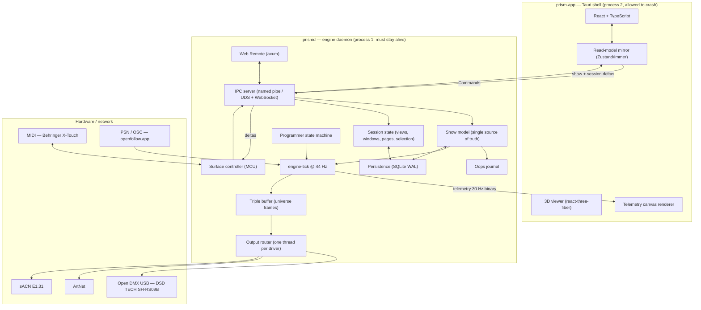
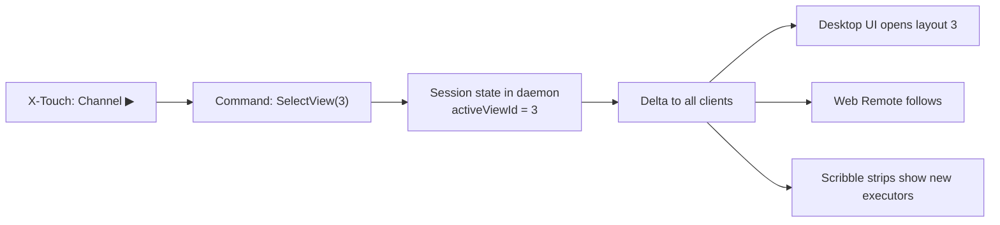

# ARCHITECTURE_SPEC.md — PrismDMX System Architecture

**Status:** Planning Phase complete, approved. Implementation (Phase 2) not started.
**Audience:** developers and AI assistants working on PrismDMX.
**Companion documents:** [`docs/MCU_MAPPING.md`](docs/MCU_MAPPING.md), [`docs/IPC_PROTOCOL.md`](docs/IPC_PROTOCOL.md), [`docs/DMX_MERGE.md`](docs/DMX_MERGE.md).

---

## 0. Scope and non-goals

PrismDMX is real-time DMX lighting control software for schools, community centres, small venues and theatre productions. It targets both professional network protocols (ArtNet, sACN, PSN) and budget USB hardware, and uses the Behringer X-Touch over Mackie Control Universal (MCU) as its physical console.

Three requirements are structural — they cannot be retrofitted, and every decision below is justified against them:

1. **Zero-crash.** DMX output must never stall during a show, including when the UI crashes.
2. **Deterministic timing.** A 44 Hz internal tick (22.727 ms) with low jitter.
3. **School-grade operability.** Installation without an IT department, on ageing hardware.

**Non-goals for V1:** multi-user sessions, RDM, timecode chase, media server integration, GDTF import.

---

## 1. Decision records

| # | Decision | Choice | Rationale |
|---|---|---|---|
| **D1** | Application stack | **Tauri v2 + Rust core + React/TypeScript UI** | No GC ⇒ no frame jitter in the tick loop; ~10 MB installer and ~100 MB RAM instead of 250/400 MB with Electron; mature crates for MIDI, FTDI, ArtNet and sACN; the UI stays web technology including three.js |
| **D2** | Process isolation | **Two processes from day one: `prismd` (engine daemon) + `prism-app` (Tauri shell)** | The strongest achievable zero-crash guarantee: the UI may die, restart and reconnect while DMX keeps running |
| **D3** | State management | **Single source of truth in the daemon**; every client is a view onto it. Two separate channels: Control (deltas) and Telemetry (30 Hz, binary, droppable) | One place of truth for desktop UI, X-Touch and Web Remote. The telemetry channel exists because 64 × 512 channels cannot pass through React state — it is a rendering optimisation, not a responsibility boundary |
| **D4** | Show file | **SQLite `.prism`** (WAL, autosave) + JSON for fixture library, surface mappings and settings + JSON export | A power cut mid-save must not destroy a show. Schools have no backups |
| **D5** | DMX outputs in V1 | **Open DMX USB (FTDI FT232R), ArtNet, sACN** — all three in V1. Enttec Pro protocol comes later | The target hardware is a **DSD TECH SH-RS09B**, an Open DMX cable without a microcontroller ⇒ host-side break timing is mandatory |
| **D6** | MCU mapping | **Declarative JSON bindings** across three layers (codec → surface model → binding table) | `XTouch.txt` specifies "assignable function out of a list" in six places — this is user configuration, not a constant |
| **D7** | Executor paging | **One page = 8 executors.** The Executor Bar shows only the **current** page. `Faderbank ◀▶` = page down/up | Supersedes "4 Rows of 8 Executors" in `Architecture.txt` — see §11 |
| **D8** | X-Touch `Channel ◀▶` | **Switches UI views** (saved window layouts from the View Selector Bar) | "View down/up" in `XTouch.txt` refers to canvas views, not executor rows |
| **D9** | Daemon lifecycle | **Both modes, switchable in settings.** Default: the shell starts `prismd` and leaves it running on close. Opt-in: autostart at boot | A classroom laptop and a permanent venue installation have opposite expectations |
| **D10** | Platforms | **Windows is primary.** Raspberry Pi (Linux ARM64) and macOS are *kept portable* but not shipped | The target audience is on Windows, but portability must not rot — see §10 |
| **D11** | Surface ↔ UI | **The X-Touch operates the UI fully — through shared session state in the daemon, never by routing through the UI** | Views, windows, pages and encoder banks are operating state and belong in the daemon. The console drives the UI *and* the low-latency fader path stays untouched — see §4 |

---

## 2. System overview



**What the process boundary buys us:** the MIDI surface, the show file, the operating state and every output live in the daemon. If the UI dies, the console and the lights keep working — the operator continues the show on the X-Touch while the interface restarts, and afterwards sees exactly the state established from the console.

---

## 3. Threading model

| Thread (inside `prismd`) | Priority | Responsibility | Must never block on |
|---|---|---|---|
| `engine-tick` | Realtime / high | 44 Hz: drain command queue, evaluate playbacks, merge, write frame to triple buffer | locks, allocation, I/O, logging |
| `out-opendmx-*` | High | Break/MAB plus 513-byte frame per adapter; reconnect backoff | the engine |
| `out-artnet`, `out-sacn` | High | Read latest frame, send at own cadence | the engine |
| `midi-in` / `midi-out` | Normal | MCU codec; feedback coalescing at 30 Hz | the engine |
| `psn-osc-in` | Normal | Tracker positions into a ring buffer (latest value only) | the engine |
| `core-main` (async, tokio) | Normal | IPC server, show model, session state, persistence, Web Remote | — |

### 3.1 Hard rules for `engine-tick`

Enforced by lint (`#![deny(clippy::unwrap_used, clippy::expect_used, clippy::panic)]` in `prism-engine`):

- **No heap allocation inside the tick.** All buffers are sized up front from the patch.
- **No mutex locks.** Input arrives over an SPSC ring buffer, output leaves through a triple buffer.
- **No synchronous logging.** Log records go into a lock-free ring; a separate writer thread drains it.
- **Absolute deadlines** via `Instant` so error does not accumulate; `sleep(deadline − 1 ms)` followed by a spin for the remainder.
- **`panic = "unwind"`** in the release profile. The panic hook marks the module *degraded* rather than terminating the process.

### 3.2 Frame rate, stated precisely

The engine tick always runs at 44 Hz — it is the time base for fades, phasers and cue timing. Output drivers consume the most recent frame from the triple buffer **at whatever rate they can achieve**. ArtNet and sACN reach 44 Hz; Open DMX USB is limited to roughly 30–40 Hz by its hardware (§7.1). The `CLAUDE.md` invariant therefore holds at the engine level without misrepresenting what budget hardware can do.

---

## 4. Session state — how the X-Touch operates the UI

This resolves two requirements that appear to conflict: **minimum fader latency** (a direct path into the backend) and **full UI operation from the console** (switching views, opening windows, paging).

They do not conflict, because the X-Touch does not remote-control the UI. Operating state — the active view, which windows are open, the executor page, the encoder bank, the selected programmer parameter — lives in the daemon, not in the client. The console changes that state, the daemon broadcasts a delta, and **every** attached surface follows.



This beats the obvious alternative ("surface sends a keypress to the UI, UI opens a window") in three ways:

- It works **while the UI is closed or restarting** — the state is already there when a client connects.
- It works with **multiple screens or clients** at once without them drifting apart.
- The scribble strips show the right thing automatically, because console and UI read the same source.

### 4.1 What belongs to session state (console-controllable)

```typescript
interface Session {
  id: SessionId;
  name: string;                        // V1: exactly one, "Main"
  activeViewId: number;                // canvas layout from the View Selector Bar
  openWindows: WindowInstance[];       // type, position, size on the canvas
  focusedWindow: number | null;
  executorPage: number;                // Faderbank ◀▶
  selectedExecutor: ExecutorId | null; // drives main fader, Flip, transport
  encoderBank: FeatureGroup;           // Dimmer / Position / Color / Beam / Focus
  programmerPage: number;              // Zoom ▲▼
  programmerParamIndex: number;        // Zoom ◀▶ — what the jog wheel turns
  commandLine: string;                 // contents of the console line
}
```

Sessions are persisted with the show file: reopening a show restores the console exactly as it was saved.

### 4.2 What does not (client-local)

Monitor assignment of a window, scroll position, hover and drag state, 3D viewer camera, UI zoom level. These are legitimately different per screen and would be actively annoying as shared state. The console cannot drive them — deliberately, and with no loss of function.

### 4.3 Latency budget, fader to light

The direct path is fully preserved. The UI appears in **none** of these steps:

| Step | Latency |
|---|---|
| Fader movement → MIDI packet at the host | ~1–3 ms (USB MIDI) |
| MIDI thread → codec → command → engine SPSC queue | < 0.1 ms |
| Wait for the next tick (44 Hz grid) | 0–22.7 ms (avg 11) |
| Merge and frame generation | < 1 ms |
| Output: ArtNet/sACN immediate · Open DMX until next frame | 0–30 ms |
| **Total fader → light** | **~15–50 ms**, dominated by the DMX protocol itself |

Routing through the UI (MIDI → daemon → UI → daemon) would add two IPC round trips and a React render cycle, and would make lighting depend on UI responsiveness. That is why **no** operating path goes through the UI — including the UI commands themselves.

### 4.4 Commands the console issues for the interface

`SelectView`, `StoreView`, `OpenWindow`, `CloseWindow`, `FocusWindow`, `SetExecutorPage`, `SelectExecutor`, `SetEncoderBank`, `SetProgrammerPage`, `SelectProgrammerParam`, `CommandLineInput`.

The **F1–F8 XKeys** are therefore freely assignable to "open Fixture Sheet", "open Patch", "jump to view 2" or macros — drawing on the same command list the UI buttons use. There is no second command world for the console.

> **Multi-session (later):** the model permits several sessions so two operators can work with independent views. V1 has exactly one session and the programmer belongs to it. Multiple programmers would be a merge question (LTP between them) and are deliberately out of scope.

---

## 5. DMX engine pipeline

One tick, in order:

```mermaid
flowchart LR
    A["1 Drain command queue"] --> B["2 Advance fades / phasers / timecode"]
    B --> C["3 Evaluate executors → attribute values"]
    C --> D["4 Merge: playbacks"]
    D --> E["5 Merge: programmer (absolute priority)"]
    E --> F["6 Apply masters (grand / group / speed)"]
    F --> G["7 Attributes → DMX channels (16-bit split, curves, invert)"]
    G --> H["8 Universe frames → triple buffer"]
    H --> I["9 Telemetry snapshot (throttled)"]
```



Merge semantics, the priority stack and the invariants that must hold under test are specified in [`docs/DMX_MERGE.md`](docs/DMX_MERGE.md). In brief: intensity merges **HTP**, everything else merges **LTP** by activation order, the programmer overrides all playbacks, and the stack from bottom to top is `Home → Playbacks → Programmer → Grand Master`.

---

## 6. Domain model

Types are defined once in Rust (`prism-domain`) and generated into TypeScript with `ts-rs`/`specta`. There is no hand-maintained duplicate. Shown here in TypeScript notation:

```typescript
type FixtureId = number;  type GroupId = number;
type SequenceId = number; type ExecutorId = number;
type PresetId = number;   type UniverseId = number;   // 1..=64

type AttributeType =
  | "Dimmer" | "Pan" | "Tilt" | "Red" | "Green" | "Blue" | "White" | "Amber"
  | "Iris" | "Zoom" | "Focus" | "Gobo" | "Prism" | "Shutter" | "Control";

type FeatureGroup = "Dimmer" | "Position" | "Color" | "Beam" | "Focus";

interface AttributeDef {
  attribute: AttributeType;
  featureGroup: FeatureGroup;
  coarseOffset: number;        // 0-based offset within the fixture footprint
  fineOffset: number | null;   // 16-bit fine channel, null when 8-bit
  defaultValue: number;        // home value, 0..65535
  mergeMode: "HTP" | "LTP";
  invert: boolean;
  physicalFrom: number;        // e.g. -270 for Pan
  physicalTo: number;
}

interface FixtureType {
  id: string;                  // stable key, e.g. "generic.rgbw.par"
  manufacturer: string; name: string; mode: string;
  footprint: number;           // channel count
  attributes: AttributeDef[];
}

interface Fixture {
  id: FixtureId;               // user-facing fixture number
  name: string; typeId: string;
  universe: UniverseId; address: number;   // 1..=512 start address
  position: Vec3; rotation: Vec3;          // 3D viewer + PSN follow
  invertPan: boolean; invertTilt: boolean;
}

interface Group { id: GroupId; name: string; fixtures: FixtureId[]; }

interface Preset {
  id: PresetId;
  pool: FeatureGroup;          // Color / Position / Dimmer pools
  name: string;
  color: RgbColor | null;      // shown on the X-Touch scribble strip
  values: Array<{ fixture: FixtureId; attribute: AttributeType; value: number }>;
}

interface CuePart {
  fixture: FixtureId; attribute: AttributeType;
  value: number;               // 0..65535
  presetRef: PresetId | null;  // preset link keeps the cue live-updatable
}

interface Cue {
  number: string;              // "1", "1.5" — string preserves decimal ordering
  name: string;
  fadeIn: number; fadeOut: number; delay: number;   // seconds
  trigger: "Go" | "Follow" | "Time" | "Sound";
  triggerTime: number | null;
  parts: CuePart[];
}

interface Sequence { id: SequenceId; name: string; cues: Cue[]; loop: boolean; }

type ExecutorButtonFunction =
  | "Empty" | "Go+" | "Go-" | "LearnSpeed" | "Off" | "On" | "Flash" | "Toggle";
type ExecutorFaderFunction   = "Empty" | "Master" | "Speed" | "XFade";
type ExecutorEncoderFunction = "Empty" | "Master" | "Speed";

interface Executor {
  id: ExecutorId;              // page * 8 + slot  (D7: one page = 8 executors)
  sequenceId: SequenceId | null;
  faderFunction: ExecutorFaderFunction;
  buttonFunctions: ExecutorButtonFunction[];  // Rec / Solo / Mute / Select
  encoderFunction: ExecutorEncoderFunction;
  masterLevel: number;         // 0..65535
  isActive: boolean;
  currentCueIndex: number | null;
}

interface ProgrammerState {
  selection: FixtureId[];
  activeFeatureGroup: FeatureGroup;
  values: Map<FixtureId, Map<AttributeType, ProgrammerValue>>;
  clearStage: 0 | 1 | 2;       // three-stage clear per CLAUDE.md
}

interface ProgrammerValue {
  value: number;
  source: "Manual" | "Preset" | "Recalled";
  presetRef: PresetId | null;
}

type WindowType =
  | "FixtureSheet" | "SequenceSheet" | "Groups" | "Viewer3D" | "PhaserEditor"
  | "ClockViewer" | "CueViewer" | "PresetPool" | "Patch" | "Settings";

interface WindowInstance {
  instanceId: number; type: WindowType;
  x: number; y: number; w: number; h: number;
  params: Record<string, unknown>;   // e.g. which preset pool
}

interface View { id: number; name: string; windows: WindowInstance[]; }
```

The `Command` and `Delta` wire types are specified in [`docs/IPC_PROTOCOL.md`](docs/IPC_PROTOCOL.md).

### 6.1 Oops (undo/redo)

Applying a command produces a compact `UndoRecord` holding the inverse and the affected scope, kept in a 200-entry ring buffer.

**Deliberately not undoable:** playback actions (`ExecutorGo`, `ExecutorOff`, master moves) and every session command from §4.4. Undo during a running show must neither change light the operator is currently driving nor pull windows out from under them.

---

## 7. DMX outputs

```rust
trait DmxOutput: Send {
    fn id(&self) -> OutputId;
    fn send_frame(&mut self, universe: UniverseId, data: &[u8; 512]) -> Result<(), OutputError>;
    fn health(&self) -> OutputHealth;   // Ok | Degraded | Disconnected
}
```

Every driver runs on its own thread wrapped in `catch_unwind`, with exponential reconnect backoff (100 ms → 5 s), and reports `health` through the telemetry channel so the UI can show a status light per interface.

### 7.1 Open DMX USB — DSD TECH SH-RS09B (V1, mandatory)

The cable is an **FTDI FT232R with no microcontroller**. There is no widget firmware to generate break and mark-after-break, so the **host** owns DMX timing.

| Aspect | Approach |
|---|---|
| Access path | Behind an `FtdiBackend` trait. Windows: **D2XX** (`libftd2xx`, statically linked), fallback **VCP** (`serialport` with `set_break`/`clear_break`). Linux/RPi: **libftdi** (`rusb`) |
| Device discovery | USB VID/PID (FTDI `0x0403`, FT232R typically `0x6001`) plus serial number and product string — **to be verified against the real device** |
| Port setup | 250 000 baud, 8 data bits, **2 stop bits**, no parity, no flow control; `SetLatencyTimer(1)` — the 16 ms default would be fatal; explicit USB transfer sizes |
| Frame | `SetBreakOn` → ~110 µs → `SetBreakOff` → ~16 µs MAB → write 513 bytes (start code `0x00` + 512 channels) |
| Achievable rate | **~30–40 Hz.** Pure data time is already 22.6 ms; break and MAB are USB control transfers costing roughly 0.1–1 ms each. A longer break remains DMX512-compliant (up to 1 s is permitted) |
| Limitations | Transmit only, no RDM, no read-back. Exactly **one** universe per adapter |
| Failure mode in the field | USB unplugged or machine suspended ⇒ the driver thread detects the error, purges and reconnects; the UI light turns red, the engine keeps running |
| Linux/RPi note | `ftdi_sio` claims the device; the libftdi path resolves this by detaching the kernel driver plus a udev rule. Do not use D2XX on Linux |

30–40 Hz is normal for this class of hardware — QLC+ and FreeStyler achieve no more with the same cable — and is unproblematic for conventional dimmers and LED pars. Guaranteed 44 Hz requires ArtNet, sACN or a future Enttec Pro widget. The UI states this plainly when the output is created rather than hiding it.

### 7.2 Network outputs (V1)

| Protocol | Crate | Notes |
|---|---|---|
| ArtNet | `artnet_protocol` | **Unicast by default** — broadcast floods school networks; optional ArtSync; full-frame refresh at least every 800 ms even without changes |
| sACN (E1.31) | `sacn` | Multicast `239.255.x.x`, per-universe priority, source name from the show file, termination packet on clean shutdown |

### 7.3 Later
Enttec USB Pro protocol over VCP. It uses the same `DmxOutput` boundary and is purely additive.

---

## 8. Incoming position data (PSN / OSC — openfollow.app)

Trackers send at their own rate (typically 30–60 Hz), asynchronously to the tick. A receiver thread writes into a ring buffer; the tick reads **only the latest** value — stale positions are worthless, so nothing is queued. Fixtures with a follow assignment compute pan and tilt from tracker position combined with fixture position and rotation in 3D space.

On packet timeout (500 ms) the last position is **held**, a warning appears in the UI, and nothing jumps.

---

## 9. Repository layout

```
prismdmx/
├─ crates/
│  ├─ prism-domain/      # types, Command/Delta/Telemetry, ts-rs export → ui/src/bindings
│  ├─ prism-engine/      # 44 Hz tick, merge, playback. No I/O, no UI dependencies.
│  ├─ prism-core/        # show model, session state, programmer, Oops, SQLite
│  ├─ prism-protocols/   # DmxOutput: OpenDmxUsb, ArtNet, sACN + PSN/OSC input
│  ├─ prism-surface/     # MCU codec, surface model, binding table
│  ├─ prism-ipc/         # framing + transport, server and client halves
│  ├─ prismd/            # daemon binary (engine, session, surface, outputs, Web Remote)
│  └─ prism-app/         # Tauri shell (thin client; spawns or attaches to prismd)
├─ ui/
│  ├─ src/components/    # Canvas, Executor Bar, Encoder Bar, Console, View Selector
│  ├─ src/windows/       # Fixture Sheet, Sequence Sheet, 3D Viewer, Patch, Settings …
│  ├─ src/state/         # read-model mirror, telemetry channel (canvas/refs, not useState)
│  └─ src/bindings/      # generated from prism-domain
├─ profiles/
│  ├─ surface/xtouch.json
│  └─ fixtures/*.json
├─ docs/                 # MCU_MAPPING.md, IPC_PROTOCOL.md, DMX_MERGE.md
└─ tests/                # integration and stress/latency suites
```

---

## 10. Platform and lifecycle strategy (D9 / D10)

### 10.1 Staying portable without shipping it

Windows is the only release target. To stop Raspberry Pi and macOS support from rotting:

- **Platform code is confined.** `#[cfg(target_os = …)]` may appear only in `prism-protocols` (FTDI backend selection) and `prism-app` (shell and autostart). `prism-domain`, `prism-engine`, `prism-core` and `prism-surface` are platform-neutral and therefore testable anywhere.
- **CI keeps the door open.** Windows: full build and all tests on every commit. Linux ARM64: cross-compile check plus the platform-neutral tests, no hardware tests. macOS: not in CI until it becomes a priority.
- **No Windows-only crates** in the core crates.

### 10.2 Why the Raspberry Pi is nearly free

D2 pays off here: `prismd` has no UI dependency and runs on a Pi with no display. A Pi as a permanent lighting server with the X-Touch on USB, operated through the Web Remote, is not a special build — it is the same daemon without a shell. It needs the libftdi backend (§7.1) and an ARM64 build, not an architectural change.

### 10.3 Autostart without administrator rights

A true Windows service requires admin rights, which schools often cannot grant. Hence three tiers:

| Tier | Windows | Linux | macOS | Rights |
|---|---|---|---|---|
| **Default** | Shell spawns `prismd` as a child, detaches it, leaves it running on close | same | same | none |
| **Opt-in autostart** | `HKCU\…\Run` (user scope) | systemd **user** unit | LaunchAgent | none |
| **Advanced** (permanent install) | Windows service | systemd system unit | LaunchDaemon | admin |

**Single-instance guarantee.** On startup `prismd` writes a lock file containing its PID and IPC port into the user data directory (plus a named mutex on Windows). If the shell finds a live daemon it attaches instead of spawning a second one. Two daemons driving the same output would be the worst possible failure mode, so it is prevented structurally rather than by convention. Stale lock files left by a crash are detected through a PID liveness check and taken over.

**Shutdown.** The daemon exits only on explicit instruction — tray menu, CLI, service stop — sending sACN termination packets and applying a configurable blackout-or-hold. Accidentally closing a window must never end a show.

---

## 11. Deviation from `Architecture.txt`

`Architecture.txt` shows the Executor Bar as **"4 Rows of 8 Executors"**. That is superseded by **D7**: one page holds 8 executors and the UI displays only the current page. `Faderbank ◀▶` on the X-Touch pages through them, mapping one-to-one onto the eight physical strips.

Relatedly, **D8**: "View down/up" in `XTouch.txt` refers to saved canvas layouts in the View Selector Bar, not to executor rows. `Channel ◀▶` therefore issues `SelectView`.

The diagrams in `Architecture.txt` and `XTouch.txt` remain the reference for everything else. This section exists so the discrepancy does not mislead anyone later.

---

## 12. Testing policy

| Category | Tooling | Target |
|---|---|---|
| Unit (engine) | `cargo test` + `proptest` for merge invariants (HTP commutative and associative; LTP order-dependent) | > 95 % on `prism-engine` |
| Unit (MCU codec) | Table-driven byte tests: MIDI bytes → control event → MIDI bytes (round trip) | > 95 % on `prism-surface` |
| Unit (Open DMX) | Mock `FtdiBackend` asserting the call sequence break → MAB → 513 bytes and start code `0x00` | > 95 % on `prism-protocols` |
| Integration | Mock MIDI → command → programmer → merged frame, asserted at byte level | full core path |
| **Surface → UI (D11)** | Mock MIDI sends `Channel ▶` and F1 **with no UI client connected**; a client then connects and must find both the view and the opened window in its `Snapshot` | mandatory gate for D11 |
| **IPC resilience (D2)** | Start the daemon, kill the client, reconnect — assert output ran without a gap | mandatory gate for D2 |
| Stress / latency | `criterion`: 64 universes under 100 % CPU load; **p99.9 tick jitter < 2 ms**, no dropped frames over 10 minutes | CI gate |
| UI | `vitest` + Testing Library; Playwright end-to-end against a daemon in mock-output mode | ≥ 85 % global |

Every hardware interface sits behind a trait (`DmxOutput`, `MidiPort`, `FtdiBackend`, `PsnSource`), so tests run deterministically with no hardware attached, as `CLAUDE.md` requires.

---

## 13. Implementation order (Phase 2, TDD)

1. `prism-domain` — types and TypeScript generation (blocks everything else)
2. `prism-engine` — merge maths, tick loop, triple buffer *(pure logic, the ideal TDD starting point)*
3. `prism-protocols` — Open DMX USB against the mock backend, then the real SH-RS09B; ArtNet; sACN
4. `prism-core` — show model, **session state**, programmer state machine, Oops, SQLite
5. `prism-ipc` + `prismd` — daemon running and testable headless from the CLI; lock file and single-instance
6. `prism-surface` — MCU codec (after device verification), bindings, feedback
7. `ui` + `prism-app` — canvas, view selector, executor bar, encoder bar, patch; attach and autostart logic
8. 3D viewer, Web Remote, PSN/OSC

---

## 14. Open items requiring hardware verification

Both are isolated as plain table data so verification is a data update, not a refactor.

| Item | Where | What to do |
|---|---|---|
| MCU note and CC numbers | [`docs/MCU_MAPPING.md`](docs/MCU_MAPPING.md) | Capture with a MIDI monitor on the real X-Touch and reconcile against the Behringer manual **before** the codec is considered complete |
| SH-RS09B USB VID/PID and achievable frame rate | §7.1 | Read the descriptors from the connected adapter; measure the sustained frame rate and record the real figure |
