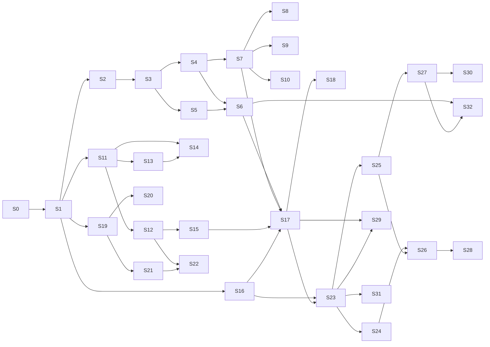

# IMPLEMENTATION_PLAN.md — PrismDMX Session Breakdown

**Companion:** [`PROGRESS.md`](PROGRESS.md) — the living tracker. This file is the plan; that file is the state.
**Architecture reference:** [`ARCHITECTURE_SPEC.md`](ARCHITECTURE_SPEC.md).

---

## How to use this document

Work proceeds in numbered **sessions**. A session is a coherent unit of work with a single goal and a testable exit criterion — sized so it can be finished, verified and committed in one sitting.

### Session protocol

1. **Open** — read [`PROGRESS.md`](PROGRESS.md), find the first session that is not `done` and whose dependencies are met. Mark it `in progress` with today's date.
2. **Work** — TDD, per `CLAUDE.md`: write the failing test first, then the implementation.
3. **Verify** — the exit criteria below are not suggestions. A session is not finished because the code exists; it is finished because the criteria pass.
4. **Close** — update `PROGRESS.md`: status, coverage figures actually measured, anything learned that changes a later session. Then **rewrite the follow-up prompt** in `PROGRESS.md` §8 so the next session can be started from scratch. Commit with a Conventional Commit message.
5. **Never** mark a session done with failing tests. Record the blocker in `PROGRESS.md` instead and leave the session `blocked`.

### The follow-up prompt

`PROGRESS.md` §8 always holds a ready-to-paste prompt that starts the next session. It must be **self-contained**: assume the reader has no memory of this conversation, no loaded context and no knowledge of the project. It therefore states the repository path, which files to read and in what order, which session to run, and what has to be true before the session may be called finished.

This exists so that work can resume in a fresh session — after a context reset, on another machine, or weeks later — without reconstructing anything by hand. Rewriting it is part of closing a session, not an optional extra.

### Conventions

| Field | Meaning |
|---|---|
| **Depends on** | Sessions that must be `done` first. Sessions with no unmet dependency may run in any order |
| **Exit criteria** | Objectively checkable. If it cannot be checked, it is not an exit criterion |
| **Size** | S ≈ half a session, M ≈ one, L ≈ one long or two short |
| 🔌 | Requires physical hardware — cannot be completed without the device |

---

# Phase 0 — Foundation

## S0 · Toolchain and workspace
**Size:** M · **Depends on:** — · 🔧 partly manual

**Goal:** a workspace that builds, lints and tests green with zero logic in it, so every later session starts from a known-good baseline.

**Deliverables**
- Rust toolchain installed and working (`rustup`, MSVC build tools, linker)
- Cargo workspace with the eight crates from `ARCHITECTURE_SPEC.md` §9
- `rust-toolchain.toml`, `rustfmt.toml`, workspace lint configuration
- `ui/` scaffold: Vite + React + TypeScript, `strict: true`, no `any`
- CI workflow per §10.1: Windows full build and test; Linux ARM64 cross-compile check plus platform-neutral tests
- `.gitignore`, `.editorconfig`, initial commit

**Exit criteria**
- `cargo build --workspace` succeeds
- `cargo clippy --workspace --all-targets -- -D warnings` is clean
- `cargo fmt --check` is clean
- `cargo test --workspace` runs (zero tests is acceptable here)
- `npm run build` in `ui/` succeeds
- CI is green on a pushed branch

---

# Phase 1 — Domain and engine

The engine is pure logic with no I/O. It is the highest-value TDD target in the project and carries the strictest coverage requirement (> 95 %).

## S1 · `prism-domain` — types
**Size:** M · **Depends on:** S0

**Goal:** the vocabulary every other crate speaks, defined once.

**Deliverables**
- All types from `ARCHITECTURE_SPEC.md` §6 as Rust types with `serde` derives
- `Command` and `Delta` enums per [`docs/IPC_PROTOCOL.md`](docs/IPC_PROTOCOL.md) §5–6
- `ts-rs`/`specta` export generating `ui/src/bindings/`
- Newtype IDs (`FixtureId`, `ExecutorId`, …) — not bare `u32`, so they cannot be swapped by accident

**Exit criteria**
- `cargo test -p prism-domain` green
- Generated TypeScript compiles under `tsc --noEmit` in `ui/`
- Round-trip property test: every type survives serialise → deserialise unchanged
- No `any` in the generated bindings

## S2 · `prism-engine` — tick loop and triple buffer
**Size:** M · **Depends on:** S1

**Goal:** a 44 Hz heartbeat that holds its deadline and hands frames off without locks.

**Deliverables**
- Triple buffer: single writer (engine), many readers (output drivers), wait-free
- Tick loop with absolute deadlines (`sleep(deadline − 1 ms)` + spin), no accumulating drift
- SPSC command queue into the tick
- Counting allocator harness for tests

**Exit criteria**
- 10-minute run: no missed tick, **p99.9 jitter < 2 ms** measured, not asserted by eye
- Allocation test: zero allocations inside the tick after warm-up
- Triple buffer: concurrent read/write stress test under `loom` or equivalent, no torn reads
- Drift test: after 100 000 ticks, absolute time error < one tick period

## S3 · `prism-engine` — HTP/LTP merge
**Size:** L · **Depends on:** S2

**Goal:** the core of the product. Every rule in [`docs/DMX_MERGE.md`](docs/DMX_MERGE.md).

**Deliverables**
- Home layer, playback layer with per-attribute HTP/LTP, activation-order tracking
- Executor master applied before the HTP maximum
- The merge is a pure function over a source set

**Exit criteria**
- Every invariant in `DMX_MERGE.md` §6.1–6.2 verified with `proptest`
- HTP commutativity, associativity, idempotence, monotonicity, identity
- LTP order-dependence explicitly asserted **and** non-commutativity asserted, so it cannot be "optimised" into a max later
- Deactivation fallback chain tested down to home
- Worked example from `DMX_MERGE.md` §7 passes as a literal test case

## S4 · `prism-engine` — attribute to DMX encoding
**Size:** S · **Depends on:** S3

**Goal:** correct bytes on the wire.

**Deliverables**
- 16-bit internal → 8-bit or 16-bit channel split
- Attribute-level invert, then per-fixture pan/tilt invert
- Patch-time address validation so the tick needs no bounds checks

**Exit criteria**
- Table tests for 8-bit and 16-bit encoding, including boundary values 0, 1, 32767, 32768, 65534, 65535
- Invert composition tested (attribute invert × fixture invert)
- A fixture whose footprint exceeds channel 512 is rejected **at patch time** with a clear error

## S5 · `prism-engine` — executors, cues, fades
**Size:** L · **Depends on:** S3

**Goal:** playback that runs on the tick's time base.

**Deliverables**
- Cue evaluation, fade in/out/delay, cue list traversal, loop
- Trigger types: `Go`, `Follow`, `Time` (`Sound` deferred)
- Activation counter maintenance feeding LTP ordering

**Exit criteria**
- A 10-second fade reaches exactly 50 % at 5 s ±1 tick, verified on a simulated clock
- Fades interpolate in 16-bit even on 8-bit patched channels (no visible stepping)
- Go during a running fade behaves deterministically and is covered by a test
- Cue numbering with decimals (`1`, `1.5`, `2`) orders correctly

## S6 · `prism-engine` — programmer layer, masters, stress
**Size:** M · **Depends on:** S4, S5

**Goal:** the full pipeline, proven under load.

**Deliverables**
- Programmer override layer (sparse, absolute priority)
- Group masters, grand master — intensity only
- Complete `ARCHITECTURE_SPEC.md` §5 pipeline end to end

**Exit criteria**
- Stack invariants from `DMX_MERGE.md` §6.3 pass
- Grand master at 0 zeroes intensity and leaves all other attributes untouched — asserted, not assumed
- **Stress gate:** 64 universes, 100 % CPU load, 10 minutes, p99.9 jitter < 2 ms, zero dropped frames
- Determinism: identical input produces byte-identical frames across runs
- Coverage on `prism-engine` **> 95 %**, measured and recorded in `PROGRESS.md`

---

# Phase 2 — Protocols

## S7 · `prism-protocols` — `DmxOutput` trait and Open DMX USB
**Size:** L · **Depends on:** S4

**Goal:** the SH-RS09B driver, fully tested without owning the hardware.

**Deliverables**
- `DmxOutput` trait, `OutputHealth`, mock output driver
- `FtdiBackend` trait with a mock implementation
- `OpenDmxUsb` driver: port setup, break/MAB sequencing, 513-byte frame
- Driver thread wrapper: `catch_unwind`, reconnect backoff 100 ms → 5 s

**Exit criteria**
- Mock backend asserts the exact call sequence: `SetBreakOn` → delay → `SetBreakOff` → delay → write of 513 bytes with start code `0x00`
- Port setup asserted: 250 000 baud, 8N2, no flow control, latency timer 1
- Simulated disconnect mid-frame: driver reports `Disconnected`, retries with backoff, engine unaffected
- Simulated panic inside the driver: contained by `catch_unwind`, output marked degraded, process alive
- Coverage on `prism-protocols` **> 95 %**

## S8 · 🔌 Hardware bring-up: DSD TECH SH-RS09B
**Size:** M · **Depends on:** S7 · **requires the adapter and a DMX fixture**

**Goal:** replace assumptions with measurements.

**Deliverables**
- Confirmed USB VID/PID, serial and product string
- Measured sustained frame rate
- Decision recorded: D2XX vs. VCP fallback on this machine

**Exit criteria**
- A real fixture responds correctly to a value ramp
- Frame rate measured over 60 s and written into `ARCHITECTURE_SPEC.md` §7.1, replacing the estimate
- Unplug during output: reconnect works without restarting the daemon
- `ARCHITECTURE_SPEC.md` §14 row for the adapter is ticked

## S9 · `prism-protocols` — ArtNet
**Size:** M · **Depends on:** S7

**Deliverables:** ArtNet output, unicast default, optional ArtSync, forced full-frame refresh at least every 800 ms.

**Exit criteria**
- Packet bytes asserted against the ArtNet specification, including sequence number wraparound
- Refresh timer verified: a static universe still emits at least every 800 ms
- Broadcast is opt-in, never the default — asserted in a test

## S10 · `prism-protocols` — sACN (E1.31)
**Size:** M · **Depends on:** S7

**Deliverables:** sACN output, multicast addressing, per-universe priority, source name from show file, termination packet on shutdown.

**Exit criteria**
- Packet bytes asserted against E1.31, including CID stability across restarts
- Multicast group address computed correctly for universes 1 and 63999
- Clean shutdown emits a stream-terminated packet — asserted

---

# Phase 3 — Core state

## S11 · `prism-core` — show model and command application
**Size:** L · **Depends on:** S1

**Deliverables:** show model, patch, groups, presets, sequences; command validation and application; delta generation.

**Exit criteria**
- Every `Command` in the show group applies or rejects; rejection leaves state byte-identical
- Delta generation verified: applying deltas to a copy reproduces the source state exactly
- Patch conflicts (overlapping addresses) are detected and reported, not silently accepted

## S12 · `prism-core` — session state (D11)
**Size:** M · **Depends on:** S11

**Goal:** the mechanism that lets the X-Touch operate the UI.

**Deliverables:** `Session` per `ARCHITECTURE_SPEC.md` §4.1, all session commands from §4.4, session persistence with the show.

**Exit criteria**
- Every session command applies and emits a `SessionPatch`
- Session survives save/load: reopening a show restores view, windows, page and selection exactly
- Client-local state (§4.2) is provably absent from the session type — asserted by the type, reviewed explicitly

## S13 · `prism-core` — programmer state machine
**Size:** M · **Depends on:** S11

**Deliverables:** selection, sparse attribute values, feature-group tracking, three-stage clear.

**Exit criteria**
- Three-stage clear tested through all transitions including the reset-to-0 rule on unrelated interaction
- Preset application records `presetRef` so cues stay live-updatable
- Programmer is sparse: an untouched attribute is absent, not zero — asserted

## S14 · `prism-core` — Oops journal
**Size:** M · **Depends on:** S11, S13

**Deliverables:** undo records with inverses, 200-entry ring, redo.

**Exit criteria**
- Property test: apply *n* random commands, undo *n* times, state equals the start byte for byte
- Redo after undo returns to the post-command state
- Playback and session commands are **excluded** — asserted with a test that an executor Go followed by Oops leaves the executor running
- Ring overflow drops oldest without corrupting the journal

## S15 · `prism-core` — SQLite persistence
**Size:** L · **Depends on:** S11, S12

**Deliverables:** `.prism` schema with `user_version` migrations, WAL, autosave every 30 s to a recovery copy, dirty flag, JSON export/import.

**Exit criteria**
- Save/load round trip: loaded show is byte-identical to the saved one, sessions included
- **Crash safety:** kill the process mid-write; the file still opens and contains the last committed state
- Migration path from a version-1 file to version 2 tested with a fixture file
- Dirty flag drives `DirtyFlag` deltas correctly (this is the X-Touch Save LED)

---

# Phase 4 — IPC and daemon

## S16 · `prism-ipc` — framing and transports
**Size:** M · **Depends on:** S1

**Deliverables:** length-prefixed MessagePack framing, named pipe / UDS transport, WebSocket transport, client and server halves.

**Exit criteria**
- Framing round-trip property test over arbitrary messages
- Oversized frame closes the connection without a large allocation — asserted
- **Transport parity:** the full suite passes identically over both transports

## S17 · `prismd` — daemon binary
**Size:** L · **Depends on:** S6, S7, S15, S16

**Goal:** the engine runs as a real process, headless, with no UI in existence.

**Deliverables:** wiring of engine, core, outputs and IPC; lock file with PID and port; single-instance guarantee; stale-lock takeover; CLI for headless operation; shutdown with sACN termination and configurable blackout-or-hold.

**Exit criteria**
- Daemon starts, loads a show, outputs DMX to a mock driver, with no client ever connecting
- Second instance detects the first and refuses to start — asserted
- Stale lock file (killed process) is detected and taken over
- Handshake serves a `Snapshot` containing show **and** session

## S18 · D2 gate — resilience
**Size:** M · **Depends on:** S17

**Goal:** prove the claim that the whole two-process design exists for.

**Exit criteria**
- Client connects, then is killed mid-show: the output frame sequence has **no gap** across the entire run — asserted on captured frames, not observed manually
- Client reconnects and re-snapshots to a state identical to the daemon's
- Protocol version mismatch produces an explicit `Reject`, never undefined behaviour
- Backpressure: a deliberately slow client loses telemetry, loses no commands, and does not affect other clients

---

# Phase 5 — Surface

## S19 · `prism-surface` — MCU codec
**Size:** L · **Depends on:** S1

**Deliverables:** MIDI byte codec per [`docs/MCU_MAPPING.md`](docs/MCU_MAPPING.md) §2, running-status handling, SysEx reassembly with timeout, malformed-input discard counters.

**Exit criteria**
- Round-trip table tests: bytes → event → bytes, byte-equal both directions
- Running status decoded identically to explicit status
- Fuzz with truncated and out-of-range messages: no panic, no allocation growth, correct discard counters
- SysEx split across packets reassembles; unterminated SysEx times out and is dropped

## S20 · 🔌 Hardware verification: Behringer X-Touch
**Size:** M · **Depends on:** S19 · **requires the console**

**Goal:** clear the UNVERIFIED banner on `MCU_MAPPING.md`.

**Exit criteria**
- Every item in `MCU_MAPPING.md` §7 ticked
- §2 tables and `profiles/surface/xtouch.json` updated with measured values
- Deviations from the MCU standard documented explicitly rather than silently corrected
- UNVERIFIED banner removed; `ARCHITECTURE_SPEC.md` §14 row ticked

## S21 · `prism-surface` — surface model and feedback
**Size:** M · **Depends on:** S19

**Deliverables:** logical control set, shadow model, diff-based outbound, touch suppression, coalescing, resync burst on reconnect.

**Exit criteria**
- Touch suppression: no outbound pitch bend while touched; exactly one resync 150 ms after release — asserted
- Coalescing: 1000 value changes in 100 ms produce at most 3 outbound messages for that control
- Priority under bandwidth pressure verified in the documented order: faders → LEDs → LCD → meters
- Device disappearance does not affect the engine

## S22 · `prism-surface` — bindings and the D11 gate
**Size:** M · **Depends on:** S12, S21

**Deliverables:** JSON binding table with schema validation, default `xtouch.json` matching `XTouch.txt`, fallback to built-in defaults on a malformed profile.

**Exit criteria**
- Default profile reproduces every row of `MCU_MAPPING.md` §4.1
- Malformed profile falls back with a warning and **never** blocks startup — asserted
- **D11 gate:** with no UI client connected, mock MIDI sends `Channel ▶` and F1; a client then connects and finds both the new view and the opened window in its `Snapshot`
- Coverage on `prism-surface` **> 95 %**

---

# Phase 6 — User interface

## S23 · `ui` — foundation
**Size:** L · **Depends on:** S16, S17

**Deliverables:** IPC client, read-model mirror (Zustand + Immer), snapshot/delta application, reconnect handling with visible disconnected state.

**Exit criteria**
- Deltas applied to the mirror reproduce daemon state — property tested against a recorded delta stream
- Daemon restart: UI shows disconnected, reconnects, re-snapshots, no stale data
- `tsc --noEmit` clean with `strict: true`; no `any` anywhere

## S24 · `ui` — telemetry channel
**Size:** M · **Depends on:** S23

**Goal:** the reason the second channel exists.

**Deliverables:** binary telemetry decoding into refs, canvas renderers for levels and meters.

**Exit criteria**
- 64 universes at 30 Hz sustained with **zero React re-renders** from telemetry — asserted with a render counter, not judged by feel
- Frame budget: canvas render stays under 8 ms at 64 universes
- Dropped telemetry degrades smoothly and never desynchronises control state

## S25 · `ui` — canvas, windows, views
**Size:** L · **Depends on:** S23

**Deliverables:** draggable and resizable window system, View Selector Bar, window types wired to session state.

**Exit criteria**
- Opening, moving and closing windows issues session commands — the UI does **not** hold this state locally
- A view switched from the X-Touch is reflected immediately (this is D11 observed end to end)
- Layout survives a UI restart because it lives in the session

## S26 · `ui` — executor bar, encoder bar, console
**Size:** L · **Depends on:** S24, S25

**Deliverables:** executor bar showing the current page of 8 (D7), selected-executor panel, five encoder banks feeding the programmer, command line.

**Exit criteria**
- Executor bar shows exactly the current page; paging from the X-Touch and from the UI agree
- Encoder changes reach the programmer and appear in output within one tick
- Command line parses and reports syntax errors without throwing

## S27 · `ui` — patch and fixture sheet
**Size:** L · **Depends on:** S25

**Exit criteria:** fixtures can be patched, addressed and edited entirely from the UI; address conflicts are shown before they are committed; the fixture sheet reflects live values.

## S28 · `ui` — sequences, cues, presets
**Size:** L · **Depends on:** S26

**Exit criteria:** cues can be stored, edited and fired from the UI; preset pools apply and store; preset links remain live (editing a preset updates cues that reference it).

## S29 · `prism-app` — Tauri shell
**Size:** M · **Depends on:** S17, S23

**Deliverables:** Tauri shell, daemon spawn-or-attach, autostart settings per `ARCHITECTURE_SPEC.md` §10.3, tray, explicit shutdown.

**Exit criteria**
- Closing the window leaves the daemon running and DMX flowing — asserted, this is D9
- Second shell instance attaches instead of spawning a second daemon
- Opt-in autostart installs and uninstalls cleanly **without administrator rights**
- Installer produces a working build on a clean Windows machine

---

# Phase 7 — Extended features

## S30 · 3D viewer
**Size:** L · **Depends on:** S27

**Exit criteria:** every patched fixture appears with correct position and orientation; beams reflect live output; the viewer never blocks the telemetry canvas or the engine.

## S31 · Web Remote
**Size:** L · **Depends on:** S23

**Exit criteria:** the browser client is functionally the same client as the desktop UI; loopback binding is the default; LAN exposure requires explicit opt-in plus token; a phone can operate executors.

## S32 · PSN / OSC — openfollow.app
**Size:** L · **Depends on:** S6, S27

**Exit criteria:** tracker positions drive pan/tilt through the 3D calculation; only the latest sample is read; a 500 ms timeout holds the last position and warns, with **no** jump — asserted with a simulated dropout.

---

## Dependency overview

**Critical path to a usable console:** S0 → S1 → S2 → S3 → S4 → S7 → S11 → S12 → S16 → S17 → S19 → S21 → S22 → S23 → S25 → S26.

Sessions S8 and S20 need physical hardware and can be deferred without blocking anything except their own verification. Everything else runs against mocks, as `CLAUDE.md` requires.
