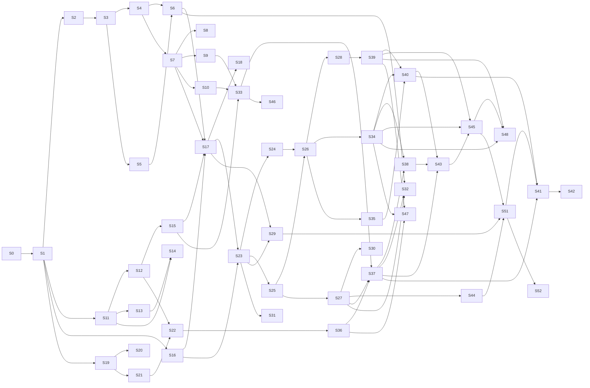

# IMPLEMENTATION_PLAN.md — PrismDMX Session Breakdown

**Companion:** [`PROGRESS.md`](PROGRESS.md) — the living tracker. This file is the plan; that file is the state.
**Architecture reference:** [`ARCHITECTURE_SPEC.md`](ARCHITECTURE_SPEC.md).

---

## How to use this document

Work proceeds in numbered **sessions**. A session is a coherent unit of work with a single goal and a testable exit criterion — sized so it can be finished, verified and committed in one sitting.

### Session protocol

1. **Open** — read [`PROGRESS.md`](PROGRESS.md), find the first session that is not `done` and whose dependencies are met. Mark it `in progress` with today's date.
2. **Work** — TDD, per `CLAUDE.md`: write the failing test first, then the implementation.
3. **Verify** — the exit criteria below are not suggestions. A session is not finished because the code exists; it is finished because the criteria pass.
4. **Close** — update `PROGRESS.md`: status, coverage figures actually measured, anything learned that changes a later session. Then **rewrite the follow-up prompt** in `PROGRESS.md` §8 so the next session can be started from scratch. Commit with a Conventional Commit message.
5. **Never** mark a session done with failing tests. Record the blocker in `PROGRESS.md` instead and leave the session `blocked`.
6.  After a session is complete and all tests have passed, always push you code and watch the ci run. If it passes, track it in `PROGRESS.md` and push again (this time you dont need to wait for CI as you only edited `PROGRESS.md`)

### The follow-up prompt

`PROGRESS.md` §8 always holds a ready-to-paste prompt that starts the next session. It must be **self-contained**: assume the reader has no memory of this conversation, no loaded context and no knowledge of the project. It therefore states the repository path, which files to read and in what order, which session to run, and what has to be true before the session may be called finished.

This exists so that work can resume in a fresh session — after a context reset, on another machine, or weeks later — without reconstructing anything by hand. Rewriting it is part of closing a session, not an optional extra.

### Conventions

| Field | Meaning |
|---|---|
| **Depends on** | Sessions that must be `done` first. Sessions with no unmet dependency may run in any order |
| **Exit criteria** | Objectively checkable. If it cannot be checked, it is not an exit criterion |
| **Size** | S ≈ half a session, M ≈ one, L ≈ one long or two short |
| 🔌 | Requires physical hardware — cannot be completed without the device |

### Session numbers are stable; the order is in §"Running order"

**A session's number never changes once the plan has been published**, because the
numbers are referenced from the source: `prism-core`'s programmer names an *S28
requirement*, its show model names *S27's group editor*, `prism-surface` names
S22's findings, and `PROGRESS.md`'s decision log is indexed by them. Renumbering
would silently make several dozen comments point at the wrong work.

So when sessions are added or reordered, the new ones take the next free numbers
and the **running order** below is what says what to do next. The numbers are
identity; the order is schedule. Within a phase the sessions are listed in
running order, which means the numbers in a phase are not always ascending —
that is the intended reading and not an error.

---

# Phase 0 — Foundation

## S0 · Toolchain and workspace
**Size:** M · **Depends on:** — · 🔧 partly manual

**Goal:** a workspace that builds, lints and tests green with zero logic in it, so every later session starts from a known-good baseline.

**Deliverables**
- Rust toolchain installed and working (`rustup`, MSVC build tools, linker)
- Cargo workspace with the eight crates from `ARCHITECTURE_SPEC.md` §9
- `rust-toolchain.toml`, `rustfmt.toml`, workspace lint configuration
- `ui/` scaffold: Vite + React + TypeScript, `strict: true`, no `any`
- CI workflow per §10.1: Windows full build and test; Linux ARM64 cross-compile check plus platform-neutral tests
- `.gitignore`, `.editorconfig`, initial commit

**Exit criteria**
- `cargo build --workspace` succeeds
- `cargo clippy --workspace --all-targets -- -D warnings` is clean
- `cargo fmt --check` is clean
- `cargo test --workspace` runs (zero tests is acceptable here)
- `npm run build` in `ui/` succeeds
- CI is green on a pushed branch

---

# Phase 1 — Domain and engine

The engine is pure logic with no I/O. It is the highest-value TDD target in the project and carries the strictest coverage requirement (> 95 %).

## S1 · `prism-domain` — types
**Size:** M · **Depends on:** S0

**Goal:** the vocabulary every other crate speaks, defined once.

**Deliverables**
- All types from `ARCHITECTURE_SPEC.md` §6 as Rust types with `serde` derives
- `Command` and `Delta` enums per [`docs/IPC_PROTOCOL.md`](docs/IPC_PROTOCOL.md) §5–6
- `ts-rs`/`specta` export generating `ui/src/bindings/`
- Newtype IDs (`FixtureId`, `ExecutorId`, …) — not bare `u32`, so they cannot be swapped by accident

**Exit criteria**
- `cargo test -p prism-domain` green
- Generated TypeScript compiles under `tsc --noEmit` in `ui/`
- Round-trip property test: every type survives serialise → deserialise unchanged
- No `any` in the generated bindings

## S2 · `prism-engine` — tick loop and triple buffer
**Size:** M · **Depends on:** S1

**Goal:** a 44 Hz heartbeat that holds its deadline and hands frames off without locks.

**Deliverables**
- Triple buffer: single writer (engine), many readers (output drivers), wait-free
- Tick loop with absolute deadlines (`sleep(deadline − 1 ms)` + spin), no accumulating drift
- SPSC command queue into the tick
- Counting allocator harness for tests

**Exit criteria**
- 10-minute run: no missed tick, **p99.9 jitter < 2 ms** measured, not asserted by eye
- Allocation test: zero allocations inside the tick after warm-up
- Triple buffer: concurrent read/write stress test under `loom` or equivalent, no torn reads
- Drift test: after 100 000 ticks, absolute time error < one tick period

## S3 · `prism-engine` — HTP/LTP merge
**Size:** L · **Depends on:** S2

**Goal:** the core of the product. Every rule in [`docs/DMX_MERGE.md`](docs/DMX_MERGE.md).

**Deliverables**
- Home layer, playback layer with per-attribute HTP/LTP, activation-order tracking
- Executor master applied before the HTP maximum
- The merge is a pure function over a source set

**Exit criteria**
- Every invariant in `DMX_MERGE.md` §6.1–6.2 verified with `proptest`
- HTP commutativity, associativity, idempotence, monotonicity, identity
- LTP order-dependence explicitly asserted **and** non-commutativity asserted, so it cannot be "optimised" into a max later
- Deactivation fallback chain tested down to home
- Worked example from `DMX_MERGE.md` §7 passes as a literal test case

## S4 · `prism-engine` — attribute to DMX encoding
**Size:** S · **Depends on:** S3

**Goal:** correct bytes on the wire.

**Deliverables**
- 16-bit internal → 8-bit or 16-bit channel split
- Attribute-level invert, then per-fixture pan/tilt invert
- Patch-time address validation so the tick needs no bounds checks

**Exit criteria**
- Table tests for 8-bit and 16-bit encoding, including boundary values 0, 1, 32767, 32768, 65534, 65535
- Invert composition tested (attribute invert × fixture invert)
- A fixture whose footprint exceeds channel 512 is rejected **at patch time** with a clear error

## S5 · `prism-engine` — executors, cues, fades
**Size:** L · **Depends on:** S3

**Goal:** playback that runs on the tick's time base.

**Deliverables**
- Cue evaluation, fade in/out/delay, cue list traversal, loop
- Trigger types: `Go`, `Follow`, `Time` (`Sound` deferred)
- Activation counter maintenance feeding LTP ordering

**Exit criteria**
- A 10-second fade reaches exactly 50 % at 5 s ±1 tick, verified on a simulated clock
- Fades interpolate in 16-bit even on 8-bit patched channels (no visible stepping)
- Go during a running fade behaves deterministically and is covered by a test
- Cue numbering with decimals (`1`, `1.5`, `2`) orders correctly

## S6 · `prism-engine` — programmer layer, masters, stress
**Size:** M · **Depends on:** S4, S5

**Goal:** the full pipeline, proven under load.

**Deliverables**
- Programmer override layer (sparse, absolute priority)
- Group masters, grand master — intensity only
- Complete `ARCHITECTURE_SPEC.md` §5 pipeline end to end

**Exit criteria**
- Stack invariants from `DMX_MERGE.md` §6.3 pass
- Grand master at 0 zeroes intensity and leaves all other attributes untouched — asserted, not assumed
- **Stress gate:** 64 universes, 100 % CPU load, 10 minutes, p99.9 jitter < 2 ms, zero dropped frames
- Determinism: identical input produces byte-identical frames across runs
- Coverage on `prism-engine` **> 95 %**, measured and recorded in `PROGRESS.md`

---

# Phase 2 — Protocols

## S7 · `prism-protocols` — `DmxOutput` trait and Open DMX USB
**Size:** L · **Depends on:** S4

**Goal:** the SH-RS09B driver, fully tested without owning the hardware.

**Deliverables**
- `DmxOutput` trait, `OutputHealth`, mock output driver
- `FtdiBackend` trait with a mock implementation
- `OpenDmxUsb` driver: port setup, break/MAB sequencing, 513-byte frame
- Driver thread wrapper: `catch_unwind`, reconnect backoff 100 ms → 5 s

**Exit criteria**
- Mock backend asserts the exact call sequence: `SetBreakOn` → delay → `SetBreakOff` → delay → write of 513 bytes with start code `0x00`
- Port setup asserted: 250 000 baud, 8N2, no flow control, latency timer 1
- Simulated disconnect mid-frame: driver reports `Disconnected`, retries with backoff, engine unaffected
- Simulated panic inside the driver: contained by `catch_unwind`, output marked degraded, process alive
- Coverage on `prism-protocols` **> 95 %**

## S8 · 🔌 Hardware bring-up: DSD TECH SH-RS09B
**Size:** M · **Depends on:** S7 · **requires the adapter and a DMX fixture**

**Goal:** replace assumptions with measurements.

**Deliverables**
- Confirmed USB VID/PID, serial and product string
- Measured sustained frame rate
- Decision recorded: D2XX vs. VCP fallback on this machine

**Exit criteria**
- A real fixture responds correctly to a value ramp
- Frame rate measured over 60 s and written into `ARCHITECTURE_SPEC.md` §7.1, replacing the estimate
- Unplug during output: reconnect works without restarting the daemon
- `ARCHITECTURE_SPEC.md` §14 row for the adapter is ticked

## S9 · `prism-protocols` — ArtNet
**Size:** M · **Depends on:** S7

**Deliverables:** ArtNet output, unicast default, optional ArtSync, forced full-frame refresh at least every 800 ms.

**Exit criteria**
- Packet bytes asserted against the ArtNet specification, including sequence number wraparound
- Refresh timer verified: a static universe still emits at least every 800 ms
- Broadcast is opt-in, never the default — asserted in a test

## S10 · `prism-protocols` — sACN (E1.31)
**Size:** M · **Depends on:** S7

**Deliverables:** sACN output, multicast addressing, per-universe priority, source name from show file, termination packet on shutdown.

**Exit criteria**
- Packet bytes asserted against E1.31, including CID stability across restarts
- Multicast group address computed correctly for universes 1 and 63999
- Clean shutdown emits a stream-terminated packet — asserted

---

# Phase 3 — Core state

## S11 · `prism-core` — show model and command application
**Size:** L · **Depends on:** S1

**Deliverables:** show model, patch, groups, presets, sequences; command validation and application; delta generation.

**Exit criteria**
- Every `Command` in the show group applies or rejects; rejection leaves state byte-identical
- Delta generation verified: applying deltas to a copy reproduces the source state exactly
- Patch conflicts (overlapping addresses) are detected and reported, not silently accepted

## S12 · `prism-core` — session state (D11)
**Size:** M · **Depends on:** S11

**Goal:** the mechanism that lets the X-Touch operate the UI.

**Deliverables:** `Session` per `ARCHITECTURE_SPEC.md` §4.1, all session commands from §4.4, session persistence with the show.

**Exit criteria**
- Every session command applies and emits a `SessionPatch`
- Session survives save/load: reopening a show restores view, windows, page and selection exactly
- Client-local state (§4.2) is provably absent from the session type — asserted by the type, reviewed explicitly

## S13 · `prism-core` — programmer state machine
**Size:** M · **Depends on:** S11

**Deliverables:** selection, sparse attribute values, feature-group tracking, three-stage clear.

**Exit criteria**
- Three-stage clear tested through all transitions including the reset-to-0 rule on unrelated interaction
- Preset application records `presetRef` so cues stay live-updatable
- Programmer is sparse: an untouched attribute is absent, not zero — asserted

## S14 · `prism-core` — Oops journal
**Size:** M · **Depends on:** S11, S13

**Deliverables:** undo records with inverses, 200-entry ring, redo.

**Exit criteria**
- Property test: apply *n* random commands, undo *n* times, state equals the start byte for byte
- Redo after undo returns to the post-command state
- Playback and session commands are **excluded** — asserted with a test that an executor Go followed by Oops leaves the executor running
- Ring overflow drops oldest without corrupting the journal

## S15 · `prism-core` — SQLite persistence
**Size:** L · **Depends on:** S11, S12

**Deliverables:** `.prism` schema with `user_version` migrations, WAL, autosave every 30 s to a recovery copy, dirty flag, JSON export/import.

**Exit criteria**
- Save/load round trip: loaded show is byte-identical to the saved one, sessions included
- **Crash safety:** kill the process mid-write; the file still opens and contains the last committed state
- Migration path from a version-1 file to version 2 tested with a fixture file
- Dirty flag drives `DirtyFlag` deltas correctly (this is the X-Touch Save LED)

---

# Phase 4 — IPC and daemon

## S16 · `prism-ipc` — framing and transports
**Size:** M · **Depends on:** S1

**Deliverables:** length-prefixed MessagePack framing, named pipe / UDS transport, WebSocket transport, client and server halves.

**Exit criteria**
- Framing round-trip property test over arbitrary messages
- Oversized frame closes the connection without a large allocation — asserted
- **Transport parity:** the full suite passes identically over both transports

## S17 · `prismd` — daemon binary
**Size:** L · **Depends on:** S6, S7, S15, S16

**Goal:** the engine runs as a real process, headless, with no UI in existence.

**Deliverables:** wiring of engine, core, outputs and IPC; lock file with PID and port; single-instance guarantee; stale-lock takeover; CLI for headless operation; shutdown with sACN termination and configurable blackout-or-hold.

**Exit criteria**
- Daemon starts, loads a show, outputs DMX to a mock driver, with no client ever connecting
- Second instance detects the first and refuses to start — asserted
- Stale lock file (killed process) is detected and taken over
- Handshake serves a `Snapshot` containing show **and** session

## S18 · D2 gate — resilience
**Size:** M · **Depends on:** S17

**Goal:** prove the claim that the whole two-process design exists for.

**Exit criteria**
- Client connects, then is killed mid-show: the output frame sequence has **no gap** across the entire run — asserted on captured frames, not observed manually
- Client reconnects and re-snapshots to a state identical to the daemon's
- Protocol version mismatch produces an explicit `Reject`, never undefined behaviour
- Backpressure: a deliberately slow client loses telemetry, loses no commands, and does not affect other clients

---

# Phase 5 — Surface

## S19 · `prism-surface` — MCU codec
**Size:** L · **Depends on:** S1

**Deliverables:** MIDI byte codec per [`docs/MCU_MAPPING.md`](docs/MCU_MAPPING.md) §2, running-status handling, SysEx reassembly with timeout, malformed-input discard counters.

**Exit criteria**
- Round-trip table tests: bytes → event → bytes, byte-equal both directions
- Running status decoded identically to explicit status
- Fuzz with truncated and out-of-range messages: no panic, no allocation growth, correct discard counters
- SysEx split across packets reassembles; unterminated SysEx times out and is dropped

## S20 · 🔌 Hardware verification: Behringer X-Touch
**Size:** M · **Depends on:** S19 · **requires the console**

**Goal:** clear the UNVERIFIED banner on `MCU_MAPPING.md`.

**Exit criteria**
- Every item in `MCU_MAPPING.md` §7 ticked
- §2 tables and `profiles/surface/xtouch.json` updated with measured values
- Deviations from the MCU standard documented explicitly rather than silently corrected
- UNVERIFIED banner removed; `ARCHITECTURE_SPEC.md` §14 row ticked

## S21 · `prism-surface` — surface model and feedback
**Size:** M · **Depends on:** S19

**Deliverables:** logical control set, shadow model, diff-based outbound, touch suppression, coalescing, resync burst on reconnect.

**Exit criteria**
- Touch suppression: no outbound pitch bend while touched; exactly one resync 150 ms after release — asserted
- Coalescing: 1000 value changes in 100 ms produce at most 3 outbound messages for that control
- Priority under bandwidth pressure verified in the documented order: faders → LEDs → LCD → meters
- Device disappearance does not affect the engine

## S22 · `prism-surface` — bindings and the D11 gate
**Size:** M · **Depends on:** S12, S21

**Deliverables:** JSON binding table with schema validation, default `xtouch.json` matching `XTouch.txt`, fallback to built-in defaults on a malformed profile.

**Exit criteria**
- Default profile reproduces every row of `MCU_MAPPING.md` §4.1
- Malformed profile falls back with a warning and **never** blocks startup — asserted
- **D11 gate:** with no UI client connected, mock MIDI sends `Channel ▶` and F1; a client then connects and finds both the new view and the opened window in its `Snapshot`
- Coverage on `prism-surface` **> 95 %**

---

# Phase 6 — User interface

## S23 · `ui` — foundation
**Size:** L · **Depends on:** S16, S17

**Deliverables:** IPC client, read-model mirror (Zustand + Immer), snapshot/delta application, reconnect handling with visible disconnected state.

**Exit criteria**
- Deltas applied to the mirror reproduce daemon state — property tested against a recorded delta stream
- Daemon restart: UI shows disconnected, reconnects, re-snapshots, no stale data
- `tsc --noEmit` clean with `strict: true`; no `any` anywhere

## S24 · `ui` — telemetry channel
**Size:** M · **Depends on:** S23

**Goal:** the reason the second channel exists.

**Deliverables:** binary telemetry decoding into refs, canvas renderers for levels and meters.

**Exit criteria**
- 64 universes at 30 Hz sustained with **zero React re-renders** from telemetry — asserted with a render counter, not judged by feel
- Frame budget: canvas render stays under 8 ms at 64 universes
- Dropped telemetry degrades smoothly and never desynchronises control state

## S25 · `ui` — canvas, windows, views
**Size:** L · **Depends on:** S23

**Deliverables:** draggable and resizable window system, View Selector Bar, window types wired to session state.

**Exit criteria**
- Opening, moving and closing windows issues session commands — the UI does **not** hold this state locally
- A view switched from the X-Touch is reflected immediately (this is D11 observed end to end)
- Layout survives a UI restart because it lives in the session

## S26 · `ui` — executor bar, encoder bar, console
**Size:** L · **Depends on:** S24, S25

**Deliverables:** executor bar showing the current page of 8 (D7), selected-executor panel, five encoder banks feeding the programmer, command line.

**Exit criteria**
- Executor bar shows exactly the current page; paging from the X-Touch and from the UI agree
- Encoder changes reach the programmer and appear in output within one tick
- Command line parses and reports syntax errors without throwing

## S27 · `ui` — patch and fixture sheet
**Size:** L · **Depends on:** S25

**Exit criteria:** fixtures can be patched, addressed and edited entirely from the UI; address conflicts are shown before they are committed; the fixture sheet reflects live values.

## S44 · `prism-core` + `prismd` + `ui` — the Open Fixture Library
**Size:** L · **Depends on:** S27 · **an extension of S27, asked for on 2026-08-14**

**Goal:** a desk that knows real fixtures. S27 shipped four generic profiles and
said so plainly: "not a fixture library in the sense a venue means — no import,
no GDTF, no per-manufacturer modes, and no way for an operator to author a
profile of their own". This is that sentence answered.

**What is there now.** `prism_core::library` is four `FixtureType`s built in
Rust, `Command::EmbedFixtureType` names one by key, and the whole list rides in
the `Snapshot` because four of anything fits anywhere. `ARCHITECTURE_SPEC.md` §9
reserves `profiles/fixtures/` and nothing has ever written it. A venue patching a
real moving head has to approximate it with a generic profile of the right
footprint, which is exactly as wrong as it sounds: the channels land in the wrong
places.

**The library.** The [Open Fixture Library](https://open-fixture-library.org) is
MIT-licensed, publishes one JSON file per fixture against a versioned schema, and
is what the rest of this industry's open software reads. Vendored at schema
**12.5.1**: **634 fixtures across 132 manufacturers, 8.5 MB, 2 798 modes.**

**Deliverables**
- `profiles/fixtures/` — the OFL tree as OFL publishes it, with its `LICENSE`
  and a `SOURCE.md` naming the upstream commit and schema version, so a
  re-import is reproducible and the licence travels with the data
- An **OFL reader** in `prism-core`, platform-neutral and pure: one
  `prism_domain::FixtureType` per OFL *mode*, offsets from the mode's channel
  order, `fineChannelAliases` becoming `fineOffset`, capability types mapped onto
  `AttributeType`, and `angleStart`/`angleEnd` becoming the physical range
- **The conversion is lossy and says so, with numbers.** Of 2 798 modes, 2 084
  convert and 714 are skipped because their channel list contains an object
  entry — a matrix insert or a switching channel, neither of which this domain
  model can express. 8 387 attributes are mapped; 5 064 channels carry a
  capability there is no `AttributeType` for; 1 384 are dropped as duplicates of
  an attribute a lower channel already claimed
- **A fixtures folder that is read automatically**: `<data-dir>/fixtures/`, in
  the same OFL format, scanned at start-up. A key there **overrides** the
  bundled one, so a venue can correct a profile without editing the vendored tree
- **The library leaves the snapshot.** Two thousand profiles do not fit in a
  1 MiB frame (`docs/IPC_PROTOCOL.md` §3), so `Snapshot.fixtureLibrary` is
  replaced by `Query::SearchLibrary { text, limit }` → `Answer::LibraryMatches`,
  carrying a small entry per match rather than a whole `FixtureType`. This is
  the second caller of the query channel S27 added, and the first one that
  *needed* it rather than merely suited it
- A **search field** in the patch window in place of S27's menu, and the
  profile embedded by key exactly as before

**Exit criteria**
- A show can be patched with a **real fixture** from the interface: search,
  choose a mode, embed, patch — and the channels land where the manufacturer's
  manual says they do, asserted against the vendored JSON for a named fixture
- Every one of the 634 vendored files parses, and the reader's answers for one
  fixture are asserted **field by field** against a fixture written out by hand
  from the JSON — not against the reader's own output
- A malformed or unreadable file in either directory is **skipped with a warning
  and never stops the daemon starting**, asserted the way S22 asserts a
  malformed binding profile
- A file in `<data-dir>/fixtures/` is found without a restart flag, and a key it
  shares with the bundled library wins
- Loading the whole library at start-up is **measured** and recorded, and the
  daemon's start-up time is still a number a person would not notice
- `Snapshot` no longer carries the library; the search answers within the frame
  limit for the worst query the corpus admits, asserted
- The three S27 criteria still hold, all fourteen end-to-end tests stay green,
  and coverage on the new code is ≥ 85 %

## S35 · `ui` — the desk layout: bars side by side, encoder pages, views that can be managed
**Size:** M · **Depends on:** S26

**Goal:** the band under the canvas as a console has it, and the View Selector Bar as something an operator can organise rather than only add to.

**What is there now, and what is wrong with it.** S26 put the encoder bar *above*
the executor bar in two full-width bands, which costs the canvas two bands of
height and leaves the encoder bar 3.1 rem to hold five banks, up to six
parameters and a readout. `programmerPage` is in `ARCHITECTURE_SPEC.md` §4.1 and
**nothing pages anything**: the encoder bar shows every parameter of a bank at
once and displays the page number only because the console can change it. Views
can be selected and stored and nothing else — there is no way to rename one, to
get rid of one, or to put them in the order an operator wants to step through.

**Deliverables**
- One band, two halves: the executor bar and the encoder bar **side by side**, both taking their height from the same column as the canvas
- The encoder bar with the room a real encoder needs: the parameter, its value, where the value came from (`ProgrammerValueSource`), and how much of the selection it covers
- **Four parameters to a page**, with `programmerPage` driving it at last — so `Zoom ▲▼` on the X-Touch pages the interface, which is what §4.1 put the field there for, and paging from either end is the same act
- A context menu on a view button: rename, delete, move left, move right, overwrite with the canvas as it now is, and store the canvas as a new view in that place
- The commands that needs — `RenameView`, `DeleteView`, `MoveView` — as a protocol change in `prism-domain`, `prism-core` and `prism-ipc` with tests **there**, in the shape S25 used for `PlaceWindow`
- `Channel ◀▶` on the console follows the **displayed** order, so moving a view moves what the console steps through

**Exit criteria**
- Both bars sit in one band, and the end-to-end overflow check still reads zero on the document, the canvas and both bars with four windows open
- The encoder bar shows four parameters at a time; paging from the interface and paging from the console's `Zoom ▲▼` agree — observed through `--mock-surface`, not asserted
- A bank with fewer parameters than a page holds shows what it has and disables the page control; a bank with more than one page is asserted to exist (Beam has six parameters)
- A view can be renamed, deleted and moved from the interface, each as a command whose answer arrives as a delta — the interface holds no view list, asserted the way S25 asserts the canvas
- Deleting the **active** view leaves the canvas in a state the *daemon* defines, and the interface does not invent one
- After a move, `Channel ▶` on the console steps to the view that is drawn next
- S26's three exit criteria and S24/S25's measured numbers all still hold

## S28 · `ui` — sequences, cues, presets
**Size:** L · **Depends on:** S26

**Deliverables**
- Sequence and cue sheets: the cues of a sequence with their numbers, names, times and triggers, edited in place
- Preset pools per feature group, applied and stored, with the colour a preset carries shown — `Preset::color` is also what the scribble strips use
- Firing: a cue list on an executor, Go, Go−, Off, and what is running read from `Delta::ExecutorState`
- The **question of the store modes** is raised here and answered in **S39**: `prism_core::Programmer::cue` merges unconditionally and its documentation names Merge / Overwrite / Remove as this session's requirement. S28 may ship with the merge behaviour that exists, provided it **says so on the button**; what it may not do is invent a mode in the client
- The **selected sequence** — what a store with no sequence named goes into — is likewise S39's to define in the session state. S28 uses the selected executor's sequence and marks the assumption rather than making it permanent

**Exit criteria**
- Cues can be stored, edited and fired from the UI
- Preset pools apply and store; preset links remain live (editing a preset updates cues that reference it)
- A store that would overwrite says what it will do **before** it does it, even where the only mode available is Merge
- Nothing about a cue, a sequence or a preset is held in the interface: all three are readers over the show document, asserted against a recorded daemon script

## S39 · `prism-core` — store modes, cue editing and the update state
**Size:** L · **Depends on:** S28

**Goal:** what a console does when you store on top of something that is already there, and what *edit cue 3* means.

**What is there now.** `StoreCue` merges unconditionally —
`prism_core::Programmer::cue` documents the choice and names the alternatives as
an S28 requirement. There is no `StoreSequence`. Nothing loads a cue *back* into
the programmer, and no state anywhere says "the programmer is editing cue 3 of
sequence 5", which is exactly what an Update key needs in order to blink.

**Deliverables**
- A **mode** on `StoreCue`: Merge, Override, Remove. The client asks the operator and the command carries the answer, so the daemon never guesses and the outcome does not depend on which client sent it
- `StoreSequence { sequenceId, mode }` with Append, Override and Merge, where **Append adds a cue at the highest number**
- The **selected sequence** in `ARCHITECTURE_SPEC.md` §4.1: whether it is the selected executor's sequence or a session field of its own is this session's decision, and it *is* a decision — both answers are defensible and only one can be right for `Store Cue 5`
- `EditCue { sequenceId, cueNumber }`: every attribute of that cue into the programmer with each `presetRef` **preserved**, so an edit does not quietly break a preset link
- The **update state**: session fields saying which cue the programmer is editing and whether anything has changed since it was loaded — which is what makes an Update key blink — and `Command::Update`, which stores back in Override mode
- Oops covering all of it, per `ARCHITECTURE_SPEC.md` §6.1

**Exit criteria**
- Each store mode does exactly what its name says against a cue that already exists, asserted on the **stored cue** rather than on the command being accepted
- A cue loaded with `EditCue` and updated with nothing changed is byte-identical to the cue that was loaded
- Preset links survive a load-and-update round trip — S13's criterion, re-asserted through the new path
- The update state clears when the programmer is cleared, when the cue is deleted, and when a different cue is loaded — all three asserted
- Oops takes back a store and an update, and S14's property test still holds
- Coverage on `prism-core` stays **> 95 %**

## S34 · `prism-core` + `prism-engine` — executor functions, and the readback from the tick
**Size:** L · **Depends on:** S26

**Goal:** close the two gaps S26 recorded, so that an executor's buttons do what the show says they do and the desk can say which cue is running.

**What is there now.** `ExecutorButtonFunction` has eight values and the protocol
can express three of them; `docs/MCU_MAPPING.md` §4.1's three rows resolve to the
commands that exist, the shipped profile carries a `deviationsFromSection41`
block, and S26's executor bar draws four buttons **disabled with the reason on
them**. Separately, `Executor::currentCueIndex` is in the domain and on the wire
and **nothing fills it**, because what cue a playback is on lives on the tick
thread and there is no channel back into the core.

**Deliverables**
- `Command::ExecutorButton { executorId, button, pressed }` — `pressed` is what `Flash` needs — routed in `prism-core` through that executor's own `buttonFunctions`, so the **executor** decides what a press means and no client does
- `On`, `Off` and `Toggle` through `prism_engine::TickCommand::SetExecutorActive`, which S5 already built; `Toggle` resolved in the **daemon**, which is the one place `isActive` is owned
- `Flash`: a temporary override that leaves the **stored** master untouched — a layer in the merge rather than a `SetExecutorMaster`, so releasing it restores exactly what was there
- Speed masters (`docs/DMX_MERGE.md` §4 item 3) and `LearnSpeed` as a tap, which is also the transport section's missing function (`MCU_MAPPING.md` §4.3, and S20's carried note)
- `ExecutorFaderFunction::XFade` on the main fader — the third of §4.1's three rows
- A **readback channel from the tick**: the current cue index of every running executor, published without allocating inside the tick (§3.1) and turned into `Delta::ExecutorState`

**Exit criteria**
- Every one of the eight `ExecutorButtonFunction` values does what its name says, asserted on **frames** rather than on state
- A `Flash` pressed and released leaves the stored master byte-identical; a `Flash` held across a `SetExecutorMaster` does not lose the new value
- `Toggle` on an executor a second client has just started **stops** it — one desk, one answer
- `currentCueIndex` is filled while a sequence runs, and `crates/prismd/tests/ui_programmer.rs`'s **absence assertion is inverted** and the recording regenerated — S26 wrote that test so this session would find it red
- §4.1's three rows resolve to real commands, the shipped profile's `deviationsFromSection41` block is **emptied**, and §4.2.1 is rewritten as history
- Zero allocations inside the tick, re-measured; coverage on `prism-engine` and `prism-core` stays **> 95 %**

## S40 · `ui` + protocol — the console shell
**Size:** XL · **Depends on:** S39, S34, S35, S28

**Goal:** most of the programming work and much of the playback work done by typing, which is how a console is operated once its operator knows it.

**What is there now.** S26's command line parses seven shapes into commands that
already existed, never consults the show, and never throws. This is that parser
grown up, and both of those rules survive it.

> **This is no longer a `ui`-only session, and the vocabulary below is why.**
> More than half of it names something the protocol cannot say yet: there is no
> `Goto` in `Command` *or* in `prism_engine::TickCommand`; there is no delete
> command for a sequence, a preset, a group or an executor, though
> `Show::remove_*` exists for all four; there is no copy command for anything;
> `MoveView` is **relative** (`Prev`/`Next`) rather than *move view 1 to view 3*;
> and every playback command is addressed to an **executor**, so `On Sequence 1`
> — a sequence that is on no fader — has no representation at all. Building the
> vocabulary therefore means building through `prism-domain`, `prism-core`,
> `prism-engine`, `prism-ipc` and `prismd` before the parser can send anything.
>
> **The vocabulary is to be implemented in full and without exception**, and the
> structural changes it needs are part of the session rather than a reason to
> narrow it. Where a line needs a command that does not exist, the command is
> added; where it needs a mode on a command that has one, the mode is added;
> where the daemon has a method with no command in front of it, that is the
> command to add. What may **not** happen is a line the parser accepts and the
> daemon cannot honour — S28's rule, and S39 is what it cost to keep it.

**The principle** — `ARCHITECTURE_SPEC.md` §4.5, written down there because it
outlives this session: **a key on the desk writes a word into the command line;
it does not act.** A command with no argument (`Clear`, `Oops`, `Update`,
`Full`) is written and executed at once; a command that needs arguments
(`Store`, `Edit`, `Goto`, `Move`, `Copy`, `Delete`, `Label`, `Assign`) is
written and **waits** for the operator to finish the line and press Enter; a
keyword (`Fixture`, `Group`, `Sequence`, `Cue`, `Preset`, `View`, `Executor`)
is **appended** to the line as it stands. Picking an item out of a list writes
the command that names it *and submits it*, because the pointer has supplied
the argument the line was waiting for. The exceptions are the ones a line
cannot express: the executor keys and faders, the encoders, and dragging a
window on the canvas.

**Deliverables** — the vocabulary, on top of S26's:
- `Group 1`, `Fixture 12 thru 16`, `Preset 3` — Selects the given Fixtures/Groups
- `Store Cue 5` — into the selected sequence. When cue 5 exists, a prompt offering **merge, override or cancel**, and the answer travels in the command
- `Store Sequence 4` — when sequence 4 exists, a prompt offering **append, override, merge or cancel**, else create Sequence 4
- `Store Preset 1` — store preset. When it exists ask for **merge, override or cancel**
- `Label View 1 "Programmer"` — and with no label given, a window to type one into. The same for cues, sequences, groups and presets
- `Edit Sequence 5 Cue 3` — loads it into the programmer, and **Update starts blinking** as soon as something is changed. `Update` stores back in Override mode, and so does the Update key on the console
- `Goto Cue 5` — jumps to cue 5 in the active sequence
- `Delete Sequence/Cue/Group/Preset/View/Executor` — Deletes Sequence/Cue/Group/Preset/View/Executor. Make sure the command just clears the spot instead of deleting it (After I deleted Executor 1 there should still be an Executor Spot one, it should just be empty)
- `Move Executor 1 Executor 5` — assignes the content of Executor 1 to Executor 5 and cleares Executor one instead. If Executor 5 holds something, they swap instead
- `Move View 1 View 3` — swaps View 1 and 3 (The number is assigned to the spot not the content so the numbers dont swap with the content)
- `Move Cue 3 Cue 8` — moves Cue 1 at Cue 8 (doesnt swap). If Cue 8 is used, it asks to **merge, override or cancel**
- `Copy Sequence/Cue/Group/Preset/View 2 Sequence/Cue/Group/Preset/View 6` — Copies Sequence/Cue/Group/Preset/View 2 at Sequence/Cue/Group/Preset/View 6. Asks to **merge, override or cancel** when used.
- `On` — when given a Sequence (`On Sequence 1`), executes on that Sequence. When given an Executor (`On Executor 1`), executes on that Executors content. When run empty executes on the active Sequence.
- `Off` — when given a Sequence (`Off Sequence 1`), executes on that Sequence. When given an Executor (`Off Executor 1`), executes on that Executors content. When run empty executes on the active Sequence.
- `Go+` — when given a Sequence (`Go+ Sequence 1`), executes on that Sequence. When given an Executor (`Go+ Executor 1`), executes on that Executors content. When run empty executes on the active Sequence.
- `Go-` — when given a Sequence (`Go- Sequence 1`), executes on that Sequence. When given an Executor (`Go- Executor 1`), executes on that Executors content. When run empty executes on the active Sequence.
- `Clear`
- `Full`
- `Oops`
- `Assign Sequence 5 Executor 1` — assigns Sequence 5 to Executor 1 (not all Sequences have an Executor)
- S26's `go`, `off`, `page`, `clear` and `at`, kept and unbroken
- Most Button Presses outside of executor handlers either write a no argument command (like Update, Clear and Oops) and execute it directly, write multiple argument command (like Edit, Goto, Move, Copy, Delete, Fixture, Group, Label and Store) and wait for Enter to execute the command (Which is also mapped to a button on the surface), or append an argument to a command (like Sequence, Cue and View)
- **Every control on the screen is one of those three shapes**, and a control that sent a command without writing the line first is the thing this session exists to remove — `ARCHITECTURE_SPEC.md` §4.5
- Completion and history: what the words are, what is legal *at this point in the line*, and the last lines back with the arrow keys — client-local (§4.2), so one operator's history is not another's
- A readme file explaining the command structure. Also contains explanation for commands from S26
- **A prompt is not a modal that blocks the desk.** The show carries on, the console line holds the question, Escape cancels, and a Go from the X-Touch is not waiting on it

**Exit criteria**
- **Every line in the vocabulary above works, without exception**, and works against a real daemon rather than against a parser test — including the ones that needed a new command, a new mode or a new engine message to exist at all
- Every command above produces the commands a daemon accepted for it, held to a recording in the shape S26 established — nothing in TypeScript decides what a line ought to mean
- **A key writes into the line; it does not act.** Asserted as a gesture, not as a claim: pressing `Fixture` puts `Fixture ` in `Session::commandLine` and sends no `Command` at all; pressing `Clear` executes at once; clicking a group in the pool writes `Group 3` and submits it. A second client sees the half-typed line, because `commandLine` is session state
- A prompt that is cancelled changes **nothing at all**, asserted on the show rather than on the interface
- A prompt left open blocks neither another client nor the console
- The parser still never throws, over a generated corpus, with the grammar grown
- The blinking Update is the **session's** update state (S39) and not a timer this interface keeps — asserted by a second client blinking too
- Every new command is undoable or deliberately not, per `ARCHITECTURE_SPEC.md` §6.1, and S14's property test over **all** commands still holds
- Coverage ≥ 85 % on what this session writes, and **> 95 %** on anything it adds to `engine/`, `programmer/` or `protocols/` (`CLAUDE.md`)

## S43 · `ui` — the punch list, the skeleton, and the first pre-release
**Size:** XL · **Depends on:** S40, S37, S38

**Goal:** the session that turns a builder's interface into an operator's. It is three things at once, and they belong together because they touch the same screens: the owner's list of what is actually wrong with the running program, the owner's own drawing of how the interface should be arranged, and everything that is a paragraph rather than a session — the small wrongnesses S23–S40 each wrote down and deliberately left. What comes out of it is fit to hand to somebody else as a **pre-release**.

**Shape — this session is interactive, and none before it were.** It runs in four movements, in this order:

1. **Questions and answers.** Everything read first — the punch list, the skeleton, the carried lists — and then the exact undertaking *agreed with the owner* before a line is written. The list and the drawing are the requirement; what they do not say is asked, not guessed.
2. **The work.** The faults fixed, the interface rebuilt along the skeleton, the cheap missing windows added.
3. **Questions and answers again.** The owner drives the built interface by hand and says what is wrong. Fix, hand back, repeat — until the owner says it is fit for a pre-release.
4. **The tests.** The suite brought back to `CLAUDE.md`'s standard around everything the two rounds changed, and the measured numbers re-taken.

Questions are asked **at the moment they come up**, not collected for the end and not worked around. This is the one session whose subject — how a thing looks and feels to use — cannot be derived from the repository.

**Deliverables**
- The owner's fault list, `docs/PRERELEASE_PUNCHLIST.md`, gone through one entry at a time. Every entry ends in one of three states: fixed, refused **with the reason written next to it**, or promoted to a session of its own
- The interface rebuilt along the owner's skeleton in `design/skeleton/` — a Penpot export: flow as a flowchart, plus the rough placement and grouping of the elements. It states **arrangement and flow** and deliberately not detail; what it does not state, this session decides and **writes down**
- `PROGRESS.md` §7's *carried out of* lists, gone through one entry at a time, with the same three outcomes
- The window bodies still saying they are not built yet: **`ClockViewer` is a morning's work and belongs in this session**; `Viewer3D` is S30 and `PhaserEditor` is an engine that does not exist, so both stay honest lines
- Keyboard: focus order, shortcuts, and the fact that a console is operated in the dark by somebody who is not looking at the screen
- Colour, contrast and density read at two metres in a dark room (`CLAUDE.md`: fast recognition of sections before aesthetics)
- Notices, refusals and errors: one voice, one place on the screen, and a message an operator can act on
- Empty states everywhere: a fresh show, an empty page, an empty pool, a disconnected desk
- The measured numbers re-taken with everything on the screen at once

**Too big is not a reason to do it badly.** A fault or a change that turns out to be a session rather than an afternoon becomes **a session of its own in this plan** — the next free number, a row in the running order and an edge in the graph — and the punch-list entry says which one it became. A UI session created this way is placed **before S29**: the interface is to be largely finished before it is wrapped in a shell.

**Exit criteria**
- Every entry on the punch list is fixed, refused with a reason, or carries the number of the session it became — **nothing merely dropped**, and the file itself says so
- Every item carried out of S23–S40 has the same three outcomes, and the list is checked off in `PROGRESS.md`
- The arrangement matches the skeleton wherever the skeleton states one, and **every deliberate departure is written down with its reason**
- `ClockViewer` draws something an operator can read, and the count of windows that say *not built yet* is down to two
- The owner has driven the built interface by hand and said it is fit for a pre-release — recorded in `PROGRESS.md` with the round of changes that got it there
- The two telemetry numbers hold with every window type open at once
- No scrolling outside the canvas, at 1280 × 720 **and** at 4K
- Coverage does not fall in any module
- A full pass with the keyboard alone reaches every control

## S45 · `prism-core` + `prism-engine` + `ui` — the executor window, and one sequence one playback
**Size:** L · **Depends on:** S43, S34, S39

**Goal:** an executor an operator can *assign*. Today what a fader and its four buttons do is decided when the executor is created and cannot be changed afterwards from anywhere — not from the interface, not from the line, not from the desk. Two punch-list entries land on the same model and are therefore one session: **B15** (the actions cannot be edited) and **B18** (two executors of one sequence move independently).

**Why the two belong together.** B15 wants a window that says *this button is Go+*, and B18 says that once two executors carry the same sequence, one of them is a second opinion about a playback that already exists — which is **D3** applied to the desk rather than to a client. Building the editor first and moving the state afterwards would mean drawing a panel over a model that is about to change; and moving the state first without the editor leaves an operator with no way to see what moved. What comes out is one statement: **an executor is a handle on a sequence's playback, and which handle it is, is editable.**

**What is there now, and what it cannot express.** `Executor` carries `fader_function`, `button_functions`, `encoder_function`, `master_level`, `speed`, `is_active` and `current_cue_index` — all seven per **executor**. Playbacks are keyed `PlaybackId::of_executor`, so `Go` on executor 1 and `Go` on executor 9 start *two* playbacks of one sequence, each with its own cue pointer and its own fade. Nothing rejects it and nothing merges it: `docs/DMX_MERGE.md` sees two contributors and does what it is told. S43's punch list found it from the other end — two Master faders that will not move together.

**Deliverables**
- The `Executors` window from S43 grown into the editor: what each of the four buttons does, what the fader does, what the encoder does, per executor, per page (**D7**, `page * 8 + slot`)
- The list to choose from is `ExecutorButtonFunction` and `ExecutorFaderFunction` in full, **plus a custom row**: *send this command line*, which is the owner's answer from S43's third round — every desk needs a different number of them, so it is a row an operator adds rather than a variant somebody has to add to an enum
- Whether this is a `Command` or a `MachineChange` is **decided in the session and written down**: an executor's assignment is show content and a desk's key binding is not, and S38's precedent cuts the other way
- The playback state moved to where a sequence can only have one of it: one cue pointer, one fade, one master level per *fader function*, and one button state per *button function* — so two Master faders on one sequence are two handles on one number, while a Master and an XFade on that same sequence stay independent, which is exactly what the entry asks for
- The X-Touch follows: a reassigned button relabels the scribble strip and a level moved from one executor moves the other's motor fader, inside the frame budget S26 measured
- The `.prism` file: an executor written before this session loads and means the same thing (`#[serde(default)]`), and the *level* it carried becomes the sequence's

**Exit criteria**
- Every button and fader function is assignable from the window, from the command line and from a bound X-Touch key, and the three produce **the same** state — asserted, not demonstrated
- Two executors on one sequence with the same fader function move together at the DMX output; with different fader functions they do not — both asserted on frames, which is the only place the difference is real
- `Go` on either of two executors carrying one sequence advances **one** cue pointer, and the second executor's window row says so
- A custom *send this command line* row survives a save and a restart, and firing it produces exactly what typing the line produces
- The tick still makes no allocator call on the eight paths S18 and S34 measured
- Coverage on the new `prism-core` and `prism-engine` code **> 95 %**

## S48 · `prism-domain` + `prism-core` + `prism-engine` — tracking, and a cue list that lands in the same place twice
**Size:** XL · **Depends on:** S39, S34, S45

**Goal:** a cue list whose output at cue 7 does not depend on how the operator got to cue 7. Asked for by the owner on 2026-08-27, out of S43's hand-testing, and it is the deepest thing that list turned up: **a cue is not a state, it is an edit**, and a console that never says which is which cannot be rehearsed with.

**What is there now, and what it cannot express.** A `Cue` is a list of `CuePart`s — fixture, attribute, value — and it is **sparse by construction**: it carries what was in the programmer when it was stored and nothing else (`docs/DMX_MERGE.md` §3). `Player::goto` moves `current` to an index and fades that cue's parts in. Everything the cue does not name is therefore left wherever the *previous* cue put it — which is what a lighting desk calls **tracking**, and it is the right default. What is missing is the other half: nothing computes what tracking *implies* for a cue reached out of order.

So today, a rehearsal does this. Cue 1 puts the wash at 50 %. Cue 5 puts it at 100 %. Go to cue 7, then Goto cue 3 — and the wash is still at 100 %, because cue 3 never mentioned it. Walking the list from the top would have left it at 50 %. **The same cue, two outputs, and which one you get depends on where you have been.** An operator cannot rehearse cue 3, and a show cannot be handed to somebody else.

**The other half of the same statement, and where it comes from.** S43 made *overriding* a thing an operator can see and set in the programmer: an attribute the programmer holds goes out whatever the playbacks say, an attribute it does not hold rests. That distinction is exactly what a cue has to carry — **this cue asserts this attribute** versus **this cue leaves it to whatever came before** — and it is what makes the accumulation above computable rather than guessed. The two are one design and this session is where the second half lands.

**Deliverables**
- A **tracking state per cue**: for a sequence and a cue index, the full set of attribute values that walking the list from its first cue would produce. Derived, never stored in the show — a `.prism` file keeps the *edits*, because a file that stored the resolved state would be a file that could not be corrected by editing cue 2
- Computed where it can be used without a tick paying for it: at load, and again when a cue is stored, edited, deleted, renumbered or moved. `prism_engine`'s tick reads it; the tick does not build it, and it makes **no allocator call** doing so — the ninth path
- `Player::goto` and every playback start resolve **through** that state, so a jump to cue 3 restores every attribute cue 3 does not name to what it would have been — and a Go from cue 3 onwards behaves as if the list had been walked
- **Cue-only** beside tracking, per cue: a cue that asserts a value *and takes it back at the end* is what an operator wants for a one-off, and it is the second half of the vocabulary S39's store modes started
- The interface says which is which: a cue sheet that marks the attributes a cue **asserts** against the ones it inherits, in the same visual language S43 gave the programmer's encoders
- What a fade does across the boundary: an attribute inherited from four cues back and now asserted has to fade from where it *is*, not from where the tracking state says it was
- **Blocking cues**: a cue that asserts everything, so a list can be cut into rehearsable sections. One command, and the marking to go with it

**Exit criteria**
- **The worked example, asserted on frames.** A list where cue 1 sets a wash to 50 %, cue 5 to 100 % and cue 3 mentions neither: walking 1→2→3 and jumping 7→3 produce the **byte-identical** frame sequence. That is the whole session in one test, and it fails today
- Every cue in a recorded list, reached both ways — walked and jumped to — gives the same output, as a property over a generated sequence rather than one worked example
- A cue-only cue takes its values back when the list leaves it, and a tracking cue does not
- Editing cue 2 changes what cue 5 outputs, without cue 5 being touched — which is what says the state is derived rather than stored
- A show saved and reloaded resolves to the same output, and a show file written before this session loads and means what it meant (`#[serde(default)]`)
- The tick makes no allocator call on any path this session adds, and the tick-deadline gate still holds with the tracking state in force at 64 universes
- Coverage on the new `prism-core` and `prism-engine` code **> 95 %**

## S49 · `prism-domain` + `prism-core` + `ui` — the command line moves into the daemon
**Size:** L · **Depends on:** S40, S43

**Goal:** one place that turns a line into commands, and it is the desk.

**Where this comes from.** `ARCHITECTURE_SPEC.md` §4.5 made the command line *the* interface, and S40 built the whole vocabulary — in TypeScript, in `ui/src/desk/console.ts`, because that is where the operator types. The daemon has never had a parser, and the consequence has been quiet until now: **a key on the X-Touch cannot run a line.** `SurfaceAction::WriteCommandLine` writes it and stops, and its own documentation has said so since S43.

S43's rebuild made that visible, because the owner asked for the obvious thing — *bei Send Command soll es eine Option geben, den Text nur in die Konsole zu schreiben, oder zu schreiben und direkt abzusenden* — and there is no honest way to give it to a daemon that cannot read a line. What S43 shipped instead is a **stop-gap that is written down as one**: the daemon bumps `Session::command_line_run`, and the client holding the keyboard focus parses the line and sends what it means. On one screen that is exactly right. On two focused screens on two machines it runs the line twice, and a doubled Go is the failure this session exists to remove.

**Deliverables**
- The parser in `prism-core`, over `prism_domain::Command` — the grammar of `docs/COMMAND_LINE.md`, moved rather than rewritten, with the TypeScript one deleted rather than left as a second opinion
- `Command::RunCommandLine`, or `CommandLineInput { run }` resolved at the daemon: a line arrives, the daemon parses it, and what comes back is the deltas of what it did
- The **reading under the box** — what the line would do, shown as it is typed — as a `Query`, because the interface still has to say it and must not answer it itself
- `Session::command_line_run` and the focus rule **removed**, and `SurfaceAction::WriteCommandLine::submit` resolved by the daemon
- The parser's errors are the daemon's sentences, so a line refused at the console and a line refused on a screen read the same

**Exit criteria**
- A key on the X-Touch bound to `Go Executor 1` with *send* fires it with **no client connected at all** — which is the whole session in one test, and is impossible today
- Two screens open, one bound key pressed: the commands are sent **once**
- Every line `ui/src/desk/console.test.ts` covers parses to the same commands in Rust, as a table shared by both suites until the TypeScript one goes
- The DMX thread is untouched: parsing happens on the command path and makes no allocator call on the tick

**Done 2026-08-31** — see `PROGRESS.md` §2.45. The grammar was **moved and not
rewritten**: the recording `crates/prismd/tests/ui_programmer.rs` writes off a
running daemon is the table both suites read, and the Rust parser is held to it
line for line, so *the same commands* is asserted against a real `prismd`'s
answers rather than against a port of a port. `ui/src/desk/console.ts` and
`exists.ts` are deleted.

Three decisions carry. **No command was added**: `CommandLineInput::run` had
meant *and run it* since S43 and every sender was already sending it, so what was
missing was a daemon that could read a line rather than a way to ask — and the
vocabulary stays at 64. **A line is one sentence**, which only became a decision
once one message carried the whole of it: a refusal now stops the rest of the
line, where the client-side loop went on to set a level on whatever had been
selected before. And **the reading is a `Query`** carrying two things the parser
cannot know — whether a store's destination is already there, and whether a
pointer may finish the line — which is `PatchPreview`, `DarkUniverses` and
`CueTracking` arriving at §5.2's rule from a fourth direction.

The exit criterion that could not be written before is
`a_key_with_a_line_on_it_fires_the_line`: an executor key carrying `On Sequence 7`
is pressed and channel 5 reaches 255 **on the frames**, with no client attached at
all.

## S29 · `prism-app` — Tauri shell & Closed Beta Pre-Release
**Size:** L · **Depends on:** S17, S23, S43

**Goal:** The planned Pre-Release and the official launch of the Closed Beta Phase. This session bundles the backend and the new Tauri shell frontend into a single executable program, wraps it in an installer, automates the release process, and delivers the first Closed Beta release.

**Deliverables:**
- **Tauri shell:** bundles the `prismd` daemon and the UI into one executable program.
- Daemon spawn-or-attach, autostart settings per `ARCHITECTURE_SPEC.md` §10.3, tray, and explicit shutdown.
- The autostart and machine settings are **driven from the settings window** (S37) rather than from a menu of their own: a setting that exists in two places is a setting that disagrees with itself, and the Web Remote (S31) has no menu bar at all.
- **Native OS file dialogues** for every path an operator types (e.g. Open, Save as, New, Export, Import). A Tauri command returns the chosen path as a string to the settings window.
- **Installer:** an installer must be created for the bundled application.
- **GitHub Build Workflow:** a CI pipeline must be created that builds the application on a release and attaches the installer as an artifact.
- **Closed Beta Release:** a first release for the Closed Beta must be published at the end of this session.

**And the operating system's own file dialogue, for every path an operator types** — asked for by the owner on 2026-08-28, out of S43's rebuild: *Dateien öffnen und speichern unter jeglicher Art (Showfiles/JSON/Control Map) sollte im Dateimanager des ausführenden Betriebssystems geschehen, um einfacher Pfade angeben zu können.* The owner named the condition themselves — *sollte das erst mit der Desktop Umgebung gehen, muss das Feature in diese Session verschoben werden* — and it does, for a reason worth writing down rather than deferring quietly:

**A browser cannot name a path on the daemon's machine.** `showOpenFilePicker` hands a page a *handle*, never a path; the two are deliberately not the same thing, and the daemon needs a path because the daemon is what opens the file. On a desk where the browser and the daemon are the same machine that is a wall in the way of something that would obviously work, and the shell is what takes it down: a Tauri command returns the chosen path as a string, the settings window puts it in the box it already has, and `OpenShow` travels unchanged. Nothing about the protocol moves — `settings/showfiles.tsx` has said so since S37, and the box stays, because the Web Remote is a browser and always will be.

The **control map** is the exception and it is already done (S43): it is exported and imported as a *file the browser holds*, not a path the daemon resolves, because a binding table belongs to the machine an operator is sitting at rather than to the one running the show. That one wants no shell.

**Exit criteria**
- Closing the window leaves the daemon running and DMX flowing — asserted, this is D9.
- **Open, Save as, New, Export and Import each open the OS dialogue** and put the chosen path in the box the daemon is sent; typing a path still works, and the Web Remote is unchanged.
- Second shell instance attaches instead of spawning a second daemon.
- Opt-in autostart installs and uninstalls cleanly **without administrator rights**.
- Installer produces a working build on a clean Windows machine.
- A GitHub Build Workflow successfully runs on a release, builds the app, and provides the installer as an attached artifact.
- The first Closed Beta release is successfully created.

**Done 2026-09-01.** Every criterion above; the version is **0.9.0** and the tag
is **`v0.9.0`**, published as a GitHub **pre-release** at
<https://github.com/flakesystems/PrismDMX/releases/tag/v0.9.0> — what makes it a beta is
that flag rather than a suffix on the number, because a Windows installer version
has to be three numerals and nothing else. See `PROGRESS.md` §2.46 for the
measurements. Six things are worth carrying forward.

**The tray menu §10.3 has named since S17 needed a command, and it is the fourth
kind.** `Command::Shutdown` acts on neither the show, the session nor the machine
but on the **process**: no applier, no delta, nothing for an Oops to take back,
and the daemon's own handler reads it before anything is routed. The alternative
was killing the process, and that is the argument — a kill skips every step of
§10.3's shutdown, so a venue's sACN receivers would hold the last look until
their own timeouts ran out. It is the first command since S33 to need a home that
was not one of the three appliers, and the honest answer was that it needs none.

**Spawn or attach had two edges and only one of them was in the plan.** A
document naming a daemon the window cannot reach is **neither**: not a spawn,
because *I could not reach the first one* is not evidence that there is not one;
not an attach, because there is nothing to attach to. It says which process holds
the desk and where that process said it could be found. The second edge — *a
daemon belonging to a different installation* — dissolved on inspection: the
**data directory** is the identity, so a different installation can only be a
different **build**, and `PROTOCOL_VERSION` already owns that question.

**The switch is written on the delta, not on the click.** Autostart is a
*setting*: any client can change it, and a shell that acted on its own click
would be acting on a value it does not own and would write an entry for a command
that was refused. So the entry follows `machine.autostart` — and the panel's
first pass **reads** rather than writes, because an entry somebody deleted in
Task Manager would otherwise be silently repaired by opening a panel and nobody
would ever learn it had gone.

**The file dialogue cost the protocol nothing, which is the measurement that says
the shape was right.** Seven places ask for a path and all five show-file ones
send the same command with the same field they always did. The box stays, and the
*Browse…* button is drawn only where something is behind it.

**One version, kept one by writing it in fewer places rather than in more.**
`tauri.conf.json` carries **no** `version` at all — the bundler falls back to the
crate's, which is the workspace's — and `ui/package.json` stays `0.0.0` because
nothing publishes it. A number that tracked another number would be the second
number the arrangement exists to prevent.

**The release workflow runs the gates again, and that is not caution.** A tag can
land on a commit whose run never finished, on one from a branch nobody merged, or
on one whose run went red after somebody stopped looking. Twenty minutes against
a release built from red code is not a close decision.

---

# Phase 7 — Outputs, devices and the machine

The plumbing a venue needs and a developer's laptop does not: several outputs of
several kinds at once, a MIDI port that is really there, and somewhere to
configure both. This is what turns a program that runs a show into an
installation.

## S33 · `prism-core` + `prism-protocols` + `prismd` — the output patch
**Size:** L · **Depends on:** S9, S10, S15

**Goal:** a venue's real output rig — several outputs, of several kinds, each carrying the universes it is actually wired for — configured as **data** rather than as command-line flags.

**What is there now, and what it cannot express.** Outputs are
`prismd::cli::OutputSpec` values built once at start-up, one thread each, and
every network output is handed `show_universes(file)` — *all* of them. So two
Art-Net nodes both receive every universe, an sACN output cannot be told to carry
only 3 and 4, an Open DMX adapter carries exactly one universe by construction,
and nothing can be added, removed or re-addressed without restarting the daemon.
**The worked example in the exit criteria is not expressible today.**

**Deliverables**
- `OutputInstance` in the domain: a number, a name, a kind with its parameters (Open DMX device, Art-Net node, sACN, mock), **the set of universes it carries**, and whether it is enabled
- Where it lives: `prism_core::MachineConfig`, beside the desk identity — the adapters belong to the *building*, and a show copied to another machine on a stick must not carry the first machine's cabling with it. That is the same argument `desk.rs` makes for the sACN CID, and it is a decision to record rather than a detail to slip in
- Routing both ways: one universe may go to several outputs, one output may carry many, and a patched universe with **no** output is a legitimate state that is reported rather than silently dropped
- Art-Net per-node port mapping — universe → net/subnet/universe on that node — so a four-port node is four rows an installer can read off the back of it
- Commands: `AddOutput`, `ConfigureOutput`, `RemoveOutput`, `SetOutputEnabled`, validated and broadcast as deltas
- **Hot reconfiguration**: adding, removing or re-addressing an output while the show runs, without a missed tick and without disturbing the outputs that did not change
- `OutputSnapshot` grows what a settings panel has to show: kind, parameters, universes, health, frames sent, and the last error with when it happened

**Exit criteria**
- **The worked example, configured and asserted**: two Open DMX adapters on universes 1 and 2, one sACN node carrying 3 and 4, and two Art-Net nodes carrying 5–8 and 9–12 — twelve universes across five outputs of three kinds, with every mock driver asserted to receive **exactly** the universes it was given and no others
- A universe sent to two outputs arrives byte-identical at both
- An output added mid-show starts sending within one refresh interval and one removed mid-show stops — neither costs a tick, asserted on the captured frame sequence the way S18 asserts the D2 gate
- An output whose device disappears degrades **alone**: the other four keep sending, and the engine never hears about it
- A patched universe with no output is reported as a `ShowIssue` rather than dropped in silence
- The configuration survives a restart, and a show copied to a second machine arrives with **no** output configuration in it — asserted, like `desk_id_is_not_show_content`
- Coverage on the new code **> 95 %**

## S36 · `prism-midi` — the real MIDI port
**Size:** M · **Depends on:** S22

**Goal:** an X-Touch that is plugged in rather than mocked, and a list of ports a settings window can offer.

**What is there now.** `prismd::surface::SurfacePort` is a two-method trait with
two implementations and **neither opens a device**: `MockSurfacePort` is
in-process and `FileSurfacePort` reads bytes appended to a file. S20's probe is
the only code in the repository that opens a MIDI port and it lives *outside* the
workspace on purpose, because `ARCHITECTURE_SPEC.md` §10.1 allows neither
`prism-surface` nor `prismd` any `#[cfg(target_os = …)]`. The backend needs a
home before it can have an implementation.

**Deliverables**
- A crate whose whole purpose is to hold the platform split, wrapping `midir` or what sits under it — the precedent is `thread-priority`, which got into the workspace for exactly that reason (S17)
- Port enumeration: what is plugged in, by name, and a stable way of naming one in a configuration that survives being unplugged and plugged back in
- `SurfacePort` over a real port, with S21's pacing and S20's finding about a surface that stops transmitting while still receiving
- Hot-plug: a desk unplugged mid-show becomes `SurfaceHealth::Disconnected` and one plugged back in triggers the §5.3 resync, with the engine never hearing about either
- `--surface <port>` and the machine-configuration entry a settings window writes
- 🔌 A row in `ARCHITECTURE_SPEC.md` §14 for the part that needs the device

**Exit criteria**
- Enumeration answers on a machine with **no** MIDI device attached, with an empty list rather than an error
- The whole `prism-surface` suite still runs with nothing plugged in, and so does the D11 gate
- **No `#[cfg(target_os = …)]` outside the new crate** — the ARM64 cross-check job is what says so
- A configured port that is not there is a warning and a daemon that starts, never a daemon that will not
- 🔌 With the X-Touch attached: the D11 gate passes over a **real** port, and §7's checklist gains a row

**Done 2026-08-22.** Every criterion above except the 🔌 one, which by
construction cannot be a test — see `PROGRESS.md` §2.36 for the measurements and
`ARCHITECTURE_SPEC.md` §14 for the row and the recipe. Three things are worth
carrying forward: the backend is a **crate** rather than a second tool outside
the workspace, because S37 has to enumerate ports over the protocol and a
separate process cannot answer that; `midir` is declared **per target** so the
ARM64 job compiles none of it and a Raspberry Pi build is one feature; and S20's
finding is now a rule the port layer obeys as well as a health state the
operator reads — **a desk that has merely gone quiet is never reopened**, because
reopening is the one thing that cannot recover it.

---

## S46 · `prism-protocols` + `prismd` + `ui` — Art-Net node discovery
**Size:** M · **Depends on:** S33

**Goal:** an Art-Net output that knows whether anything is listening. S43's punch list, **B6**: a configured node reads *Health OK* with no node plugged in, because health today means *the socket accepted the datagram* — and UDP always accepts it. An installer reading that line is being told something the program does not know.

**What is there now.** `prism_protocols::artnet` sends `ArtDmx` to a configured address and counts frames. There is no receive path at all, so there is nothing that could distinguish a node from an empty subnet.

**Deliverables**
- `ArtPoll` sent on a cadence of its own, and `ArtPollReply` parsed: the node's short and long name, its IP and MAC, its port-address table, its status bytes and its firmware revision — §6 of the Art-Net 4 specification, which is where the field order comes from
- A **discovered** node is not the same thing as a **configured** one, and the settings panel shows both: what is out there, what this machine is addressed to, and where the two disagree — a node answering on a universe nothing is patched to is as useful to an installer as a configured node that never answers
- Health becomes three-valued rather than a boolean: *answering*, *never answered*, *stopped answering at 20:14*, with the last reply's time on the row
- The receive socket is bound the way S33's outputs are: its own thread, never the tick's, and a socket that will not bind degrades **alone**
- A discovered node offered as a one-click output, so the common case — plug in a node, add it — does not need its address typed

**Exit criteria**
- A mock node that answers `ArtPoll` is discovered, named and shown; one that stops answering is reported as *stopped*, with the time, within one poll interval
- A configured node that never answers never reads *OK* — which is the entry, asserted
- Replies from the network are parsed under the fuzz harness pattern of `prism-surface`: no panic, no allocation storm, and a malformed reply is dropped rather than believed
- No test opens a real socket on a real network, and the tick is untouched — asserted on the frame sequence
- Coverage on the new protocol code **> 95 %**

**Done 2026-08-29.** Every criterion above, and punch-list **B6** closed at the
line an installer reads. See `PROGRESS.md` §2.43 for the measurements. Five
things are worth carrying forward.

**A discovered node is a `Query`, not the rig.** It is an observation about the
network — it changes while nobody does anything, no command causes it, and it is
gone at the next start — so `Query::ArtNetNodes` and never `MachineConfig`, which
is `Query::MidiPorts`' argument one protocol along. What differs from `MidiPorts`
is why this could not be *enumerate on the asking thread*: there is no call that
answers *what is on this network*, so the daemon listens continuously and the
question **reads** a table its own receive thread keeps. The query still sends
nothing.

**Three-valued health is a second word.** `NodeHealth` belongs to a **node**,
because an Open DMX cable and an sACN stream have no answer-back and would enter
*never answered* and never leave. What an output *reports* goes on being
`OutputHealth`, folded down by `prismd::outputs::reported_health` — and folded
**only while the discovery is listening**, because reporting a fault a desk has
not observed is the same mistake pointed the other way. The *stopped* state
carries a time, and the time is an **age** from the daemon (S33's rule).

**The receive seam is a second trait, exactly as `udp.rs` promised in S9.**
`UdpNode` beside `UdpSender`, because an output's thread must never be handed a
call that can block; `ArtNetOutput`, `SacnOutput` and `OpenDmxUsb` compile
unchanged, which is the measurement that says the shape was right.

**Nothing broadcasts.** The poll goes only where the rig already sends, so it
needs no new permission and can reach nothing new — and the price is written down
rather than hidden: a node at an address nobody has typed is found only when it
announces itself, which is what a node does at power-up.

**A test found the flag.** `wiring.rs` failed because a loopback socket standing
in for a node received the poll, and behind that was a daemon binding
`0.0.0.0:6454` inside a test suite. `--no-artnet-discovery` is on by default and
off in the two targets that put a real Art-Net output on loopback — the same
sentence `websocket: Listen::Off` has carried since S37.

# Phase 8 — Settings and the control editor

## S37 · `ui` — the settings window
**Size:** L · **Depends on:** S33, S36, S27

**Goal:** the window `WindowType::Settings` has been reserving since S25, and the first place an operator configures **the desk** rather than the show. Targets to replace all cli start commands with a live editable setting.

**Deliverables** — four panels:
- **Outputs**: the output patch of S33 — add, remove, enable, re-address; which universes each output carries; live health, frame counters and the last error; and the patched universes going nowhere at all
- **Devices**: the MIDI ports of S36 — choose one, watch what it is doing through `SurfaceCounters`, load and reload a binding profile
- **Show files**: save, save as, open, recent, the autosave state, the dirty flag, and the JSON export and import S15 built. Only `SaveShow` has a command today, so the rest is a protocol change — `OpenShow`, `SaveShowAs`, `NewShow` — with their tests in `prism-core` and `prism-ipc`
- **This machine**: data directory, network exposure and the §2.1 token, the desk identity, the log level, and the autostart of S29
- **A settings window is a window, not a modal.** It lives on the canvas like any other, it can be open on a second screen, it can be opened from an F-key, and what it changes is machine or session state that every client sees

**Exit criteria**
- S33's worked example is built **entirely from the interface**, and the frames arrive where they should — the same assertion, driven from a browser
- A show is saved, saved under a new name and reopened without touching a command line
- Changing one output does not interrupt the others, watched in a browser against a running daemon
- Every panel is a reader over daemon state: closing and reopening the window shows the same thing, and a second client sees the change
- A panel with more rows than it has room for scrolls **inside its window** — nothing outside the canvas scrolls

**Done 2026-08-23.** Every criterion above, and the *targets to replace all cli
start commands* sentence taken literally: `prism_core::Settings` holds the
network exposure and the §2.1 token, the log level, the universe count, the exit
action, the autostart flag, the fixture library and the surface profile, and the
WebSocket listener is **on by default** on loopback. See `PROGRESS.md` §2.39 for
the measurements. Four things are worth carrying forward. A flag is still the
value for its run, so `prismd::cli::resolve` answers both the value in force and
the **list of rows a command line is holding** — one function, so the panel and
the daemon cannot disagree, and a greyed row names its flag. A value a client
must not choose is **asked for rather than sent**: `NewToken` and `NewIdentity`
carry nothing, because a client choosing either would be choosing this desk's
password or giving two desks one sACN CID. A counter that moves faster than any
delta is a **query with a cadence of the client's own** — `Query::OutputStatus`,
which is the gap S33 named on its way out. And a listener that cannot bind is a
**warning and a daemon that starts**, which is S36's rule for a MIDI port and
matters more here, because two daemons on one machine both want 7373.

## S38 · `ui` — the interactive control editor
**Size:** L · **Depends on:** S37, S36, S34

**Goal:** the binding table of `docs/MCU_MAPPING.md` §4 edited at the desk, instead of in a JSON file beside it.

**What is there now.** `prism_surface::Bindings` is layer 3 and it is read once,
from a path, at start-up. There is no command that reads the table in force and
none that writes one.

**Deliverables**
- The profile over the protocol: read what is in force, write a table, reload from disk — with S22's rule intact, that a malformed table never blocks anything
- A picture of the surface: pick a control, see what it does now, choose what it should do — from the whole command vocabulary, including the executor buttons S34 adds
- **Learn**: press a control on the desk and have the editor name it, which is S20's method rule run in the other direction
- The reserved control (SMPTE/Beats, §4.3) refused **by name**, with the reason, before a table can be saved
- Ownership shown: which controls are permanently PrismDMX's in the combined Xctl+MC mode and which follow the operator's switch (§4.3)

**Exit criteria**
- A binding changed in the interface takes effect **without restarting the daemon**, observed through `--mock-surface`
- The shipped profile still **is** the built-in defaults after a round trip through the editor — S22's assertion, unchanged
- A profile binding the reserved control cannot be saved, and the message names the button and says why
- Learn names the right control for every group of §2.1, driven from `--mock-surface`
- Two clients with the editor open do not produce two tables

---

# Phase 9 — Extended features

*None of these has run, and on 2026-09-05 they moved **behind** Phase 10 and Phase 11 in the running order — see Phase 12 and the table at the end for why. The sessions themselves are unchanged.*

## S30 · 3D viewer
**Size:** L · **Depends on:** S27

**Exit criteria:** every patched fixture appears with correct position and orientation; beams reflect live output; the viewer never blocks the telemetry canvas or the engine.

## S31 · Web Remote
**Size:** L · **Depends on:** S23

**Deliverables:** the same client, served over the network. The settings window (S37) is reachable there as well — it is a window on the canvas and there is nothing to special-case — but the **machine** panel is not: a phone in the auditorium may not move the data directory or turn off the network exposure it is connected through, and that restriction belongs in the daemon rather than in a hidden button.

**Exit criteria**
- The browser client is functionally the same client as the desktop UI
- Loopback binding is the default; LAN exposure requires explicit opt-in plus token
- A phone can operate executors
- A remote client is refused the machine settings **by the daemon**, and the refusal says why

## S32 · PSN / OSC — openfollow.app
**Size:** L · **Depends on:** S6, S27, S37

**Deliverables:** PSN tracker input driving pan/tilt through the 3D calculation; OSC in and out; and **their panel in the settings window** (S37) — sources, ports, which trackers are seen, which fixtures follow which tracker, and the timeout. OSC is also a *surface*: the binding vocabulary of `docs/MCU_MAPPING.md` §4 is not MCU-specific, and an OSC control that fires a command belongs in the control editor (S38) rather than in a second mapping system.

**Exit criteria**
- Tracker positions drive pan/tilt through the 3D calculation; only the latest sample is read
- A 500 ms timeout holds the last position and warns, with **no** jump — asserted with a simulated dropout
- Sources and mappings are configured from the settings window and survive a restart
- An OSC message bound to a command reaches the desk through the same door every client uses — no second command path (D11's rule, applied to a second protocol)

---

## S47 · `prism-core` + `prism-protocols` + `ui` — timecode
**Size:** L · **Depends on:** S34, S39, S36

**Goal:** cues that fire off a clock somebody else is running. Asked for in S43's first round, where the owner chose the show clock for that session and put timecode here on purpose: a clock that shows the time is a morning's work, and a cue list that *follows* one is a session.

**Deliverables**
- MIDI Timecode in (quarter-frame and full-frame), on the port layer S36 built, at the four standard rates including 29.97 drop-frame — which is the one that makes the arithmetic worth testing
- Art-Net Timecode as a second source, so a rig with no MIDI cable can still follow the desk that has one
- A **timecode track** on a sequence: a cue with a time on it, fired when the clock passes it, and re-armed when the clock is wound back — scrubbing backwards is the case that separates a working implementation from a demonstration
- Free-run, chase and off, per sequence, with what the sequence is doing visible in the cue list rather than only in a settings panel
- Drift and drop-out: a source that stutters must not fire a cue twice, and a source that disappears leaves the sequence where it is rather than at cue 1
- The reader lives off the tick thread and hands over one atomic, the way S33's `FrameEnrolment` does

**Exit criteria**
- A recorded timecode stream drives a recorded cue list to a byte-identical frame sequence, twice, from a cold start — the fixture is the assertion
- Scrubbing backwards re-arms every cue it passes and fires none of them on the way
- 29.97 drop-frame arithmetic is asserted against the published frame-number table, not against itself
- A source that stops mid-show is reported and the show carries on; a source that returns picks up where the clock now is
- No test opens a MIDI port — `CLAUDE.md`'s rule, and S36 left the mock that makes it possible
- The tick makes no allocator call on any path this session adds

# Phase 10 — Documentation and release

*Planned last, and moved. The running order now puts these two **before** the extended features of Phase 9, because the reason for being last has expired: the manual was to wait until the settings window existed, and it does. What is left of the project is fixes and additions, and a program nobody outside this repository can read the manual to is not ready for an **open** beta however many features it grows.*

## S41 · docs — the manual, and a README in every crate
**Size:** L · **Depends on:** S37, S40, S51

**Goal:** everything a person who is not the author needs, and the check that stops it going stale.

**Deliverables**
- **A README in every crate**: what it is for, what it may not contain — §10.1's rules are per-crate and today live only in the specification — how to test it, and which sessions built it
- **An operator's manual**: patching, programming, storing, playback, the console shell, the X-Touch, and what to do when something has gone wrong mid-show
- **An installer's manual**: outputs and the network, sACN and Art-Net in a venue, the machine configuration, autostart, and the Raspberry Pi path (D10)
- **A developer's manual**: the architecture as it actually ended up, the decision log distilled into the rules that came out of it, and how to add a command, a window type, a fixture type or an output kind
- `rustdoc` published: the crate documentation is already unusually complete and nothing renders it

**Exit criteria**
- Every workspace member has a README, checked by a **test** rather than by a reviewer
- `cargo doc --workspace --no-deps` builds with no warnings and every intra-doc link resolves
- The operator's manual covers every `WindowType` and every console command, and a test asserts those **lists** against the code — a manual that has quietly fallen behind is worse than none
- Every 🔌 procedure has a written form somebody without this repository open could follow

## S42 · `web` — prismdmx.de
**Size:** M · **Depends on:** S41

**Deliverables:** the presentation site and the documentation site; S41's manuals rendered from the same source; the released builds with their checksums; a changelog derived from the session records; and a deployment that is a push.

**Exit criteria**
- The site builds **from this repository**, so the documentation cannot drift from a release
- The manuals are S41's source and not a copy of it
- The documentation is readable without JavaScript, and every page says which version it documents
- Deployment is reproducible, and the domain serves over TLS
- **A stranger can get from the front page to a running desk** — download, install, patch one fixture, put it at full — without asking the author anything. That is what an open beta is, and it is the only exit criterion here that a test cannot check: somebody who has not built this has to do it

---

# Phase 11 — What the closed beta sent back

*Written after `v0.9.0` went out on 2026-09-01. Its position in the running order is **first**, ahead of both phases above it: the numbers are identity and the running order is the schedule.*

## S51 · `prism-core` + `prism-engine` + `prism-app` + `ui` — the punch list, and v0.9.1
**Size:** L · **Depends on:** S29, S34, S44, S45

**Goal:** close every entry `docs/ISSUES.md` still has open, and release the result as **v0.9.1**. Six entries, four of them faults and two of them things the closed beta found missing. Nothing here is a new subsystem; every one of them lands in a model that already exists, which is what makes them one session rather than six.

**Deliverables**

- **B36 — the crossfade an operator can actually walk a list with.** Today one fader movement does one fade and then the fader **snaps back** to nought for the next. Two modes replace it, chosen per executor: **Fade**, where pushing up fades the current cue out and pulling down fades the next one in; and **XFade**, where pushing up crossfades from the current cue to the next and pulling down crossfades from that one to the one after — so an operator walks a cue list by moving one fader up and down and never lifts their hand. **The fader is never moved by the desk**, in either mode; stopping half way holds the crossfade half way, which is the whole point of having one on a fader
- **B37 — Clear in the order the hands expect.** The first press clears the **selection** and the second the values, not the other way round. The current order makes programming several fixtures in one look impossible without clearing what was already set
- **B38 — the OFL profiles arrive whole.** Every channel of an Open Fixture Library profile maps to an attribute and a bank, and **capabilities** are read rather than ignored — a channel with named ranges is a channel an operator can pick a range from instead of guessing a number
- **B39 — a tray icon that knows whether the desk is still there.** Kill the daemon from Task Manager and the icon stays, *Stop the desk* finds nothing, and the next start leaves a second icon beside the first. The shell watches the process it attached to, and says so
- **B42 — full screen.** `F11` and `Alt` + `Enter`, both ways. `CLAUDE.md` asks for a device screen and a title bar is the last thing on it that is not one
- **B43 — a home for a venue's own fixture profiles.** A directory `tools/fetch-fixtures` does not overwrite, read by the daemon, searchable beside the OFL profiles and **marked as the venue's own** in the picker. Today the documentation says where they may not go and names no alternative, so there is none
- **v0.9.1**, tagged and released by `release.yml`, with notes that say which punch-list entries closed

**Exit criteria**
- Every entry in `docs/ISSUES.md` reads ✅ or ⛔ with a reason. **Not one is left ☐**, and none is closed by deleting it
- The two playback modes are asserted on **frames**, not on state: a recorded fader walk through a cue list produces a byte-identical frame sequence twice, and a walk that stops half way outputs the half-way mix and holds it
- No path in either mode ever writes a fader position back to the surface — asserted against the MCU output, because a desk that moves an operator's hand is the fault this entry is about
- The clear stages are asserted as a **sequence**, so a later change that reorders them again goes red
- Every profile in the 634-fixture corpus patches with no unmapped channel, asserted over the whole corpus rather than over an example
- A custom profile survives a library re-download, and a test runs the download against a directory holding one
- Full screen is driven in the end-to-end suite, both keys, both directions
- The daemon dying under the shell is a **test**, not a hand-check: the icon reports it and a second start does not add a second icon
- The tick makes no allocator call on any path this session adds, and the 46 end-to-end tests still pass

**Done 2026-09-05**, released as **`v0.9.1`** — see `PROGRESS.md` §2.47. All six entries closed and every exit criterion met. Three of them cost more than the entry described, and each is worth carrying forward: B38's nineteen new attributes made **B1's colour rule wrong** — *a colour rests open* was read off the encoder bank, and the bank now has CMY **filters** on it, where open is nought — so the rule moved on to `AttributeType::is_additive_emitter` and a CMY rig does not go black at home. B37's reordering pulled `Session::editingCue` with it: the update state hangs on the **values** now rather than on any Clear, because a press that moves no value must not take a state away. And B36's *nothing ever moves the fader* is a rule with two ends — `prismd::surface` must not write one and `ui/src/desk/executorbar.tsx` must not drop the position on pointer-up — so it lives in one predicate, `ExecutorFaderFunction::desk_may_move_it`, which both ask.

---

## S52 · `prism-domain` + `prism-core` + `prism-engine` + `ui` — a fixture may have two of a parameter
**Size:** L · **Depends on:** S51

**Goal:** let one fixture carry **more than one channel of the same kind**. Born out of S51 on 2026-09-05 and named there rather than folded into it, with the number the corpus gives it: **2 679 channels** of the installed Open Fixture Library are a second (or third) channel of a kind their fixture already has, and every one of them is dropped. A head with two colour wheels loses the second; an LED tube whose profile writes out a red per pixel keeps one pixel.

**Why it is not part of S51.** S51 closed the *mapping* half of B38 — every capability type the format defines now reaches an attribute, and `channels_unmapped` is nought over the whole corpus. What is left is not a table with a hole in it but a **rule of this model**: a fixture has one of each parameter, `MergeError::DuplicateAttribute` enforces it, and `AttributeType` alone is the key every value in a show is filed under. Lifting it means giving an attribute an **occurrence** — and that key is in `CuePart`, in `ProgrammerValue`, in a preset, on the wire, in the console grammar (`1 gobo 2 at 50` has to mean something) and in `ChannelPlan`. Doing it inside a punch-list session would have been a schema change smuggled in beside five bug fixes.

**Deliverables**

- An **occurrence** on the attribute key — `AttributeType` plus an index, defaulting to the first — through `AttributeDef`, `CuePart`, `ProgrammerValue`, `Preset`, the wire and `prism_engine::ChannelPlan`
- `prism_core::library::ofl` keeps every channel of a repeated kind instead of counting it as a duplicate, in the manufacturer's own order
- A word for it in the console grammar, and a way to reach the second one from the encoder bank without giving a bank a second page of things called *Red*
- A migration for `.prism` files written before it: an absent occurrence **is** the first, so nothing has to be rewritten

**Exit criteria**
- `Conversion::channels_duplicate` is **nought** over the installed corpus, asserted the way `channels_unmapped` is
- A profile with two colour wheels patches, both wheels reach DMX, and a cue stores and replays both
- A `.prism` file written by `v0.9.1` opens with every value on the first occurrence and no diff in the frames it produces — asserted on frames, because that is the claim
- The tick still makes no allocator call, with a fixture whose footprint is thirty-two repeated channels

# Phase 12 — Extended features, once the doors are open

*Everything in Phase 9 that has not run: **S30** 3D viewer, **S31** Web Remote, **S32** PSN / OSC, **S47** timecode, **S50** macros. They are not renumbered — the numbers are identity — and they are not reordered among themselves. What moved is the schedule: the open beta comes first, and what an open beta asks for should choose between these five better than this document can.*

---

## Dependency overview

**Critical path to a usable console:** S0 → S1 → S2 → S3 → S4 → S7 → S11 → S12 → S16 → S17 → S19 → S21 → S22 → S23 → S25 → S26. *Reached at S26.*

**Critical path to a console that can be *installed* in a venue:** everything above, plus **S33, S36 and S27**, which are what S37 waits on — in any order between themselves. Until all four, a venue's output rig is command-line flags and the X-Touch is a mock.

Sessions S8 and S20 need physical hardware and can be deferred without blocking anything except their own verification; S36 has a 🔌 half with the same property. Everything else runs against mocks, as `CLAUDE.md` requires.

---

## Running order

The numbers are identity and this is the schedule — see *Conventions*. Nothing
below is a hard sequence except where the dependency graph makes it one; what it
is, is the order the work was planned to make sense in.

| # | Session | Why here |
|---|---|---|
| 1 | **S27** `ui` — patch and fixture sheet | The last thing an operator cannot do at all: build a rig. Already prompted in `PROGRESS.md` §8 |
| 2 | **S44** `prism-core`/`prismd`/`ui` — the Open Fixture Library | Asked for on 2026-08-14 as an extension of S27. Four generic profiles cannot patch a real rig, and S27 said so in as many words |
| 3 | **S35** `ui` — desk layout and view management | A correction to what S26 shipped, done before more is built on top of the layout it got wrong |
| 4 | **S28** `ui` — sequences, cues, presets | Raises the store-mode question. Moved ahead of S34 on 2026-08-19: it depends on S26 rather than on S34, so the graph allows it, and it keeps the interface work in one stretch. What it costs is named in its own prompt — a cue sheet can show *which* executor is running but not *where* it is, because nothing fills `cueIndex` until S34. **Done 2026-08-19** — see `PROGRESS.md` §2.31. It raised the store-mode question the way the plan asked: no command carries a mode, and the daemon answers with the one it has so the button can say it |
| 5 | **S34** core/engine — executor functions and the tick readback | Fills in the four buttons S26 had to draw disabled, and the cue number S26 *and* S28 had to draw as a dash. Everything that plays back is better afterwards. **Done 2026-08-20** — see `PROGRESS.md` §2.32. The two tests written to go red when it landed did — `ui_show.rs::the_cue_index_is_still_a_dash` and the browser's *draws the cue index as absent* — and both are inverted now |
| 6 | **S39** `prism-core` — store modes, cue editing, the update state | Answers it, and defines the update state the shell's blinking Update needs. **Done 2026-08-20**, CI green on run **32412552879** — see `PROGRESS.md` §2.33. The two tests written to go red when it landed did: `prism-domain`'s `merge_is_the_only_store_mode_this_build_has` and the browser's *every recorded preview is a Merge*, and both are turned round. It also decided the selected sequence the other way from S28's assumption: `Session::selectedSequence` is a field of its own |
| 7 | **S40** `ui` + protocol — the console shell | Needs all four above: groups and presets to select, cues to store, executors to press, views to label. Grew on 2026-08-20 into the session that makes the command line **the** interface rather than one of two (`ARCHITECTURE_SPEC.md` §4.5), which pulled a dozen missing commands into it — Goto, the deletes, the copies, an absolute Move, and playback addressed to a sequence rather than only to a fader. **Done 2026-08-21** — see `PROGRESS.md` §2.34. The vocabulary was built in full, and the decision held everywhere: every key in every window writes a line, and the two structural questions it raised — where a sequence-addressed playback lives, and one command per verb rather than one per pool — were put to the operator and are recorded with their reasons |
| 8 | **S33** core/protocols — the output patch | The first session a venue rather than a laptop needs. Independent of everything above, so it may equally run earlier if hardware is waiting. **Done 2026-08-22** — see `PROGRESS.md` §2.35. The worked example is expressible and asserted: twelve universes across five outputs of three kinds, each given exactly its own. It settled where a rig lives — `prism_core::MachineConfig`, beside the desk identity, so a show carried on a stick brings no cabling with it — which made the four commands a **third applier** and none of them undoable. Hot reconfiguration needed a new thing in `prism-engine`: `FrameEnrolment`, a subscriber hand-over behind one atomic flag, and the tick that takes one on and gives one up still makes no allocator call |
| 9 | **S36** `prism-midi` — the real MIDI port | The other half of the same statement: the desk in the rack is a device, not a mock. S33 left it the pattern for exactly this problem — the device behind a factory, a mock beside it, a flag that demands the mock, and the configured port in `MachineConfig`. **Done 2026-08-22**, CI green on run **32581376059** — see `PROGRESS.md` §2.36. The backend got a home rather than a second tool: `prism-midi` is §10.1's fourth exception, `midir` is target-gated so the ARM64 cross-check compiles none of it, and `prism-surface` gained no dependency at all. A configured port is a **name** that survives a replug; one that is not there is a warning and a daemon that starts; a cable pulled mid-show and put back costs the engine nothing. S20's finding is kept as a rule the port layer obeys — **a desk that has merely gone quiet is never reopened** — and the 🔌 half, the gate over a *real* port, is a row in `ARCHITECTURE_SPEC.md` §14 with the recipe |
| 10 | **S37** `ui` — the settings window | Needs both of those to have something to configure, and now has it: S33's rig and S36's port are both `MachineConfig`'s, both reachable over the protocol, and three of the four panels need no protocol change at all. The fourth — show files — is the one that does. **Done 2026-08-23** — see `PROGRESS.md` §2.39. It went further than the fourth panel: **every operational `prismd` flag is a setting now**, so a venue's desk is configured where an operator can see it rather than in a shortcut nobody opens, and the WebSocket listener is on by default because the settings window, the Web Remote and the whole end-to-end suite all speak it. Three decisions are worth carrying: a flag still wins for its run and the panel is *told which rows a flag is holding*; a value a client must not choose — a token, a desk identity — is asked for rather than sent; and a counter that moves faster than any delta is a **query with a cadence of the client's own**, which is the gap S33 named on its way out |
| 11 | **S38** `ui` — the interactive control editor | Needs the settings window to live in and the real port to learn from. S37 built half of the profile half already: the Devices panel names the binding file and re-reads it, so what is left is the table itself. **Done 2026-08-23**, CI green on run **32649175306** — see `PROGRESS.md` §2.40. All seventy-three controls are drawn with what each does, the whole vocabulary of §4 to choose from, and — because a client holds no device profile — which stay PrismDMX's in the combined Xctl+MC mode. **Learn** is S20's method rule run backwards: press the key you mean and the daemon names it, without firing it. Three decisions carry: the table lives in `MachineConfig` beside the rig and the port, a **profile file is an import** so a desk starts with the keys it was left with, and S22's rule split in two — a file that will not parse leaves *the table in force* standing. It also added **no command**: what a desk's keys do is one of this machine's settings, so it is two `MachineChange` variants |
| 12 | **S43** `ui` — the punch list, the skeleton, and the first pre-release | After the last feature and before the first release, because that is the only moment the list is complete. Grew on 2026-08-24 from *cleanup and polish* into the session that makes the interface an operator's: an owner-written fault list (`docs/PRERELEASE_PUNCHLIST.md`), an owner-drawn layout (`design/skeleton/`, a Penpot export of flow and arrangement) and the cheap missing windows. It is also the **first interactive session** — agreed before it is built and driven by hand before it is called done. **Open** — its third movement ends when the owner calls the interface fit for a pre-release |
| 13 | **S45** core/engine/`ui` — the executor window, and one sequence one playback | Born out of S43 on 2026-08-27 from two punch-list entries that land on the same model: B15 (a button's action cannot be edited) and B18 (two executors of one sequence move independently). A UI session, so **before S29** — the interface is to be largely finished before it is wrapped in a shell |
| 14 | **S46** protocols/`prismd`/`ui` — Art-Net node discovery | Born out of S43 on 2026-08-27 from punch-list B6: health means *the socket took it*, and UDP always takes it. Needs a receive path that does not exist yet, which is the session. Independent of S45, so it may equally run beside it. **Done 2026-08-29** — see `PROGRESS.md` §2.43. The receive path is the first in the workspace and it got a seam of its own, which `udp.rs` had specified in S9; a node is *answering*, *never answered* or *stopped* with the age of its last reply, and the daemon folds that into the health every client is told. Nothing broadcasts: the poll goes where the rig already sends, and the cost of that is named rather than hidden |
| 15 | **S48** domain/core/engine — tracking, and a cue list that lands in the same place twice | **Done 2026-08-30** — the byte-identical frame sequence is asserted both ways round and as a property over generated lists; `Query::CueTracking` is what a cue sheet reads and the only fold in the project. Asked for by the owner on 2026-08-27 out of S43's hand-testing, and it is the deepest thing that list turned up: today the output at a cue depends on how you got there, so a cue cannot be rehearsed. After S45 because it needs *one sequence, one playback* underneath it — a tracking state per playback of the same list is two answers to the question this session exists to give one answer to |
| 16 | **S49** domain/core/`ui` — the command line moves into the daemon | **Done 2026-08-31** — see `PROGRESS.md` §2.45. Born out of S43 on 2026-08-28: the owner asked for a bound key that *sends* its line, and a daemon with no parser cannot. S43 shipped the stop-gap and named it one; the field it added is gone. There is one parser and it is `prism_core::console` — the same grammar, held to the same recording of what a real daemon accepted — and a bound key now fires its line with **no client attached at all**. It added **no command**: `run` had meant *and run it* since S43, so what was missing was a daemon that could read a line. After S45 and S48 because those two add words to the grammar, and moving a grammar twice is moving it twice |
| 17 | **S29** `prism-app` — Tauri shell, and the closed beta | Independent throughout; it is what makes the rest an application rather than a browser tab. It also carried the **OS file dialogue** the owner asked for on 2026-08-28, which was here because a browser cannot name a path on the daemon's machine. **Done 2026-09-01**, released as **`v0.9.0`** (a GitHub pre-release, built and attached by `release.yml` on the tag) — see `PROGRESS.md` §2.46. The shell spawns or attaches through S17's guard, hides on close and stops the desk only when asked; `Command::Shutdown` is the fourth kind of command and exists because a daemon with no console had no way to be told; the autostart switch S37 wrote down is acted on at last, and the panel says what the machine **has** rather than only what was asked for. Punch-list **B31** is closed. CI grew a job that builds the installer on every commit, and a release workflow that runs the gates again before it makes one |
| 18 | **S51** core/engine/`prism-app`/`ui` — the punch list, and v0.9.1 | **Done 2026-09-05**, released as **`v0.9.1`** — see `PROGRESS.md` §2.47. The closed beta had been out since 2026-09-01 and `docs/ISSUES.md` had six entries open: four faults and two things it found missing. They belonged together because none of them was a new subsystem — each landed in a model that already existed — and because the list was the only thing between `v0.9.0` and a build that can be handed to somebody who did not write it. All six closed; none by deleting it. It also drew a line and wrote it down: B38's capability half stops at *a range is a label on a number*, and the repeated channels the corpus still drops are **S52** rather than a footnote |
| 19 | **S41** docs · **S42** prismdmx.de | **Moved forward on 2026-09-05, and this is the reason.** They were last because a manual written before the settings window would document a program that does not exist. That window has existed since S37, and what is left of the project is additions and fixes — so the sentence no longer holds and its opposite does: an **open** beta is a release strangers install, and a program a stranger cannot read a manual to is not one, whatever else it grows. The remaining features are better chosen with an open beta's reports in hand than without them |
| 20 | **S52** domain/core/engine/`ui` — a fixture may have two of a parameter | Born out of S51 on 2026-09-05 with a number attached: 2 679 channels of the installed library are a second of their kind and are dropped. Not in S51 because it is a change to the **key every value in a show is filed under** — `CuePart`, the programmer, presets, the wire, the grammar and `ChannelPlan` — and that does not belong beside five bug fixes. Whether it runs before or after the open beta is a question for the open beta: nobody has yet reported a rig it stops |
| 21 | **S30** 3D viewer · **S31** Web Remote · **S32** PSN / OSC · **S47** timecode · **S50** macros | Extended features, in whichever order the venue asks for them — and after the open beta, so that *the venue* is a larger set of people than the author |
