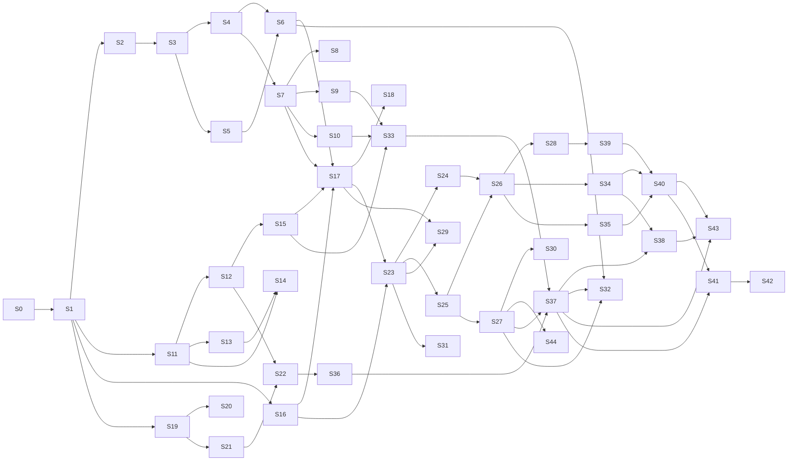

# IMPLEMENTATION_PLAN.md — PrismDMX Session Breakdown

**Companion:** [`PROGRESS.md`](PROGRESS.md) — the living tracker. This file is the plan; that file is the state.
**Architecture reference:** [`ARCHITECTURE_SPEC.md`](ARCHITECTURE_SPEC.md).

---

## How to use this document

Work proceeds in numbered **sessions**. A session is a coherent unit of work with a single goal and a testable exit criterion — sized so it can be finished, verified and committed in one sitting.

### Session protocol

1. **Open** — read [`PROGRESS.md`](PROGRESS.md), find the first session that is not `done` and whose dependencies are met. Mark it `in progress` with today's date.
2. **Work** — TDD, per `CLAUDE.md`: write the failing test first, then the implementation.
3. **Verify** — the exit criteria below are not suggestions. A session is not finished because the code exists; it is finished because the criteria pass.
4. **Close** — update `PROGRESS.md`: status, coverage figures actually measured, anything learned that changes a later session. Then **rewrite the follow-up prompt** in `PROGRESS.md` §8 so the next session can be started from scratch. Commit with a Conventional Commit message.
5. **Never** mark a session done with failing tests. Record the blocker in `PROGRESS.md` instead and leave the session `blocked`.
6.  After a session is complete and all tests have passed, always push you code and watch the ci run. If it passes, track it in `PROGRESS.md` and push again (this time you dont need to wait for CI as you only edited `PROGRESS.md`)

### The follow-up prompt

`PROGRESS.md` §8 always holds a ready-to-paste prompt that starts the next session. It must be **self-contained**: assume the reader has no memory of this conversation, no loaded context and no knowledge of the project. It therefore states the repository path, which files to read and in what order, which session to run, and what has to be true before the session may be called finished.

This exists so that work can resume in a fresh session — after a context reset, on another machine, or weeks later — without reconstructing anything by hand. Rewriting it is part of closing a session, not an optional extra.

### Conventions

| Field | Meaning |
|---|---|
| **Depends on** | Sessions that must be `done` first. Sessions with no unmet dependency may run in any order |
| **Exit criteria** | Objectively checkable. If it cannot be checked, it is not an exit criterion |
| **Size** | S ≈ half a session, M ≈ one, L ≈ one long or two short |
| 🔌 | Requires physical hardware — cannot be completed without the device |

### Session numbers are stable; the order is in §"Running order"

**A session's number never changes once the plan has been published**, because the
numbers are referenced from the source: `prism-core`'s programmer names an *S28
requirement*, its show model names *S27's group editor*, `prism-surface` names
S22's findings, and `PROGRESS.md`'s decision log is indexed by them. Renumbering
would silently make several dozen comments point at the wrong work.

So when sessions are added or reordered, the new ones take the next free numbers
and the **running order** below is what says what to do next. The numbers are
identity; the order is schedule. Within a phase the sessions are listed in
running order, which means the numbers in a phase are not always ascending —
that is the intended reading and not an error.

---

# Phase 0 — Foundation

## S0 · Toolchain and workspace
**Size:** M · **Depends on:** — · 🔧 partly manual

**Goal:** a workspace that builds, lints and tests green with zero logic in it, so every later session starts from a known-good baseline.

**Deliverables**
- Rust toolchain installed and working (`rustup`, MSVC build tools, linker)
- Cargo workspace with the eight crates from `ARCHITECTURE_SPEC.md` §9
- `rust-toolchain.toml`, `rustfmt.toml`, workspace lint configuration
- `ui/` scaffold: Vite + React + TypeScript, `strict: true`, no `any`
- CI workflow per §10.1: Windows full build and test; Linux ARM64 cross-compile check plus platform-neutral tests
- `.gitignore`, `.editorconfig`, initial commit

**Exit criteria**
- `cargo build --workspace` succeeds
- `cargo clippy --workspace --all-targets -- -D warnings` is clean
- `cargo fmt --check` is clean
- `cargo test --workspace` runs (zero tests is acceptable here)
- `npm run build` in `ui/` succeeds
- CI is green on a pushed branch

---

# Phase 1 — Domain and engine

The engine is pure logic with no I/O. It is the highest-value TDD target in the project and carries the strictest coverage requirement (> 95 %).

## S1 · `prism-domain` — types
**Size:** M · **Depends on:** S0

**Goal:** the vocabulary every other crate speaks, defined once.

**Deliverables**
- All types from `ARCHITECTURE_SPEC.md` §6 as Rust types with `serde` derives
- `Command` and `Delta` enums per [`docs/IPC_PROTOCOL.md`](docs/IPC_PROTOCOL.md) §5–6
- `ts-rs`/`specta` export generating `ui/src/bindings/`
- Newtype IDs (`FixtureId`, `ExecutorId`, …) — not bare `u32`, so they cannot be swapped by accident

**Exit criteria**
- `cargo test -p prism-domain` green
- Generated TypeScript compiles under `tsc --noEmit` in `ui/`
- Round-trip property test: every type survives serialise → deserialise unchanged
- No `any` in the generated bindings

## S2 · `prism-engine` — tick loop and triple buffer
**Size:** M · **Depends on:** S1

**Goal:** a 44 Hz heartbeat that holds its deadline and hands frames off without locks.

**Deliverables**
- Triple buffer: single writer (engine), many readers (output drivers), wait-free
- Tick loop with absolute deadlines (`sleep(deadline − 1 ms)` + spin), no accumulating drift
- SPSC command queue into the tick
- Counting allocator harness for tests

**Exit criteria**
- 10-minute run: no missed tick, **p99.9 jitter < 2 ms** measured, not asserted by eye
- Allocation test: zero allocations inside the tick after warm-up
- Triple buffer: concurrent read/write stress test under `loom` or equivalent, no torn reads
- Drift test: after 100 000 ticks, absolute time error < one tick period

## S3 · `prism-engine` — HTP/LTP merge
**Size:** L · **Depends on:** S2

**Goal:** the core of the product. Every rule in [`docs/DMX_MERGE.md`](docs/DMX_MERGE.md).

**Deliverables**
- Home layer, playback layer with per-attribute HTP/LTP, activation-order tracking
- Executor master applied before the HTP maximum
- The merge is a pure function over a source set

**Exit criteria**
- Every invariant in `DMX_MERGE.md` §6.1–6.2 verified with `proptest`
- HTP commutativity, associativity, idempotence, monotonicity, identity
- LTP order-dependence explicitly asserted **and** non-commutativity asserted, so it cannot be "optimised" into a max later
- Deactivation fallback chain tested down to home
- Worked example from `DMX_MERGE.md` §7 passes as a literal test case

## S4 · `prism-engine` — attribute to DMX encoding
**Size:** S · **Depends on:** S3

**Goal:** correct bytes on the wire.

**Deliverables**
- 16-bit internal → 8-bit or 16-bit channel split
- Attribute-level invert, then per-fixture pan/tilt invert
- Patch-time address validation so the tick needs no bounds checks

**Exit criteria**
- Table tests for 8-bit and 16-bit encoding, including boundary values 0, 1, 32767, 32768, 65534, 65535
- Invert composition tested (attribute invert × fixture invert)
- A fixture whose footprint exceeds channel 512 is rejected **at patch time** with a clear error

## S5 · `prism-engine` — executors, cues, fades
**Size:** L · **Depends on:** S3

**Goal:** playback that runs on the tick's time base.

**Deliverables**
- Cue evaluation, fade in/out/delay, cue list traversal, loop
- Trigger types: `Go`, `Follow`, `Time` (`Sound` deferred)
- Activation counter maintenance feeding LTP ordering

**Exit criteria**
- A 10-second fade reaches exactly 50 % at 5 s ±1 tick, verified on a simulated clock
- Fades interpolate in 16-bit even on 8-bit patched channels (no visible stepping)
- Go during a running fade behaves deterministically and is covered by a test
- Cue numbering with decimals (`1`, `1.5`, `2`) orders correctly

## S6 · `prism-engine` — programmer layer, masters, stress
**Size:** M · **Depends on:** S4, S5

**Goal:** the full pipeline, proven under load.

**Deliverables**
- Programmer override layer (sparse, absolute priority)
- Group masters, grand master — intensity only
- Complete `ARCHITECTURE_SPEC.md` §5 pipeline end to end

**Exit criteria**
- Stack invariants from `DMX_MERGE.md` §6.3 pass
- Grand master at 0 zeroes intensity and leaves all other attributes untouched — asserted, not assumed
- **Stress gate:** 64 universes, 100 % CPU load, 10 minutes, p99.9 jitter < 2 ms, zero dropped frames
- Determinism: identical input produces byte-identical frames across runs
- Coverage on `prism-engine` **> 95 %**, measured and recorded in `PROGRESS.md`

---

# Phase 2 — Protocols

## S7 · `prism-protocols` — `DmxOutput` trait and Open DMX USB
**Size:** L · **Depends on:** S4

**Goal:** the SH-RS09B driver, fully tested without owning the hardware.

**Deliverables**
- `DmxOutput` trait, `OutputHealth`, mock output driver
- `FtdiBackend` trait with a mock implementation
- `OpenDmxUsb` driver: port setup, break/MAB sequencing, 513-byte frame
- Driver thread wrapper: `catch_unwind`, reconnect backoff 100 ms → 5 s

**Exit criteria**
- Mock backend asserts the exact call sequence: `SetBreakOn` → delay → `SetBreakOff` → delay → write of 513 bytes with start code `0x00`
- Port setup asserted: 250 000 baud, 8N2, no flow control, latency timer 1
- Simulated disconnect mid-frame: driver reports `Disconnected`, retries with backoff, engine unaffected
- Simulated panic inside the driver: contained by `catch_unwind`, output marked degraded, process alive
- Coverage on `prism-protocols` **> 95 %**

## S8 · 🔌 Hardware bring-up: DSD TECH SH-RS09B
**Size:** M · **Depends on:** S7 · **requires the adapter and a DMX fixture**

**Goal:** replace assumptions with measurements.

**Deliverables**
- Confirmed USB VID/PID, serial and product string
- Measured sustained frame rate
- Decision recorded: D2XX vs. VCP fallback on this machine

**Exit criteria**
- A real fixture responds correctly to a value ramp
- Frame rate measured over 60 s and written into `ARCHITECTURE_SPEC.md` §7.1, replacing the estimate
- Unplug during output: reconnect works without restarting the daemon
- `ARCHITECTURE_SPEC.md` §14 row for the adapter is ticked

## S9 · `prism-protocols` — ArtNet
**Size:** M · **Depends on:** S7

**Deliverables:** ArtNet output, unicast default, optional ArtSync, forced full-frame refresh at least every 800 ms.

**Exit criteria**
- Packet bytes asserted against the ArtNet specification, including sequence number wraparound
- Refresh timer verified: a static universe still emits at least every 800 ms
- Broadcast is opt-in, never the default — asserted in a test

## S10 · `prism-protocols` — sACN (E1.31)
**Size:** M · **Depends on:** S7

**Deliverables:** sACN output, multicast addressing, per-universe priority, source name from show file, termination packet on shutdown.

**Exit criteria**
- Packet bytes asserted against E1.31, including CID stability across restarts
- Multicast group address computed correctly for universes 1 and 63999
- Clean shutdown emits a stream-terminated packet — asserted

---

# Phase 3 — Core state

## S11 · `prism-core` — show model and command application
**Size:** L · **Depends on:** S1

**Deliverables:** show model, patch, groups, presets, sequences; command validation and application; delta generation.

**Exit criteria**
- Every `Command` in the show group applies or rejects; rejection leaves state byte-identical
- Delta generation verified: applying deltas to a copy reproduces the source state exactly
- Patch conflicts (overlapping addresses) are detected and reported, not silently accepted

## S12 · `prism-core` — session state (D11)
**Size:** M · **Depends on:** S11

**Goal:** the mechanism that lets the X-Touch operate the UI.

**Deliverables:** `Session` per `ARCHITECTURE_SPEC.md` §4.1, all session commands from §4.4, session persistence with the show.

**Exit criteria**
- Every session command applies and emits a `SessionPatch`
- Session survives save/load: reopening a show restores view, windows, page and selection exactly
- Client-local state (§4.2) is provably absent from the session type — asserted by the type, reviewed explicitly

## S13 · `prism-core` — programmer state machine
**Size:** M · **Depends on:** S11

**Deliverables:** selection, sparse attribute values, feature-group tracking, three-stage clear.

**Exit criteria**
- Three-stage clear tested through all transitions including the reset-to-0 rule on unrelated interaction
- Preset application records `presetRef` so cues stay live-updatable
- Programmer is sparse: an untouched attribute is absent, not zero — asserted

## S14 · `prism-core` — Oops journal
**Size:** M · **Depends on:** S11, S13

**Deliverables:** undo records with inverses, 200-entry ring, redo.

**Exit criteria**
- Property test: apply *n* random commands, undo *n* times, state equals the start byte for byte
- Redo after undo returns to the post-command state
- Playback and session commands are **excluded** — asserted with a test that an executor Go followed by Oops leaves the executor running
- Ring overflow drops oldest without corrupting the journal

## S15 · `prism-core` — SQLite persistence
**Size:** L · **Depends on:** S11, S12

**Deliverables:** `.prism` schema with `user_version` migrations, WAL, autosave every 30 s to a recovery copy, dirty flag, JSON export/import.

**Exit criteria**
- Save/load round trip: loaded show is byte-identical to the saved one, sessions included
- **Crash safety:** kill the process mid-write; the file still opens and contains the last committed state
- Migration path from a version-1 file to version 2 tested with a fixture file
- Dirty flag drives `DirtyFlag` deltas correctly (this is the X-Touch Save LED)

---

# Phase 4 — IPC and daemon

## S16 · `prism-ipc` — framing and transports
**Size:** M · **Depends on:** S1

**Deliverables:** length-prefixed MessagePack framing, named pipe / UDS transport, WebSocket transport, client and server halves.

**Exit criteria**
- Framing round-trip property test over arbitrary messages
- Oversized frame closes the connection without a large allocation — asserted
- **Transport parity:** the full suite passes identically over both transports

## S17 · `prismd` — daemon binary
**Size:** L · **Depends on:** S6, S7, S15, S16

**Goal:** the engine runs as a real process, headless, with no UI in existence.

**Deliverables:** wiring of engine, core, outputs and IPC; lock file with PID and port; single-instance guarantee; stale-lock takeover; CLI for headless operation; shutdown with sACN termination and configurable blackout-or-hold.

**Exit criteria**
- Daemon starts, loads a show, outputs DMX to a mock driver, with no client ever connecting
- Second instance detects the first and refuses to start — asserted
- Stale lock file (killed process) is detected and taken over
- Handshake serves a `Snapshot` containing show **and** session

## S18 · D2 gate — resilience
**Size:** M · **Depends on:** S17

**Goal:** prove the claim that the whole two-process design exists for.

**Exit criteria**
- Client connects, then is killed mid-show: the output frame sequence has **no gap** across the entire run — asserted on captured frames, not observed manually
- Client reconnects and re-snapshots to a state identical to the daemon's
- Protocol version mismatch produces an explicit `Reject`, never undefined behaviour
- Backpressure: a deliberately slow client loses telemetry, loses no commands, and does not affect other clients

---

# Phase 5 — Surface

## S19 · `prism-surface` — MCU codec
**Size:** L · **Depends on:** S1

**Deliverables:** MIDI byte codec per [`docs/MCU_MAPPING.md`](docs/MCU_MAPPING.md) §2, running-status handling, SysEx reassembly with timeout, malformed-input discard counters.

**Exit criteria**
- Round-trip table tests: bytes → event → bytes, byte-equal both directions
- Running status decoded identically to explicit status
- Fuzz with truncated and out-of-range messages: no panic, no allocation growth, correct discard counters
- SysEx split across packets reassembles; unterminated SysEx times out and is dropped

## S20 · 🔌 Hardware verification: Behringer X-Touch
**Size:** M · **Depends on:** S19 · **requires the console**

**Goal:** clear the UNVERIFIED banner on `MCU_MAPPING.md`.

**Exit criteria**
- Every item in `MCU_MAPPING.md` §7 ticked
- §2 tables and `profiles/surface/xtouch.json` updated with measured values
- Deviations from the MCU standard documented explicitly rather than silently corrected
- UNVERIFIED banner removed; `ARCHITECTURE_SPEC.md` §14 row ticked

## S21 · `prism-surface` — surface model and feedback
**Size:** M · **Depends on:** S19

**Deliverables:** logical control set, shadow model, diff-based outbound, touch suppression, coalescing, resync burst on reconnect.

**Exit criteria**
- Touch suppression: no outbound pitch bend while touched; exactly one resync 150 ms after release — asserted
- Coalescing: 1000 value changes in 100 ms produce at most 3 outbound messages for that control
- Priority under bandwidth pressure verified in the documented order: faders → LEDs → LCD → meters
- Device disappearance does not affect the engine

## S22 · `prism-surface` — bindings and the D11 gate
**Size:** M · **Depends on:** S12, S21

**Deliverables:** JSON binding table with schema validation, default `xtouch.json` matching `XTouch.txt`, fallback to built-in defaults on a malformed profile.

**Exit criteria**
- Default profile reproduces every row of `MCU_MAPPING.md` §4.1
- Malformed profile falls back with a warning and **never** blocks startup — asserted
- **D11 gate:** with no UI client connected, mock MIDI sends `Channel ▶` and F1; a client then connects and finds both the new view and the opened window in its `Snapshot`
- Coverage on `prism-surface` **> 95 %**

---

# Phase 6 — User interface

## S23 · `ui` — foundation
**Size:** L · **Depends on:** S16, S17

**Deliverables:** IPC client, read-model mirror (Zustand + Immer), snapshot/delta application, reconnect handling with visible disconnected state.

**Exit criteria**
- Deltas applied to the mirror reproduce daemon state — property tested against a recorded delta stream
- Daemon restart: UI shows disconnected, reconnects, re-snapshots, no stale data
- `tsc --noEmit` clean with `strict: true`; no `any` anywhere

## S24 · `ui` — telemetry channel
**Size:** M · **Depends on:** S23

**Goal:** the reason the second channel exists.

**Deliverables:** binary telemetry decoding into refs, canvas renderers for levels and meters.

**Exit criteria**
- 64 universes at 30 Hz sustained with **zero React re-renders** from telemetry — asserted with a render counter, not judged by feel
- Frame budget: canvas render stays under 8 ms at 64 universes
- Dropped telemetry degrades smoothly and never desynchronises control state

## S25 · `ui` — canvas, windows, views
**Size:** L · **Depends on:** S23

**Deliverables:** draggable and resizable window system, View Selector Bar, window types wired to session state.

**Exit criteria**
- Opening, moving and closing windows issues session commands — the UI does **not** hold this state locally
- A view switched from the X-Touch is reflected immediately (this is D11 observed end to end)
- Layout survives a UI restart because it lives in the session

## S26 · `ui` — executor bar, encoder bar, console
**Size:** L · **Depends on:** S24, S25

**Deliverables:** executor bar showing the current page of 8 (D7), selected-executor panel, five encoder banks feeding the programmer, command line.

**Exit criteria**
- Executor bar shows exactly the current page; paging from the X-Touch and from the UI agree
- Encoder changes reach the programmer and appear in output within one tick
- Command line parses and reports syntax errors without throwing

## S27 · `ui` — patch and fixture sheet
**Size:** L · **Depends on:** S25

**Exit criteria:** fixtures can be patched, addressed and edited entirely from the UI; address conflicts are shown before they are committed; the fixture sheet reflects live values.

## S44 · `prism-core` + `prismd` + `ui` — the Open Fixture Library
**Size:** L · **Depends on:** S27 · **an extension of S27, asked for on 2026-08-14**

**Goal:** a desk that knows real fixtures. S27 shipped four generic profiles and
said so plainly: "not a fixture library in the sense a venue means — no import,
no GDTF, no per-manufacturer modes, and no way for an operator to author a
profile of their own". This is that sentence answered.

**What is there now.** `prism_core::library` is four `FixtureType`s built in
Rust, `Command::EmbedFixtureType` names one by key, and the whole list rides in
the `Snapshot` because four of anything fits anywhere. `ARCHITECTURE_SPEC.md` §9
reserves `profiles/fixtures/` and nothing has ever written it. A venue patching a
real moving head has to approximate it with a generic profile of the right
footprint, which is exactly as wrong as it sounds: the channels land in the wrong
places.

**The library.** The [Open Fixture Library](https://open-fixture-library.org) is
MIT-licensed, publishes one JSON file per fixture against a versioned schema, and
is what the rest of this industry's open software reads. Vendored at schema
**12.5.1**: **634 fixtures across 132 manufacturers, 8.5 MB, 2 798 modes.**

**Deliverables**
- `profiles/fixtures/` — the OFL tree as OFL publishes it, with its `LICENSE`
  and a `SOURCE.md` naming the upstream commit and schema version, so a
  re-import is reproducible and the licence travels with the data
- An **OFL reader** in `prism-core`, platform-neutral and pure: one
  `prism_domain::FixtureType` per OFL *mode*, offsets from the mode's channel
  order, `fineChannelAliases` becoming `fineOffset`, capability types mapped onto
  `AttributeType`, and `angleStart`/`angleEnd` becoming the physical range
- **The conversion is lossy and says so, with numbers.** Of 2 798 modes, 2 084
  convert and 714 are skipped because their channel list contains an object
  entry — a matrix insert or a switching channel, neither of which this domain
  model can express. 8 387 attributes are mapped; 5 064 channels carry a
  capability there is no `AttributeType` for; 1 384 are dropped as duplicates of
  an attribute a lower channel already claimed
- **A fixtures folder that is read automatically**: `<data-dir>/fixtures/`, in
  the same OFL format, scanned at start-up. A key there **overrides** the
  bundled one, so a venue can correct a profile without editing the vendored tree
- **The library leaves the snapshot.** Two thousand profiles do not fit in a
  1 MiB frame (`docs/IPC_PROTOCOL.md` §3), so `Snapshot.fixtureLibrary` is
  replaced by `Query::SearchLibrary { text, limit }` → `Answer::LibraryMatches`,
  carrying a small entry per match rather than a whole `FixtureType`. This is
  the second caller of the query channel S27 added, and the first one that
  *needed* it rather than merely suited it
- A **search field** in the patch window in place of S27's menu, and the
  profile embedded by key exactly as before

**Exit criteria**
- A show can be patched with a **real fixture** from the interface: search,
  choose a mode, embed, patch — and the channels land where the manufacturer's
  manual says they do, asserted against the vendored JSON for a named fixture
- Every one of the 634 vendored files parses, and the reader's answers for one
  fixture are asserted **field by field** against a fixture written out by hand
  from the JSON — not against the reader's own output
- A malformed or unreadable file in either directory is **skipped with a warning
  and never stops the daemon starting**, asserted the way S22 asserts a
  malformed binding profile
- A file in `<data-dir>/fixtures/` is found without a restart flag, and a key it
  shares with the bundled library wins
- Loading the whole library at start-up is **measured** and recorded, and the
  daemon's start-up time is still a number a person would not notice
- `Snapshot` no longer carries the library; the search answers within the frame
  limit for the worst query the corpus admits, asserted
- The three S27 criteria still hold, all fourteen end-to-end tests stay green,
  and coverage on the new code is ≥ 85 %

## S35 · `ui` — the desk layout: bars side by side, encoder pages, views that can be managed
**Size:** M · **Depends on:** S26

**Goal:** the band under the canvas as a console has it, and the View Selector Bar as something an operator can organise rather than only add to.

**What is there now, and what is wrong with it.** S26 put the encoder bar *above*
the executor bar in two full-width bands, which costs the canvas two bands of
height and leaves the encoder bar 3.1 rem to hold five banks, up to six
parameters and a readout. `programmerPage` is in `ARCHITECTURE_SPEC.md` §4.1 and
**nothing pages anything**: the encoder bar shows every parameter of a bank at
once and displays the page number only because the console can change it. Views
can be selected and stored and nothing else — there is no way to rename one, to
get rid of one, or to put them in the order an operator wants to step through.

**Deliverables**
- One band, two halves: the executor bar and the encoder bar **side by side**, both taking their height from the same column as the canvas
- The encoder bar with the room a real encoder needs: the parameter, its value, where the value came from (`ProgrammerValueSource`), and how much of the selection it covers
- **Four parameters to a page**, with `programmerPage` driving it at last — so `Zoom ▲▼` on the X-Touch pages the interface, which is what §4.1 put the field there for, and paging from either end is the same act
- A context menu on a view button: rename, delete, move left, move right, overwrite with the canvas as it now is, and store the canvas as a new view in that place
- The commands that needs — `RenameView`, `DeleteView`, `MoveView` — as a protocol change in `prism-domain`, `prism-core` and `prism-ipc` with tests **there**, in the shape S25 used for `PlaceWindow`
- `Channel ◀▶` on the console follows the **displayed** order, so moving a view moves what the console steps through

**Exit criteria**
- Both bars sit in one band, and the end-to-end overflow check still reads zero on the document, the canvas and both bars with four windows open
- The encoder bar shows four parameters at a time; paging from the interface and paging from the console's `Zoom ▲▼` agree — observed through `--mock-surface`, not asserted
- A bank with fewer parameters than a page holds shows what it has and disables the page control; a bank with more than one page is asserted to exist (Beam has six parameters)
- A view can be renamed, deleted and moved from the interface, each as a command whose answer arrives as a delta — the interface holds no view list, asserted the way S25 asserts the canvas
- Deleting the **active** view leaves the canvas in a state the *daemon* defines, and the interface does not invent one
- After a move, `Channel ▶` on the console steps to the view that is drawn next
- S26's three exit criteria and S24/S25's measured numbers all still hold

## S28 · `ui` — sequences, cues, presets
**Size:** L · **Depends on:** S26

**Deliverables**
- Sequence and cue sheets: the cues of a sequence with their numbers, names, times and triggers, edited in place
- Preset pools per feature group, applied and stored, with the colour a preset carries shown — `Preset::color` is also what the scribble strips use
- Firing: a cue list on an executor, Go, Go−, Off, and what is running read from `Delta::ExecutorState`
- The **question of the store modes** is raised here and answered in **S39**: `prism_core::Programmer::cue` merges unconditionally and its documentation names Merge / Overwrite / Remove as this session's requirement. S28 may ship with the merge behaviour that exists, provided it **says so on the button**; what it may not do is invent a mode in the client
- The **selected sequence** — what a store with no sequence named goes into — is likewise S39's to define in the session state. S28 uses the selected executor's sequence and marks the assumption rather than making it permanent

**Exit criteria**
- Cues can be stored, edited and fired from the UI
- Preset pools apply and store; preset links remain live (editing a preset updates cues that reference it)
- A store that would overwrite says what it will do **before** it does it, even where the only mode available is Merge
- Nothing about a cue, a sequence or a preset is held in the interface: all three are readers over the show document, asserted against a recorded daemon script

## S39 · `prism-core` — store modes, cue editing and the update state
**Size:** L · **Depends on:** S28

**Goal:** what a console does when you store on top of something that is already there, and what *edit cue 3* means.

**What is there now.** `StoreCue` merges unconditionally —
`prism_core::Programmer::cue` documents the choice and names the alternatives as
an S28 requirement. There is no `StoreSequence`. Nothing loads a cue *back* into
the programmer, and no state anywhere says "the programmer is editing cue 3 of
sequence 5", which is exactly what an Update key needs in order to blink.

**Deliverables**
- A **mode** on `StoreCue`: Merge, Override, Remove. The client asks the operator and the command carries the answer, so the daemon never guesses and the outcome does not depend on which client sent it
- `StoreSequence { sequenceId, mode }` with Append, Override and Merge, where **Append adds a cue at the highest number**
- The **selected sequence** in `ARCHITECTURE_SPEC.md` §4.1: whether it is the selected executor's sequence or a session field of its own is this session's decision, and it *is* a decision — both answers are defensible and only one can be right for `Store Cue 5`
- `EditCue { sequenceId, cueNumber }`: every attribute of that cue into the programmer with each `presetRef` **preserved**, so an edit does not quietly break a preset link
- The **update state**: session fields saying which cue the programmer is editing and whether anything has changed since it was loaded — which is what makes an Update key blink — and `Command::Update`, which stores back in Override mode
- Oops covering all of it, per `ARCHITECTURE_SPEC.md` §6.1

**Exit criteria**
- Each store mode does exactly what its name says against a cue that already exists, asserted on the **stored cue** rather than on the command being accepted
- A cue loaded with `EditCue` and updated with nothing changed is byte-identical to the cue that was loaded
- Preset links survive a load-and-update round trip — S13's criterion, re-asserted through the new path
- The update state clears when the programmer is cleared, when the cue is deleted, and when a different cue is loaded — all three asserted
- Oops takes back a store and an update, and S14's property test still holds
- Coverage on `prism-core` stays **> 95 %**

## S34 · `prism-core` + `prism-engine` — executor functions, and the readback from the tick
**Size:** L · **Depends on:** S26

**Goal:** close the two gaps S26 recorded, so that an executor's buttons do what the show says they do and the desk can say which cue is running.

**What is there now.** `ExecutorButtonFunction` has eight values and the protocol
can express three of them; `docs/MCU_MAPPING.md` §4.1's three rows resolve to the
commands that exist, the shipped profile carries a `deviationsFromSection41`
block, and S26's executor bar draws four buttons **disabled with the reason on
them**. Separately, `Executor::currentCueIndex` is in the domain and on the wire
and **nothing fills it**, because what cue a playback is on lives on the tick
thread and there is no channel back into the core.

**Deliverables**
- `Command::ExecutorButton { executorId, button, pressed }` — `pressed` is what `Flash` needs — routed in `prism-core` through that executor's own `buttonFunctions`, so the **executor** decides what a press means and no client does
- `On`, `Off` and `Toggle` through `prism_engine::TickCommand::SetExecutorActive`, which S5 already built; `Toggle` resolved in the **daemon**, which is the one place `isActive` is owned
- `Flash`: a temporary override that leaves the **stored** master untouched — a layer in the merge rather than a `SetExecutorMaster`, so releasing it restores exactly what was there
- Speed masters (`docs/DMX_MERGE.md` §4 item 3) and `LearnSpeed` as a tap, which is also the transport section's missing function (`MCU_MAPPING.md` §4.3, and S20's carried note)
- `ExecutorFaderFunction::XFade` on the main fader — the third of §4.1's three rows
- A **readback channel from the tick**: the current cue index of every running executor, published without allocating inside the tick (§3.1) and turned into `Delta::ExecutorState`

**Exit criteria**
- Every one of the eight `ExecutorButtonFunction` values does what its name says, asserted on **frames** rather than on state
- A `Flash` pressed and released leaves the stored master byte-identical; a `Flash` held across a `SetExecutorMaster` does not lose the new value
- `Toggle` on an executor a second client has just started **stops** it — one desk, one answer
- `currentCueIndex` is filled while a sequence runs, and `crates/prismd/tests/ui_programmer.rs`'s **absence assertion is inverted** and the recording regenerated — S26 wrote that test so this session would find it red
- §4.1's three rows resolve to real commands, the shipped profile's `deviationsFromSection41` block is **emptied**, and §4.2.1 is rewritten as history
- Zero allocations inside the tick, re-measured; coverage on `prism-engine` and `prism-core` stays **> 95 %**

## S40 · `ui` — the console shell
**Size:** L · **Depends on:** S39, S34, S35, S28

**Goal:** most of the programming work and much of the playback work done by typing, which is how a console is operated once its operator knows it.

**What is there now.** S26's command line parses seven shapes into commands that
already existed, never consults the show, and never throws. This is that parser
grown up, and both of those rules survive it.

**Deliverables** — the vocabulary, on top of S26's:
- `Select Group 1`, `Select Fixture 12 thru 16`, `Select Preset 3`
- `Store Cue 5` — into the selected sequence. When cue 5 exists, a prompt offering **merge, override or cancel**, and the answer travels in the command
- `Store Sequence 4` — when sequence 4 exists, a prompt offering **append, override, merge or cancel**
- `Label View 1 "Programmer"` — and with no label given, a window to type one into. The same for cues, sequences, groups and presets
- `Edit Sequence 5 Cue 3` — loads it into the programmer, and **Update starts blinking** as soon as something is changed. `Update` stores back in Override mode, and so does the Update key on the console
- S26's `go`, `off`, `page`, `clear` and `at`, kept and unbroken
- Most Button Presses outside of executor handlers either write a no argument command (like Update, Clear and Oops) and execute it directly, write multiple argument command (like Select, Edit, Label and Store) and wait for Enter to execute the command (Which is also mapped to a button on the surface), or append an argument to a command (like Fixture, Group, Sequence, Cue and View)
- Completion and history: what the words are, what is legal *at this point in the line*, and the last lines back with the arrow keys — client-local (§4.2), so one operator's history is not another's
- A readme file explaining the command structure. Also contains explanation for commands from S26
- **A prompt is not a modal that blocks the desk.** The show carries on, the console line holds the question, Escape cancels, and a Go from the X-Touch is not waiting on it

**Exit criteria**
- Every command above produces the commands a daemon accepted for it, held to a recording in the shape S26 established — nothing in TypeScript decides what a line ought to mean
- A prompt that is cancelled changes **nothing at all**, asserted on the show rather than on the interface
- A prompt left open blocks neither another client nor the console
- The parser still never throws, over a generated corpus, with the grammar grown
- The blinking Update is the **session's** update state (S39) and not a timer this interface keeps — asserted by a second client blinking too
- Coverage ≥ 85 % on what this session writes

## S43 · `ui` — cleanup and polish
**Size:** M · **Depends on:** S40, S37, S38

**Goal:** the session for everything that is a paragraph rather than a session — the small wrongnesses S23–S40 each wrote down and deliberately left.

**Deliverables**
- `PROGRESS.md` §7's *carried out of* lists, gone through one entry at a time
- The window bodies still saying they are not built yet, and the ones that are a morning's work
- Keyboard: focus order, shortcuts, and the fact that a console is operated in the dark by somebody who is not looking at the screen
- Colour, contrast and density read at two metres in a dark room (`CLAUDE.md`: fast recognition of sections before aesthetics)
- Notices, refusals and errors: one voice, one place on the screen, and a message an operator can act on
- Empty states everywhere: a fresh show, an empty page, an empty pool, a disconnected desk
- The measured numbers re-taken with everything on the screen at once

**Exit criteria**
- Every item carried out of S23–S40 is done, or has become a session of its own — **nothing merely dropped**, and the list is checked off in `PROGRESS.md`
- The two telemetry numbers hold with every window type open at once
- No scrolling outside the canvas, at 1280 × 720 **and** at 4K
- Coverage does not fall in any module
- A full pass with the keyboard alone reaches every control

## S29 · `prism-app` — Tauri shell
**Size:** M · **Depends on:** S17, S23

**Deliverables:** Tauri shell, daemon spawn-or-attach, autostart settings per `ARCHITECTURE_SPEC.md` §10.3, tray, explicit shutdown. The autostart and machine settings are **driven from the settings window** (S37) rather than from a menu of their own: a setting that exists in two places is a setting that disagrees with itself, and the Web Remote (S31) has no menu bar at all.

**Exit criteria**
- Closing the window leaves the daemon running and DMX flowing — asserted, this is D9
- Second shell instance attaches instead of spawning a second daemon
- Opt-in autostart installs and uninstalls cleanly **without administrator rights**
- Installer produces a working build on a clean Windows machine

---

# Phase 7 — Outputs, devices and the machine

The plumbing a venue needs and a developer's laptop does not: several outputs of
several kinds at once, a MIDI port that is really there, and somewhere to
configure both. This is what turns a program that runs a show into an
installation.

## S33 · `prism-core` + `prism-protocols` + `prismd` — the output patch
**Size:** L · **Depends on:** S9, S10, S15

**Goal:** a venue's real output rig — several outputs, of several kinds, each carrying the universes it is actually wired for — configured as **data** rather than as command-line flags.

**What is there now, and what it cannot express.** Outputs are
`prismd::cli::OutputSpec` values built once at start-up, one thread each, and
every network output is handed `show_universes(file)` — *all* of them. So two
Art-Net nodes both receive every universe, an sACN output cannot be told to carry
only 3 and 4, an Open DMX adapter carries exactly one universe by construction,
and nothing can be added, removed or re-addressed without restarting the daemon.
**The worked example in the exit criteria is not expressible today.**

**Deliverables**
- `OutputInstance` in the domain: a number, a name, a kind with its parameters (Open DMX device, Art-Net node, sACN, mock), **the set of universes it carries**, and whether it is enabled
- Where it lives: `prism_core::MachineConfig`, beside the desk identity — the adapters belong to the *building*, and a show copied to another machine on a stick must not carry the first machine's cabling with it. That is the same argument `desk.rs` makes for the sACN CID, and it is a decision to record rather than a detail to slip in
- Routing both ways: one universe may go to several outputs, one output may carry many, and a patched universe with **no** output is a legitimate state that is reported rather than silently dropped
- Art-Net per-node port mapping — universe → net/subnet/universe on that node — so a four-port node is four rows an installer can read off the back of it
- Commands: `AddOutput`, `ConfigureOutput`, `RemoveOutput`, `SetOutputEnabled`, validated and broadcast as deltas
- **Hot reconfiguration**: adding, removing or re-addressing an output while the show runs, without a missed tick and without disturbing the outputs that did not change
- `OutputSnapshot` grows what a settings panel has to show: kind, parameters, universes, health, frames sent, and the last error with when it happened

**Exit criteria**
- **The worked example, configured and asserted**: two Open DMX adapters on universes 1 and 2, one sACN node carrying 3 and 4, and two Art-Net nodes carrying 5–8 and 9–12 — twelve universes across five outputs of three kinds, with every mock driver asserted to receive **exactly** the universes it was given and no others
- A universe sent to two outputs arrives byte-identical at both
- An output added mid-show starts sending within one refresh interval and one removed mid-show stops — neither costs a tick, asserted on the captured frame sequence the way S18 asserts the D2 gate
- An output whose device disappears degrades **alone**: the other four keep sending, and the engine never hears about it
- A patched universe with no output is reported as a `ShowIssue` rather than dropped in silence
- The configuration survives a restart, and a show copied to a second machine arrives with **no** output configuration in it — asserted, like `desk_id_is_not_show_content`
- Coverage on the new code **> 95 %**

## S36 · `prism-midi` — the real MIDI port
**Size:** M · **Depends on:** S22

**Goal:** an X-Touch that is plugged in rather than mocked, and a list of ports a settings window can offer.

**What is there now.** `prismd::surface::SurfacePort` is a two-method trait with
two implementations and **neither opens a device**: `MockSurfacePort` is
in-process and `FileSurfacePort` reads bytes appended to a file. S20's probe is
the only code in the repository that opens a MIDI port and it lives *outside* the
workspace on purpose, because `ARCHITECTURE_SPEC.md` §10.1 allows neither
`prism-surface` nor `prismd` any `#[cfg(target_os = …)]`. The backend needs a
home before it can have an implementation.

**Deliverables**
- A crate whose whole purpose is to hold the platform split, wrapping `midir` or what sits under it — the precedent is `thread-priority`, which got into the workspace for exactly that reason (S17)
- Port enumeration: what is plugged in, by name, and a stable way of naming one in a configuration that survives being unplugged and plugged back in
- `SurfacePort` over a real port, with S21's pacing and S20's finding about a surface that stops transmitting while still receiving
- Hot-plug: a desk unplugged mid-show becomes `SurfaceHealth::Disconnected` and one plugged back in triggers the §5.3 resync, with the engine never hearing about either
- `--surface <port>` and the machine-configuration entry a settings window writes
- 🔌 A row in `ARCHITECTURE_SPEC.md` §14 for the part that needs the device

**Exit criteria**
- Enumeration answers on a machine with **no** MIDI device attached, with an empty list rather than an error
- The whole `prism-surface` suite still runs with nothing plugged in, and so does the D11 gate
- **No `#[cfg(target_os = …)]` outside the new crate** — the ARM64 cross-check job is what says so
- A configured port that is not there is a warning and a daemon that starts, never a daemon that will not
- 🔌 With the X-Touch attached: the D11 gate passes over a **real** port, and §7's checklist gains a row

---

# Phase 8 — Settings and the control editor

## S37 · `ui` — the settings window
**Size:** L · **Depends on:** S33, S36, S27

**Goal:** the window `WindowType::Settings` has been reserving since S25, and the first place an operator configures **the desk** rather than the show.

**Deliverables** — four panels:
- **Outputs**: the output patch of S33 — add, remove, enable, re-address; which universes each output carries; live health, frame counters and the last error; and the patched universes going nowhere at all
- **Devices**: the MIDI ports of S36 — choose one, watch what it is doing through `SurfaceCounters`, load and reload a binding profile
- **Show files**: save, save as, open, recent, the autosave state, the dirty flag, and the JSON export and import S15 built. Only `SaveShow` has a command today, so the rest is a protocol change — `OpenShow`, `SaveShowAs`, `NewShow` — with their tests in `prism-core` and `prism-ipc`
- **This machine**: data directory, network exposure and the §2.1 token, the desk identity, the log level, and the autostart of S29
- **A settings window is a window, not a modal.** It lives on the canvas like any other, it can be open on a second screen, it can be opened from an F-key, and what it changes is machine or session state that every client sees

**Exit criteria**
- S33's worked example is built **entirely from the interface**, and the frames arrive where they should — the same assertion, driven from a browser
- A show is saved, saved under a new name and reopened without touching a command line
- Changing one output does not interrupt the others, watched in a browser against a running daemon
- Every panel is a reader over daemon state: closing and reopening the window shows the same thing, and a second client sees the change
- A panel with more rows than it has room for scrolls **inside its window** — nothing outside the canvas scrolls

## S38 · `ui` — the interactive control editor
**Size:** L · **Depends on:** S37, S36, S34

**Goal:** the binding table of `docs/MCU_MAPPING.md` §4 edited at the desk, instead of in a JSON file beside it.

**What is there now.** `prism_surface::Bindings` is layer 3 and it is read once,
from a path, at start-up. There is no command that reads the table in force and
none that writes one.

**Deliverables**
- The profile over the protocol: read what is in force, write a table, reload from disk — with S22's rule intact, that a malformed table never blocks anything
- A picture of the surface: pick a control, see what it does now, choose what it should do — from the whole command vocabulary, including the executor buttons S34 adds
- **Learn**: press a control on the desk and have the editor name it, which is S20's method rule run in the other direction
- The reserved control (SMPTE/Beats, §4.3) refused **by name**, with the reason, before a table can be saved
- Ownership shown: which controls are permanently PrismDMX's in the combined Xctl+MC mode and which follow the operator's switch (§4.3)

**Exit criteria**
- A binding changed in the interface takes effect **without restarting the daemon**, observed through `--mock-surface`
- The shipped profile still **is** the built-in defaults after a round trip through the editor — S22's assertion, unchanged
- A profile binding the reserved control cannot be saved, and the message names the button and says why
- Learn names the right control for every group of §2.1, driven from `--mock-surface`
- Two clients with the editor open do not produce two tables

---

# Phase 9 — Extended features

## S30 · 3D viewer
**Size:** L · **Depends on:** S27

**Exit criteria:** every patched fixture appears with correct position and orientation; beams reflect live output; the viewer never blocks the telemetry canvas or the engine.

## S31 · Web Remote
**Size:** L · **Depends on:** S23

**Deliverables:** the same client, served over the network. The settings window (S37) is reachable there as well — it is a window on the canvas and there is nothing to special-case — but the **machine** panel is not: a phone in the auditorium may not move the data directory or turn off the network exposure it is connected through, and that restriction belongs in the daemon rather than in a hidden button.

**Exit criteria**
- The browser client is functionally the same client as the desktop UI
- Loopback binding is the default; LAN exposure requires explicit opt-in plus token
- A phone can operate executors
- A remote client is refused the machine settings **by the daemon**, and the refusal says why

## S32 · PSN / OSC — openfollow.app
**Size:** L · **Depends on:** S6, S27, S37

**Deliverables:** PSN tracker input driving pan/tilt through the 3D calculation; OSC in and out; and **their panel in the settings window** (S37) — sources, ports, which trackers are seen, which fixtures follow which tracker, and the timeout. OSC is also a *surface*: the binding vocabulary of `docs/MCU_MAPPING.md` §4 is not MCU-specific, and an OSC control that fires a command belongs in the control editor (S38) rather than in a second mapping system.

**Exit criteria**
- Tracker positions drive pan/tilt through the 3D calculation; only the latest sample is read
- A 500 ms timeout holds the last position and warns, with **no** jump — asserted with a simulated dropout
- Sources and mappings are configured from the settings window and survive a restart
- An OSC message bound to a command reaches the desk through the same door every client uses — no second command path (D11's rule, applied to a second protocol)

---

# Phase 10 — Documentation and release

## S41 · docs — the manual, and a README in every crate
**Size:** L · **Depends on:** S37, S40

**Goal:** everything a person who is not the author needs, and the check that stops it going stale.

**Deliverables**
- **A README in every crate**: what it is for, what it may not contain — §10.1's rules are per-crate and today live only in the specification — how to test it, and which sessions built it
- **An operator's manual**: patching, programming, storing, playback, the console shell, the X-Touch, and what to do when something has gone wrong mid-show
- **An installer's manual**: outputs and the network, sACN and Art-Net in a venue, the machine configuration, autostart, and the Raspberry Pi path (D10)
- **A developer's manual**: the architecture as it actually ended up, the decision log distilled into the rules that came out of it, and how to add a command, a window type, a fixture type or an output kind
- `rustdoc` published: the crate documentation is already unusually complete and nothing renders it

**Exit criteria**
- Every workspace member has a README, checked by a **test** rather than by a reviewer
- `cargo doc --workspace --no-deps` builds with no warnings and every intra-doc link resolves
- The operator's manual covers every `WindowType` and every console command, and a test asserts those **lists** against the code — a manual that has quietly fallen behind is worse than none
- Every 🔌 procedure has a written form somebody without this repository open could follow

## S42 · `web` — prismdmx.de
**Size:** M · **Depends on:** S41

**Deliverables:** the presentation site and the documentation site; S41's manuals rendered from the same source; the released builds with their checksums; a changelog derived from the session records; and a deployment that is a push.

**Exit criteria**
- The site builds **from this repository**, so the documentation cannot drift from a release
- The manuals are S41's source and not a copy of it
- The documentation is readable without JavaScript, and every page says which version it documents
- Deployment is reproducible, and the domain serves over TLS

---

## Dependency overview

**Critical path to a usable console:** S0 → S1 → S2 → S3 → S4 → S7 → S11 → S12 → S16 → S17 → S19 → S21 → S22 → S23 → S25 → S26. *Reached at S26.*

**Critical path to a console that can be *installed* in a venue:** everything above, plus **S33, S36 and S27**, which are what S37 waits on — in any order between themselves. Until all four, a venue's output rig is command-line flags and the X-Touch is a mock.

Sessions S8 and S20 need physical hardware and can be deferred without blocking anything except their own verification; S36 has a 🔌 half with the same property. Everything else runs against mocks, as `CLAUDE.md` requires.

---

## Running order

The numbers are identity and this is the schedule — see *Conventions*. Nothing
below is a hard sequence except where the dependency graph makes it one; what it
is, is the order the work was planned to make sense in.

| # | Session | Why here |
|---|---|---|
| 1 | **S27** `ui` — patch and fixture sheet | The last thing an operator cannot do at all: build a rig. Already prompted in `PROGRESS.md` §8 |
| 2 | **S44** `prism-core`/`prismd`/`ui` — the Open Fixture Library | Asked for on 2026-08-14 as an extension of S27. Four generic profiles cannot patch a real rig, and S27 said so in as many words |
| 3 | **S35** `ui` — desk layout and view management | A correction to what S26 shipped, done before more is built on top of the layout it got wrong |
| 4 | **S28** `ui` — sequences, cues, presets | Raises the store-mode question. Moved ahead of S34 on 2026-08-19: it depends on S26 rather than on S34, so the graph allows it, and it keeps the interface work in one stretch. What it costs is named in its own prompt — a cue sheet can show *which* executor is running but not *where* it is, because nothing fills `cueIndex` until S34. **Done 2026-08-19** — see `PROGRESS.md` §2.31. It raised the store-mode question the way the plan asked: no command carries a mode, and the daemon answers with the one it has so the button can say it |
| 5 | **S34** core/engine — executor functions and the tick readback | Fills in the four buttons S26 had to draw disabled, and the cue number S26 *and* S28 had to draw as a dash. Everything that plays back is better afterwards. **Done 2026-08-20** — see `PROGRESS.md` §2.32. The two tests written to go red when it landed did — `ui_show.rs::the_cue_index_is_still_a_dash` and the browser's *draws the cue index as absent* — and both are inverted now |
| 6 | **S39** `prism-core` — store modes, cue editing, the update state | Answers it, and defines the update state the shell's blinking Update needs. **Done 2026-08-20**, CI green on run **32412552879** — see `PROGRESS.md` §2.33. The two tests written to go red when it landed did: `prism-domain`'s `merge_is_the_only_store_mode_this_build_has` and the browser's *every recorded preview is a Merge*, and both are turned round. It also decided the selected sequence the other way from S28's assumption: `Session::selectedSequence` is a field of its own |
| 7 | **S40** `ui` — the console shell | Needs all four above: groups and presets to select, cues to store, executors to press, views to label. **Next** |
| 8 | **S33** core/protocols — the output patch | The first session a venue rather than a laptop needs. Independent of everything above, so it may equally run earlier if hardware is waiting |
| 9 | **S36** `prism-midi` — the real MIDI port | The other half of the same statement: the desk in the rack is a device, not a mock |
| 10 | **S37** `ui` — the settings window | Needs both of those to have something to configure |
| 11 | **S38** `ui` — the interactive control editor | Needs the settings window to live in and the real port to learn from |
| 12 | **S43** `ui` — cleanup and polish | After the last feature and before the first release, because that is the only moment the list is complete |
| 13 | **S29** `prism-app` — Tauri shell | Independent throughout; it is what makes the rest an application rather than a browser tab |
| 14 | **S30** 3D viewer · **S31** Web Remote · **S32** PSN / OSC | Extended features, in whichever order the venue asks for them |
| 15 | **S41** docs · **S42** prismdmx.de | Last, because a manual written before the settings window would document a program that does not exist |
