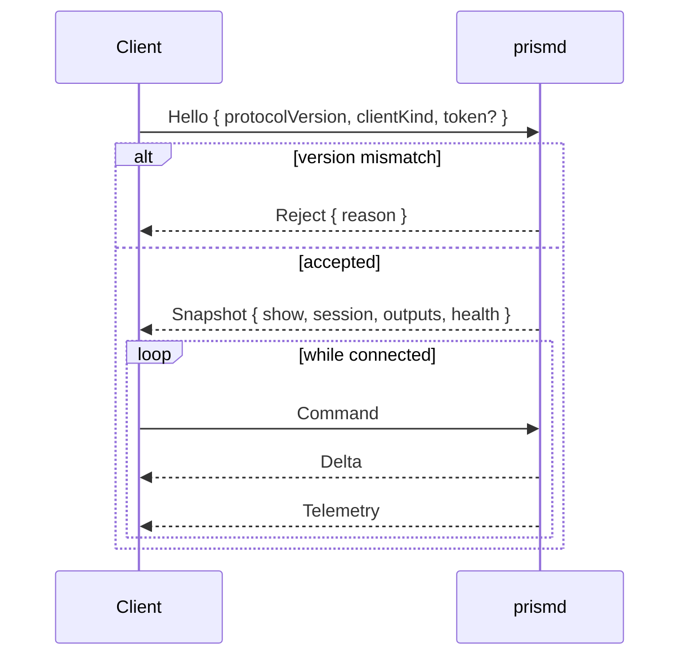

# IPC_PROTOCOL.md — Daemon ↔ Client Protocol

**Status:** specification.
**Parent document:** [`ARCHITECTURE_SPEC.md`](../ARCHITECTURE_SPEC.md) (decisions D2, D3, D11).
**Implemented by:** `prism-ipc` (framing and transport), `prismd` (server), `prism-app` and the Web Remote (clients).

---

## 1. Why there is a protocol at all

**D2** splits PrismDMX into two processes so a UI crash cannot stop DMX output. That boundary needs a wire protocol. **D3** makes the daemon the single source of truth, so the protocol is deliberately asymmetric: clients send intent, the daemon sends facts. A client never computes state it then expects the daemon to accept.

Every client is equivalent. The desktop shell, the Web Remote and the X-Touch surface controller all speak the same command vocabulary. There is no privileged client and no back door for the console — see **D11**.

---

## 2. Transports

| Transport | Used by | Rationale |
|---|---|---|
| Named pipe (Windows) / Unix domain socket (Linux, macOS) | Desktop shell on the same machine | Lowest latency, no TCP stack, no port to firewall, no accidental network exposure |
| WebSocket over `axum` | Web Remote, remote clients | Works from any browser; binds `127.0.0.1` by default |

Both transports carry identical framing and identical messages. Transport choice is not visible above `prism-ipc`.

### 2.1 Network exposure

The WebSocket listener binds to loopback unless the user explicitly enables LAN access in settings. Enabling it requires a token, which the daemon generates and the UI displays. This is a deliberate default: school networks are shared, and an unauthenticated lighting console reachable from any classroom machine is not acceptable.

### 2.2 Discovery

`prismd` writes a lock file into the user data directory containing its PID and the IPC endpoint. Clients read it to find the daemon. A stale file left by a crash is detected with a PID liveness check and replaced. This same file provides the single-instance guarantee described in `ARCHITECTURE_SPEC.md` §10.3 — two daemons driving the same output must be structurally impossible.

---

## 3. Framing

```
┌──────────────┬───────────────────────────┐
│ u32 LE length│ MessagePack payload       │
└──────────────┴───────────────────────────┘
```

- **MessagePack** (`rmp-serde`) — compact, schema-free enough to evolve, and fast to decode in both Rust and the browser.
- **Maximum frame size** is enforced on both sides. An oversized frame closes the connection rather than allocating.
- Message types are distinguished by a tagged enum inside the payload, not by a separate header byte.

---

## 4. Message types

| Message | Direction | Reliability |
|---|---|---|
| `Hello` | client → daemon | reliable, first message |
| `Snapshot` | daemon → client | reliable, response to `Hello` |
| `Command` | client → daemon | reliable, ordered — never dropped |
| `Delta` | daemon → client | reliable, ordered |
| `Telemetry` | daemon → client | **droppable**, coalesced |
| `Ack` / `Reject` | daemon → client | reliable |

### 4.1 Handshake



The `Snapshot` carries **both** the show model and the session state. This is what makes a UI restart an ordinary reconnect rather than a special case: the client asks for the world, receives it, and resumes. It is also what makes **D11** work — a view switched from the X-Touch while the UI was closed is simply part of the snapshot the UI receives when it comes back.

### 4.2 Version negotiation

`protocolVersion` is an integer incremented on any breaking change. A mismatch produces an explicit `Reject` with a human-readable reason, surfaced in the UI as "the interface and the engine are different versions". Undefined behaviour from a silent mismatch is unacceptable in software that controls a show.

---

## 5. Commands

Commands express intent. The daemon validates, applies, journals for Oops where applicable, and broadcasts the resulting delta. A command that cannot be applied yields `Reject` and changes nothing.

```typescript
type Command =
  // ---- Show and light ----
  | { t: "SelectFixtures"; ids: FixtureId[]; mode: "Set" | "Add" | "Toggle" }
  | { t: "SetAttribute"; attribute: AttributeType; value: number; relative: boolean }
  | { t: "ApplyPreset"; presetId: PresetId }
  | { t: "ClearProgrammer" }
  | { t: "StoreCue"; sequenceId: SequenceId; cueNumber: string }
  | { t: "ExecutorGo"; executorId: ExecutorId; direction: "Next" | "Prev" }
  | { t: "ExecutorOff"; executorId: ExecutorId }
  | { t: "SetExecutorMaster"; executorId: ExecutorId; level: number }
  | { t: "PatchFixture"; /* … */ }
  | { t: "Oops" } | { t: "Redo" } | { t: "SaveShow" }
  // ---- Session and interface (D11) — issued by console and UI alike ----
  | { t: "SelectView"; viewId: number }
  | { t: "StoreView"; viewId: number; name: string }
  | { t: "OpenWindow"; window: WindowType; params?: Record<string, unknown> }
  | { t: "CloseWindow"; instanceId: number }
  | { t: "FocusWindow"; instanceId: number }
  | { t: "SetExecutorPage"; page: number }
  | { t: "SelectExecutor"; executorId: ExecutorId }
  | { t: "SetEncoderBank"; group: FeatureGroup }
  | { t: "SetProgrammerPage"; page: number }
  | { t: "SelectProgrammerParam"; direction: "Prev" | "Next" }
  | { t: "CommandLineInput"; text: string };
```

The second group is the concrete form of **D11**. The console and the UI draw on one vocabulary; there is no separate surface command set to keep in sync.

### 5.1 Latency path

Commands originating at the X-Touch do **not** traverse this protocol on their way to the engine — the surface controller runs inside `prismd` and pushes straight into the engine's SPSC queue. The protocol carries the resulting deltas outward to clients. The measured budget is in `ARCHITECTURE_SPEC.md` §4.3.

---

## 6. Deltas

A `Delta` describes a change already applied. Clients apply deltas to their mirror without validation — the daemon has already decided.

```typescript
type Delta =
  | { t: "ShowPatch"; ops: JsonPatchOp[] }        // patch, sequences, presets, groups
  | { t: "SessionPatch"; ops: JsonPatchOp[] }     // views, windows, pages, selection
  | { t: "ProgrammerChanged"; state: ProgrammerState }
  | { t: "ExecutorState"; executorId: ExecutorId; isActive: boolean; cueIndex: number | null }
  | { t: "OutputHealth"; outputId: OutputId; health: OutputHealth }
  | { t: "DirtyFlag"; unsavedChanges: boolean }   // drives the X-Touch Save LED
  | { t: "Notice"; level: "Info" | "Warn" | "Error"; message: string };
```

Deltas are ordered per connection. A client that has applied every delta since its snapshot holds state identical to the daemon's.

---

## 7. Telemetry

Telemetry is separate from the control channel because it is high-rate, lossy by nature and must never delay a command.

| Property | Value |
|---|---|
| Rate | 25–30 Hz, independent of the 44 Hz engine tick |
| Content | DMX output levels, programmer values, executor fader positions, meters, tick health |
| Encoding | Binary, fixed layout — not MessagePack maps |
| Loss policy | Coalesced per client; **dropped** when a client cannot keep up |

**Clients must not put telemetry into reactive state.** In the React UI it is written to refs and rendered on `<canvas>`. 64 universes × 512 channels at 30 Hz through React state would make the interface unusable — this is the reason the second channel exists at all, and it is a rendering concern, not a change to where authority lives.

---

## 8. Backpressure and failure

| Situation | Behaviour |
|---|---|
| Client is slow | Telemetry is coalesced then dropped. Control messages are **never** dropped; if the control queue for a client fills, that client is disconnected with a `Reject` and must reconnect and re-snapshot |
| Client disconnects | The daemon frees its state and carries on. Nothing about the show changes. Sessions are not owned by clients |
| Daemon is unreachable at startup | The shell spawns one (per **D9**) or reports that the engine is not running, without pretending to be connected |
| Daemon dies | Clients show a clear disconnected state and retry with backoff. On reconnect, a fresh `Snapshot` resynchronises everything |
| Protocol version mismatch | Explicit `Reject`, surfaced in the UI |

A client is never a dependency of the engine. Disconnecting every client leaves DMX output completely unaffected — that is the property **D2** exists to provide, and §9 tests it directly.

---

## 9. Testing

| Test | Method |
|---|---|
| Framing round trip | Property test over arbitrary messages: encode → decode → equal |
| Oversized frame | Assert connection closes without a large allocation |
| Handshake | Version match, mismatch, and missing token on a LAN-bound listener |
| Snapshot completeness | Apply a random command sequence, then assert a fresh client's snapshot equals the state reached by an existing client's accumulated deltas |
| **IPC resilience (D2 gate)** | Start the daemon with a mock output, connect a client, kill it mid-show, reconnect — assert the output frame sequence has **no gap** across the whole run |
| **Surface → UI (D11 gate)** | Drive `SelectView` and `OpenWindow` from a mock MIDI source with **no client connected**; connect afterwards and assert both appear in the snapshot |
| Backpressure | Attach a deliberately slow client; assert telemetry is dropped, commands are not, and other clients are unaffected |
| Transport parity | Run the full suite over both named pipe / UDS and WebSocket; results must be identical |
