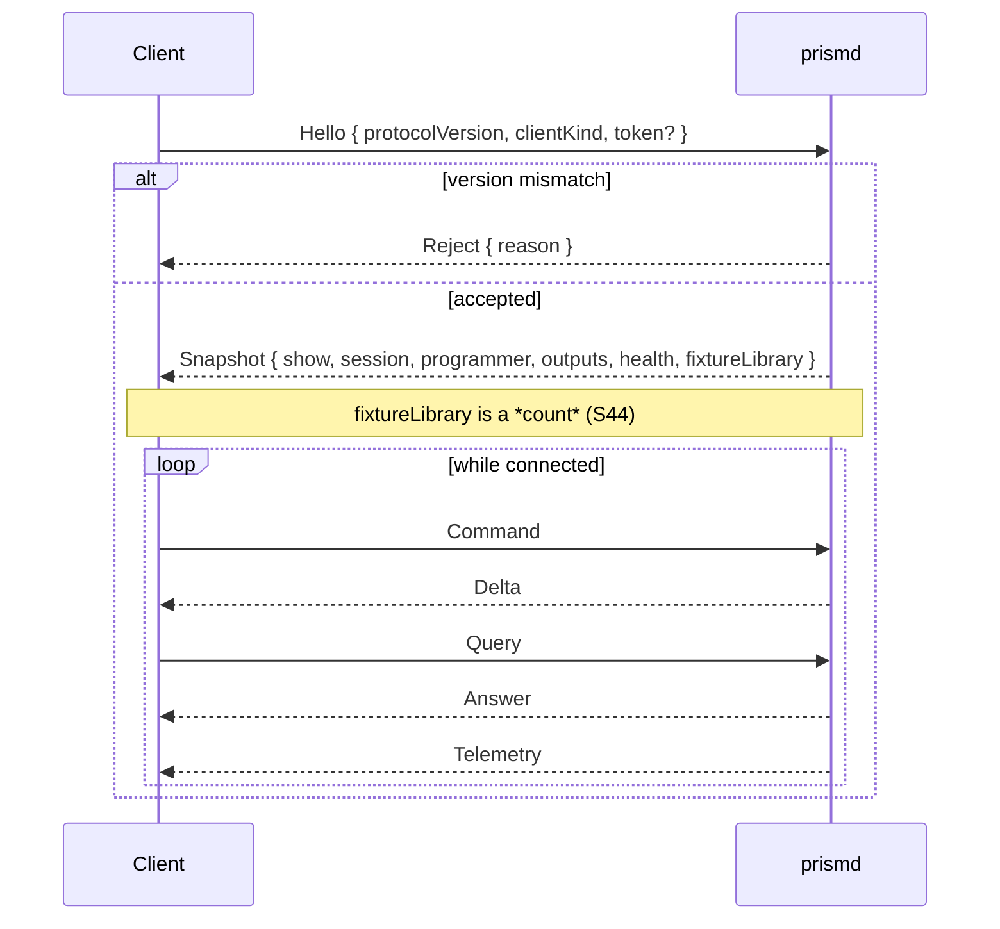

# IPC_PROTOCOL.md — Daemon ↔ Client Protocol

**Status:** specification.
**Parent document:** [`ARCHITECTURE_SPEC.md`](../ARCHITECTURE_SPEC.md) (decisions D2, D3, D11).
**Implemented by:** `prism-ipc` (framing and transport), `prismd` (server), `prism-app` and the Web Remote (clients).

---

## 1. Why there is a protocol at all

**D2** splits PrismDMX into two processes so a UI crash cannot stop DMX output. That boundary needs a wire protocol. **D3** makes the daemon the single source of truth, so the protocol is deliberately asymmetric: clients send intent, the daemon sends facts. A client never computes state it then expects the daemon to accept.

Every client is equivalent. The desktop shell, the Web Remote and the X-Touch surface controller all speak the same command vocabulary. There is no privileged client and no back door for the console — see **D11**.

---

## 2. Transports

| Transport | Used by | Rationale |
|---|---|---|
| Named pipe (Windows) / Unix domain socket (Linux, macOS) | Desktop shell on the same machine | Lowest latency, no TCP stack, no port to firewall, no accidental network exposure |
| WebSocket over `axum` | Web Remote, remote clients | Works from any browser; binds `127.0.0.1` by default |

Both transports carry identical **payloads** and identical messages. Transport choice is not visible above `prism-ipc` — every transport produces a `Wire`, which is a duplex of byte payloads, and the server, the client, the handshake and the backpressure policy are one code path above it.

The length prefix of §3 belongs to the byte-stream transports. A WebSocket binary message already carries its own length, and a second copy of the same number inside it would be two lengths that can disagree. What both transports share is the **limit**: `MAX_FRAME_BYTES` is checked against the length prefix on a stream, and given to the WebSocket implementation as `max_message_size` on a WebSocket — in both cases before a buffer for the body exists. *(S16)*

### 2.1 Network exposure

The WebSocket listener binds to loopback unless the user explicitly enables LAN access in settings. Enabling it requires a token, which the daemon generates and the UI displays. This is a deliberate default: school networks are shared, and an unauthenticated lighting console reachable from any classroom machine is not acceptable.

### 2.2 Discovery

`prismd` writes a lock file into the user data directory containing its PID and the IPC endpoint. Clients read it to find the daemon. A stale file left by a crash is detected and replaced. This same file provides the single-instance guarantee described in `ARCHITECTURE_SPEC.md` §10.3 — two daemons driving the same output must be structurally impossible.

**As built (S17).** `prismd.lock` is the document: `{ pid, local?, websocket?, token? }`, as JSON, rewritten whenever a listener binds — so an endpoint in it is one that already exists. Beside it is `prismd.guard`, an empty file the daemon holds an advisory lock on for its whole life; that lock is the single-instance guarantee and the staleness check at once, because the operating system releases it when the process ends, killed or not. The two are separate files because an exclusive lock on Windows would stop clients reading the document. `ARCHITECTURE_SPEC.md` §10.3 has the rest of the reasoning, including why the process id is reported rather than believed.

The local endpoint is `prism_ipc::local::daemon_address(label)`, where the label is derived from the data directory — so two user accounts on one machine do not ask for the same pipe name, and a client that knows the directory can work out the address without reading anything. Reading the file is still the way to do it: that is what makes discovery one file rather than two programs agreeing about a hash.

---

## 3. Framing

```
┌──────────────┬───────────────────────────┐
│ u32 LE length│ MessagePack payload       │
└──────────────┴───────────────────────────┘
```

- **MessagePack** (`rmp-serde`) — compact, schema-free enough to evolve, and fast to decode in both Rust and the browser. Written with `to_vec_named`: `Command` and `Delta` are internally tagged, and the compact array encoding of a struct has nowhere to put the tag *(S1)*.
- **Maximum frame size** is enforced on both sides, and it is 1 MiB. An oversized frame closes the connection rather than allocating: the length is checked before a body buffer exists, which is a claim about memory and is measured as one *(S16, `crates/prism-ipc/tests/oversized_frame.rs`)*.
- **Maximum nesting depth** is enforced on decode, and it is 128 levels — the same limit `serde_json` applies, against the same attack. `JsonValue` is recursive and MessagePack has no limit of its own, so a payload of a few kilobytes can nest a hundred thousand deep; a stack overflow is not recoverable in Rust and would take the DMX output with it. The depth is established by walking the payload with an explicit stack **before** `serde` sees it, because the recursion to be stopped happens inside serde's own buffering of an internally tagged enum *(S1 finding, S16 implementation)*.
- Message types are distinguished by a tagged enum inside the payload, not by a separate header byte.
- **Serialisation is fallible.** A non-finite `f64` is refused in both directions *(S1)*, so a message that cannot be encoded is reported rather than emitted.

---

## 4. Message types

| Message | Direction | Reliability |
|---|---|---|
| `Hello` | client → daemon | reliable, first message |
| `Snapshot` | daemon → client | reliable, response to `Hello` |
| `Command` | client → daemon | reliable, ordered — never dropped |
| `Query` | client → daemon | reliable, ordered, **changes nothing** |
| `Delta` | daemon → client | reliable, ordered |
| `Answer` | daemon → client | reliable, to the one client that asked |
| `Telemetry` | daemon → client | **droppable**, coalesced |
| `Ack` / `Reject` | daemon → client | reliable |

There are two envelopes, not one: `ClientMessage` carries `Hello` and `Command`, `ServerMessage` carries the rest. A type that could carry either would let a client send a `Delta`, and **D3** says it cannot *(S16)*.

A `Command` carries a `seq`, and `Ack` and `Reject` echo it. The daemon stores that number and never interprets it; it exists because with several commands in flight — the normal case for a fader bank — an unaddressed rejection tells a client only that *something* failed *(S16)*. A `Query` shares that numbering and `Answer` echoes it, because both travel on the one ordered channel and two numberings would let an answer and an acknowledgement collide *(S27)*.

### 4.1 Handshake



The `Snapshot` carries **three** documents: the show model, the session state and the programmer. This is what makes a UI restart an ordinary reconnect rather than a special case: the client asks for the world, receives it, and resumes. It is also what makes **D11** work — a view switched from the X-Touch while the UI was closed is simply part of the snapshot the UI receives when it comes back.

> **The programmer is the third document, and it was added in S16.** S13 found the gap: the programmer is a model of its own with a delta of its own, so a client connecting mid-programming would have seen an empty one. It could have been closed by sending a `ProgrammerChanged` immediately after the snapshot. It is closed in the snapshot instead, because §9's *snapshot completeness* row — a fresh client's snapshot equals the state an existing client reached by accumulating deltas — is false for the programmer under the other reading. The world arrives in one message, or that criterion has to be rewritten.

The show and the session travel as **documents** rather than as models, because `ShowPatch` and `SessionPatch` are RFC 6902 operations and an operation is only meaningful against a document root. `prism_core::ShowMirror` and `SessionMirror` apply them to exactly these two values.

> **The snapshot carries `fixtureLibrary` as a number** *(S27, changed in S44)*. It is how many profiles **this desk** can embed — `prism_core::library` — and it is a property of the build rather than of the show: a show that has embedded one of them owns its copy from then on (§5's `EmbedFixtureType`, and the embedding rule on `Command::PatchFixture`).
>
> S27 carried the whole list here, which was right for the four built-in profiles and impossible for the two thousand S44 brought: the Open Fixture Library is 634 fixtures across 2 798 modes, which is several megabytes and would not fit in the 1 MiB frame §3 defines — and a menu of two thousand entries is not a menu. So the list is **searched** (§5.2's `SearchLibrary`) and this field is only what a client needs in order to say *2 157 profiles* beside the box. Zero is an ordinary state: it means no library is installed and the built-in profiles are all that is offered, which the daemon logs on the way up.

### 4.2 Version negotiation

`protocolVersion` is an integer incremented on any breaking change. A mismatch produces an explicit `Reject` with a human-readable reason, surfaced in the UI as "the interface and the engine are different versions". Undefined behaviour from a silent mismatch is unacceptable in software that controls a show.

---

## 5. Commands

Commands express intent. The daemon validates, applies, journals for Oops where applicable, and broadcasts the resulting delta. A command that cannot be applied yields `Reject` and changes nothing.

```typescript
type Command =
  // ---- Show and light ----
  | { t: "SelectFixtures"; ids: FixtureId[]; mode: "Set" | "Add" | "Toggle" }
  | { t: "SetAttribute"; attribute: AttributeType; value: number; relative: boolean }
  | { t: "ApplyPreset"; presetId: PresetId }
  | { t: "ClearProgrammer" }
  | { t: "StoreCue"; sequenceId: SequenceId; cueNumber: string; mode: StoreMode }
  | { t: "StorePreset"; presetId: PresetId; pool: FeatureGroup; name: string; color: RgbColor | null; mode: StoreMode }
  | { t: "StoreSequence"; sequenceId: SequenceId; mode: SequenceStoreMode }
  | { t: "EditCue"; sequenceId: SequenceId; cueNumber: string }
  | { t: "Update" }
  | { t: "CreateSequence"; sequenceId: SequenceId; name: string }
  | { t: "SetCueProperty"; sequenceId: SequenceId; cueNumber: string; property: CueProperty }
  | { t: "DeleteCue"; sequenceId: SequenceId; cueNumber: string }
  | { t: "AssignExecutor"; executorId: ExecutorId; sequenceId: SequenceId | null }
  | { t: "ExecutorGo"; executorId: ExecutorId; direction: "Next" | "Prev" }
  | { t: "ExecutorOff"; executorId: ExecutorId }
  | { t: "ExecutorButton"; executorId: ExecutorId; button: ExecutorButtonRef; pressed: boolean }
  | { t: "SetExecutorMaster"; executorId: ExecutorId; level: number }
  | { t: "PatchFixture"; /* … */ }
  | { t: "UnpatchFixture"; id: FixtureId }
  | { t: "RenumberFixture"; id: FixtureId; to: FixtureId }
  | { t: "EmbedFixtureType"; typeId: string }
  | { t: "Oops" } | { t: "Redo" } | { t: "SaveShow" }
  // ---- Session and interface (D11) — issued by console and UI alike ----
  | { t: "SelectView"; viewId: number }
  | { t: "StoreView"; viewId: number; name: string }
  | { t: "RenameView"; viewId: number; name: string }
  | { t: "DeleteView"; viewId: number }
  | { t: "MoveView"; viewId: number; direction: "Prev" | "Next" }
  | { t: "OpenWindow"; window: WindowType; params?: Record<string, unknown> }
  | { t: "CloseWindow"; instanceId: number }
  | { t: "FocusWindow"; instanceId: number }
  | { t: "PlaceWindow"; instanceId: number; x: number; y: number; w: number; h: number }
  | { t: "SetExecutorPage"; page: number }
  | { t: "SelectExecutor"; executorId: ExecutorId }
  | { t: "SelectSequence"; sequenceId: SequenceId }
  | { t: "SetEncoderBank"; group: FeatureGroup }
  | { t: "SetProgrammerPage"; page: number }
  | { t: "SelectProgrammerParam"; direction: "Prev" | "Next" }
  | { t: "CommandLineInput"; text: string };
```

The second group is the concrete form of **D11**. The console and the UI draw on one vocabulary; there is no separate surface command set to keep in sync.

> **Three commands the patch needed** *(S27)*. `PatchFixture` alone can only ever *add* to a rig, so a patch nobody could correct was the state the interface was in until S27. `UnpatchFixture` takes one out, and does **not** cascade into groups, presets or cues — a show outlives the rig it was written on (S11), and `Show::issues` reports what now dangles rather than deleting an operator's stored looks. `RenumberFixture` is one command and not an unpatch plus a patch, because the number is the key the patch is filed under: doing it in two steps leaves the rig without that fixture in between, and leaves it deleted if the second step is refused. `EmbedFixtureType` carries **a key and nothing else**, resolved by the daemon against `prism_core::library` — the same rule `PatchFixture` follows in carrying no channels, since a client that sent a whole `FixtureType` would be authoring show content for the daemon to validate. Without it a brand-new show, which carries no profiles at all, could not be patched from an interface.

> **Five commands a show needed** *(S28)*. Before them the protocol could store a cue and apply a preset, and nothing else about a show could be written from an interface: there was no way to make a sequence to store into, no way to put one on an executor so it could be fired, no way to correct a cue that had been stored, and no way to make a preset for `ApplyPreset` to apply. So a show could only ever be written by hand, in a file, somewhere else.
>
> `CreateSequence` makes an **empty** cue list and is refused when the number is taken — a *create* that replaced a running cue list would empty a playback that is on stage. It is deliberately not S39's `StoreSequence`, which is a different act with a mode on it: that one stores the *programmer* into a sequence.
>
> `SetCueProperty` carries **one field** (`CueProperty`: number, name, fade in, fade out, delay, trigger). The alternative — one command carrying every editable field — makes a client read the cue, change one member and send the rest back, which is a read-modify-write over state the daemon owns; two operators editing two different columns would then each undo the other. What a cue *sets* is not among the fields, for the reason `PatchFixture` carries no channels: values come from the programmer.
>
> `DeleteCue` does not renumber what is left. A cue number is what an operator has written on a running order and what a Goto names.
>
> `AssignExecutor` puts a sequence on a slot, or takes one off. An empty slot gains an executor with **the desk's defaults** — the three button functions the protocol can actually press and a master at full — because what a fader and four buttons do is show content, and a client that chose it would be authoring the show. Taking the sequence off keeps everything else the slot has.
>
> `StorePreset` is `StoreCue`'s mirror, with two differences that both come from the type: it carries a name and a colour, so a store with an **empty programmer** onto a preset that exists is an ordinary relabel (and onto one that does not exist it is refused, because an empty preset applies nothing); and which values go in depends on the `pool`, since a colour preset takes the colour values and the bank an attribute is filed under is the *profile's* answer rather than the attribute name's.
>
> **None of the five carried a store mode**, and that was S28's one deliberate omission: `prism_core::Programmer` merged unconditionally, and a client carrying a mode the daemon did not honour would have been describing an outcome that did not happen. What S28 did instead was *say so first* — see `Query::StorePreview` in §5.2. **S39 built the other two modes and put the mode on the commands**, which is the paragraph below.

> **The store modes, and the four commands S39 added** *(S39)*. `StoreMode` has three values and the **operator** chooses one, so it travels in the command and the daemon never guesses — and the outcome no longer depends on which client sent it.
>
> ```typescript
> type StoreMode = "Merge" | "Override" | "Remove";
> type SequenceStoreMode = "Append" | "Override" | "Merge";
> ```
>
> Against a cue: `Merge` writes the programmer's values in and leaves everything else standing; `Override` makes the cue's parts **exactly** the programmer's, so what it does not mention is gone; `Remove` takes the programmer's values **out** and does not use their levels at all. A cue keeps its name, its times and its trigger under all three — a store is about the look, and a cue's name is `SetCueProperty`'s. A `Remove` against a cue that is not there, or one that would remove nothing, is **refused**: a store that writes nothing and removes nothing is one an operator would press twice. A `Remove` that empties a cue leaves an **empty cue**, because deleting one is `DeleteCue`'s job and a store that took a number off a running order as a side effect would be a surprise. `StorePreset` carries the same three, and it has to: §5.2's preview can be asked about a preset in any of them, and an answer describing an outcome no command can produce is exactly what S28 refused to ship.
>
> **`StoreSequence` is a different act** and therefore a different command: it names a cue *list* and not a cue. `Append` adds a cue at **one past the highest whole number** the list has, so pressing it repeatedly gives `1`, `2`, `3`; `Override` makes the sequence *be* this look — one cue, numbered `1`, and the list that was there is gone; `Merge` writes the look into **every** cue, which is the cue-level Merge one level up. A `Merge` into a cue list with no cues is refused rather than quietly appending, because appending would be a different command than the one that was sent. It is deliberately **not** `CreateSequence`, which makes an empty list and stores nothing. There is no preview for it: §5.2's counts are about the values of one cue, and a sequence store is about cues — an honest answer needs a different shape, and the interface that needs one is S40's.
>
> **`EditCue` loads a stored cue back into the programmer, with every `presetRef` kept.** A load that took the values and dropped the links would break every preset link in the cue the next time it was stored, and it would break it *invisibly*: nothing looks different until somebody edits the preset and the cue does not follow. The values arrive as `ProgrammerValueSource::Recalled`, which is what that variant has been for since S1, and the cue's fixtures become the selection so an encoder reaches them.
>
> **`Update` carries nothing at all**, because everything it needs is the desk's: `Session::editingCue` says which cue, and the mode is `Override` by definition — an Update that merged could never take a value *out* of the cue it is updating, which is why an operator loads one. It is refused when nothing is loaded, and it is a **show edit**, so §6.1 makes it undoable however playback-shaped the key on the desk looks. A cue loaded with `EditCue` and updated with nothing changed is byte-identical to the cue that was loaded.
>
> **`SelectSequence` is the sixteenth session command**, and the one of the four §4.4 gained since S12 that a console *can* issue — `Sequence 5` on the command line. `ARCHITECTURE_SPEC.md` §4.1 has why it exists at all.

> **One command presses an executor's button** *(S34)*. `ExecutorButton` carries *which button*, never what it means:
>
> ```typescript
> type ExecutorButtonRef =
>   | { t: "Slot"; index: number }                         // a hardware position
>   | { t: "Function"; function: ExecutorButtonFunction };  // a profile's own row
> ```
>
> `prism_core::Show::apply` resolves it against that executor's `buttonFunctions`, which is **show data**, and it is the only place `isActive` is read to decide what a `Toggle` comes out as. A client that resolved one for itself would race a second client doing the same, and the daemon would be told to do something nobody pressed. `pressed` exists for `Flash`, which is momentary: the release is half the gesture, and every other function ignores it.
>
> Before it, three of the eight `ExecutorButtonFunction` values had commands and five did not. `docs/MCU_MAPPING.md` §4.2.1 records the whole history — S22 found the gap in the binding table, S26 met it again in the executor bar and drew four keys disabled with the reason on them, and this closed all three of §4.1's unresolved rows at once.
>
> **`SetExecutorMaster` did not change and its meaning did.** It is still one command for a fader, and since S34 the daemon routes it through the executor's own `faderFunction`: `Master` moves the master, `Speed` moves the speed master (`docs/DMX_MERGE.md` §4.1), `XFade` drives a manual crossfade and carries no show state at all, and `Empty` does nothing. `ARCHITECTURE_SPEC.md` §6 has said what a fader does is the executor's setting since S1; this is the daemon reading it.

> **`PlaceWindow` is twelfth and is not in `ARCHITECTURE_SPEC.md` §4.4** *(S25)*. §4.4 lists what the *console* issues, and an X-Touch opens and closes windows without ever dragging one. But §4.1 puts `x`, `y`, `w` and `h` in the session, so a window moved on one screen has to move on every other one — and a client that kept the geometry to itself would be holding session state locally, which is precisely what **D11** exists to prevent. The gap was found when the canvas was built and there was no honest way to drag a window; the four coordinates are canvas units and are rejected as NaN or infinity in both directions, like every other `f64` in the domain.

> **Three commands a view library needed** *(S35)*. Until S35 a view could be stored and selected and nothing else: no rename, no delete, and no way to put views in the order an operator wants to step through. All three are session commands that `ARCHITECTURE_SPEC.md` §4.4 does not list, for `PlaceWindow`'s reason — §4.4 is what a *console* issues, and an X-Touch cannot type a name — while §4.1 puts the view library in the session, so a client that reordered views locally would be holding session state.
>
> **`MoveView` exchanges the two views' numbers**, and that is a decision rather than an implementation detail. A view library carries its order either in the numbers or in an ordering beside them; the second gives two things that can disagree, and the disagreement an operator would meet is `Channel ◀▶` stepping to a view other than the one drawn next. Since `views` is keyed by number, the bar draws in number order and `SelectView` names a number, making the number *be* the order leaves nothing to keep in step. The price, paid deliberately: after a move `SelectView 3` names a different layout, and an F-key bound to a view number follows the **place** rather than the layout that used to be there — which is how a console's page numbers behave.
>
> **`DeleteView` refuses the last view** (`SessionError::LastView`): `activeViewId` names a view from the first moment and `ShowStore` refuses a file whose active view is not stored, so a session with no views could satisfy neither. Deleting the **active** view is allowed, and what the canvas then shows is the *daemon's*: it selects the neighbour before it, or the one after it when there is none, exactly as `SelectView` would have. A client does not choose a successor, so two screens cannot choose differently.

### 5.1 Latency path

Commands originating at the X-Touch do **not** traverse this protocol on their way to the engine — the surface controller runs inside `prismd` and pushes straight into the engine's SPSC queue. The protocol carries the resulting deltas outward to clients. The measured budget is in `ARCHITECTURE_SPEC.md` §4.3.

### 5.2 Queries — the third shape *(S27)*

A command expresses intent and a delta describes a change that has already
happened. Neither can answer *what would happen if*, and S27 needed exactly
that: **an address conflict has to be shown before it is committed**, not
reported afterwards beside a patch that has already moved.

```typescript
type Query =
  | { t: "PatchConflicts" }
  | { t: "PatchPreview"; id: FixtureId; typeId: string; universe: UniverseId; address: number }
  | { t: "SearchLibrary"; text: string; limit: number }
  | { t: "StorePreview"; target: StoreTarget; mode: StoreMode };

type StoreTarget =
  | { t: "Cue"; sequenceId: SequenceId; cueNumber: string }
  | { t: "Preset"; presetId: PresetId; pool: FeatureGroup };

type Answer =
  | { t: "PatchConflicts"; conflicts: PatchConflict[] }
  | { t: "PatchPreview"; preview: PatchPreview }
  | { t: "LibraryMatches"; matches: LibraryEntry[]; total: number }
  | { t: "StorePreview"; preview: StorePreview };

interface StorePreview {
  accepted: boolean; refusal: string | null;
  exists: boolean;  name: string;        // what is filed there now
  mode: StoreMode;                        // echoed back from the question (S39)
  added: number; replaced: number; kept: number; removed: number;
}
```

> **`SearchLibrary` is the variant that made the mechanism necessary** *(S44)*. `PatchPreview` could conceivably have been a client's own arithmetic, wrongly; the fixture library could not be sent at all. The desk knows some two thousand profiles, an answer has to fit in a frame, and a `LibraryEntry` is deliberately not a `FixtureType` — a key, a manufacturer, a name, a mode and a footprint, which is what a menu row shows. The profile itself never leaves the daemon: `Command::EmbedFixtureType` names the one that was chosen by its key, and the daemon copies it into the show. The `limit` a client asks for is **clamped by the daemon**, because a client that asked for two thousand would otherwise get an answer no frame can carry.

> **`StorePreview` is the variant S28 needed** *(S28)*. The exit criterion was *a store that would overwrite says what it will do **before** it does it, even where the only mode available is Merge* — which is `PatchPreview`'s shape one gesture along, and for the same reason: a store that reported afterwards would have reported it by *doing* it, on a show somebody is about to run.
>
> Four of the fields are the counts, and they account for **every value on both sides** whichever mode was asked about. Writing *S* for what is filed there now and *I* for what the programmer would bring:
>
> | Mode | `added` | `replaced` | `kept` | `removed` |
> |---|---|---|---|---|
> | `Merge` | I∖S | I∩S | S∖I | 0 |
> | `Override` | I∖S | I∩S | 0 | S∖I |
> | `Remove` | 0 | 0 | S∖I | I∩S |
>
> so `kept + replaced + removed` is what is filed there now, and what the store leaves behind is `added + replaced + kept`. The one number an operator is really reading is whichever of `kept` and `removed` is not zero: they are the same values, named by what the chosen mode does to them. `removed` arrived in **S39** and is zero under Merge, which is why S28 could ship without it.
>
> **The mode is asked rather than answered, since S39.** S28 put it on the *answer*, because `prism_core::Programmer` was what decided it and an interface that had spelled `"Merge"` itself would have gone on looking right and been wrong. Now the operator chooses, the choice travels in the question, and the answer **echoes it** — so a bar drawing an answer beside a chooser that has since moved cannot describe the wrong one. A client still renders the word it is given rather than the word it sent.
>
> It takes its refusal from the **same** builders the store runs (`Programmer::cue`, `Programmer::preset`), so a preview and the store after it cannot disagree — the rule `PatchPreview` and `check_patch` already share.

Four rules, and the first three are what make it safe to ask one on a desk that
is running a show:

- **A query changes nothing.** There is no refusal shape and no journal entry,
  and `crates/prismd/tests/ui_patch.rs` asserts on a recording that every query
  step broadcast no delta at all and left the patch exactly as the step before
  it did.
- **The answer goes to the client that asked**, addressed by the query's `seq`.
  It is deliberately not a `Delta`: a delta is broadcast, and what one operator
  is typing into a form is nobody else's business (`ARCHITECTURE_SPEC.md` §4.2).
- **There is no `Query::Show`.** The show and the session arrive as documents and
  are kept current by deltas; a question that returned a second copy of state a
  client already mirrors would be a second path to the same fact. Every variant
  answers something **derived** that no client may derive for itself.
- **The alternatives were both worse.** A client that intersected the address
  spans itself would be a second opinion about something `prism_core::conflict`
  already decides — the duplication **D3** exists to prevent. A command that
  patched and then offered an undo would show the operator the conflict by
  *making* it, on a rig that is on stage.

---

## 6. Deltas

A `Delta` describes a change already applied. Clients apply deltas to their mirror without validation — the daemon has already decided.

```typescript
type Delta =
  | { t: "ShowPatch"; ops: JsonPatchOp[] }        // patch, sequences, presets, groups
  | { t: "SessionPatch"; ops: JsonPatchOp[] }     // views, windows, pages, selection
  | { t: "ProgrammerChanged"; state: ProgrammerState }
  | { t: "ExecutorState"; executorId: ExecutorId; isActive: boolean; cueIndex: number | null }
  | { t: "OutputHealth"; outputId: OutputId; health: OutputHealth }
  | { t: "DirtyFlag"; unsavedChanges: boolean }   // drives the X-Touch Save LED
  | { t: "Notice"; level: "Info" | "Warn" | "Error"; message: string };
```

Deltas are ordered per connection. A client that has applied every delta since its snapshot holds state identical to the daemon's.

> **`ExecutorState` is the tick's, and only the tick's** *(S34)*. `isActive` and `cueIndex` are what `prism_engine::PlaybackReport` published on the last tick, sampled by the daemon at 25 ms and broadcast **only when one of them has changed**. Two things follow.
>
> It **does not arrive with the command that caused it**: an `ExecutorGo` is acknowledged with no delta at all, and the state follows a fraction of a second later. That is deliberate — until S34 the daemon wrote `isActive` on the way past because nothing else could, and with a readback that becomes two authors racing, whose symptom is a strip that lights, goes dark and lights again. `ARCHITECTURE_SPEC.md` §3.1.1 has the rest.
>
> And it is **silent while a fade runs**. A cue index changes when a cue changes, not when a level does, so this delta does not move at playback rates — which matters because it moves the show *document*, and a client that re-asks a question on every show change (`Query::StorePreview`, §5.2) would otherwise be asking it per frame.

---

## 7. Telemetry

Telemetry is separate from the control channel because it is high-rate, lossy by nature and must never delay a command.

| Property | Value |
|---|---|
| Rate | 25–30 Hz, independent of the 44 Hz engine tick |
| Content | DMX output levels, programmer values, executor fader positions, meters, tick health |
| Encoding | Binary, fixed layout — not MessagePack maps |
| Loss policy | Coalesced per client; **dropped** when a client cannot keep up |

**The envelope is MessagePack and the content is not.** A telemetry frame travels as `ServerMessage::Telemetry { data }`, where `data` is a MessagePack *byte string* holding a fixed-layout binary frame. Both sentences above hold: the envelope is the one tagged enum §3 asks for, and the payload is not a MessagePack map. The alternative — a channel discriminator in the framing — is what §3 rules out. The cost is about ten bytes per frame *(S16)*.

The layout is a 16-byte header (`"PTLM"`, layout version, one reserved byte, universe count, sequence number, little-endian) followed by one 514-byte section per universe (number, then 512 levels). A frame announcing a layout version this build does not know is **dropped**, not guessed at — which telemetry can afford, being droppable by definition. What is measured beside the levels is S17's to decide; the channel and its room to grow are S16's.

**Clients must not put telemetry into reactive state.** In the React UI it is written to refs and rendered on `<canvas>`. 64 universes × 512 channels at 30 Hz through React state would make the interface unusable — this is the reason the second channel exists at all, and it is a rendering concern, not a change to where authority lives.

---

## 8. Backpressure and failure

| Situation | Behaviour |
|---|---|
| Client is slow | Telemetry is coalesced then dropped. Control messages are **never** dropped; if the control queue for a client fills, that client is disconnected with a `Reject` and must reconnect and re-snapshot |
| Client disconnects | The daemon frees its state and carries on. Nothing about the show changes. Sessions are not owned by clients |
| Daemon is unreachable at startup | The shell spawns one (per **D9**) or reports that the engine is not running, without pretending to be connected |
| Daemon dies | Clients show a clear disconnected state and retry with backoff. On reconnect, a fresh `Snapshot` resynchronises everything |
| Protocol version mismatch | Explicit `Reject`, surfaced in the UI |

A client is never a dependency of the engine. Disconnecting every client leaves DMX output completely unaffected — that is the property **D2** exists to provide, and §9 tests it directly.

**The `Reject` that ends a connection is best-effort; the disconnection is not.** The commonest reason to send one is the first row of that table — the client's control queue filled because it stopped reading — and a client that has stopped reading is exactly the client that cannot be told why. The daemon waits `ServerConfig::goodbye` (one second by default) for the message to reach the socket and then closes regardless, because the alternative is holding a connection it has already given up on for as long as the process lives *(S16)*.

**A message the daemon cannot decode is not a disconnection.** If the framing delivered a whole payload and it was not a message this version understands, the frame boundary is intact: the client is answered with `Reject { reason: Undecodable }` and the connection carries on. Only a fault that loses the frame boundary — an oversized frame — ends it. The distinction matters because the first case is reachable by an honest client of the wrong version, and disconnecting it would hide the reason *(S16)*.

---

## 9. Testing

| Test | Method |
|---|---|
| Framing round trip | Property test over arbitrary messages: encode → decode → equal *(S16: `tests/framing.rs`, through the whole frame, reading the length back out of the header)* |
| Oversized frame | Assert connection closes without a large allocation *(S16: `tests/oversized_frame.rs` counts what the allocator was asked for; the functional assertion passes for the wrong implementation too)* |
| Nesting depth | Assert a payload nested past 128 levels is refused **before** it is deserialised, and that one at 128 is not *(S16)* |
| Handshake | Version match, mismatch, and missing token on a LAN-bound listener *(S16 through a duplex; S18 against a running daemon over the local transport, both directions of mismatch, asserting the refusal names both versions)* |
| Snapshot completeness | Apply a random command sequence, then assert a fresh client's snapshot equals the state reached by an existing client's accumulated deltas *(S18: `crates/prismd/tests/resilience.rs`, all three documents, with the first client **killed** in between — so it is also the reconnect half of the D2 gate)* |
| **IPC resilience (D2 gate)** | Start the daemon with a mock output, connect a client, kill it mid-show, reconnect — assert the output frame sequence has **no gap** across the whole run *(S18: "no gap" is two claims — no silence longer than 250 ms between consecutive frames for a universe, and the look never changing by itself once it is up. Either on its own passes for a daemon that is broken in the other way)* |
| **Surface → UI (D11 gate)** | Drive `SelectView` and `OpenWindow` from a mock MIDI source with **no client connected**; connect afterwards and assert both appear in the snapshot *(S22: `crates/prismd/tests/surface_gate.rs`. The surface controller runs inside `prismd` and applies its commands through the same `ServerHandler::command` door a client uses, so what the snapshot carries is the daemon's own state and not a second one kept for the console — which is why there is nothing here to keep in step)* |
| Backpressure | Attach a deliberately slow client; assert telemetry is dropped, commands are not, and other clients are unaffected *(S16 built the mechanism through a 512-byte socket; S18 measures it against a running daemon — the slow client loses more telemetry frames than it receives, receives every control message in order afterwards, and the client beside it has its commands answered throughout)* |
| **Telemetry layout, from the client's end** | Decode frames a running daemon sent and compare against what `TelemetryFrame::decode` made of the same bytes; assert a layout version this build does not know is **dropped** *(S24: `crates/prismd/tests/ui_telemetry.rs` records the frames and writes down `decode`'s own answers; `ui/src/telemetry/frame.test.ts` holds the browser to them. There is no encoder in the client — a client never sends telemetry (§4), and one would exist only to feed the decoder its own idea of the format)* |
| **Telemetry into a picture** | Assert the frame reaches a canvas and **not** reactive state, and that drawing it fits the budget *(S24: a `<Profiler>` counts zero React commits over 300 frames of 64 universes; `ui/e2e/telemetry.spec.ts` measures decode and paint in Chromium against a real daemon publishing 64 real universes — 0.30 ms median, 1.10 ms p99. A frame this build cannot read costs one picture and nothing else, asserted by sending malformed frames and then a delta that has to arrive)* |
| **A store says what it will do first (§5.2)** | Record a script of stores and questions off a running daemon; assert every question was answered, broadcast **no** deltas, and left the sequences, the presets and the executors exactly as the step before it did — and that the counts a preview answered with are the cue the daemon ended up holding *(S28: `crates/prismd/tests/ui_show.rs`. The same file asserts the session's hardest claim, that **editing a preset moves the values of the cues that reference it**: the recorded cue's blues change and its whites, which the store never mentioned, do not)* |
| **Each store mode does what its name says (§5)** | Assert on the **stored cue** rather than on the command being accepted, for every mode and against a cue that already exists; assert that a cue loaded with `EditCue` and updated unchanged is **byte-identical**, that every `presetRef` survives the round trip, and that the update state clears on a Clear, a delete and another load *(S39: `crates/prism-core/tests/store_modes.rs`, plus the same claims off a running daemon in `crates/prismd/tests/ui_show.rs` — where the preview of each mode is compared against the cue the daemon ended up holding)* |
| **Queries change nothing (§5.2)** | Record a script of commands and questions off a running daemon; assert every question was answered, broadcast **no** deltas at all, and left the patch and the profiles exactly as the step before it did *(S27: `crates/prismd/tests/ui_patch.rs`. The same file asserts the harder half — that a preview is what the patch that follows it does: the address a preview called free is the address the fixture ends up at, and the overlap a preview named before the command is the overlap `Show::conflicts` reports afterwards)* |
| Transport parity | Run the full suite over both named pipe / UDS and WebSocket; results must be identical *(S16: one suite, called three times — the third transport is the in-process duplex — plus a scripted session recorded over each and compared as bytes)* |
