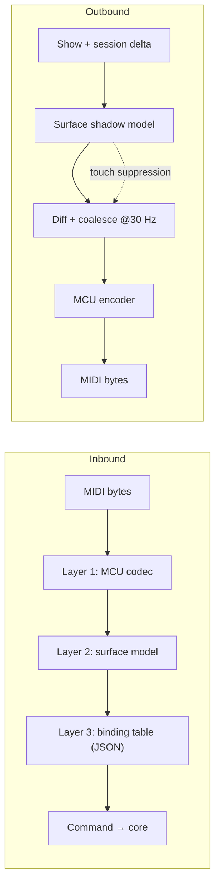

# MCU_MAPPING.md — Mackie Control / Behringer X-Touch Integration

**Status:** specification, and §2 is **verified against the device** as of 2026-08-13 — a Behringer X-Touch in MC mode over USB, firmware V1.25, serial `0156406`. §2.7 is the measurement, §7 is the checklist it closes, and `crates/prism-surface/tests/captures/` holds the recordings the ordinary test suite replays.
**Parent document:** [`ARCHITECTURE_SPEC.md`](../ARCHITECTURE_SPEC.md) (decisions D6, D8, D11).
**Source of requirements:** `XTouch.txt`.

---

## 1. Three layers

The surface controller is split so that protocol detail, device abstraction and user configuration never mix. Each layer is testable in isolation.



| Layer | Responsibility | Knows about |
|---|---|---|
| **1 — MCU codec** | MIDI bytes ↔ logical control events. Pure, no domain logic, no state beyond the running-status parser. | MIDI only |
| **2 — Surface model** | Device-independent controls: `Strip{n}.Fader`, `Strip{n}.Button.Select`, `Global.Play`. Holds the shadow model used for outbound diffing. | Control topology |
| **3 — Binding table** | Maps logical controls to `Command`s. Ships as JSON, user-editable. | PrismDMX domain |

Adding an X-Touch Extender or another MCU device means adding a codec profile in layer 1 — layers 2 and 3 are untouched.

---

## 2. Layer 1 — MCU protocol table

> ✅ **VERIFIED AGAINST OUR OWN DEVICE, 2026-08-13 (S20).** Every note number,
> CC number, MIDI channel and buffer offset below was worked control by control
> against a Behringer X-Touch in MC mode over USB (firmware V1.25) and **not one
> of them had to change**. §2.7 records what was measured, including the six
> places where the surface does something these tables did not say. Rows that
> §2.7 corrects or qualifies are marked **⚠ see §2.7**.
>
> The numbers came from three sources that agree with each other (§2.5) and they
> were right. That is worth knowing before the next device is guessed at — and so
> is the reason it can be *stated*: the table is data, so the verification pass
> was a data edit and not a refactor.
>
> **All note and CC numbers are on MIDI channel 1** (status byte `0x90` / `0xB0`,
> "channel 0" in the zero-based convention most of the sources use) unless a row
> says otherwise.

### 2.1 Inbound (X-Touch → PrismDMX)

The X-Touch in **MC mode is a 1:1 emulation of the Mackie Control**: same button
complement, same numbers. Ardour's manual states it plainly — *"a direct
emulation of the Mackie Control and has all the buttons the Mackie device
does"* — and lists no deviations, which is why the table below is the MCU table
rather than an X-Touch table.

**Channel strips** (n = 0…7 from the left):

| Control | Message | Notes |
|---|---|---|
| Rec / Arm | Note 0–7 | velocity 127 = press, 0 = release |
| Solo | Note 8–15 | |
| Mute | Note 16–23 | |
| Select | Note 24–31 | |
| V-Pot push | Note 32–39 | |
| V-Pot rotation | CC 16–23 | relative, sign-magnitude: bit 6 is the sign, bits 0–5 the step count. `0x01` = +1, `0x41` = −1. **⚠ measured: a fast turn does raise the magnitude — 1…8 observed — and the jog wheel never does. See §2.7** |
| Fader touch, strips 1–8 | Note 104–111 | velocity 127 = touched, 0 = released |
| Fader touch, main | Note 112 | as above |
| Strip fader position | Pitch Bend, channels 1–8 | 14-bit, LSB first. **⚠ measured: the range is 0…16380 in steps of 4, not 0…16383 — see §2.7** |
| Main fader position | Pitch Bend, channel 9 | 14-bit, as above |

**Everything else on the panel.** These are the numbers `XTouch.txt` describes
by name and D6/D7/D8 need by number:

| Group | Buttons and notes |
|---|---|
| Encoder Assign | Track 40, Send 41, Pan/Surround 42, Plug-in 43, EQ 44, Instrument 45 |
| Fader banks | Bank ◀ 46, Bank ▶ 47, Channel ◀ 48, Channel ▶ 49, **Flip 50**, Global View 51 |
| Display | Name/Value 52, SMPTE/Beats 53 — **⚠ both send their note and neither has an LED, §2.7. SMPTE/Beats is reserved: in the combined Xctl+MC mode it switches the surface between hosts, so PrismDMX never binds it — §4.3** |
| Function | F1–F8 = 54–61 |
| Global View group | MIDI Tracks 62, Inputs 63, Audio Tracks 64, Audio Instruments 65, Aux 66, Busses 67, Outputs 68, User 69 |
| Modifiers | Shift 70, Option 71, Control 72, Alt 73 — held, not latched |
| Automation | Read/Off 74, Write 75, Trim 76, Touch 77, Latch 78, Group 79 |
| Utility | Save 80, Undo 81, Cancel 82, Enter 83 |
| Transport (upper) | Markers 84, Nudge 85, Cycle 86, Drop 87, Replace 88, Click 89, Solo 90 |
| Transport | Rewind 91, Forward 92, Stop 93, Play 94, Record 95 |
| Cursor | Up 96, Down 97, Left 98, Right 99, Zoom 100, Scrub 101 |
| Foot switches | User switch 1 = 102, User switch 2 = 103 |
| Jog wheel | CC 60, relative, same sign-magnitude encoding as the V-Pots — **⚠ but it only ever sends ±1, however fast it is spun, §2.7** |

**Where this table lives in the code.** `prism_surface::profile::X_TOUCH`, one
constant, and *only* there — nothing in the codec matches on a literal number.
Earlier drafts of this document said `profiles/surface/xtouch.json` held these
numbers as well; it does not, and it must not. That file is **layer 3**, the
binding table of §4, and a second copy of a note map is a second thing to keep in
step — which is exactly what holding it in one constant was for. The JSON records
*which* device profile was verified and *when*, and binds controls to commands.

### 2.2 Outbound (PrismDMX → X-Touch)

| Target | Message | Notes |
|---|---|---|
| Button LED | Note On to the same note number | velocity 0 = off, **1 = flashing**, 127 = on — **all three measured**, and the flashing is the surface's own, not the host blinking it. The surface never lights its own LEDs, which is why a control that is not driven by the host stays dark. **⚠ two buttons have no LED at all, §2.7** |
| Motor fader | Pitch Bend on the strip's channel | suppressed while touched — §5. **The printed scale is a dB scale and its `0` mark is not the top**: **measured — 12 700 of 16 383 puts the pointer on the printed 0**, roughly 77 % of travel. PrismDMX's faders are 0–100 % linear, so the printing is decorative here — worth knowing before somebody "fixes" the mapping to match it. All 16 384 values are accepted outbound even though only multiples of 4 come back (§2.7) |
| V-Pot ring LEDs | CC 48–55, value `0b0LMMVVVV` | **MM** (bits 5–4) = mode — `00` single dot, `01` boost/cut from centre, `10` wrap (fill from the left), `11` spread (symmetrical about centre); **VVVV** = position 1…11, or 0 for all off (mode `11` uses 0…6). **All four modes measured and all four draw as described.** **L** (bit 6) is the small LED under the encoder — **⚠ the X-Touch has no such lamp, so the bit does nothing here, §2.7** |
| Scribble strip text | SysEx `F0 00 00 66 14 12 <offset> <ascii…> F7` | one 2×56 character buffer for the whole row of strips, **not** one message per strip: offset `0x00` starts the upper line, `0x38` (56) the lower one, and strip *n* owns 7 characters at `7n` and `0x38 + 7n`. **All measured, including the 56th character, which does arrive** — Ardour's habit of sending 55 is caution, not a device limit. It is **one continuous 112-character buffer**: two characters written at offset 55 put the second on the lower line's first character, and a single 112-byte write fills both lines. Lower case is folded to upper by the hardware |
| **Scribble strip colour** | SysEx `F0 00 00 66 14 72 <c0…c7> F7` | **the vendor extension this device is bought for — see §2.3** |
| Level meters | Channel Pressure `D0`, data `(strip << 4) \| level` | level `0x0`…`0xC` is silence…0 dB, `0xD` over 0 dB, `0xE` sets the overload flag and `0xF` clears it — **all measured, and the nibble split is this way round**. **⚠ the decay is much faster than the ~300 ms per division claimed: under a second from 0 dB to empty, §2.7** |
| 7-segment display | CC 64–75, **right to left** | value `0b0DCCCCCC`: bit 6 is that digit's dot, bits 5–0 are the character. **Measured: digit 0 really is the rightmost** — `0 1 2 … 9 A B` sent to digits 0…11 reads `BA9876543210` across the panel. The character set is ASCII with bit 6 stripped: `1`–`26` = `A`–`Z`, `48`–`57` = `0`–`9`, punctuation in between (`#$%&'()*+,` at 35–44, `;` 59, `<` 60). **⚠ `0` is a blank and so is 32, so `@` cannot be shown at all, §2.7.** CC 64–73 are the ten timecode digits, CC 74–75 the two assignment digits; CC 76 does nothing. **Measured: this surface accepts the display on MIDI channel 16 as well as channel 1** |
| Global LCD meter mode | SysEx `F0 00 00 66 14 21 <mode> F7` | `0x00` horizontal, `0x01` vertical. **⚠ measured: neither does anything on the X-Touch, whose meters are hardware LEDs rather than drawn on the LCD — and the overload marker works regardless, which the "horizontal only" claim said it would not. §2.7** |

### 2.3 What the X-Touch adds to the standard — the scribble strip colours

This is the row `ARCHITECTURE_SPEC.md` §7 flags as "vendor extension, not part of
MCU", and it is the one thing in this document that had to be found rather than
looked up. Behringer never documented it; it appeared in firmware **1.22**
(21 June 2022) and is absent from that release's notes.

**Verified in full on 2026-08-13** (§2.7), on firmware V1.25: the command, all
eight values, the additive bit order, and three things the sources only implied —
there is no inverted variant in MC mode, a message that does not carry exactly
eight colour bytes is ignored, and writing text does not disturb the colour.

```
F0 00 00 66 14 72 c0 c1 c2 c3 c4 c5 c6 c7 F7
   └──┬──┘ └┬┘ └┬┘ └──────────┬──────────┘
  Mackie   ID  cmd     one byte per strip, left to right
```

| Byte | Meaning |
|---|---|
| `00 00 66` | Mackie's manufacturer ID — the extension lives inside the emulated vendor's namespace, not Behringer's |
| `14` | device ID: `0x14` = Mackie Control (what the X-Touch calls itself in MC mode), `0x15` = an extender |
| `72` | the colour command |
| `c0…c7` | one colour per strip. **All eight are always sent**; there is no per-strip form |

**The colour byte is an additive RGB triple, not a palette index** — bit 0 = red,
bit 1 = green, bit 2 = blue:

| Value | 0 | 1 | 2 | 3 | 4 | 5 | 6 | 7 |
|---|---|---|---|---|---|---|---|---|
| Colour | off (black) | red | green | yellow | blue | magenta | cyan | white |

Two consequences for the layers above. **Black is off, not "dark"** — a strip set
to 0 has its backlight off and its text is unreadable, so an "unassigned"
executor wants white rather than 0, and black is worth reserving as the deliberate
marker for *nothing here*. And **the eight colours are exactly the eight corners
of the RGB cube**, so mapping an arbitrary colour to a strip is a nearest-corner
quantisation. Two shipping implementations disagree usefully about how: Ardour
normalises to the brightest component and thresholds each channel at half; the
Ableton script measures distance in RGB **or** in hue (its author found that
hue-first keeps a pale orange orange instead of collapsing it to white), and
sends greys to white and only an explicitly chosen black to black. **Hue-first is
the better default for a lighting desk**, where a pastel is still the colour it
is a pastel of.

**There is a way to fake more than eight colours, and it is worth knowing about
before somebody invents it badly.** The Ableton script has a "colour mix mode"
that cycles a strip between two or three of the eight at speed, so the eye
integrates them — magenta and blue alternating read as violet. It is honest
about the price: it needs a message every ~10 ms, it freezes everything else
while it runs, its author limits it to two-second bursts by default, and the
readme carries an explicit warning about **wear on the display and about
flicker sensitivity**. For PrismDMX that is a no by default — a lighting desk's
scribble strips are read, not admired, and an operator staring at a flickering
strip during a get-in is a worse outcome than an approximate colour.

**Other X-Touch behaviour worth knowing before the codec is written:**

- **The handshake is optional, and now measured.** The host may send the device
  query `F0 00 00 66 14 00 F7`. **Our desk answers**
  `F0 00 00 66 14 01 30 31 35 36 34 30 36 35 42 43 35 F7` — command `0x01`, then
  eleven **printable ASCII** bytes: a seven-character serial (`0156406`) and a
  four-character challenge (`5BC5`). Not `0x06`. The challenge/response cipher in
  the MCU specification belongs to **Logic Control** (device IDs `0x10`/`0x11`)
  and is not required here; nothing was sent back and the surface drove happily
  for the whole session. A host that simply begins sending also works.
- **There is an undocumented firmware version request**, found by asking:
  `F0 00 00 66 14 13 F7` is answered with `F0 00 00 66 14 14 56 31 2E 32 35 F7` —
  command `0x14`, payload the ASCII string `V1.25`. That is how the colour
  extension's firmware requirement can be checked at run time rather than by
  asking an operator to power-cycle the desk and read the boot screen.
- **The surface needs pacing, and it is worse than "loses the tail" — §2.7.**
  Two unrelated projects reported that firing several dozen messages back to back
  loses the tail and that ~1 ms fixes it. Measured here: a burst of 64 large
  SysEx messages on its own is harmless, and so is a burst of 64 small ones, but
  **saturating both directions at once loses messages and can stop the surface
  transmitting altogether until it is power-cycled.** §2.7 has the recipe and the
  consequences.
- **Modes and connections are chosen at power-up** by holding the channel 1
  SELECT button: encoder 1 picks the emulation (**MC**, HUI, and on current
  firmware the Behringer-native **Xctl** and combined Xctl+MC / Xctl+HUI), and
  encoder 2 picks USB, MIDI DIN or Ethernet. **PrismDMX targets MC over USB**, and
  the desk this document was verified against is set to exactly that — confirmed
  at the front panel and by the device ID it answers on (§2.7).
- **Xctl is a different protocol and is deliberately out of scope *as a protocol
  PrismDMX speaks*.** It is Behringer's own, used by the X32/M32 consoles,
  carried over UDP (port 10111 in the one public implementation) and it uses
  device ID `0x58` with *per-strip* display messages that carry the text **and**
  the colour **and** an inversion flag together. It is better than MC for
  scribble strips and it is undocumented, single-vendor and unusable over plain
  MIDI. PrismDMX will not implement it.
- **But the surface will be run in the combined Xctl+MC mode, and that is a
  requirement rather than a curiosity — see §4.3.** The intended deployment is
  one X-Touch driving the venue's sound console over Xctl *and* PrismDMX over MC
  at the same time. That changes what layer 3 may assume: most of the panel
  belongs to the other host, and only what Xctl leaves unused reaches us.

### 2.4 Robustness requirements for the codec

- **Running status** must be handled — a compliant sender may omit repeated status bytes.
- **Malformed or truncated messages are discarded silently** and counted in a diagnostics counter. Per `CLAUDE.md`, an invalid MIDI packet must never propagate a failure; it certainly must never reach the engine thread.
- **SysEx reassembly** across packet boundaries, with a maximum buffer size and a timeout that drops an unterminated message.
- The codec allocates nothing per message; it writes into caller-provided buffers.

### 2.5 Where these numbers come from

Recorded because a table with no provenance cannot be argued with, and because
§7 needs to know which rows are worth re-measuring first. None of this is a
Behringer document: **Behringer publishes a MIDI implementation for the
X-Touch's *Ctrl* (plain MIDI) mode only**, and nothing for MC mode, which is
why the community reverse-engineered it.

| Source | What it is | Weight |
|---|---|---|
| **Our own X-Touch, 2026-08-13 (§2.7)** | The desk PrismDMX is built for, worked control by control, with the recordings kept in `crates/prism-surface/tests/captures/` | **Highest, and it now outranks everything below.** Where a source and the device disagree, the device wins and the row is marked ⚠. Six such places exist; none of them is a note number |
| [Ardour](https://github.com/Ardour/ardour/tree/master/libs/surfaces/mackie), `libs/surfaces/mackie/` | A production implementation with a dedicated X-Touch profile, in use for years | **Highest.** The SysEx header, the LCD offsets, the ring encoding, the colour command and the handshake below were read out of this code |
| [TouchMCU protocol reference](https://github.com/NicoG60/TouchMCU/blob/main/doc/mackie_control_protocol.md) | A careful reverse-engineering write-up of the whole MCU protocol, with the complete note map | High. The note table in §2.1 is this, cross-checked against Ardour |
| [X-Touch script for Ableton Live](https://github.com/Kik07L/Behringer-X-Touch-for-ableton) | **Ableton's own `MackieControl` remote script, adapted for the X-Touch** and in use by a community that reports it working | **Highest, and it is the best single source here.** It is a fourth-party check that agrees with the others *number for number*: its `consts.py` note table is §2.1 exactly, its `MainDisplay.py` sends `F0 00 00 66 <14\|15> 72 …` for the colours, `0x00`/`0x38` for the two display lines, and `0/1/127` for LED off/flashing/on. The 7-segment character set, the fader's 0 dB point, the colour-matching strategies and the colour-mixing trick in §2.2 and §2.3 are all from here |
| [x-touch-xctl](https://github.com/pythag/x-touch-xctl) | An X-Touch driver for Behringer's own Xctl protocol | The Xctl notes in §2.3, including the inversion flag MC mode does not have |
| [Ardour manual, Behringer devices in MC mode](https://manual.ardour.org/using-control-surfaces/mackie-control-protocol/behringer-devices-in-mackielogic-control-mode/) | Vendor-neutral documentation of how these surfaces behave | The "1:1 emulation, no deviations" claim in §2.1 |
| Community reports (forum threads, an independent Rust and a C++ driver) | Firmware 1.22, the colour codes, the message pacing | Lowest, and each is marked in the text. **The pacing claim in particular is somebody else's measurement of somebody else's device** |

### 2.6 As built (S19)

Layer 1 exists: [`crates/prism-surface`](../crates/prism-surface), 112 tests,
**99.24 % line coverage**. Everything in §2.1 and §2.2 above is in
`profile::X_TOUCH`, which carried **`verified: false`** — the banner as a value,
so a log line or a status panel could say so where a comment could not. Nothing in
the codec matches on a literal number, so S20 was an edit to one table and to the
hand-written byte table in `tests/round_trip.rs`, and to nothing else.

**And that bet paid in a way worth recording: neither table needed a single byte
changed.** The verification cost three added fields, one corrected character
mapping and a new test target — see §2.7 and, for what was actually done, S20's
record in `PROGRESS.md`.

Four things the implementation decided that this document did not say:

- **Inbound SysEx is counted, not interpreted.** The handshake is optional
  (§2.3) and no source settles what an X-Touch's *Device Ready* payload looks
  like. Writing a decoder for a message shape nobody has seen would be inventing
  data in a table made of citations, so `McuCodec` counts it (`sysex_ignored`).
  The *question* — `F0 00 00 66 14 00 F7` — is written, and the reassembly, the
  bounded buffer and the timeout are all exercised by the scribble strip
  messages, which are longer. **§2.3 now records exactly what the desk answers**,
  so a decoder could be written; it still is not, because nothing above layer 1
  has asked for the serial number yet and inventing an API for it would be S21
  guessing at its own requirements. The bytes are written down, which is the part
  that was missing.
- **A release is written as a Note On with velocity 0**, because that is what
  the surface sends; a real Note Off is accepted on the way in and normalises
  onto it. The round-trip table separates *canonical* rows, which are byte-equal
  both ways, from *alias* rows, which are not and say so.
- **The V-Pot magnitude is passed through, not interpreted** — and that turned
  out to be the right call twice over. A fast turn *does* send a larger number
  (1…8) and the jog wheel *never* does (§2.7), so the codec reporting what the
  wire carried is the only behaviour that is correct for both. The acceleration
  curve belongs to layer 2, and layer 2 now knows it needs two of them.
- **A ring position the mode cannot draw, and a colour byte outside the eight,
  are refused rather than masked.** Both directions, so the round trip stays
  honest.

The four robustness requirements of §2.4 are met and measured rather than
asserted: no allocation at all, inbound or outbound, under 250 kB of hostile
input (`tests/codec_allocations.rs`, a counting global allocator).

### 2.7 As measured at the device (S20, 2026-08-13)

**The desk.** Behringer X-Touch, **MC mode over USB** — chosen at power-up with
channel 1 SELECT held and read off the front panel, and confirmed independently by
the device ID it answers SysEx on (`0x14`). **Firmware V1.25**, so the colour
extension of §2.3 (which needs ≥ 1.22) is available. Serial `0156406`. USB
`VID 1397 PID 00B1`, enumerating two MIDI ports; everything here is on the first
(`X-Touch`), the second being the MIDI DIN pair.

**Every number in §2 survived.** Not one note number, CC number, MIDI channel or
buffer offset had to change. What follows is therefore not a correction list for
the tables — it is the list of things the tables did not say, plus one claim that
was wrong.

#### What was verified, and how

| Claim | Method | Result |
|---|---|---|
| The 40 strip-button notes (0–39) | pressed, strip by strip, all five rows | ✅ exactly as tabulated; the block tiles 0…39 with no hole |
| The 64 global notes (40–103) | the host lit **one LED at a time** and the lit button was pressed | ✅ **60 confirmed in both directions at once.** Name/Value and SMPTE/Beats have no LED and were pressed blind (notes 52, 53 ✅). The two foot-switch notes need a pedal nobody had — **untested, not wrong** |
| Fader pitch-bend channels and 14-bit order | all nine faders swept end to end | ✅ channels 1–8 for the strips in left-to-right order, channel 9 for the main fader, **LSB first**: at the top of travel the message is `E0 7C 7F` = 124 + 128 × 127 |
| Fader touch notes | the same sweeps | ✅ 104–111 in order, 112 for the main fader |
| V-Pot CCs and the jog wheel | one detent each, then spun hard | ✅ CC 16–23 in left-to-right order, jog CC 60 |
| Ring LED modes | all four drawn on all eight rings | ✅ Dot, BoostCut, Wrap and Spread all draw as described |
| Scribble strip offsets | one strip written at offset 21, then whole lines | ✅ strip *n* owns 7 characters at `7n`; **all 56 of a line arrive** |
| Colours | all eight, one per strip and all-same | ✅ off, red, green, yellow, blue, magenta, cyan, white — the additive order exactly |
| Meter message and overload flag | staircase, then `0xE` / `0xF` | ✅ `(strip << 4) \| level`, marker sets and clears |
| 7-segment addressing | `0 1 2 … 9 A B` to digits 0…11 | ✅ reads `BA9876543210` — digit 0 is the **rightmost** |
| Round-trip latency | 60 device queries, one at a time | ✅ **median 0.71 ms**, min 0.61, max 1.02 (host → surface → host) |

#### The six things the sources did not say

1. **The faders are 12-bit, and the top is 16380.** Every one of 576 captured
   positions is a multiple of **4**; the LSB only ever takes the 32 values
   `00,04,…,7C`. So the surface reports 4096 distinct positions inside a 14-bit
   field and **never sends 16383**. It *accepts* all 16 384 outbound. Held as
   `McuProfile::fader_step`, because a layer that turns an inbound position into a
   percentage by dividing by 16383 gives 99.98 % for a fader against its end stop,
   and an executor master that cannot reach full is wrong.
   A moving fader reports every **19.8 ms** (≈50 Hz), very evenly.
2. **The V-Pots accelerate; the jog wheel does not.** §2.1 described both as
   "relative, sign-magnitude" and left the magnitude open. A fast V-Pot turn
   carries **1…8 detents** in one message (`0x08` / `0x48` at the extremes,
   distribution peaking at 4–6). The jog wheel sent **±1 and nothing else in 404
   messages**, however hard it was spun — it raises its *rate*, not its
   magnitude. A layer 2 that applied one acceleration curve to both would be
   wrong about one of them. Neither ever sends a zero-magnitude message.
3. **Two buttons have no LED.** Name/Value (52) and SMPTE/Beats (53) are printed
   on the panel, send their notes when pressed, and stay dark at any velocity.
   The Ardour manual's "a direct emulation … with no deviations" is not quite
   true, and `McuProfile::unlit_buttons` now says so as data.
4. **The encoders have no lamp under them.** Bit 6 of the ring value — the "small
   LED beneath the encoder" of §2.2 — has nothing to light on this surface.
   Harmless to send; pointless to model.
5. **A 7-segment value of `0` blanks the digit, and so does 32.** This settles the
   contradiction §7 raised: the "ASCII with bit 6 stripped" rule stops one
   character short, because the code `'@'` strips to draws *nothing*.
   `SegmentChar::from_ascii` therefore now **refuses `'@'`** rather than handing
   back a code that silently disappears, and `to_ascii(0)` answers `' '`.
6. **The meters decay in well under a second**, not the ~300 ms per division the
   sources claim, which would be 2–4 s from 0 dB. A host that wants a meter to
   look continuous must refresh it far more often than that — and §5.2's
   permission to drop meters first is still right, because a dropped meter simply
   falls rather than freezing.

#### What the surface ignores, which is what the codec assumed

Every one of these was sent **by hand**, because the codec refuses to encode
them — and in every case the surface did nothing at all rather than wrapping the
message onto a control it does have:

- a meter for strip index **8** and **15** (`D0 8C`, `D0 FC`) — nothing lit;
- a ring LED on **CC 56** and **CC 63**, past the eighth ring;
- **note 120**, which is in no table;
- **pitch bend on channel 10**, a tenth fader;
- **CC 76**, a thirteenth 7-segment digit;
- a colour message with **0, 4 or 9** colour bytes — only exactly eight is acted
  on, so there is no per-strip form and `Feedback::DisplayColors`'s fixed array
  is exactly right;
- colour bytes with **bit 3, 4 or 6 set** (`08…0F`, `10…17`, `40…47`) — the high
  bits are masked away and the strip shows the plain colour, so **there is no
  inverted variant in MC mode** as there is in Xctl. Note the codec is *stricter*
  than the device here: it refuses a colour byte outside 0…7 rather than masking
  it, deliberately, so a caller's mistake is visible instead of approximated;
- a scribble strip write and a device query on the **extender's** device ID
  (`0x15`) — no display change, no answer, so a two-desk rig can be addressed
  separately.

**Writing text does not disturb the colour**, confirmed: eight strips set to cyan
kept it across a full text write. Text and colour are independent state, which is
what both shipping implementations assume and what lets S21's shadow model track
them separately.

#### The pacing finding, which is worse than the reports said

Two independent projects reported the X-Touch "losing the tail" of a burst and
~1 ms fixing it. What is actually there is sharper, and it is the one genuinely
unwelcome result of this session. Measured, twice, reproducibly:

| What was sent | Result |
|---|---|
| 64 device queries (7 bytes) back to back, no gap | **64 answers. Nothing lost** — a burst of small messages is fine |
| 64 full scribble strip writes (63 bytes) back to back, nothing asked of the desk | **Harmless.** 30.9 ms for the burst, and the desk answered a query straight after |
| 64 × (63-byte write + query), each answer *waited for* | **64 answers**, 7.2 ms per exchange |
| 64 × (63-byte write + query) with **nothing waited for** | **17–34 of 64 answers lost**, and on both attempts the surface then **stopped transmitting entirely** |
| 2000 × 63-byte writes while an operator swept a fader | No hang, but the inbound stream **thinned from ~40 to ~11 messages a second** for the duration, recovering immediately afterwards |

**The failure mode is one-directional and it is not a disconnection.** When it
happens, the surface keeps *receiving* perfectly — scribble strip text written
while it was in that state appeared on the display — and sends nothing at all:
no button, no fader, no SysEx reply. Closing and reopening the MIDI port does not
help; a fresh process does not help. **Only a power cycle brings it back.**
(Unplugging USB was not tried.)

Three consequences, all for S21:

- **Pace the outbound path.** §5.2's 30 Hz coalescing is not an optimisation, it
  is what keeps the desk out of this state, and a minimum gap between messages
  belongs in the send queue. The safe figure this session can defend is the one
  it measured: at 30 Hz with a diffed shadow model the traffic is nowhere near
  the burst above.
- **Never poll the handshake.** The device query is the only inbound reply the
  surface generates, and the failure needs replies in flight. Use it once at
  connect, if at all — not as a keep-alive.
- **Silence is a fault state, and §5.3 does not currently cover it.** "Device
  disappearance" assumes the port goes away. Here the port stays open, writes
  still land, and the desk is deaf-mute in one direction. A surface layer that
  notices no inbound traffic for some seconds should say *the desk has stopped
  responding — power-cycle it*, because reconnecting will not fix it.

---

## 3. Layer 2 — surface model

The logical control set, independent of any device:

```
Strip[0..8].Fader            Strip[0..8].Touch
Strip[0..8].Encoder          Strip[0..8].EncoderPush
Strip[0..8].Button.Rec | .Solo | .Mute | .Select
Strip[0..8].Display.{ text, color, value }
Strip[0..8].Meter
Main.Fader                   Main.Touch                Main.Flip
Global.Play | .Stop | .Forward | .Backward | .Record
Global.Faderbank.Prev | .Next
Global.Channel.Prev | .Next
Global.Zoom.Up | .Down | .Left | .Right
Global.Jog
Global.F[1..8]
Global.Save | .Undo | .Cancel | .Enter
Global.Modifier.Shift | .Option | .Control | .Alt
Global.SevenSegment
```

This layer also owns the **shadow model**: the last state believed to be displayed on the device. Outbound traffic is generated by diffing new state against the shadow, never by re-sending everything.

---

## 4. Layer 3 — binding table

Shipped as `profiles/surface/xtouch.json`, validated against a JSON schema on load. A malformed profile falls back to the built-in default and raises a warning — it never prevents startup.

### 4.1 Default bindings (from `XTouch.txt`)

The "Acts on" column is the practical consequence of **D11**: some controls reach the engine directly because latency matters, others change session state and the UI follows. Both travel the same command bus; there is no special path.

| Control | Default | Acts on | Configurable |
|---|---|---|---|
| Strip fader 1–8 | `Master` of the executor on that strip | Engine | yes — Empty / Master / Speed / XFade |
| Strip Rec / Solo / Mute / Select | `Go+` | Engine | yes — Empty / Go+ / Go− / LearnSpeed / Off / On / Flash / Toggle |
| Strip encoder | `Empty` | Engine | yes — Empty / Master / Speed |
| Strip display | colour, name and value of the executor | — | — |
| Main fader | `XFade` of the selected executor | Engine | yes — Empty / Master / XFade |
| Flip button | `Go+` of the selected executor | Engine | yes |
| **Play / Stop / Forward / Backward** | On / Off / Go+ / Go− on the selected executor | Engine | yes — **and this row is the one to spend carefully: it is the part of the panel that stays PrismDMX's in shared operation (§4.3), so it wants live-show functions, free assignments included** |
| **Record** | `Clear` (three-stage) | Programmer | yes — same section, same reasoning |
| **Faderbank ◀▶** | executor **page** down / up — 8 per page (D7) | **Session** | — |
| **Channel ◀▶** | **switch UI view** — `SelectView` (D8) | **Session** | — |
| **Zoom ▲▼** | programmer page up / down | **Session** | — |
| **Zoom ◀▶** | select previous / next programmer parameter | **Session** | — |
| Jog wheel | change the value of the selected programmer parameter | Programmer | — |
| Encoder Assign section | switch encoder bank — Dimmer / Position / Color / Beam / Focus | **Session** | yes |
| **F1–F8 (XKeys)** | free: open window, jump to view, macro, executor | **Session** or Engine | yes |
| Save | save show file; **LED lit while unsaved changes exist** | Core | — |
| Undo | `Oops` | Core | — |

### 4.2 Profile shape

```jsonc
{
  "profileVersion": 1,
  "device": "behringer-x-touch",
  "bindings": [
    { "control": "Strip[*].Fader",  "action": { "t": "SetExecutorMaster" } },
    { "control": "Strip[*].Button.Select", "action": { "t": "ExecutorGo", "direction": "Next" } },
    { "control": "Global.Channel.Next",    "action": { "t": "SelectView", "relative": 1 } },
    { "control": "Global.F1", "action": { "t": "OpenWindow", "window": "FixtureSheet" } }
  ]
}
```

`Strip[*]` expands per strip with the strip index bound to the executor at `executorPage * 8 + index`.

### 4.3 Sharing the surface with a sound console (Xctl+MC)

> **Provenance: this section is the operator's, not a measurement.** Everything in
> §2.7 was read off the desk in S20; everything here was stated by the person who
> owns and runs it, describing how it is to be deployed and how the combined mode
> behaves. It is written down because it changes what layer 3 may assume, and it
> is marked because the difference between *measured* and *reported* is the whole
> point of §2.5. Verifying it needs the sound console present as well and is
> recorded as an open item in §7.

**The intended deployment is one X-Touch driving two hosts at once**: the venue's
sound console over Xctl, and PrismDMX over MC, in the surface's combined
**Xctl+MC** mode. That is not the configuration S20 measured — the desk was in
plain MC — and it does not change a single number in §2, because the MC half of
the combined mode is the same MC. What it changes is **how much of the panel is
ours**.

**Only what Xctl does not use reaches MC.** In the combined mode the surface
routes each control to one host or the other: whatever the Xctl side claims
belongs to the sound console, and the rest keeps driving MC output *and* keeps
listening to MC input, permanently. In practice the reliably-ours set is:

| Guaranteed to reach PrismDMX | Note / CC |
|---|---|
| The whole transport section — Rewind, Forward, Stop, Play, Record | 91–95 |
| The jog wheel | CC 60 |

These reach PrismDMX **permanently**, whichever host the surface is currently
showing. Everything else follows the switch.

**The rest of the panel is not lost — it is one button away.** The operator can
switch the whole surface to MC at any time (with the reserved SMPTE/Beats button,
below), and then every strip, fader, encoder and F-key is PrismDMX's, exactly as
in the dedicated deployment; the sound console is simply not operable meanwhile.
So the split is **not** a restriction on what the profile may contain.

What the permanently-MC set buys is different and more valuable: **no switching**.
Whatever sits on the transport section and the jog wheel is in reach *during a
show*, without taking the sound desk away from whoever is using it.

**Three consequences.**

1. **The transport section is the always-hot part of the console, so what sits
   there should be worth having mid-show.** Not "everything important must fit
   into five buttons" — nothing has to fit, because the full surface is a button
   press away — but "these five are the ones reachable without a mode change, so
   spend them on live-show work". That includes **freely assignable buttons**:
   an operator will want a *tap for speed* against a particular speed master, a
   macro, or a look for a moment in the show on the keys that are always in reach,
   and that is a better use of them than a transport metaphor PrismDMX does not
   have. §4.1's defaults (go / off / next / previous / clear) are a reasonable
   starting point rather than a fixed layout, and that row is already marked
   configurable.
2. **Nothing is unreachable, but D7 and D8 need a mode change.** `Faderbank ◀▶`
   (executor paging) and `Channel ◀▶` (`SelectView`) sit outside the permanent
   set, so in shared operation they cost a switch to the full surface. That is
   fine for paging and view changes, which are setup-shaped rather than
   cue-shaped; it is a reason not to put anything *time-critical* there, and it
   is why the UI and the Web Remote keep their own paths to both.
3. **Feedback must not assume it owns a control.** The shadow model may only
   drive LEDs for controls MC actually holds at that moment; lighting a strip's
   Select LED while the surface is showing the sound console is either ignored
   or, worse, fights that console's own feedback. S21 should hold the ownership
   set as **data on the profile**, in the same way `unlit_buttons` is, so that
   "which controls are ours" is one edit rather than a condition scattered
   through the diffing.

**What "tap for speed" needs, and does not have yet.** `LearnSpeed` exists today
only as an *executor button* function (`ExecutorButtonFunction` in
`ARCHITECTURE_SPEC.md` §6, and `XTouch.txt`, which offers it on a strip's buttons
but not on the selected executor's). A tap against a **speed master** is a
different target, and speed masters are named in `docs/DMX_MERGE.md` §4 item 3 —
playback rate, applied in step 2 of the tick — but **nothing implements them and
no domain type carries one**. So this is a forward dependency rather than
something S22 can bind: the session that builds speed masters owes a command to
tap one, and the transport row's function list should grow `LearnSpeed` when it
exists. Recorded here so that the requirement is not rediscovered from the
operator a second time.

**SMPTE/Beats (note 53) is reserved and must never be bound.** In the combined
mode **it is the button that switches the surface between the two hosts** — it is
the operator's way back to the sound desk, and a console that steals it is a
console somebody has to power-cycle to get out of. The decision goes further than
the shared mode, and deliberately: **PrismDMX leaves it unbound in every mode**,
so that the same profile is safe on a desk whose mode nobody has checked.

It is worth noting, without making more of it than the evidence supports, that
note 53 is one of the two buttons S20 found to have **no LED at all** (§2.7). A
button the firmware reserves for itself is a button it would have no reason to
give a host-controllable lamp. That is a consistent story rather than a
demonstrated one — Name/Value has no LED either and switches nothing — but it is
one more reason not to build anything on top of it.

---

## 5. Feedback rules

These two rules are not optimisations; without them the surface misbehaves visibly.

### 5.1 Touch suppression

While a fader reports touch (Note On 104–111 with velocity 127), PrismDMX sends **no** position updates to that fader. On release it waits 150 ms, then resynchronises to the authoritative value.

Without this the motor fights the operator: the engine echoes the value back, the motor drives to it, the movement generates a new inbound value, and the loop oscillates.

### 5.2 Coalescing and priority

Outbound updates are batched at a maximum of 30 Hz and sent only where the value differs from the shadow model. USB MIDI cannot absorb an unthrottled delta stream, and a saturated buffer shows up as laggy faders.

When bandwidth is constrained, the send order is:

1. **Motor faders** — most visible, most misleading if stale
2. **Button LEDs** — state feedback the operator acts on
3. **Scribble strips** — names and values, tolerant of a late update
4. **Meters** — purely decorative; dropped first

### 5.3 Connection handling

On connect or reconnect the shadow model is invalidated and the full surface state is transmitted once (a "resync burst"), rate-limited so the device is not flooded. Device disappearance is treated like any other hardware fault: the MIDI threads report `Disconnected`, the engine is unaffected, and reconnection is attempted with backoff.

**A second fault state, measured in S20, that this rule does not cover.** The
X-Touch can stop transmitting while remaining fully present: the port stays open,
writes still land on the display, and no button, fader or reply ever comes back
(§2.7). Reopening the port does not help and neither does a fresh process — only
a power cycle. So *the port is there* is not evidence the desk is listening, and
a surface layer that only watches for disappearance would show a green light
beside a dead console. Silence beyond a few seconds on a desk that was talking is
a fault worth naming to the operator, and the message has to say **power-cycle
it**, because reconnecting is the one thing that will not work.

The resync burst is also the traffic pattern most likely to *cause* it, which is
why it is rate-limited rather than sent as fast as the port accepts.

---

## 6. Testing

| Test | Method |
|---|---|
| Codec round trip | Table-driven: MIDI bytes → control event → MIDI bytes, asserting byte equality both ways |
| Running status | Feed a stream with omitted status bytes; assert identical decoding |
| Malformed input | Fuzz with truncated and out-of-range messages; assert no panic, no allocation growth, correct discard counters |
| SysEx reassembly | Split a scribble strip message across packet boundaries; assert single correct event; assert timeout drops an unterminated message |
| Touch suppression | Simulate touch → engine value change → release; assert no outbound pitch bend during touch and exactly one resync 150 ms after release |
| Coalescing | Drive 1000 value changes in 100 ms; assert at most 3 outbound messages for that control |
| **Surface → UI (D11 gate)** | Send `Channel ▶` and F1 with **no UI client connected**; then connect a client and assert its `Snapshot` contains both the new view and the opened window |
| **The device's own bytes (S20)** | `tests/hardware_capture.rs` replays four recordings of the real X-Touch — every strip button, the whole panel, all nine faders, all nine relative controls — and asserts that each message decodes to the control the table names, that the profile finds **nothing** it cannot describe, and that every message re-encodes to exactly the bytes the desk sent |

Target coverage on `prism-surface`: **> 95 %**, per `CLAUDE.md`. All tests run against a mock MIDI port or a recorded capture — **no hardware required**, including the ones that verify a specific physical device.

One trap worth knowing, because a mutation check found it: replaying real bytes
and re-encoding them is *still* a function composed with its own inverse. Swapping
the two halves of the 14-bit fader split in both directions leaves the byte
comparison green on genuine device recordings. What catches it is a claim about the
values rather than the bytes — the measured fact that positions are multiples of 4
and stop at 16380, plus a small table of captured messages whose meaning was
worked out **by hand**. This is S19's finding (§2.6) surviving contact with real
data, which is worth stating plainly: *real* input does not make a round trip
self-validating.

---

## 7. Hardware verification checklist — closed 2026-08-13 (S20)

**Done.** Every item below was worked against a real Behringer X-Touch in
Mackie Control mode; §2.7 is the measurement and `crates/prism-surface/tests/`
holds the recordings and the test that replays them. Two items are marked
◻ *untested* rather than ticked, and both say why — an absent pedal and an
untried cable pull are not results.

- [x] **Mode and connection** — **MC over USB**, read off the front panel with channel 1 SELECT held at power-up, and confirmed by the device ID the surface answers on (§2.7)
- [x] **Firmware version** — **V1.25**, so ≥ 1.22 and the colour extension exists. Found by SysEx rather than by reading the boot screen: `F0 00 00 66 14 13 F7` answers `…14 "V1.25"`, an undocumented request now written into §2.3
- [x] **Every button press reconciled against §2.1** — the whole map, not a sample. All 40 strip notes pressed strip by strip; the 64 panel notes checked by **lighting one LED at a time and pressing the button that lit**, which verifies the inbound *and* outbound halves in one pass. 60 of 64 agreed in both directions, notes 52 and 53 inbound-only (no LED — §2.7), and the note map needed no change
- [x] **Fader pitch-bend channels and 14-bit byte order** — channels 1–8 left to right, 9 for the main fader, **LSB first**, proved by the top-of-travel message `E0 7C 7F`. Also found: the faders are 12-bit and stop at 16380 (§2.7)
- [x] **Fader touch notes including the main fader** — 104–111 and 112
- [x] **V-Pot relative encoding at speed** — **it accelerates: magnitudes 1…8.** And the jog wheel does not: ±1 in 404 messages. The two are not the same control (§2.7)
- [x] **Scribble strip offsets, and whether the 56th character arrives** — `7n` confirmed by writing one strip; **all 56 arrive**, Ardour's 55 is caution. It is one continuous 112-character buffer: a write at offset 55 spills onto the lower line
- [x] **Colours** — the command and all eight values confirmed in the documented additive order. **No inverted variant in MC mode** (bits 3, 4 and 6 are masked away); **a message without exactly eight colour bytes is ignored** (0, 4 and 9 all tried), so there is no per-strip form; and **text does not reset the colour**, confirmed rather than assumed
- [x] **Meter format, overload flag and decay** — `(strip << 4) | level` confirmed, `0xE`/`0xF` set and clear the marker, **but the decay is under a second** rather than ~300 ms per division. The LCD meter-mode SysEx does nothing at all on this surface, and the overload marker works anyway
- [x] **7-segment addressing, character encoding and channel** — digit 0 is the rightmost (`BA9876543210` from `0…9 A B`), CC 76 ignored, and **the surface accepts the display on channel 16 as well as channel 1**, which justifies the codec taking both
- [x] **What a 7-segment `0` draws** — **a blank**, and so does 32. The stripping rule stops one character short, `'@'` cannot be displayed at all, and `SegmentChar::from_ascii` now refuses it instead of returning a code that draws nothing
- [x] **A strip index above 7 is ignored**, not wrapped — meters at index 8 and 15, ring LEDs on CC 56 and 63, note 120, pitch bend on channel 10 and CC 76 all did nothing. Also the extender device ID `0x15`, which this surface neither displays nor answers
- [x] **Whether back-to-back messages are lost, and the pacing needed** — measured, and it is worse than the reports: a burst of small messages is lossless, a burst of large ones is harmless on its own, but **saturating both directions at once loses replies and can stop the surface transmitting until it is power-cycled.** §2.7 has the recipe, the numbers and the three consequences for S21
- [x] **Round-trip latency** — **median 0.71 ms** host → surface → host over 60 exchanges (min 0.61, max 1.02). Measured through the handshake, because a motor fader generates no reply; a fader move the *operator* makes is reported every 19.8 ms, which is the figure that bounds §4.3's budget
- [x] **§2 updated and the UNVERIFIED banner removed**; `profiles/surface/xtouch.json` written with the verification recorded in it. `prism_surface::X_TOUCH.verified` is `true`, and `ARCHITECTURE_SPEC.md` §14's row is closed
- ◻ **Foot switches (notes 102, 103)** — *untested.* Nothing is plugged into either jack, and there is no way to make an absent pedal send a note. Their LEDs were driven and, as expected for a jack rather than a button, nothing lit
- ◻ **The combined Xctl+MC mode** — *untested, and it is the deployment that is actually planned* (§4.3). The desk was in plain MC for all of the above, which is the right mode to have verified first: the MC half of the combined mode is the same MC, so nothing in §2 depends on it. What is **not** verified is the division of the panel — that only what Xctl leaves unused reaches MC, and that the transport section and the jog wheel are what reliably remain. That is the operator's account of the surface, not a measurement, and checking it needs the sound console on the other end of it. Worth doing before S22 finalises a default profile, because it decides which bindings can be relied on
- ◻ **Behaviour when the USB cable is pulled** — *untested here.* S8 did this for the DMX adapter and it belongs to S21's connection handling rather than to the codec; what this session did establish is the harder case, a surface that is still *there* and has stopped talking

Findings go into this document. Discrepancies against the MCU standard are recorded explicitly rather than silently corrected, so the next device profile can reuse the knowledge — see §2.7, which is that list.

---

## 8. Reproducing any of this

`tools/xtouch-probe` is the tool the measurements were taken with. It is a
**standalone crate, deliberately outside the workspace**: opening a MIDI port is
platform code, and `ARCHITECTURE_SPEC.md` §10.1 allows `prism-surface` none. So
`cargo test --workspace`, `cargo clippy --workspace --all-targets` and the ARM64
cross-check never see `midir`, and `prism-surface` gained no dependency at all.

It depends on `prism-surface` by path, which is the point: **every byte it sent
was produced by `Feedback::encode_into` and every byte it read was decoded by
`McuCodec`**, so what was verified is the shipping codec rather than a
transcription of it. The exceptions are marked in its output — the `raw` command
and the steps that deliberately send what the codec refuses to encode.

`PROGRESS.md` §3.4 carries the commands.
