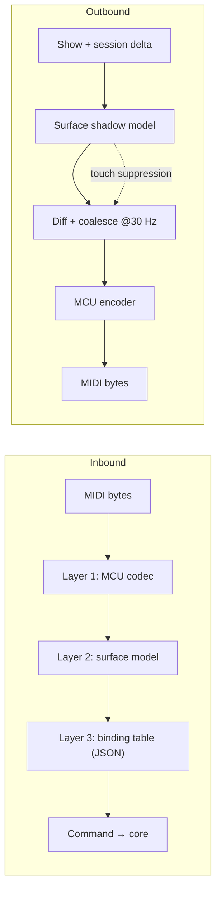

# MCU_MAPPING.md — Mackie Control / Behringer X-Touch Integration

**Status:** specification. The MIDI numbers in §2 carry named sources since 2026-08-12 (§2.5) but are **not yet verified against hardware** — see §7.
**Parent document:** [`ARCHITECTURE_SPEC.md`](../ARCHITECTURE_SPEC.md) (decisions D6, D8, D11).
**Source of requirements:** `XTouch.txt`.

---

## 1. Three layers

The surface controller is split so that protocol detail, device abstraction and user configuration never mix. Each layer is testable in isolation.



| Layer | Responsibility | Knows about |
|---|---|---|
| **1 — MCU codec** | MIDI bytes ↔ logical control events. Pure, no domain logic, no state beyond the running-status parser. | MIDI only |
| **2 — Surface model** | Device-independent controls: `Strip{n}.Fader`, `Strip{n}.Button.Select`, `Global.Play`. Holds the shadow model used for outbound diffing. | Control topology |
| **3 — Binding table** | Maps logical controls to `Command`s. Ships as JSON, user-editable. | PrismDMX domain |

Adding an X-Touch Extender or another MCU device means adding a codec profile in layer 1 — layers 2 and 3 are untouched.

---

## 2. Layer 1 — MCU protocol table

> ⚠️ **UNVERIFIED AGAINST OUR OWN DEVICE.** Every number below now has a
> **named source** (§2.5) rather than being a convention somebody remembered:
> the MCU standard as reverse-engineered by two independent projects, plus
> Ardour's production implementation, which is what actually drives X-Touches in
> the field. That is enough to *write* the codec against. It is not enough to
> *sign it off*: nothing here has been seen on the desk in the next room, and the
> table is deliberately still data so that §7's verification pass is a data edit
> and not a refactor. Where a claim is stronger or weaker than "read in a
> reputable implementation", the row says so.
>
> **All note and CC numbers are on MIDI channel 1** (status byte `0x90` / `0xB0`,
> "channel 0" in the zero-based convention most of the sources use) unless a row
> says otherwise.

### 2.1 Inbound (X-Touch → PrismDMX)

The X-Touch in **MC mode is a 1:1 emulation of the Mackie Control**: same button
complement, same numbers. Ardour's manual states it plainly — *"a direct
emulation of the Mackie Control and has all the buttons the Mackie device
does"* — and lists no deviations, which is why the table below is the MCU table
rather than an X-Touch table.

**Channel strips** (n = 0…7 from the left):

| Control | Message | Notes |
|---|---|---|
| Rec / Arm | Note 0–7 | velocity 127 = press, 0 = release |
| Solo | Note 8–15 | |
| Mute | Note 16–23 | |
| Select | Note 24–31 | |
| V-Pot push | Note 32–39 | |
| V-Pot rotation | CC 16–23 | relative, sign-magnitude: bit 6 is the sign, bits 0–5 the step count. `0x01` = +1, `0x41` = −1. Larger magnitudes are believed to encode speed; **unconfirmed**, and §7 measures it |
| Fader touch, strips 1–8 | Note 104–111 | velocity 127 = touched, 0 = released |
| Fader touch, main | Note 112 | as above |
| Strip fader position | Pitch Bend, channels 1–8 | 14-bit, LSB first, 0…16383 |
| Main fader position | Pitch Bend, channel 9 | 14-bit |

**Everything else on the panel.** These are the numbers `XTouch.txt` describes
by name and D6/D7/D8 need by number:

| Group | Buttons and notes |
|---|---|
| Encoder Assign | Track 40, Send 41, Pan/Surround 42, Plug-in 43, EQ 44, Instrument 45 |
| Fader banks | Bank ◀ 46, Bank ▶ 47, Channel ◀ 48, Channel ▶ 49, **Flip 50**, Global View 51 |
| Display | Name/Value 52, SMPTE/Beats 53 |
| Function | F1–F8 = 54–61 |
| Global View group | MIDI Tracks 62, Inputs 63, Audio Tracks 64, Audio Instruments 65, Aux 66, Busses 67, Outputs 68, User 69 |
| Modifiers | Shift 70, Option 71, Control 72, Alt 73 — held, not latched |
| Automation | Read/Off 74, Write 75, Trim 76, Touch 77, Latch 78, Group 79 |
| Utility | Save 80, Undo 81, Cancel 82, Enter 83 |
| Transport (upper) | Markers 84, Nudge 85, Cycle 86, Drop 87, Replace 88, Click 89, Solo 90 |
| Transport | Rewind 91, Forward 92, Stop 93, Play 94, Record 95 |
| Cursor | Up 96, Down 97, Left 98, Right 99, Zoom 100, Scrub 101 |
| Foot switches | User switch 1 = 102, User switch 2 = 103 |
| Jog wheel | CC 60, relative, same sign-magnitude encoding as the V-Pots |

`profiles/surface/xtouch.json` holds these as data; §7 reconciles them against a
MIDI monitor capture and `XTouch.txt`.

### 2.2 Outbound (PrismDMX → X-Touch)

| Target | Message | Notes |
|---|---|---|
| Button LED | Note On to the same note number | velocity 0 = off, **1 = flashing**, 127 = on. Every button that has an LED accepts this; the surface never lights its own LEDs, which is why a control that is not driven by the host stays dark |
| Motor fader | Pitch Bend on the strip's channel | suppressed while touched — §5. **The printed scale is a dB scale and its `0` mark is not the top**: two independent implementations put the 0 dB detent at about 12 700 of 16 383, roughly 77 % of travel. PrismDMX's faders are 0–100 % linear, so the printing is decorative here — worth knowing before somebody "fixes" the mapping to match it |
| V-Pot ring LEDs | CC 48–55, value `0b0LMMVVVV` | **L** (bit 6) = the small LED under the encoder; **MM** (bits 5–4) = mode — `00` single dot, `01` boost/cut from centre, `10` wrap (fill from the left), `11` spread (symmetrical about centre); **VVVV** = position 1…11, or 0 for all off (mode `11` uses 0…6) |
| Scribble strip text | SysEx `F0 00 00 66 14 12 <offset> <ascii…> F7` | one 2×56 character buffer for the whole row of strips, **not** one message per strip: offset `0x00` starts the upper line, `0x38` (56) the lower one, and strip *n* owns 7 characters at `7n` and `0x38 + 7n`. Writing a single strip is therefore an offset, not a different message. How many of the 7 are usable is a layout choice rather than a limit: Ableton's script writes **6 characters and a separating space** per strip (54 per line), Ardour writes 55 and drops the last strip's 7th — §7 settles whether all 56 arrive |
| **Scribble strip colour** | SysEx `F0 00 00 66 14 72 <c0…c7> F7` | **the vendor extension this device is bought for — see §2.3** |
| Level meters | Channel Pressure `D0`, data `(strip << 4) \| level` | level `0x0`…`0xC` is silence…0 dB, `0xD` over 0 dB, `0xE` sets the overload flag and `0xF` clears it. The X-Touch has an eight-segment meter per strip in hardware; decay is automatic at roughly 300 ms per division, so a host that stops sending does not leave a meter lit |
| 7-segment display | CC 64–75, **right to left** | value `0b0DCCCCCC`: bit 6 is that digit's dot, bits 5–0 are the character. The character set is ASCII with bit 6 stripped: `0` = space, `1`–`26` = `A`–`Z`, `48`–`57` = `0`–`9`, and a dozen punctuation marks in between (`#$%&'()*+,` at 35–44, `;` 59, `<` 60). CC 64–73 are the ten timecode digits, CC 74–75 the two assignment digits. **Some hosts send these on MIDI channel 16 rather than 1** — a codec that accepts both is a codec that works with more surfaces |
| Global LCD meter mode | SysEx `F0 00 00 66 14 21 <mode> F7` | `0x00` horizontal, `0x01` vertical. Only in horizontal mode does the overload marker appear. **Untested on the X-Touch** |

### 2.3 What the X-Touch adds to the standard — the scribble strip colours

This is the row `ARCHITECTURE_SPEC.md` §7 flags as "vendor extension, not part of
MCU", and it is the one thing in this document that had to be found rather than
looked up. Behringer never documented it; it appeared in firmware **1.22**
(21 June 2022) and is absent from that release's notes.

```
F0 00 00 66 14 72 c0 c1 c2 c3 c4 c5 c6 c7 F7
   └──┬──┘ └┬┘ └┬┘ └──────────┬──────────┘
  Mackie   ID  cmd     one byte per strip, left to right
```

| Byte | Meaning |
|---|---|
| `00 00 66` | Mackie's manufacturer ID — the extension lives inside the emulated vendor's namespace, not Behringer's |
| `14` | device ID: `0x14` = Mackie Control (what the X-Touch calls itself in MC mode), `0x15` = an extender |
| `72` | the colour command |
| `c0…c7` | one colour per strip. **All eight are always sent**; there is no per-strip form |

**The colour byte is an additive RGB triple, not a palette index** — bit 0 = red,
bit 1 = green, bit 2 = blue:

| Value | 0 | 1 | 2 | 3 | 4 | 5 | 6 | 7 |
|---|---|---|---|---|---|---|---|---|
| Colour | off (black) | red | green | yellow | blue | magenta | cyan | white |

Two consequences for the layers above. **Black is off, not "dark"** — a strip set
to 0 has its backlight off and its text is unreadable, so an "unassigned"
executor wants white rather than 0, and black is worth reserving as the deliberate
marker for *nothing here*. And **the eight colours are exactly the eight corners
of the RGB cube**, so mapping an arbitrary colour to a strip is a nearest-corner
quantisation. Two shipping implementations disagree usefully about how: Ardour
normalises to the brightest component and thresholds each channel at half; the
Ableton script measures distance in RGB **or** in hue (its author found that
hue-first keeps a pale orange orange instead of collapsing it to white), and
sends greys to white and only an explicitly chosen black to black. **Hue-first is
the better default for a lighting desk**, where a pastel is still the colour it
is a pastel of.

**There is a way to fake more than eight colours, and it is worth knowing about
before somebody invents it badly.** The Ableton script has a "colour mix mode"
that cycles a strip between two or three of the eight at speed, so the eye
integrates them — magenta and blue alternating read as violet. It is honest
about the price: it needs a message every ~10 ms, it freezes everything else
while it runs, its author limits it to two-second bursts by default, and the
readme carries an explicit warning about **wear on the display and about
flicker sensitivity**. For PrismDMX that is a no by default — a lighting desk's
scribble strips are read, not admired, and an operator staring at a flickering
strip during a get-in is a worse outcome than an approximate colour.

**Other X-Touch behaviour worth knowing before the codec is written:**

- **The handshake is optional.** The host may send the device query
  `F0 00 00 66 14 00 F7`; the surface answers with a *Device Ready*
  (`0x01` in the command position — the X-Touch family also uses `0x06`). The
  challenge/response cipher in the MCU specification belongs to **Logic Control**
  (device IDs `0x10`/`0x11`) and is not required here. Ardour adopts whatever
  device ID the surface announces and starts driving it; a host that simply
  begins sending also works.
- **The surface may need pacing, and two unrelated projects say so.** One
  reports that firing several dozen messages back to back loses the tail and
  that ~1 ms between them fixes it; the Ableton script's own configuration file
  says of its fastest mode *"try a slightly higher value if colours look
  unstable (X-Touch can't keep up with SysEx messages)"* and treats ~10 ms as
  the floor for a whole-row colour update. Neither is our measurement, but two
  independent reports of the same limit are worth designing around: it matches
  the 30 Hz coalescing §5.2 already requires, and it means the outbound path
  wants a queue with a minimum gap rather than a burst.
- **Modes and connections are chosen at power-up** by holding the channel 1
  SELECT button: encoder 1 picks the emulation (**MC**, HUI, and on current
  firmware the Behringer-native **Xctl** and combined Xctl+MC / Xctl+HUI), and
  encoder 2 picks USB, MIDI DIN or Ethernet. **PrismDMX targets MC over USB**;
  §7 records what the desk in the venue is actually set to.
- **Xctl is a different protocol and is deliberately out of scope.** It is
  Behringer's own, used by the X32/M32 consoles, carried over UDP (port 10111 in
  the one public implementation) and it uses device ID `0x58` with *per-strip*
  display messages that carry the text **and** the colour **and** an inversion
  flag together. It is better than MC for scribble strips and it is
  undocumented, single-vendor and unusable over plain MIDI. Recorded here so
  that a later session knows the option exists rather than rediscovering it.

### 2.4 Robustness requirements for the codec

- **Running status** must be handled — a compliant sender may omit repeated status bytes.
- **Malformed or truncated messages are discarded silently** and counted in a diagnostics counter. Per `CLAUDE.md`, an invalid MIDI packet must never propagate a failure; it certainly must never reach the engine thread.
- **SysEx reassembly** across packet boundaries, with a maximum buffer size and a timeout that drops an unterminated message.
- The codec allocates nothing per message; it writes into caller-provided buffers.

### 2.5 Where these numbers come from

Recorded because a table with no provenance cannot be argued with, and because
§7 needs to know which rows are worth re-measuring first. None of this is a
Behringer document: **Behringer publishes a MIDI implementation for the
X-Touch's *Ctrl* (plain MIDI) mode only**, and nothing for MC mode, which is
why the community reverse-engineered it.

| Source | What it is | Weight |
|---|---|---|
| [Ardour](https://github.com/Ardour/ardour/tree/master/libs/surfaces/mackie), `libs/surfaces/mackie/` | A production implementation with a dedicated X-Touch profile, in use for years | **Highest.** The SysEx header, the LCD offsets, the ring encoding, the colour command and the handshake below were read out of this code |
| [TouchMCU protocol reference](https://github.com/NicoG60/TouchMCU/blob/main/doc/mackie_control_protocol.md) | A careful reverse-engineering write-up of the whole MCU protocol, with the complete note map | High. The note table in §2.1 is this, cross-checked against Ardour |
| [X-Touch script for Ableton Live](https://github.com/Kik07L/Behringer-X-Touch-for-ableton) | **Ableton's own `MackieControl` remote script, adapted for the X-Touch** and in use by a community that reports it working | **Highest, and it is the best single source here.** It is a fourth-party check that agrees with the others *number for number*: its `consts.py` note table is §2.1 exactly, its `MainDisplay.py` sends `F0 00 00 66 <14\|15> 72 …` for the colours, `0x00`/`0x38` for the two display lines, and `0/1/127` for LED off/flashing/on. The 7-segment character set, the fader's 0 dB point, the colour-matching strategies and the colour-mixing trick in §2.2 and §2.3 are all from here |
| [x-touch-xctl](https://github.com/pythag/x-touch-xctl) | An X-Touch driver for Behringer's own Xctl protocol | The Xctl notes in §2.3, including the inversion flag MC mode does not have |
| [Ardour manual, Behringer devices in MC mode](https://manual.ardour.org/using-control-surfaces/mackie-control-protocol/behringer-devices-in-mackielogic-control-mode/) | Vendor-neutral documentation of how these surfaces behave | The "1:1 emulation, no deviations" claim in §2.1 |
| Community reports (forum threads, an independent Rust and a C++ driver) | Firmware 1.22, the colour codes, the message pacing | Lowest, and each is marked in the text. **The pacing claim in particular is somebody else's measurement of somebody else's device** |

### 2.6 As built (S19)

Layer 1 exists: [`crates/prism-surface`](../crates/prism-surface), 112 tests,
**99.24 % line coverage**. Everything in §2.1 and §2.2 above is in
`profile::X_TOUCH`, which carries **`verified: false`** — the banner as a value,
so a log line or a status panel can say so where a comment could not. Nothing in
the codec matches on a literal number; §7 is therefore an edit to one table and
to the hand-written byte table in `tests/round_trip.rs`, and to nothing else.

Four things the implementation decided that this document did not say:

- **Inbound SysEx is counted, not interpreted.** The handshake is optional
  (§2.3) and no source settles what an X-Touch's *Device Ready* payload looks
  like. Writing a decoder for a message shape nobody has seen would be inventing
  data in a table made of citations, so `McuCodec` counts it (`sysex_ignored`).
  The *question* — `F0 00 00 66 14 00 F7` — is written, and the reassembly, the
  bounded buffer and the timeout are all exercised by the scribble strip
  messages, which are longer. §7 records what the desk answers.
- **A release is written as a Note On with velocity 0**, because that is what
  the surface sends; a real Note Off is accepted on the way in and normalises
  onto it. The round-trip table separates *canonical* rows, which are byte-equal
  both ways, from *alias* rows, which are not and say so.
- **The V-Pot magnitude is passed through, not interpreted.** Whether a fast
  turn sends one `0x01` per detent or a larger number is the first thing §7
  measures; until then the codec reports the magnitude the wire carried and any
  acceleration curve belongs to layer 2.
- **A ring position the mode cannot draw, and a colour byte outside the eight,
  are refused rather than masked.** Both directions, so the round trip stays
  honest.

The four robustness requirements of §2.4 are met and measured rather than
asserted: no allocation at all, inbound or outbound, under 250 kB of hostile
input (`tests/codec_allocations.rs`, a counting global allocator).

---

## 3. Layer 2 — surface model

The logical control set, independent of any device:

```
Strip[0..8].Fader            Strip[0..8].Touch
Strip[0..8].Encoder          Strip[0..8].EncoderPush
Strip[0..8].Button.Rec | .Solo | .Mute | .Select
Strip[0..8].Display.{ text, color, value }
Strip[0..8].Meter
Main.Fader                   Main.Touch                Main.Flip
Global.Play | .Stop | .Forward | .Backward | .Record
Global.Faderbank.Prev | .Next
Global.Channel.Prev | .Next
Global.Zoom.Up | .Down | .Left | .Right
Global.Jog
Global.F[1..8]
Global.Save | .Undo | .Cancel | .Enter
Global.Modifier.Shift | .Option | .Control | .Alt
Global.SevenSegment
```

This layer also owns the **shadow model**: the last state believed to be displayed on the device. Outbound traffic is generated by diffing new state against the shadow, never by re-sending everything.

---

## 4. Layer 3 — binding table

Shipped as `profiles/surface/xtouch.json`, validated against a JSON schema on load. A malformed profile falls back to the built-in default and raises a warning — it never prevents startup.

### 4.1 Default bindings (from `XTouch.txt`)

The "Acts on" column is the practical consequence of **D11**: some controls reach the engine directly because latency matters, others change session state and the UI follows. Both travel the same command bus; there is no special path.

| Control | Default | Acts on | Configurable |
|---|---|---|---|
| Strip fader 1–8 | `Master` of the executor on that strip | Engine | yes — Empty / Master / Speed / XFade |
| Strip Rec / Solo / Mute / Select | `Go+` | Engine | yes — Empty / Go+ / Go− / LearnSpeed / Off / On / Flash / Toggle |
| Strip encoder | `Empty` | Engine | yes — Empty / Master / Speed |
| Strip display | colour, name and value of the executor | — | — |
| Main fader | `XFade` of the selected executor | Engine | yes — Empty / Master / XFade |
| Flip button | `Go+` of the selected executor | Engine | yes |
| Play / Stop / Forward / Backward | On / Off / Go+ / Go− on the selected executor | Engine | yes |
| Record | `Clear` (three-stage) | Programmer | yes |
| **Faderbank ◀▶** | executor **page** down / up — 8 per page (D7) | **Session** | — |
| **Channel ◀▶** | **switch UI view** — `SelectView` (D8) | **Session** | — |
| **Zoom ▲▼** | programmer page up / down | **Session** | — |
| **Zoom ◀▶** | select previous / next programmer parameter | **Session** | — |
| Jog wheel | change the value of the selected programmer parameter | Programmer | — |
| Encoder Assign section | switch encoder bank — Dimmer / Position / Color / Beam / Focus | **Session** | yes |
| **F1–F8 (XKeys)** | free: open window, jump to view, macro, executor | **Session** or Engine | yes |
| Save | save show file; **LED lit while unsaved changes exist** | Core | — |
| Undo | `Oops` | Core | — |

### 4.2 Profile shape

```jsonc
{
  "profileVersion": 1,
  "device": "behringer-x-touch",
  "bindings": [
    { "control": "Strip[*].Fader",  "action": { "t": "SetExecutorMaster" } },
    { "control": "Strip[*].Button.Select", "action": { "t": "ExecutorGo", "direction": "Next" } },
    { "control": "Global.Channel.Next",    "action": { "t": "SelectView", "relative": 1 } },
    { "control": "Global.F1", "action": { "t": "OpenWindow", "window": "FixtureSheet" } }
  ]
}
```

`Strip[*]` expands per strip with the strip index bound to the executor at `executorPage * 8 + index`.

---

## 5. Feedback rules

These two rules are not optimisations; without them the surface misbehaves visibly.

### 5.1 Touch suppression

While a fader reports touch (Note On 104–111 with velocity 127), PrismDMX sends **no** position updates to that fader. On release it waits 150 ms, then resynchronises to the authoritative value.

Without this the motor fights the operator: the engine echoes the value back, the motor drives to it, the movement generates a new inbound value, and the loop oscillates.

### 5.2 Coalescing and priority

Outbound updates are batched at a maximum of 30 Hz and sent only where the value differs from the shadow model. USB MIDI cannot absorb an unthrottled delta stream, and a saturated buffer shows up as laggy faders.

When bandwidth is constrained, the send order is:

1. **Motor faders** — most visible, most misleading if stale
2. **Button LEDs** — state feedback the operator acts on
3. **Scribble strips** — names and values, tolerant of a late update
4. **Meters** — purely decorative; dropped first

### 5.3 Connection handling

On connect or reconnect the shadow model is invalidated and the full surface state is transmitted once (a "resync burst"), rate-limited so the device is not flooded. Device disappearance is treated like any other hardware fault: the MIDI threads report `Disconnected`, the engine is unaffected, and reconnection is attempted with backoff.

---

## 6. Testing

| Test | Method |
|---|---|
| Codec round trip | Table-driven: MIDI bytes → control event → MIDI bytes, asserting byte equality both ways |
| Running status | Feed a stream with omitted status bytes; assert identical decoding |
| Malformed input | Fuzz with truncated and out-of-range messages; assert no panic, no allocation growth, correct discard counters |
| SysEx reassembly | Split a scribble strip message across packet boundaries; assert single correct event; assert timeout drops an unterminated message |
| Touch suppression | Simulate touch → engine value change → release; assert no outbound pitch bend during touch and exactly one resync 150 ms after release |
| Coalescing | Drive 1000 value changes in 100 ms; assert at most 3 outbound messages for that control |
| **Surface → UI (D11 gate)** | Send `Channel ▶` and F1 with **no UI client connected**; then connect a client and assert its `Snapshot` contains both the new view and the opened window |

Target coverage on `prism-surface`: **> 95 %**, per `CLAUDE.md`. All tests run against a mock MIDI port — no hardware required.

---

## 7. Hardware verification checklist (blocking for Phase 2 completion)

The codec is **not** considered complete until every item is ticked against a real Behringer X-Touch in Mackie Control mode.

Since §2 was given sources rather than conventions, this list is no longer a
list of unknowns — it is a list of **claims to falsify**, and the ones worth
doing first are the ones no source could settle: the acceleration encoding, the
pacing, and everything about the colours.

- [ ] Record which mode and connection the desk is set to (MC / HUI / Xctl / Xctl+MC, and USB / MIDI / Network) — set at power-up with channel 1 SELECT held, §2.3
- [ ] Record the firmware version. **The colour SysEx needs ≥ 1.22**, and a desk below that has no colours at all
- [ ] Capture every button press with a MIDI monitor; reconcile against the note map in §2.1 — the whole map, not a sample, because that map is the argument that the X-Touch is a 1:1 emulation
- [ ] Confirm fader pitch-bend channel assignment and 14-bit byte order
- [ ] Confirm fader touch note numbers, including the main fader
- [ ] **Measure the V-Pot relative encoding at speed** — is a fast turn one `0x01` per detent or a larger magnitude? No source could answer this, and an encoder that silently drops steps is a fader that will not follow a hand
- [ ] Confirm the scribble strip character offsets (`7n` and `0x38 + 7n`) by writing **one** strip, and settle whether the 56th character of a line arrives (Ardour sends 55)
- [ ] **Colours:** confirm `F0 00 00 66 14 72 …` and all eight values, and settle what the sources only imply — is there an inverted variant in MC mode as there is in Xctl, and does a message with fewer than eight bytes do anything? (Both shipping implementations always send exactly eight, so nobody knows.) *Text does not appear to reset the colour*: the Ableton script tracks the last text and the last colours separately and re-sends neither unless it changed, which would break if writing text cleared the strip — confirm it rather than assume it
- [ ] Confirm the meter message format, the overload flag (`0xE`/`0xF`) and the automatic decay
- [ ] Confirm 7-segment addressing and character encoding, **and which MIDI channel the surface accepts** (1 and/or 16)
- [ ] **Settle what a 7-segment value of `0` draws.** §2.2 records two claims from the same sources that cannot both be the whole truth: that the character set is *ASCII with bit 6 stripped* — under which 0 is `@` — and that *0 is a space*. `SegmentChar` implements the stripping rule, so `to_ascii(0)` is `'@'` today; one look at the display settles it, and if 0 is blank then so, probably, is 32
- [ ] **Confirm that a message with a strip index above 7 is ignored** rather than wrapping onto strip 0 — meters and ring LEDs both carry the strip in a nibble, and the codec refuses to *send* one, which does not say what the surface does with one
- [ ] **Measure whether back-to-back messages are lost** and, if so, the pacing needed — one report says ~1 ms; if true it belongs in the surface layer's send queue, not in the codec
- [ ] Measure round-trip latency for a fader move and record it
- [ ] Update §2 and `profiles/surface/xtouch.json` with measured values, and remove the UNVERIFIED banner

Findings go into this document. Discrepancies against the MCU standard are recorded explicitly rather than silently corrected, so the next device profile can reuse the knowledge.
