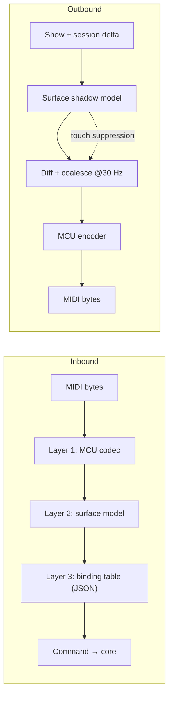

# MCU_MAPPING.md — Mackie Control / Behringer X-Touch Integration

**Status:** specification. The MIDI numbers in §2 are **not yet verified against hardware** — see §7.
**Parent document:** [`ARCHITECTURE_SPEC.md`](../ARCHITECTURE_SPEC.md) (decisions D6, D8, D11).
**Source of requirements:** `XTouch.txt`.

---

## 1. Three layers

The surface controller is split so that protocol detail, device abstraction and user configuration never mix. Each layer is testable in isolation.



| Layer | Responsibility | Knows about |
|---|---|---|
| **1 — MCU codec** | MIDI bytes ↔ logical control events. Pure, no domain logic, no state beyond the running-status parser. | MIDI only |
| **2 — Surface model** | Device-independent controls: `Strip{n}.Fader`, `Strip{n}.Button.Select`, `Global.Play`. Holds the shadow model used for outbound diffing. | Control topology |
| **3 — Binding table** | Maps logical controls to `Command`s. Ships as JSON, user-editable. | PrismDMX domain |

Adding an X-Touch Extender or another MCU device means adding a codec profile in layer 1 — layers 2 and 3 are untouched.

---

## 2. Layer 1 — MCU protocol table

> ⚠️ **UNVERIFIED.** These values follow the Mackie Control Universal convention. They have **not** been checked against the Behringer X-Touch manual or a MIDI monitor capture. They live in a data table precisely so that verification (§7) is a data edit and not a refactor. Do not treat this section as authoritative until §7 is signed off.

### 2.1 Inbound (X-Touch → PrismDMX)

| Control | Message | Notes |
|---|---|---|
| Strip faders 1–8 | Pitch Bend, channels 1–8 | 14-bit, LSB first |
| Main fader | Pitch Bend, channel 9 | 14-bit |
| Fader touch, strips | Note On 104–111 | velocity 127 = touch, 0 = release |
| Fader touch, main | Note On 112 | as above |
| V-Pot encoders 1–8 | CC 16–23 | relative, sign-magnitude: `0x01` = +1, `0x41` = −1; higher bits = acceleration |
| V-Pot push 1–8 | Note 32–39 | |
| Rec / Arm buttons | Note 0–7 | velocity 127 = press, 0 = release |
| Solo buttons | Note 8–15 | |
| Mute buttons | Note 16–23 | |
| Select buttons | Note 24–31 | |
| Transport: Rewind / Forward / Stop / Play / Record | Note 91 / 92 / 93 / 94 / 95 | |
| Jog wheel | CC 60 | relative, same encoding as V-Pots |
| Function keys F1–F8 | Note 54–61 | |
| Modifiers: Shift / Option / Control / Alt | Note 70 / 71 / 72 / 73 | held, not latched |

Remaining sections in `XTouch.txt` (Encoder Assign, View, Automation, Utility, Selection) follow the same Note On convention; their exact numbers are part of the §7 verification pass and are recorded in `profiles/surface/xtouch.json` once confirmed.

### 2.2 Outbound (PrismDMX → X-Touch)

| Target | Message | Notes |
|---|---|---|
| Button LED | Note On to the same note number | velocity 0 = off, 1 = flashing, 127 = on |
| Motor fader | Pitch Bend on the strip's channel | suppressed while touched — §5 |
| V-Pot ring LEDs | CC 48–55 | mode bits select dot / fan / spread / wrap |
| Scribble strip text | SysEx `F0 00 00 66 14 12 <offset> <ascii…> F7` | 2 rows × 7 characters per strip |
| Scribble strip colour | X-Touch–specific SysEx | vendor extension, not part of MCU; verify in §7 |
| Level meters | Channel Pressure `D0`, data `(strip << 4) \| level` | |
| 7-segment display | CC 64–75 | assignment, bars, beats, subdivision, ticks |

### 2.3 Robustness requirements for the codec

- **Running status** must be handled — a compliant sender may omit repeated status bytes.
- **Malformed or truncated messages are discarded silently** and counted in a diagnostics counter. Per `CLAUDE.md`, an invalid MIDI packet must never propagate a failure; it certainly must never reach the engine thread.
- **SysEx reassembly** across packet boundaries, with a maximum buffer size and a timeout that drops an unterminated message.
- The codec allocates nothing per message; it writes into caller-provided buffers.

---

## 3. Layer 2 — surface model

The logical control set, independent of any device:

```
Strip[0..8].Fader            Strip[0..8].Touch
Strip[0..8].Encoder          Strip[0..8].EncoderPush
Strip[0..8].Button.Rec | .Solo | .Mute | .Select
Strip[0..8].Display.{ text, color, value }
Strip[0..8].Meter
Main.Fader                   Main.Touch                Main.Flip
Global.Play | .Stop | .Forward | .Backward | .Record
Global.Faderbank.Prev | .Next
Global.Channel.Prev | .Next
Global.Zoom.Up | .Down | .Left | .Right
Global.Jog
Global.F[1..8]
Global.Save | .Undo | .Cancel | .Enter
Global.Modifier.Shift | .Option | .Control | .Alt
Global.SevenSegment
```

This layer also owns the **shadow model**: the last state believed to be displayed on the device. Outbound traffic is generated by diffing new state against the shadow, never by re-sending everything.

---

## 4. Layer 3 — binding table

Shipped as `profiles/surface/xtouch.json`, validated against a JSON schema on load. A malformed profile falls back to the built-in default and raises a warning — it never prevents startup.

### 4.1 Default bindings (from `XTouch.txt`)

The "Acts on" column is the practical consequence of **D11**: some controls reach the engine directly because latency matters, others change session state and the UI follows. Both travel the same command bus; there is no special path.

| Control | Default | Acts on | Configurable |
|---|---|---|---|
| Strip fader 1–8 | `Master` of the executor on that strip | Engine | yes — Empty / Master / Speed / XFade |
| Strip Rec / Solo / Mute / Select | `Go+` | Engine | yes — Empty / Go+ / Go− / LearnSpeed / Off / On / Flash / Toggle |
| Strip encoder | `Empty` | Engine | yes — Empty / Master / Speed |
| Strip display | colour, name and value of the executor | — | — |
| Main fader | `XFade` of the selected executor | Engine | yes — Empty / Master / XFade |
| Flip button | `Go+` of the selected executor | Engine | yes |
| Play / Stop / Forward / Backward | On / Off / Go+ / Go− on the selected executor | Engine | yes |
| Record | `Clear` (three-stage) | Programmer | yes |
| **Faderbank ◀▶** | executor **page** down / up — 8 per page (D7) | **Session** | — |
| **Channel ◀▶** | **switch UI view** — `SelectView` (D8) | **Session** | — |
| **Zoom ▲▼** | programmer page up / down | **Session** | — |
| **Zoom ◀▶** | select previous / next programmer parameter | **Session** | — |
| Jog wheel | change the value of the selected programmer parameter | Programmer | — |
| Encoder Assign section | switch encoder bank — Dimmer / Position / Color / Beam / Focus | **Session** | yes |
| **F1–F8 (XKeys)** | free: open window, jump to view, macro, executor | **Session** or Engine | yes |
| Save | save show file; **LED lit while unsaved changes exist** | Core | — |
| Undo | `Oops` | Core | — |

### 4.2 Profile shape

```jsonc
{
  "profileVersion": 1,
  "device": "behringer-x-touch",
  "bindings": [
    { "control": "Strip[*].Fader",  "action": { "t": "SetExecutorMaster" } },
    { "control": "Strip[*].Button.Select", "action": { "t": "ExecutorGo", "direction": "Next" } },
    { "control": "Global.Channel.Next",    "action": { "t": "SelectView", "relative": 1 } },
    { "control": "Global.F1", "action": { "t": "OpenWindow", "window": "FixtureSheet" } }
  ]
}
```

`Strip[*]` expands per strip with the strip index bound to the executor at `executorPage * 8 + index`.

---

## 5. Feedback rules

These two rules are not optimisations; without them the surface misbehaves visibly.

### 5.1 Touch suppression

While a fader reports touch (Note On 104–111 with velocity 127), PrismDMX sends **no** position updates to that fader. On release it waits 150 ms, then resynchronises to the authoritative value.

Without this the motor fights the operator: the engine echoes the value back, the motor drives to it, the movement generates a new inbound value, and the loop oscillates.

### 5.2 Coalescing and priority

Outbound updates are batched at a maximum of 30 Hz and sent only where the value differs from the shadow model. USB MIDI cannot absorb an unthrottled delta stream, and a saturated buffer shows up as laggy faders.

When bandwidth is constrained, the send order is:

1. **Motor faders** — most visible, most misleading if stale
2. **Button LEDs** — state feedback the operator acts on
3. **Scribble strips** — names and values, tolerant of a late update
4. **Meters** — purely decorative; dropped first

### 5.3 Connection handling

On connect or reconnect the shadow model is invalidated and the full surface state is transmitted once (a "resync burst"), rate-limited so the device is not flooded. Device disappearance is treated like any other hardware fault: the MIDI threads report `Disconnected`, the engine is unaffected, and reconnection is attempted with backoff.

---

## 6. Testing

| Test | Method |
|---|---|
| Codec round trip | Table-driven: MIDI bytes → control event → MIDI bytes, asserting byte equality both ways |
| Running status | Feed a stream with omitted status bytes; assert identical decoding |
| Malformed input | Fuzz with truncated and out-of-range messages; assert no panic, no allocation growth, correct discard counters |
| SysEx reassembly | Split a scribble strip message across packet boundaries; assert single correct event; assert timeout drops an unterminated message |
| Touch suppression | Simulate touch → engine value change → release; assert no outbound pitch bend during touch and exactly one resync 150 ms after release |
| Coalescing | Drive 1000 value changes in 100 ms; assert at most 3 outbound messages for that control |
| **Surface → UI (D11 gate)** | Send `Channel ▶` and F1 with **no UI client connected**; then connect a client and assert its `Snapshot` contains both the new view and the opened window |

Target coverage on `prism-surface`: **> 95 %**, per `CLAUDE.md`. All tests run against a mock MIDI port — no hardware required.

---

## 7. Hardware verification checklist (blocking for Phase 2 completion)

The codec is **not** considered complete until every item is ticked against a real Behringer X-Touch in Mackie Control mode.

- [ ] Confirm the device operating mode (MC vs. MC User vs. HUI) and record which mode PrismDMX targets
- [ ] Capture every button press with a MIDI monitor; reconcile note numbers against §2.1
- [ ] Confirm fader pitch-bend channel assignment and 14-bit byte order
- [ ] Confirm fader touch note numbers, including the main fader
- [ ] Confirm V-Pot relative encoding and acceleration behaviour at speed
- [ ] Confirm the scribble strip SysEx header, the device ID byte, and the character offset scheme
- [ ] Confirm the vendor SysEx for scribble strip colour
- [ ] Confirm the meter message format and decay behaviour
- [ ] Confirm 7-segment display addressing
- [ ] Measure round-trip latency for a fader move and record it
- [ ] Update §2 and `profiles/surface/xtouch.json` with measured values, and remove the UNVERIFIED banner

Findings go into this document. Discrepancies against the MCU standard are recorded explicitly rather than silently corrected, so the next device profile can reuse the knowledge.
